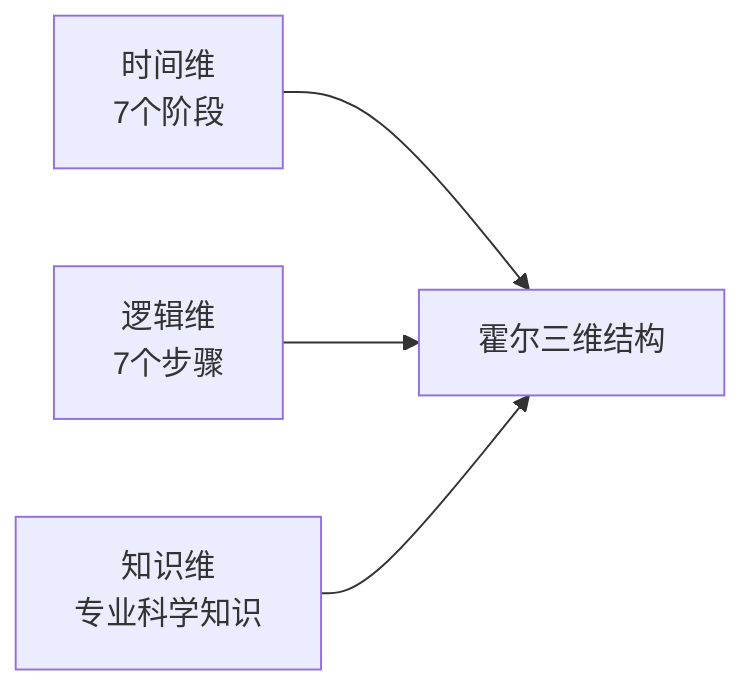

# 系统分析师｜第1章 绪论（备考讲义+章节自测题）

> **教材依据**：《系统分析师教程》第1章 绪论（第1版/第2版本章实质知识点几乎无变动，仅开篇引言政策文本更新、"知识体系"从1.2.3升格为1.3）。
>
> **考纲定位说明**：2024版考试大纲没有独立的"绪论"条目。本章知识点唯一官方依据：考纲【考试说明‑考试要求】第 (1) 条 **掌握系统工程的基础知识**。
>
> **考试形式**：仅上午综合知识单选题，历年分值约1~2分；案例分析、论文几乎不考查本章内容。
>
> 标签：系统分析师、上午题、绪论、信息、信息系统、系统工程、霍尔三维、系统分析师角色、知识体系

[TOC]

## 章节结构对照与来源标注

> 本讲义为**系统分析师（第2版）教材第1章《绪论》**的学习讲义。与第2章不同，本章知识点**几乎全部来自教材本身**，无跨章节补充，故各模块统一标注【教材】。

| 讲义模块 | 对应教材第2版章节 | 内容性质 | 备考要求 |
|---|---|---|---|
| 模块1 信息的基本概念 | 1.1.1 信息的基本概念 | 教材 | 必掌握：信息11特征/信息量/信息与数据知识 |
| 模块2 系统及相关理论 | 1.1.2 系统及相关理论 | 教材 | 必掌握：系统9特性/8原理/信息系统三模型；拓展：系统论的任务 |
| 模块3 系统工程方法论 | 1.1.3 系统工程方法论 | 教材 | 必掌握：霍尔三维/软系统方法论 |
| 模块4 信息系统工程 | 1.1.4 信息系统工程 | 教材 | 必掌握：生命周期5阶段/建设原则 |
| 模块5 系统分析师的角色与任务 | 1.2 系统分析师 | 教材 | 必掌握：6角色/素质/任务/CIO |
| 模块6 系统分析师的知识体系 | 1.3 系统分析师的知识体系 | 教材 | 了解为主（知识地图） |

> 教材第2版第1章章节结构：1.1 信息与信息系统（1.1.1 信息基本概念｜1.1.2 系统及相关理论｜1.1.3 系统工程方法论｜1.1.4 信息系统工程）｜1.2 系统分析师（1.2.1 角色定位、1.2.2 任务）｜1.3 系统分析师的知识体系。

---

## 模块1：信息的基本概念（教材 1.1.1）【教材】

**模块优先级**：🔴 高频考点
**考情**：年均0~1道选择题；核心：香农信息定义、信息特征、信息量计算、信息与数据/知识的关系。

### 1.1 核心知识点

#### 1.1.1 香农的信息定义与信息量

- **香农定义**：信息是**不确定性的减少**（即确定性的增加）。
- **信息量单位**：比特（bit）。1比特 = 消除非此即彼的不确定性所需的信息量。
- **信息量公式（香农熵）**：$$ H(X) = -\sum_{i=1}^{n} P(x_i) \log_b P(x_i) $$
  - 式中 $x_i$ 代表第 $i$ 个状态，$P(x_i)$ 为出现该状态的概率，$H(X)$ 为该随机变量的信息熵（度量平均不确定性）。
  - 对数底数 $b$ 决定单位：
    - $b=2$ → 单位 **比特（bit）**（计算机/通信最常用，考试重点）；
    - $b=e$ → 单位 **奈特（nat）**（了解）；
    - $b=10$ → 单位 **哈特（hart）**（了解）。
  - 信息是系统**有序程度**的度量，表现为**负熵**（与热力学中的熵正好相反）。

> 拓展阅读｜非必学：完整求和公式与 nat/hart 单位仅作阅读了解，不要求默写、不出现于习题；考试只考概念（熵度量不确定性、$b=2$ 对应 bit）。

#### 1.1.2 信息的特征（11条，高频）

教材明确列出信息的11个基本特征：

| 序号 | 特征 | 要点 |
|------|------|------|
| 1 | **客观性** | 信息是客观事物在人脑中的反映；分主观信息（决策、指令、计划）和客观信息（形势、经济、四季） |
| 2 | 普遍性 | 物质的普遍性决定信息普遍存在 |
| 3 | 无限性 | 客观世界无限→信息总量无限；每个具体事物产生的信息也可无限 |
| 4 | 动态性 | 信息随时间变化而变化 |
| 5 | 相对性 | 不同认识主体从同一事物获取的信息量可能不同 |
| 6 | **依附性** | 信息由客观事物产生（无源信息不存在）；须依附一定载体存在 |
| 7 | 变换性 | 信息通过处理可变换/转换，改变形式和内容 |
| 8 | 传递性 | 时间上的传递=存储；空间上的传递=转移/扩散 |
| 9 | 层次性 | 客观世界分层次→信息也分层次（战略/战术/作业） |
| 10 | 系统性 | 信息可表示为集合，不同类别形成整体，可对应信息系统 |
| 11 | 转化性 | 信息产生不能没有物质，传递不能没有能量；但有效使用信息可转化为物质或能量 |

> 补充：金融信息最重要特性是**安全性**，市场信息最重要特性是**及时性**——应用场合不同侧重不同。

#### 1.1.3 信息的功能（5条）

1. 为认识世界提供依据
2. 为改造世界提供指导
3. 为有序的建立提供保证
4. 为资源开发提供条件（有形资源=物质+能量；无形资源=信息资源）
5. 为知识的生产提供材料

#### 1.1.4 信息与数据、知识的关系

- **信息与数据**：信息是经过加工后的数据；数据是信息的存在形式和状态。信息=被解释或被理解的数据。
  - 例："张啸杰""男""19""大二"各自是数据，组合并建立逻辑关系后成为信息。
- **信息与知识**：知识是经过加工的信息。
  - 例："张啸杰是湖南永州人""李国杰是湖南邵阳人"是信息；得出"两人是湖南同乡"则为知识。

### 1.2 典型例题

**例题1**：香农认为，信息是（）
A. 事物运动的状态与方式  B. 不确定性的减少  C. 数据的载体  D. 客观世界的全部映像

> 【解析】教材原文：香农认为信息是不确定性的减少。
> 【答案】B

**例题2**：某系统发送4种等概率消息，每种概率均为1/4。每条消息携带的信息量为（）
A. 1比特  B. 2比特  C. 3比特  D. 4比特

> 【解析】$\text{信息量} = \log_2 (1/p) = \log_2 4 = 2 \text{比特}$。
> 【答案】B

### 1.3 课后习题

**习题1**：信息在时间上的传递称为（），在空间上的传递称为（）
A. 存储/转移  B. 转移/存储  C. 变换/存储  D. 存储/变换

> 答案：A
> 解析：传递性—时间上传递 = 存储，空间上传递 = 转移或扩散。

**习题2**：下列关于信息与数据关系的叙述，正确的是（）
A. 数据就是信息  B. 信息是经过加工后的数据  C. 数据是信息加工后的产物  D. 信息和数据无关

> 答案：B
> 解析：信息是经过加工后的数据，数据是信息的存在形式和状态。

---

## 模块2：系统及相关理论（教材 1.1.2）【教材】

**模块优先级**：🟡 中频考点
**考情**：年均0~1道选择题；核心：系统9大特性、信息系统三模型。

### 2.1 核心知识点

#### 2.1.1 系统的定义

系统是由**相互联系、相互依赖、相互作用**的事物或过程组成的具有**整体功能和综合行为**的统一体。

#### 2.1.2 系统的特性（9条，高频）

| 序号 | 特性 | 要点 |
|------|------|------|
| 1 | **整体性** | 元素按一定原则有序排列，产生系统特定功能；整体性质 ≠ 各元素简单相加 |
| 2 | **层次性** | 系统与元素相对；系统可成为更高层系统的元素（子系统） |
| 3 | **目的性** | 任何系统都有一定的目的或目标 |
| 4 | 稳定性 | 开放系统有自我稳定能力，可在一定范围内自我调节 |
| 5 | 突变性 | 系统通过失稳从一种状态进入另一种状态，是质变的基本形式 |
| 6 | 自组织性 | 开放系统在内外因素作用下自发组织，从无序到有序 |
| 7 | 相似性 | 系统具有同构和同态性质，根本原因是世界的物质统一性 |
| 8 | 相关性 | 元素间有实实在在的、具体的联系（非哲学上的普遍联系） |
| 9 | **环境适应性** | 系统与环境发生物质和能量交换 |

> 记忆口诀：整体、层次、目的、稳定、突变、组织、相似、相关、适应（9个）。

#### 2.1.3 系统理论8个基本原理

1. **整体性原理**：系统有整体形态、结构、边界、特性、行为、功能
2. **整体突变原理（非加和原理）**：系统整体性质 ≠ 各元素性质简单相加
3. **层次性原理**：系统组织在地位与作用上表现出等级秩序
4. **开放性原理**：系统不断与外界交换物质、能量、信息
5. **目的性原理**：系统在与环境作用中趋向预先确定的状态
6. **环境互塑共生原理**：系统对环境有功能（积极）和污染（消极）；环境对系统有资源（积极）和压力（消极）
7. **秩序原理**：系统发展中存在有序和无序两种形态
8. **生命周期原理（演化原理）**：系统从产生到发展到消亡的演化过程

#### 2.1.4 信息系统（教材原文）

- **定义**：简单地说，信息系统就是接受输入数据，通过加工处理产生信息的系统。**面向管理是信息系统的显著特点**。
- 以计算机为基础的信息系统：结合管理理论和方法，应用信息技术解决管理问题，为管理决策提供支持的系统。

**三模型结合产生信息系统（高频考点）**：

| 模型 | 含义 |
|------|------|
| **管理模型** | 系统服务对象领域的专门知识，以及分析和处理该领域问题的模型（对象的处理模型） |
| **信息处理模型** | 系统处理信息的结构和方法；将管理模型中的理论转化为信息获取、存储、传输、加工、使用的规则 |
| **系统实现条件** | 可供应用的计算机技术和通信技术、从事对象领域工作的人员，以及对这些资源的控制与融合 |

> 记忆：管理模型定"领域知识"、信息处理模型定"加工规则"、实现条件定"技术与人"。

### 2.2 典型例题

**例题1**："系统整体功能大于各组成部分功能之和"体现了系统的（）
A. 相关性  B. 整体性  C. 层次性  D. 目的性

> 【解析】整体性：元素按原则有序排列，产生系统特定功能，整体不等于部分简单相加。
> 【答案】B

**例题2**：信息系统由哪三个模型结合产生？（）
A. 管理模型+信息处理模型+系统实现条件
B. 数据模型+功能模型+网络模型
C. 业务模型+技术模型+人员模型
D. 输入模型+处理模型+输出模型

> 【解析】教材明确：管理模型、信息处理模型和系统实现条件三者结合产生信息系统。
> 【答案】A

### 2.3 课后习题

**习题1**：一个系统各要素互相影响、互相制约，这体现了系统的（）
A. 整体性  B. 相关性  C. 自组织性  D. 相似性

> 答案：B
> 解析：相关性指元素间有实实在在的、具体的联系。

**习题2**：系统从产生到发展到消亡的演化过程，对应系统理论的（）
A. 整体性原理  B. 层次性原理  C. 秩序原理  D. 生命周期原理

> 答案：D

### 拓展阅读：教材原生但备考非必学内容

> 【教材拓展｜非必学】教材有原文，但考纲未单独列出、真题极少直接命题，仅作概念了解，不配置例题与习题。

#### 拓展·系统论的任务（教材1.1.2）【教材拓展｜非必学】

系统论的任务不仅在于认识系统的特点和规律，更在于利用这些规律去**控制、管理、改造或创造系统**，使系统的存在、发展更符合人们需要。作用三方面：
1. **改变人类的思维方式**：传统分析法把事物分解成部分、从局部看问题（单项因果决定论），只适用于认识简单事物；系统分析方法站在较高层次纵观全局，为认识复杂问题提供了有效思维方式。
2. **提供科学的理论和方法**：反映现代科学整体化趋势与社会化大生产特点，为政治、经济、军事、科学、文化等复杂问题提供方法论基础。
3. **形成统一的系统科学体系**：一般系统论创始人贝塔朗菲（L. Bertalanffy）把系统论分为**狭义系统论**（着重对系统本身分析研究）与**广义系统论**（研究一类相关系统科学原理，含系统科学、系统技术、系统哲学三方面）。

> 记忆：系统论任务=改变思维方式＋提供方法＋形成统一体系；贝塔朗菲=狭义/广义系统论。

---

## 模块3：系统工程方法论（教材 1.1.3）【教材】

**模块优先级**：🔴 本章最高频考点
**考情**：年均0~1道选择题；核心：霍尔三维结构（时间维/逻辑维步骤顺序）、硬系统vs软系统方法论区别。

### 3.1 核心知识点

#### 3.1.1 系统工程与方法论概述

- **系统工程**：从整体出发合理开发、设计、实施和运用系统科学的工程技术，以达到最优规划、最优设计、最优管理和最优控制的目的。
- 代表性方法论：**霍尔三维结构**（硬系统方法论）和**切克兰德软系统方法论（SSM）**。

#### 3.1.2 霍尔三维结构（高频重点）

霍尔将系统工程活动分为 **7个阶段**（时间维）和 **7个步骤**（逻辑维），结合所需专业知识（知识维），形成三维空间结构。

**（1）逻辑维——解决问题的7个步骤（顺序是高频考点）**：

| 步骤 | 名称 | 说明 |
|------|------|------|
| 1 | 问题确定 | 收集资料数据，弄清问题历史、现状及发展趋势 |
| 2 | 目标确定 | 提出解决目标，制定评价标准和指标 |
| 3 | 系统综合 | 按问题性质和目标，形成一组可供选择的方案 |
| 4 | 系统分析 | 对备选方案说明性质、特点及与系统的关系（构造模型） |
| 5 | 方案选择 | 系统优化，选择最优方案或确定优劣顺序 |
| 6 | 评价决策 | 决策者根据全面要求确定方案试行 |
| 7 | 实施计划 | 将选定方案付诸实施 |

> 记忆：问题→目标→综合→分析→选择→评价→实施

**（2）时间维——工作进程的7个阶段**：
规划 → 制定方案 → 研制 → 生产 → 安装 → 运行 → 更新

**（3）知识维——专业科学知识**：
工程、医药、建筑、商业、法律、管理、社会科学和艺术等。

> 记忆：时间维管"阶段"（从规划到更新），逻辑维管"步骤"（从问题确定到实施计划），知识维管"专业"。

#### 3.1.3 切克兰德软系统方法论（SSM）

- **背景**：霍尔方法适用于目标明确、结构清楚的**结构化问题**（硬系统）。20世纪70年代后，系统工程面临与人的因素密切相关、与社会/政治/经济/生态纠缠的**非结构化问题**，霍尔方法遇到困难。
- **核心区别**：
  - 霍尔（硬系统）：强调明确目标，核心是**模型化和最优化**。
  - 切克兰德（软系统）：目标模糊，"可行"和"满意"代替"最优"，核心不是最优化而是**比较**。
- **SSM 五个步骤**：
  1. 问题现状说明
  2. 理清问题的关联因素
  3. 建立概念模型（可用结构模型或流程图表达）
  4. 比较（概念模型与现状比较，逐步得出满意可行解）
  5. 实施

> 记忆：硬系统求最优、软系统求满意（学习过程）。

### 3.2 典型例题

**例题1**：霍尔三维结构的逻辑维中，紧接"系统分析"之后的步骤是（）
A. 目标确定  B. 系统综合  C. 方案选择  D. 评价决策

> 【解析】逻辑维7步：问题确定→目标确定→系统综合→系统分析→方案选择→评价决策→实施计划。
> 【答案】C

**例题2**：针对社会、管理类非结构化复杂问题，不追求最优解而强调可行与满意的方法论是（）
A. 霍尔三维结构  B. 切克兰德软系统方法论  C. 原型法  D. BPR

> 【解析】SSM适用于与人的因素密切相关、目标不清楚的非结构化问题，强调比较和学习过程而非最优化。
> 【答案】B

### 3.3 课后习题

**习题1**：霍尔三维结构中，"研制阶段"属于（）
A. 逻辑维  B. 时间维  C. 知识维  D. 空间维

> 答案：B
> 解析：时间维7阶段：规划、制定方案、研制、生产、安装、运行、更新。

**习题2**：软系统方法论的核心是（）
A. 最优化  B. 模型化  C. 比较  D. 定量化

> 答案：C
> 解析：软系统方法论核心不是最优化，而是进行比较，找出可行、满意的结果。

---

## 模块4：信息系统工程（教材 1.1.4）【教材】

**模块优先级**：🟡 中频考点
**考情**：年均0~1道选择题；核心：生命周期5阶段顺序、建设原则。

### 4.1 核心知识点

#### 4.1.1 信息系统工程概述

- **定义**：以系统工程的方法来实现信息系统建设的过程，是系统工程的一个分支学科。
- **专业特征**：研究方法上具有**整体性**，技术应用上具有**综合性**，工程管理上具有**科学性**。

#### 4.1.2 信息系统生命周期（5阶段，高频）

信息系统从产生到消亡的整个过程，分为5个阶段：

| 阶段 | 主要任务 | 后续章节 |
|------|----------|----------|
| 1. **系统规划** | 指明信息系统在企业战略中的作用和地位；包括开发目标、总体架构、组织结构、实施计划、技术规范 | 第9章 |
| 2. **系统分析** | 在可行性分析和总体规划基础上详细调查，整理文档，分析组织结构/业务流程/信息需求，**构建逻辑模型** | 第10、11章 |
| 3. **系统设计** | 根据分析结果设计实施方案，提供**物理设计说明** | 第12、13章 |
| 4. **系统实现** | 将设计文档变成能在计算机上运行的软件系统 | 第14章 |
| 5. **系统运行与维护** | 维护评价、记录运行情况、修改完善、评价工作质量和经济效益 | 第15章 |

> 关键区分：系统分析产出**逻辑模型**；系统设计产出**物理方案**。
> 注意：这是**信息系统生命周期**（5阶段），与后续软件工程章节讨论的**软件生命周期**口径相近但所属章节不同，勿混淆。

#### 4.1.3 信息系统建设的原则

**四大基本原则**：

1. **高层管理人员介入原则**（一把手原则）：信息系统建设服务于企业战略，必须有高层介入（可直接参加、决策指导或经济人事支持）。具体化即为 **CIO** 的出现。
2. **用户参与开发原则**：
   - 用户有确定范围（核心用户=使用者，领导=辅助/外围用户）
   - 用户应参与**全过程**（从规划设计到运行）
   - 用户应**深度参与**，既以甲方代表身份出现，又成为真正的开发人员
3. **自顶向下规划原则**：主要目标是达到**信息的一致性**，避免因缺乏总体规划导致信息不一致。
4. **工程化原则**：软件危机的教训——没有按工程化原则开发是质量问题的根源；信息系统同样需要工程化方法。

**其他补充原则**：创新性原则、整体性原则、发展性原则、经济性原则、先进性原则等。

### 4.2 典型例题

**例题1**：信息系统生命周期的正确顺序是（）
A. 系统规划→系统分析→系统设计→系统实现→系统运行与维护
B. 系统设计→系统规划→系统分析→系统实现→系统运行与维护
C. 系统规划→系统设计→系统分析→系统实现→系统运行与维护
D. 系统分析→系统规划→系统设计→系统实现→系统运行与维护

> 【解析】教材明确5阶段顺序：规划→分析→设计→实现→运行维护。
> 【答案】A

**例题2**：信息系统建设中，"一把手原则"指的是（）
A. 最高领导亲自编写代码
B. 高层管理人员必须介入信息系统建设
C. 项目由基层员工自主决策
D. 只由技术人员负责

> 【解析】高层管理人员介入原则（一把手原则）：信息系统建设服务于企业战略，必须有高层介入。
> 【答案】B

### 4.3 课后习题

**习题1**：信息系统生命周期中，产出逻辑模型的阶段是（）
A. 系统规划  B. 系统分析  C. 系统设计  D. 系统实现

> 答案：B
> 解析：系统分析阶段构建逻辑模型，为系统设计提供依据。

**习题2**：下列哪项不是信息系统建设的基本原则？（）
A. 高层管理人员介入  B. 用户参与开发  C. 自底向上设计  D. 工程化

> 答案：C
> 解析：四大原则是高层介入、用户参与、自顶向下规划、工程化。是"自顶向下"而非"自底向上"。

---

## 模块5：系统分析师的角色与任务（教材 1.2）【教材】

**模块优先级**：🟡 中频考点
**考情**：年均0~1道选择题；核心：6种角色、CIO定位、5大类任务。

### 5.1 核心知识点

#### 5.1.1 信息化的人才结构

- **横向**：IT人员（CIO、系统分析师、软件/硬件/通信/数据工程师、操作员等）和非IT人员。CIO和系统分析师既属IT人员又属企业管理人员。
- **纵向（金字塔三层）**：
  - 上层（决策层）：CEO、CFO、CIO
  - 中层（管理业务层）：中层经理、**系统分析师**、经济师、会计师、软硬件/通信/数据工程师
  - 下层（操作层）：计算机通信操作人员、维护人员、数据处理人员、业务人员

**决策层高管缩写**：

| 缩写 | 英文全称 | 中文 |
|------|----------|------|
| CEO | Chief Executive Officer | 首席执行官 |
| CFO | Chief Financial Officer | 首席财务官 |
| CIO | Chief Information Officer | 首席信息官 |

#### 5.1.2 系统分析师的6种角色（高频）

| 角色 | 要点 |
|------|------|
| 1. **IT专家** | 首要角色；须谙练信息技术，对新技术有正确评估与选择能力 |
| 2. **管理业务专家** | 信息系统建设是复杂管理工程，须有丰富管理业务知识和经验 |
| 3. **IT人员与非IT人员的沟通者** | 作为双方沟通桥梁，消除隔阂（很多项目失败源于此隔阂） |
| 4. **对外谈判者** | 代表企业与专业开发组织/商品化软件供应商"讨价还价" |
| 5. **信息系统运行的指导者** | 从纲领和细节两方面指导系统运行管理、评价维护、升级扩展 |
| 6. **信息系统建设项目的技术负责人** | 建设单位角度：高层领导任项目负责人，分析师任技术负责人；承建单位角度：分析师任技术/研发经理 |

> **CIO是系统分析师的典型代表**——系统分析师处于人才金字塔中上层，最上层是CIO。CIO 主管企业信息化战略与信息系统建设，是系统分析师的典型代表，本身也应是系统分析师。

#### 5.1.3 系统分析师的7条素质要求

1. 深入观察问题的能力、逻辑思维能力和归纳能力（从树木见森林、从森林见树木）
2. 丰富的开发实践经验、想象力和创造力，善于从经验积累中创新
3. 较强的学习能力，精通系统开发方法和技术，熟悉开发环境和工具
4. 较强的谈判协商能力和人际交往能力，能说服用户接受主张
5. 较强的组织和管理能力，能担任技术负责人，指导工程师和程序员
6. 与他人合作共事的能力，带领团队齐心协力完成任务
7. 一定的远见和前瞻能力，适应业务环境和技术的快速变化

#### 5.1.4 系统分析师的5大类任务

**1. 信息化战略管理中的任务**：
- 深入理解企业战略目标和业务方向，明确战略对信息化的需求
- 分析评估内外部信息化环境和企业信息化现状
- 与高层一起设计信息系统建设长期目标并分解
- 主持制定企业信息化战略规划

**2. 信息化基础建设中的任务**：
- 了解计算机系统发展、配置、性能，估算投资成本
- 把握网络技术，对局域网/内联网/外联网/Internet建设提出可行性分析和方案
- 负责信息系统安全制度和规范制定
- 设计信息系统评价体系
- 主持制定信息化管理制度并动态调整
- 审定企业信息化标准规范

**3. 信息系统建设中的任务（5个阶段）**：
- 规划阶段：可行性研究、制定开发策略、编写可研报告、参与制订开发计划
- 分析阶段：建立业务模型、完成需求分析、构建逻辑模型
- 设计阶段：与架构设计师配合设计系统架构、指导设计工作
- 实施阶段：指导软硬件配置、组织应用软件开发、用户培训、进度成本质量控制
- 运行维护阶段：制定运维规章制度、检查指导日常工作、综合评价运行效果、制定升级扩展方案

**4. 企业流程管理中的任务**：
- 关注研究企业流程问题
- 将流程改进/重组作为系统修正和升级的主要因素
- 研究评价流程分析工具，必要时选用辅助软件

**5. 信息资源开发利用中的任务**：
- 调查分析企业信息资源，指导制定开发利用规划
- 制定信息资源管理基础标准和制度
- 指导信息资源开发利用工作并纳入系统建设
- 检查评估日常信息资源管理工作

### 5.2 典型例题

**例题1**：很多信息系统项目失败源于IT人员与非IT人员之间的隔阂，系统分析师作为什么角色可以消除这一隔阂？（）
A. IT专家  B. 管理业务专家  C. 沟通者  D. 对外谈判者

> 【解析】系统分析师既是IT专家又是管理业务专家，可作为IT人员和非IT人员的沟通桥梁。
> 【答案】C

**例题2**：关于CIO与系统分析师的关系，正确的是（）
A. CIO不是系统分析师
B. CIO是系统分析师的典型代表
C. CIO与系统分析师无关
D. CIO是系统分析师的下属

> 【解析】教材明确：CIO本身也应该是系统分析师，CIO是系统分析师的典型代表。
> 【答案】B

### 5.3 课后习题

**习题1**：下列哪项不是系统分析师的角色？（）
A. IT专家  B. 管理业务专家  C. 对外谈判者  D. 企业财务审计师

> 答案：D
> 解析：6种角色：IT专家、管理业务专家、沟通者、对外谈判者、运行指导者、项目技术负责人。

**习题2**：系统分析师在企业信息化人才金字塔中主要处于（）
A. 操作层  B. 管理业务层（中层）  C. 决策层（塔尖）  D. 与层次无关

> 答案：B
> 解析：纵向三层：上层决策层（CEO/CFO/CIO）、中层管理业务层（含系统分析师）、下层操作层。

---

## 模块6：系统分析师的知识体系（教材 1.3）【教材】

**模块优先级**：🟢 了解为主
**考情**：选择题极少直接考查细节，但为全书知识地图提供框架。

### 6.1 核心知识点

系统分析师属于复合型人才，知识体系由角色和工作任务决定，分为**四大类**：

#### 6.1.1 技术知识与技能（7方面）

| 序号 | 知识领域 | 内容 |
|------|----------|------|
| 1 | 计算机系统知识 | 发展概况、系统配置、系统性能 |
| 2 | 计算机科学与技术 | 数据结构、操作系统、编译原理、算法设计、程序语言、软件工程、数据库、人工智能 |
| 3 | 计算机网络 | 通信技术、局域网/广域网、Internet/Intranet、网络规划设计配置管理 |
| 4 | 系统安全 | 通信网络安全、安全管理、安全架构和模型、灾难恢复、信息安全机制 |
| 5 | 信息系统工程 | 系统规划与分析、需求分析、系统设计、架构设计、实现测试、运行维护 |
| 6 | 数学及相关学科 | 微积分、线性代数、概率论、统计学、离散数学、运筹学 |
| 7 | 经济管理 | 财务会计、管理会计、技术经济学 |

#### 6.1.2 经营管理知识与技能（5方面）

1. **人际沟通知识**：口头和书面沟通；**沟通技能往往比技术技能更决定系统成败**
2. **人际关系知识**：团队合作、领导艺术、管理变化和冲突
3. **项目管理知识**：项目管理理论、方法和工具
4. **企业管理知识**：企业战略管理、知识管理、日常运作管理
5. **市场营销知识**：担任谈判者或"售前"工作时需要

#### 6.1.3 业务知识与技能

- 与个人专业出身、职业经历、供职单位业务特点相关
- IT企业的系统分析师需具备很强的学习能力，快速熟悉不同行业的业务领域知识

#### 6.1.4 人文修养（5方面）

1. **人格与道德规范**：经常接触秘密和敏感信息，需优秀人格和道德规范
2. **遵守法律法规**：熟练掌握信息系统开发应用相关法律法规
3. **诚信道德修养**：守时守信，维护所在单位信用
4. **职业道德修养**：调节职业活动中人与人之间的关系；分析师作为高级工程师，其思想行为影响他人
5. **健康的心理素质**：开朗豁达、坚毅意志、有主见又果断、沉着冷静、既有灵活性又不失原则

### 6.2 典型例题

**例题1**：在信息系统开发过程中，决定系统成败的关键因素往往是（）
A. 技术技能  B. 沟通技能  C. 编程能力  D. 硬件性能

> 【解析】第一版教材原文："决定系统成败的关键因素往往是沟通技能而不是技术技能。"
> 【答案】B

**例题2**：下列哪项不属于系统分析师知识体系四大分类？（）
A. 技术知识与技能  B. 经营管理知识与技能  C. 业务知识与技能  D. 机械制图与金工技能

> 【解析】四大类：技术知识与技能、经营管理知识与技能、业务知识与技能、人文修养。
> 【答案】D

---

# 章节总复习综合模拟题

## 一、单项选择题（13题）

1. 香农认为，信息是（）
A. 事物运动的状态与方式  B. 不确定性的减少  C. 数据的载体  D. 客观世界的全部映像
> 答案：B

2. 某系统发送8种等概率消息，每条消息携带的信息量为（）
A. 1比特  B. 2比特  C. 3比特  D. 8比特
> 答案：C
> 解析：$\log_2 8 = 3 \text{比特}$

3. 系统的9大特性不包括（）
A. 整体性  B. 层次性  C. 可移植性  D. 环境适应性
> 答案：C

4. 信息系统三模型中，"管理模型"指的是（）
A. 项目管理方法论
B. 系统服务对象领域的专门知识及分析处理模型
C. 企业OA系统
D. 数据库管理系统
> 答案：B

5. 霍尔三维结构逻辑维的正确顺序是（）
A. 问题确定→目标确定→系统综合→系统分析→方案选择→评价决策→实施计划
B. 问题确定→系统综合→目标确定→系统分析→方案选择→评价决策→实施计划
C. 目标确定→问题确定→系统综合→系统分析→方案选择→评价决策→实施计划
D. 问题确定→目标确定→系统分析→系统综合→方案选择→评价决策→实施计划
> 答案：A

6. 切克兰德软系统方法论适用于（）
A. 目标明确的结构化工程问题
B. 目标模糊、涉及人的因素的非结构化问题
C. 纯数学优化问题
D. 硬件系统设计问题
> 答案：B

7. 信息系统生命周期中，产出物理设计说明的阶段是（）
A. 系统规划  B. 系统分析  C. 系统设计  D. 系统实现
> 答案：C

8. "自顶向下规划"作为信息系统建设原则，其主要目标是（）
A. 降低开发成本  B. 达到信息的一致性  C. 加快开发速度  D. 减少人员投入
> 答案：B

9. 系统分析师的首要角色是（）
A. 管理业务专家  B. IT专家  C. 对外谈判者  D. 运行指导者
> 答案：B

10. 关于CIO与系统分析师的关系，正确的是（）
A. CIO与系统分析师无关
B. CIO是系统分析师的典型代表
C. CIO是系统分析师的下属
D. CIO不需要具备系统分析师能力
> 答案：B

11. 系统分析师知识体系中，"沟通技能往往比技术技能更决定系统成败"属于（）
A. 技术知识与技能  B. 经营管理知识与技能  C. 业务知识与技能  D. 人文修养
> 答案：B

12. 信息系统工程的专业特征不包括（）
A. 整体性  B. 综合性  C. 科学性  D. 封闭性
> 答案：D

13. 下列关于霍尔三维结构与切克兰德软系统方法论的对比，正确的是（）
A. 两者都追求最优化
B. 霍尔追求最优化，切克兰德追求可行满意
C. 切克兰德适用于结构化工程问题
D. 霍尔适用于社会政治类软问题
> 答案：B

## 二、计算题（1道）

### 计算题1【信息量计算】

某系统有4个等概率状态，每个状态概率为1/4。请计算系统的信息量（熵）。
> 【解析】
> $$ H(X) = -\sum P(x_i) \log_2 P(x_i) = -4 \times \left(\frac{1}{4}\right) \times \log_2\left(\frac{1}{4}\right) = \log_2 4 = 2 \text{比特} $$
> 答案：2比特

## 三、简答概念题（1道）

1. 简述霍尔三维结构与切克兰德软系统方法论的区别。
> 【解析】
> - 霍尔三维结构（硬系统方法论）：将系统工程活动分为时间维（7阶段）、逻辑维（7步骤）、知识维，适用于目标明确、结构清楚的结构化问题，核心是模型化和最优化。
> - 切克兰德软系统方法论（SSM）：适用于目标模糊、与人的因素密切相关的非结构化问题，核心不是最优化而是比较，通过"问题现状说明→理清关联因素→建立概念模型→比较→实施"5个步骤，强调学习过程，追求可行和满意而非最优。

---

> **备考提示**：本章在上午综合知识中约占1~2分，重点掌握：①霍尔三维逻辑维7步顺序；②系统9大特性辨析；③信息系统生命周期5阶段；④硬系统vs软系统方法论区别。其余内容以理解为主，不必死记。
