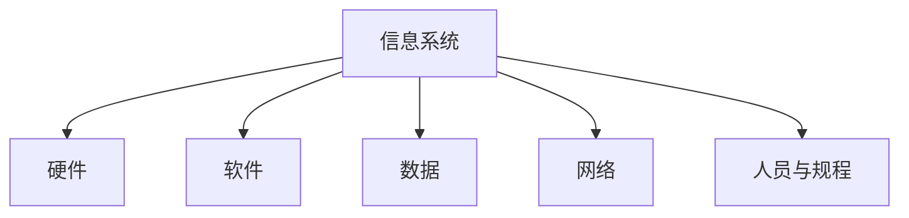
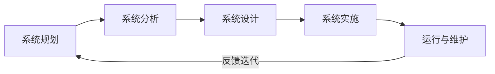
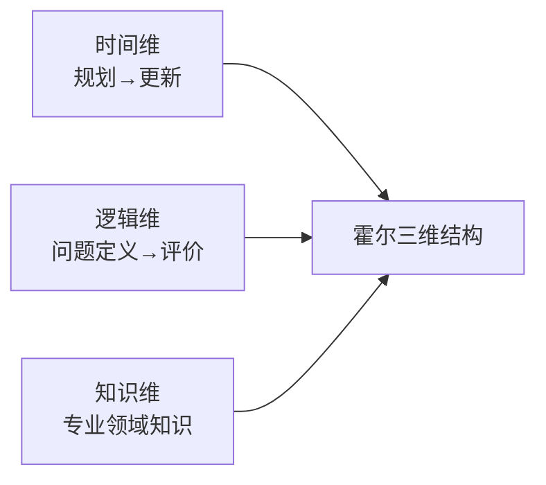
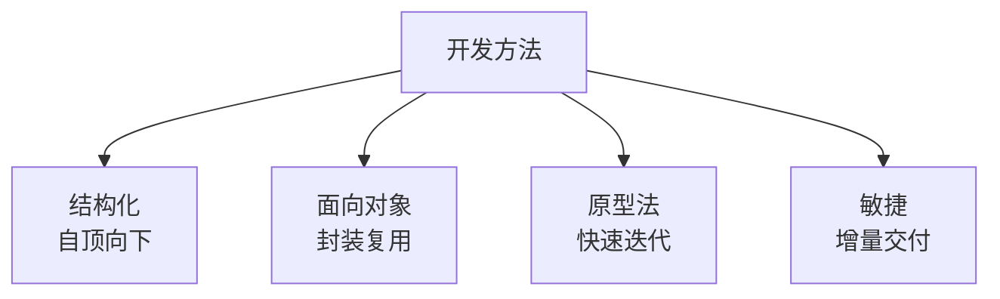
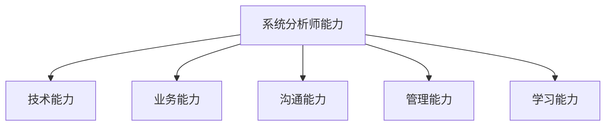
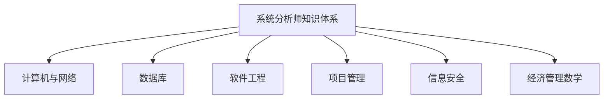

# 系统分析师｜第1章 绪论（完整版备考讲义+章节自测题）

> 适配系统分析师（第2版教材第1章），对应考纲"1.1信息系统基础知识"；上午选择题3分左右，方法论与角色定位是案例、论文的底层铺垫。  
> 标签：系统分析师、上午题、绪论、信息、信息系统、系统工程、霍尔三维、系统分析师角色、数字化转型、备考

[TOC]

## 模块1：信息与信息系统基础

**前置说明**：本章基于系统分析师第2版官方教材第1章，增补第1版删减但历年真题、新考纲仍必考内容，适配上午综合选择题。  
**模块优先级**：🔴 最高优先级（信息与信息系统是全书地基）  
**考情分析**：年均0~1道选择题；核心：信息特征、信息系统组成与分类、生命周期。

### 1.1 核心知识点精讲

#### 1.1.1 信息的定义与特征（高频）

- **信息**：关于事物运动状态和方式的描述，消除不确定性（香农）。
- 主要特征：
  1. **事实性**：信息最重要的性质，信息必须真实。
  2. **时效性**：价值随时间衰减。
  3. **可共享性**：可同时被多人使用，不因共享而损耗。
  4. 可传递性、可存储性、可加工性、层次性（战略/战术/作业）。

> 记忆：事实性是核心、时效性管价值、共享性可复用。

#### 1.1.2 信息系统组成与层次（高频）

- **信息系统**：由人、硬件、软件、数据、网络、规程（制度）组成的人机系统。
- 层次：**战略层（决策）、管理层（管理控制）、作业层（事务处理）**。

> 记忆：人机系统六要素：人、硬件、软件、数据、网络、规程。
#### 1.1.3 信息系统分类

- 按处理层次：**事务处理系统TPS、管理信息系统MIS、决策支持系统DSS**。
- 按业务领域：办公自动化OAS、企业资源计划ERP、客户关系管理CRM等。

> 记忆：TPS管作业、MIS管管理、DSS管决策。

#### 1.1.4 信息系统生命周期（高频，重点）

- 经典阶段：**系统规划 → 系统分析 → 系统设计 → 系统实施 → 系统运行与维护**。

> 记忆：规划→分析→设计→实施→运维五阶段。

#### 1.1.5 高频易错点

1. 信息最重要特征是事实性；
2. 系统六要素；
3. TPS/MIS/DSS层次；
4. 生命周期五阶段顺序。

### 1.2 典型配套例题（真题同源，带完整解析）

#### 例题1 信息特征

信息最重要的特征是（）
A. 时效性 B. 事实性 C. 共享性 D. 可存储性

> 【解析】事实性是信息最重要的性质，信息必须真实。  
> 【答案】B

#### 例题2 生命周期

信息系统生命周期中，系统分析之后是（）
A. 规划 B. 设计 C. 实施 D. 维护

> 【解析】生命周期顺序：规划→分析→设计→实施→维护。  
> 【答案】B
### 1.3 课后习题（带完整答案+解析）

**习题1**  
管理信息系统MIS对应信息系统的（）
A. 战略层 B. 管理层 C. 作业层 D. 物理层

> 答案：B  
> 解析：MIS面向管理控制层；DSS面向战略决策。

**习题2**  
决策支持系统DSS服务的主要层级是（）
A. 作业层 B. 管理层 C. 战略层 D. 运维层

> 答案：C  
> 解析：DSS面向战略层决策支持。

---

## 模块2：系统工程方法论

**前置说明**：本章基于系统分析师第2版官方教材第1章，增补第1版删减但历年真题、新考纲仍必考内容，适配上午综合选择题。  
**模块优先级**：🟡 中等优先级  
**考情分析**：年均0~1道选择题；核心：霍尔三维结构、软系统方法论、系统工程过程。

### 2.1 核心知识点精讲

#### 2.1.1 系统思想与系统方法

- 系统：由相互联系、相互作用的若干要素组成的有机整体。
- 系统特性：整体性、层次性、相关性、目的性、环境适应性。

> 记忆：整、层、相、目、适五特性。

#### 2.1.2 霍尔三维结构（高频，重点）

- 美国霍尔提出：**时间维、逻辑维、知识维**三维。

> 记忆：时间维管阶段、逻辑维管步骤、知识维管专业。

#### 2.1.3 切克兰德软系统方法论SSM

- 适用于**目标模糊、涉及人的因素**的软问题系统。
- 核心：学习与研讨过程，而非硬性最优化。

> 记忆：硬系统求最优、软系统求共识（SSM）。

#### 2.1.4 系统工程过程

- 问题定义 → 系统设计 → 系统分析 → 方案评价 → 决策实施。

#### 2.1.5 高频易错点

1. 系统五特性；
2. 霍尔三维内容；
3. SSM适用软问题。
### 2.2 典型配套例题（真题同源，带完整解析）

#### 例题1 霍尔三维

霍尔三维结构包含（）
A. 时间维、逻辑维、知识维 B. 空间维、时间维、知识维 C. 逻辑维、数据维、控制维 D. 时间维、成本维、质量维

> 【解析】霍尔三维：时间维、逻辑维、知识维。  
> 【答案】A

#### 例题2 SSM

切克兰德软系统方法论适用于（）
A. 目标明确的硬系统 B. 目标模糊、含人为因素的问题 C. 纯数学优化 D. 硬件设计

> 【解析】SSM适用目标模糊、涉及人为因素的软问题。  
> 【答案】B

### 2.3 课后习题（带完整答案+解析）

**习题1**  
不属于系统基本特性的是（）
A. 整体性 B. 层次性 C. 随机性 D. 环境适应性

> 答案：C  
> 解析：系统特性=整体、层次、相关、目的、环境适应。

**习题2**  
霍尔三维结构中"问题定义→方案评价"属于（）
A. 时间维 B. 逻辑维 C. 知识维 D. 数据维

> 答案：B  
> 解析：逻辑维描述解决问题的逻辑步骤。

---

## 模块3：信息系统工程概述

**前置说明**：本章基于系统分析师第2版官方教材第1章，增补第1版删减但历年真题、新考纲仍必考内容，适配上午综合选择题。  
**模块优先级**：🟡 中等优先级  
**考情分析**：年均0~1道选择题；核心：信息系统工程概念、开发方法、特点。

### 3.1 核心知识点精讲

#### 3.1.1 信息系统工程概念

- 用系统工程方法开发信息系统的工程过程。
- 特点：**综合性**（多学科）、**复杂性**（规模大）、**人机交互**（社会技术系统）。

#### 3.1.2 信息系统开发方法（高频，重点）

1. **结构化方法**：自顶向下、模块化、严格阶段。
2. **面向对象方法**：对象封装、可复用、迭代。
3. **原型法**：快速原型、用户反馈迭代。
4. **敏捷方法**：增量交付、拥抱变化（Scrum/XP）。

> 记忆：结构化严、OO复用、原型快、敏捷变。
#### 3.1.3 高频易错点

1. 信息系统工程三特点；
2. 四种开发方法区别。

### 3.2 典型配套例题（真题同源，带完整解析）

#### 例题1 开发方法

自顶向下、严格分阶段的方法是（）
A. 原型法 B. 结构化方法 C. 敏捷 D. 极限编程

> 【解析】结构化方法自顶向下、严格阶段划分。  
> 【答案】B

#### 例题2 工程特点

信息系统工程不属于的特点是（）
A. 综合性 B. 复杂性 C. 人机交互 D. 纯技术性

> 【解析】信息系统工程是综合性、复杂性的社会技术系统，非纯技术。  
> 【答案】D

### 3.3 课后习题（带完整答案+解析）

**习题1**  
快速搭建原型、依赖用户反馈迭代的方法是（）
A. 结构化 B. 原型法 C. 瀑布 D. 净室

> 答案：B  
> 解析：原型法快速原型+用户反馈迭代。

**习题2**  
敏捷开发的核心思想是（）
A. 严格阶段 B. 增量交付拥抱变化 C. 一次交付 D. 无沟通

> 答案：B  
> 解析：敏捷强调增量交付、拥抱变化。

---
## 模块4：系统分析师的角色与素质

**前置说明**：本章基于系统分析师第2版官方教材第1章，增补第1版删减但历年真题、新考纲仍必考内容，适配上午综合选择题与论文写作。  
**模块优先级**：🟡 中等优先级  
**考情分析**：年均0~1道选择题；核心：职责、能力素质、角色关系。

### 4.1 核心知识点精讲

#### 4.1.1 系统分析师职责（高频）

1. **需求分析**：获取、分析、定义用户需求。
2. **系统规划**：参与信息化规划与可行性研究。
3. **系统设计指导**：指导架构与详细设计。
4. **项目管理协助**：计划、进度、风险控制。

> 记忆：需求、规划、设计指导、项目协助。

#### 4.1.2 能力素质模型（高频）

- **技术能力**：计算机、网络、数据库、软件工程。
- **业务能力**：行业知识、业务流程理解。
- **沟通能力**：与用户、开发、管理层沟通。
- **管理能力**：计划、组织、协调。
- **学习能力**：持续跟踪新技术。

> 记忆：技术、业务、沟通、管理、学习五力。

#### 4.1.3 与其他角色关系

- 与**项目经理**：分析师管"做什么"（需求与方案）、项目经理管"怎么做"（进度资源）。
- 与**架构师**：分析师重业务需求、架构师重技术方案。
- 与**开发人员**：分析师定义需求、开发实现。

> 记忆：分析管需求、架构管方案、项目管进度。
#### 4.1.4 高频易错点

1. 分析师四大职责；
2. 五力模型；
3. 分析师与项目经理、架构师分工。

### 4.2 典型配套例题（真题同源，带完整解析）

#### 例题1 职责

系统分析师的核心职责是（）
A. 编写代码 B. 需求分析与系统规划 C. 网络布线 D. 服务器运维

> 【解析】分析师核心：需求分析、系统规划、设计指导、项目协助。  
> 【答案】B

#### 例题2 角色关系

系统分析师与项目经理的分工是（）
A. 分析师管进度、项目经理管需求 B. 分析师管需求方案、项目经理管进度资源 C. 角色相同 D. 分析师管开发

> 【解析】分析师管"做什么"（需求方案）、项目经理管"怎么做"（进度资源）。  
> 【答案】B

### 4.3 课后习题（带完整答案+解析）

**习题1**  
不属于系统分析师能力素质的是（）
A. 技术能力 B. 沟通能力 C. 业务理解 D. 焊板能力

> 答案：D  
> 解析：五力=技术、业务、沟通、管理、学习；焊板为硬件技能非分析师核心。

**习题2**  
系统分析师侧重（）
A. 技术实现细节 B. 业务需求与系统方案 C. 硬件采购 D. 销售

> 答案：B  
> 解析：分析师侧重业务需求理解与系统方案设计。

---
## 模块5：企业信息化与数字化转型概述

**前置说明**：本章基于系统分析师第2版官方教材第1章，增补第1版删减但历年真题、新考纲仍必考内容，适配上午综合选择题。  
**模块优先级**：🟡 中等优先级  
**考情分析**：年均0~1道选择题；核心：企业信息化、信息化体系、数字化转型。

### 5.1 核心知识点精讲

#### 5.1.1 企业信息化（高频）

- 利用信息技术改造企业业务流程与管理，提升竞争力。
- 意义：提高效率、降低成本、支撑决策、创新模式。

#### 5.1.2 信息化体系结构

- **信息资源开发利用是核心**；信息技术应用是龙头；信息网络是基础；信息化人才是根本；信息化政策法规与标准是保障。

> 记忆：资源是核心、应用是龙头、网络是基础、人才是根本、法规是保障。

#### 5.1.3 数字化转型（第2版强化）

- 数字化转型：利用数字技术**重构业务模式与管理方式**。
- 与信息化的区别：信息化是"流程电子化"、数字化是"业务重构与数据驱动"。

> 记忆：信息化电子化、数字化重构数据驱动。

#### 5.1.4 高频易错点

1. 信息化五要素定位；
2. 信息化vs数字化转型。

### 5.2 典型配套例题（真题同源，带完整解析）

#### 例题1 信息化核心

企业信息化体系的核心是（）
A. 网络建设 B. 信息资源开发利用 C. 硬件采购 D. 软件开发

> 【解析】信息资源开发利用是信息化核心。  
> 【答案】B

#### 例题2 数字化转型

数字化转型的本质是（）
A. 购买更多设备 B. 业务模式重构与数据驱动 C. 只做电子化 D. 减少IT投入

> 【解析】数字化是业务重构、数据驱动，区别于流程电子化。  
> 【答案】B

### 5.3 课后习题（带完整答案+解析）

**习题1**  
企业信息化的根本是（）
A. 信息网络 B. 信息技术应用 C. 信息化人才 D. 硬件

> 答案：C  
> 解析：信息化人才是根本，网络是基础、应用是龙头。

**习题2**  
"流程电子化"描述的是（）
A. 数字化转型 B. 信息化 C. 智能化 D. 云计算

> 答案：B  
> 解析：信息化=流程电子化；数字化=业务重构数据驱动。

---
## 模块6：系统分析师知识体系与职业发展

**前置说明**：本章基于系统分析师第2版官方教材第1章，增补第1版删减但历年真题、新考纲仍必考内容，适配上午综合选择题。  
**模块优先级**：🟡 中等优先级  
**考情分析**：年均0~1道选择题；核心：知识体系、考试科目对应、职业发展。

### 6.1 核心知识点精讲

#### 6.1.1 系统分析师知识体系（高频）

- 覆盖：计算机系统、网络、数据库、软件工程、项目管理、信息安全、经济管理、应用数学。

> 记忆：八大知识域，全面覆盖软考三科。

#### 6.1.2 与考试科目对应

- 综合知识（上午）：全面覆盖知识体系。
- 案例分析（下午一）：综合应用能力。
- 论文（下午二）：实践经验与表达。

#### 6.1.3 职业发展

- 系统分析师→高级架构师/技术总监/CTO；或项目管理方向。

#### 6.1.4 高频易错点

1. 知识体系构成；
2. 三科考查侧重。

### 6.2 典型配套例题（真题同源，带完整解析）

#### 例题1 知识体系

不属于系统分析师知识体系的是（）
A. 数据库 B. 项目管理 C. 信息安全 D. 机械制图

> 【解析】知识体系八大域不含机械制图。  
> 【答案】D

#### 例题2 考试科目

考查实践经验的科目是（）
A. 综合知识 B. 案例分析 C. 论文 D. 英语

> 【解析】论文考查实践经验与表达。  
> 【答案】C

### 6.3 课后习题（带完整答案+解析）

**习题1**  
上午科目"综合知识"侧重考查（）
A. 论文写作 B. 基础知识广度 C. 硬件焊板 D. 销售技巧

> 答案：B  
> 解析：综合知识考查知识体系广度。

**习题2**  
案例分析科目侧重（）
A. 理论背诵 B. 综合应用能力 C. 记忆单词 D. 打字速度

> 答案：B  
> 解析：案例分析考查知识综合应用解题能力。

---
# 章节总复习综合模拟题（覆盖全部6模块，含答案与解析）

> 说明：题型贴合系统分析师上午真题风格，包含选择+计算，覆盖模块1~6所有核心考点；可直接放在讲义末尾作为章节自测。

## 一、单项选择题（15题）

1. 信息最重要的特征是（）
A. 时效性 B. 事实性 C. 共享性 D. 可存储性
> 答案：B

2. 信息系统生命周期中，系统分析之后是（）
A. 规划 B. 设计 C. 实施 D. 维护
> 答案：B

3. 管理信息系统MIS对应信息系统的（）
A. 战略层 B. 管理层 C. 作业层 D. 物理层
> 答案：B

4. 决策支持系统DSS服务的主要层级是（）
A. 作业层 B. 管理层 C. 战略层 D. 运维层
> 答案：C

5. 霍尔三维结构包含（）
A. 时间维、逻辑维、知识维 B. 空间维、时间维、知识维 C. 逻辑维、数据维、控制维 D. 时间维、成本维、质量维
> 答案：A

6. 切克兰德软系统方法论适用于（）
A. 目标明确的硬系统 B. 目标模糊、含人为因素的问题 C. 纯数学优化 D. 硬件设计
> 答案：B

7. 不属于系统基本特性的是（）
A. 整体性 B. 层次性 C. 随机性 D. 环境适应性
> 答案：C

8. 自顶向下、严格分阶段的方法是（）
A. 原型法 B. 结构化方法 C. 敏捷 D. 极限编程
> 答案：B

9. 信息系统工程不属于的特点是（）
A. 综合性 B. 复杂性 C. 人机交互 D. 纯技术性
> 答案：D

10. 系统分析师的核心职责是（）
A. 编写代码 B. 需求分析与系统规划 C. 网络布线 D. 服务器运维
> 答案：B

11. 系统分析师与项目经理的分工是（）
A. 分析师管进度、项目经理管需求 B. 分析师管需求方案、项目经理管进度资源 C. 角色相同 D. 分析师管开发
> 答案：B

12. 企业信息化体系的核心是（）
A. 网络建设 B. 信息资源开发利用 C. 硬件采购 D. 软件开发
> 答案：B

13. 数字化转型的本质是（）
A. 购买更多设备 B. 业务模式重构与数据驱动 C. 只做电子化 D. 减少IT投入
> 答案：B

14. 企业信息化的根本是（）
A. 信息网络 B. 信息技术应用 C. 信息化人才 D. 硬件
> 答案：C

15. 上午科目"综合知识"侧重考查（）
A. 论文写作 B. 基础知识广度 C. 硬件焊板 D. 销售技巧
> 答案：B
## 二、计算题（4道，真题风格）

### 计算题1【信息量计算】

某系统发送4种等概率消息，每种消息出现概率均为1/4。请计算每条消息携带的信息量（比特）。
> 【解析】
> 信息量=log₂(1/p)=log₂4=2比特。
> 答案：每条消息2比特

### 计算题2【生命周期阶段评估】

某信息系统项目已完需求分析，进入设计阶段，预计实施6个月、测试2个月、上线试运行3个月。请回答：①当前处于生命周期第几阶段；②距离系统正式验收还需约多少个月。
> 【解析】
> ①生命周期：规划→分析→设计→实施→运维；已完成分析，处于设计阶段。
> ②剩余=6+2+3=11个月。
> 答案：设计阶段；约11个月
### 计算题3【方法论选型评估】

某项目需求明确、规模大且要求严格文档管理，另一项目需求模糊需快速验证。请判断分别适合哪种开发方法，并说明理由。
> 【解析】
> ①需求明确、规模大、重文档 → 结构化方法（自顶向下、阶段严格、文档完备）。
> ②需求模糊、快速验证 → 原型法（快速原型+用户反馈迭代）。
> 答案：结构化方法；原型法

### 计算题4【信息化投入产出估算】

某企业信息化项目投入200万元，预计每年节省人力成本60万元，系统运行维护每年20万元。请计算：①年净收益；②静态投资回收期（年）。
> 【解析】
> ①年净收益=60-20=40万元。
> ②回收期=200/40=5年。
> 答案：年净收益40万元；回收期5年

## 三、简答概念题（3道）

1. 简述信息系统生命周期各阶段及主要任务
> 【解析】生命周期五阶段：①系统规划：可行性研究、制定规划；②系统分析：需求获取分析、逻辑模型；③系统设计：总体与详细设计；④系统实施：编码、测试、上线；⑤系统运行与维护：日常运维、维护改进、系统升级。各阶段迭代反馈、层层递进。

2. 简述霍尔三维结构与切克兰德软系统方法论的区别
> 【解析】霍尔三维结构（硬系统方法论）：时间维、逻辑维、知识维，适合目标明确、结构清晰的硬问题，追求最优化；切克兰德软系统方法论SSM：适合目标模糊、涉及人的价值与观念因素的软问题，通过"学习-研讨-共识"过程而非硬性最优求解，强调人在系统中的主导性。

3. 简述系统分析师的职责与能力素质要求
> 【解析】职责：需求分析（获取、分析、定义用户需求）、系统规划（参与信息化规划与可行性研究）、系统设计指导、项目协助（计划、进度、风险）。能力素质：技术能力（计算机、网络、数据库、软件工程）、业务能力（行业与流程理解）、沟通能力（与用户、开发、管理层）、管理能力（计划组织协调）、学习能力（跟踪新技术）。论文科目即考查这些实践能力与表达。
