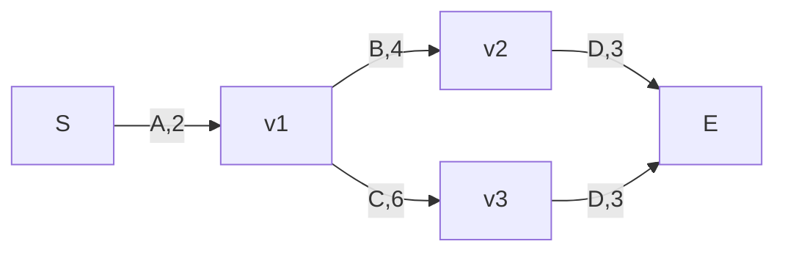
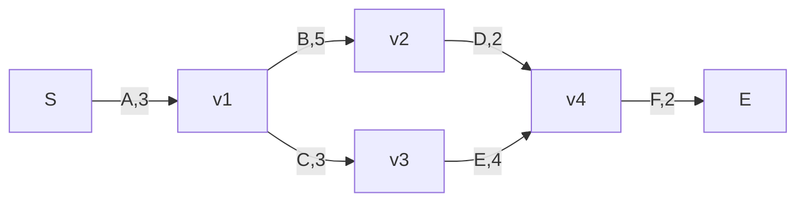

# 系统分析师｜第2章 数学与工程基础（完整版备考讲义+章节自测题）

> 适配系统分析师（第2版教材），包含教材删减但真题持续考查内容；上午选择题、计算题备考讲义。  
> 标签：系统分析师、上午题、数学、运筹学、图论、备考

[TOC]

## 章节结构对照与来源标注

> 本讲义为**系统分析师（第2版）教材第2章《数学与工程基础》**的学习强化讲义。下列映射标明：各模块对应教材哪一节、以及哪些内容来自**教材之外**（第1版/跨章节/真题补充）。
>
> **教材第2版第2章章节结构**：2.1 数学统计基础｜2.2 图论应用｜2.3 预测与决策｜2.4 数学建模｜2.5 工程伦理

| 讲义模块 | 对应教材第2版章节 | 内容性质 | 备考要求 |
|---|---|---|---|
| 模块1 数理基础 | 2.1 数学统计基础 | 主体为教材 | 必掌握：概率/分布/期望方差/相关系数；拓展：统计推断 |
| 模块2 图论基础 | 2.2 图论应用 | 主体为教材；欧拉/哈密顿为补充 | 必掌握：MST/Dijkstra/Floyd/最大流最小割；拓展：更多MST/更多最短路径/增广路径法 |
| 模块3 组合分析 | 教材第2版本章无 | 第1版补充（考纲仍要求） | 必掌握 |
| 模块4 运筹学 | 2.3.5 决策方法（线性规划） | 关键路径/PERT、排队/存贮/对策、不确定决策准则为补充 | 必掌握：关键路径/PERT/决策树/线性规划图解法；拓展：单纯形法手算；了解即可：排队/存贮/对策 |
| 模块5 数学建模 | 2.4 数学建模 | 主体为教材；过拟合/欠拟合/残差为补充 | 必掌握：建模步骤/分类/评估；拓展：白箱灰箱黑箱 |
| 模块6 预测技术 | 2.3 预测与决策 | 教材只详讲一次指数平滑；SMA/WMA为补充 | 必掌握：移动平均/指数平滑/回归概念；概念：预测内涵/程序/其他方法 |
| 模块7 工程伦理 | 2.5 工程伦理 | 技术/工程伦理为教材；知识产权为补充；标准化/IT审计/开源为跨章节 | 必掌握：职业道德/知识产权；拓展：工程伦理理论；跨章节：标准化/IT审计/开源 |

> ⚠️ **备考讲义 ≠ 教材摘要**：本讲义只把**考纲明确要求 OR 历年真题命题**的内容纳入必掌握主体。教材第2版第2章中存在、但考纲不明确、真题极少命题的小节（统计推断、Borůvka/反向删除、Bellman-Ford/SPFA/A*/Johnson、增广路径法实现、单纯形法手算、白箱灰箱黑箱、技术与工程区别、工程伦理四类问题与三原则、责任观演变）一律归入各模块末尾「拓展阅读」，**不配置例题、不配置课后习题**。
>
> ⚠️ 教材第2版第2章**不包含**：组合分析、关键路径/PERT、排队论、存贮论、对策论、欧拉/哈密顿回路、简单/加权移动平均、知识产权、标准化、IT审计、开源协议。其中**标准化、IT审计、开源统一收拢到文末「跨章节高频选择题拓展」**，复习时注意区分，勿误当成数学模块本身内容。

## 模块1：数理基础（概率论、数理统计）

**前置说明**：本章基于系统分析师第2版官方教材，增补第1版删减但历年真题、新考纲仍必考内容，适配上午综合计算题、选择题。  
**模块优先级**：🔴 最高优先级，概率论每年必考。  
**考情分析**：每年1道左右概率计算；核心：事件概率、条件概率、期望方差、相关系数。

### 1.1 核心知识点精讲

#### 1.1.1 基础概率定义

1. 样本空间：所有可能结果集合；随机事件是样本空间子集。
2. 概率公理：0≤P(A)≤1；必然事件概率=1，不可能事件=0。
3. 事件关系

- 互斥（互不相容）：A、B不能同时发生；P(AB)=0，P(A∪B)=P(A)+P(B)
- 对立事件：A不发生即为Ā；P(Ā)=1-P(A)
- 独立事件：A发生与否不影响B；P(AB)=P(A)P(B)

#### 1.1.2 条件概率 & 贝叶斯公式（高频）

条件概率：  
$P(B|A)=\frac{P(AB)}{P(A)}$

贝叶斯公式：  
$P(A|B)=\frac{P(B|A)P(A)}{P(B)}$

> 记忆：已知先验概率，反向求后验概率；系分选择题高频。

#### 1.1.3 期望、方差（离散随机变量）

期望（均值）：E(X)=Σx_i·P(x_i)，代表平均取值。  
方差：D(X)=E[(X-E(X))²]，衡量波动大小；方差越大，数据越离散。

性质：

- E(aX+b)=aE(X)+b
- D(aX+b)=a²D(X)

#### 1.1.4 相关系数 r

衡量两个变量线性相关强弱，r∈[-1,1]

- r=1：完全正线性相关
- r=-1：完全负线性相关
- r=0：无线性相关（不代表无任何关系，只是没有线性关系）

#### 1.1.5 大数定律与中心极限定理（概念）

大数定律：样本量足够大，样本均值趋近于总体期望。  
中心极限定理：大量独立同分布随机变量之和，近似服从正态分布。

#### 1.1.6 全概率公式与贝叶斯公式（教材2.1.1）【教材核心】

- **全概率公式**：若 B₁,B₂,…,Bₙ 两两互斥且并集为样本空间（构成完全事件组），P(Bᵢ)>0，则
  $P(A)=\sum_{i=1}^{n}P(B_i)P(A|B_i)$
- **贝叶斯公式**（由结果反推原因）：
  $P(B_i|A)=\dfrac{P(A|B_i)P(B_i)}{P(A)}=\dfrac{P(A|B_i)P(B_i)}{\sum_{k}P(A|B_k)P(B_k)}$

> 例题1即标准“全概率+贝叶斯”套路：先全概率求 P(告警触发)，再贝叶斯求 P(故障|告警)。

#### 1.1.7 常用概率分布（教材2.1.4）【教材核心，需记期望/方差】

| 分布 | 适用场景 | 期望 | 方差 |
|---|---|---|---|
| 0-1分布（伯努利） | 单次试验只有两个结果 | p | p(1-p) |
| 二项分布 B(n,p) | n重独立重复试验中A发生次数 | np | np(1-p) |
| 几何分布 G(p) | 首次成功所需试验次数 | 1/p | (1-p)/p² |
| 泊松分布 P(λ) | 稀有事件出现次数（误码数、不合格品数） | λ | λ（期望=方差是其识别特征） |
| 均匀分布 U(a,b) | 区间[a,b]上等可能 | (a+b)/2 | (b-a)²/12 |
| 正态分布 N(μ,σ²) | 大量独立小因素综合作用（误差、质量、进度） | μ | σ² |

> 记忆：泊松分布**期望=方差=λ**，可据此识别；二项分布 n=1 时退化为 0-1 分布。伯努利二项概率公式 $P_n(k)=C_n^k p^k(1-p)^{n-k}$ 是二项分布基础。

#### 1.1.8 高频易错点

1. 独立≠互斥；独立事件可以同时发生；互斥事件一定不独立（除非概率为0）；
2. 相关系数=0，仅无线性相关，不能说变量相互独立；
3. 贝叶斯公式是反向概率，不要和条件概率混淆。

### 1.2 典型配套例题（真题同源，带完整解析）

#### 例题1 条件概率

项目服务器故障概率0.1；故障时告警触发概率0.9，无故障时误告警概率0.05。已知告警触发，求服务器真实故障概率（贝叶斯）。

设A：服务器故障；B：告警触发  
P(A)=0.1，P(Ā)=0.9  
P(B|A)=0.9，P(B|Ā)=0.05  
P(B)=P(B|A)P(A)+P(B|Ā)P(Ā)=0.1×0.9+0.9×0.05=0.135

$$P(A|B)=\frac{P(B|A)P(A)}{P(B)}=\frac{0.09}{0.135}\approx0.667$$

> 【答案】≈0.667

#### 例题2 数学期望

方案：成功概率0.6收益100；失败概率0.4收益-50，求期望收益。

> 【解析】E=0.6×100+0.4×(-50)=60-20=40  
> 【答案】40

#### 例题3 相关系数

变量X,Y相关系数r=-0.95，描述正确的是？  
A. 无相关 B. 强负线性相关 C. 强正线性相关 D. 相互独立

> 【解析】r接近-1，强负线性相关  
> 【答案】B

### 1.3 课后习题（带完整答案+解析）

**习题1**  
事件A概率0.3，事件B概率0.4，A、B相互独立，求P(A∪B)

> 解析：P(A∪B)=P(A)+P(B)-P(A)P(B)=0.3+0.4-0.12=0.58  
> 答案：0.58

**习题2**  
随机变量X取值：10(0.5)，20(0.5)，求期望E(X)

> 解析：E=10×0.5+20×0.5=15  
> 答案：15

**习题3**  
相关系数r=0，说明（）  
A. 变量独立 B. 不存在线性相关关系 C. 完全负相关 D. 完全正相关

> 答案：B

**习题4**  
A、B互斥事件，P(A)=0.2，P(B)=0.5，P(A∪B)=？

> 解析：互斥，直接相加 0.2+0.5=0.7  
> 答案：0.7

### 拓展阅读：教材原生但备考非必学内容

> 【教材拓展｜非必学】教材有原文，但考纲无明确要求、历年真题极少命题。仅作概念了解，**不配置例题、不配置课后习题**。

#### 拓展·统计推断基础（教材2.1.5）【教材拓展｜非必学】

- **总体/样本/统计量**：总体＝研究对象全部观测；样本＝抽出的子集；统计量＝不含未知参数的样本函数。常用统计量：样本均值、样本方差/标准差、样本k阶原点矩/中心矩、次序统计量。
- **参数估计**
  - 点估计：用一个数估计参数。常用**矩估计法**（用样本矩估计总体矩）与**极大似然估计法**（最重要）。
  - 区间估计：用区间[a,b]以给定**置信度（置信水平）**覆盖待估参数；区间越大置信水平越高，两端称置信下限/上限。
- **假设检验（显著性检验）**：依据样本判断总体指标是否等于某值、是否服从某分布；常用 U检验、t检验、χ²检验、F检验。
- **回归分析**：研究变量间相关关系。分一元/多元、线性/非线性回归；参数估计常用**最小二乘法**；变量筛选用逐步回归、向前/向后回归。
- **方差分析**：把总变差按来源分解，判断可控因素影响是否显著。适用条件：**可比性、正态性、方差齐性**。分**单因素方差分析**与**双因素方差分析**（无交互/有交互）。
- **正交试验法**：用正交表做多因素试验设计，实现“**均衡分散、整齐可比**”，用少数试验找较优条件。

> 注：回归分析（最小二乘法）预测作为必掌握内容见模块6。系分对统计推断一般只考概念辨析，不考公式推导。

---

## 模块2：图论基础

**前置说明**：本章基于系统分析师第2版官方教材，增补第1版删减但历年真题、新考纲仍必考内容，适配上午综合计算题、选择题，部分知识点支撑案例计算题型。  
**模块优先级**：🔴 最高优先级（每年必考，计算题核心板块）  
**考情分析**：每年稳定1\~2道计算题；核心考点：最小生成树、Dijkstra最短路径、最大流最小割；欧拉/哈密顿回路以概念选择题为主。

### 2.1 核心知识点精讲

#### 2.1.1 图基本概念

图 G=(V,E)，V顶点集合，E边集合

- 无向图：边无方向；有向图：边为带方向的弧
- 简单图：无自环、无重复边
- 完全无向图：任意两点之间存在边；n顶点完全图边数：C(n,2)=n(n-1)/2

**度数**

- 无向图顶点度数：连接该顶点的边数量；握手定理：所有顶点度数之和 = 边数 × 2
- 有向图：入度（指向顶点）、出度（从顶点出发）；全部顶点总入度 = 总出度 = 边数

**连通相关**

- 连通图：无向图任意两点存在路径；不连通图拆分为多个连通分量
- 强连通：有向图任意两点互相可达
- 割点：删除该顶点，连通分量数量增加；割边（桥）：删除该边，图不再连通

#### 2.1.2 树与最小生成树（高频计算）

树：连通无环无向图；n个顶点的树一定有 n-1 条边。  
最小生成树MST：连通全部顶点，总边权之和最小，无环。

- Kruskal（克鲁斯卡尔）：边从小到大排序，依次选边；不构成环则保留，成环丢弃，直到选中 n-1 条边。适合稀疏图。
- Prim（普里姆）：任选起点，每次选择一端在已选集合、另一端在外的权重最小边，逐步扩张。适合稠密图。

> 性质：最小生成树总权重唯一，但树的结构不一定唯一。

#### 2.1.3 最短路径

- Dijkstra：单源最短路径（一个起点到所有其他顶点）；仅支持边权≥0，系分高频。
- Floyd：多源最短路径，一次性得到任意两点最短距离；允许负权，不能存在负环；复杂度高，系分一般只考概念。

#### 2.1.4 网络流：最大流、最小割（高频）

1. 有向带权网络：源点S（只流出）、汇点T（只流入）；边权代表容量。
2. 流量约束：0≤f≤c；中间节点流入总量=流出总量。
3. 最大流最小割定理：S到T的最大流的值 = S-T最小割容量。

> 最小割：顶点拆分为两组，S在A、T在B；所有A→B的边容量之和的最小值。

#### 2.1.5 欧拉回路 & 哈密顿回路（教材第2版本章无，图论基础补充；概念选择题）

- 欧拉回路（一笔画，遍历每条边一次，回到起点）

  - 无向图欧拉回路判定：全部顶点度数为偶数
  - 无向图欧拉路径（不回起点）：恰好0个或2个奇度顶点；2个奇度点分别是起点、终点
- 哈密顿回路：遍历每个顶点恰好一次，最后回到起点

> 考点提示：哈密顿回路没有简单判定公式，系分只考概念判断，不考复杂计算。

#### 2.1.6 高频易错点

1. Dijkstra不能处理负权边，题目出现负权不可使用Dijkstra；
2. 最小生成树只保证连通所有顶点，不保证原图任意两点是最短路径；
3. 握手定理是快速验算工具，选择题经常直接考查；
4. 最大流不是边容量简单相加，流量受路径瓶颈边限制。

### 2.2 典型配套例题（真题同源，带完整解析 + Mermaid绘图代码）

#### 例题1：最小生成树 Kruskal

顶点：A,B,C,D  
边：AB(1), AC(4), BC(2), BD(5), CD(1)  
求最小生成树总权重。

```mermaid
graph undirected
    A --1-- B
    A --4-- C
    B --2-- C
    B --5-- D
    C --1-- D
```

> 【解析】
> 
> 1. 边从小到大排序：AB(1)、CD(1)、BC(2)、AC(4)、BD(5)
> 2. 依次选取：
> 
>    - AB=1，无环，保留；已选边{AB}
>    - CD=1，无环，保留；已选边{AB,CD}
>    - BC=2，无环，保留；已选边{AB,CD,BC}，4个顶点需要3条边，停止。
> 3. 总权重 = 1+1+2=4  
> 【答案】最小生成树总权重为4

#### 例题2：Dijkstra单源最短路径

顶点S,A,B,C  
边：S→A(3)，S→B(6)，A→B(2)，A→C(5)，B→C(1)  
求S到C最短距离。

```mermaid
graph directed
    S --3--> A
    S --6--> B
    A --2--> B
    A --5--> C
    B --1--> C
```

> 【解析】
> 
> 1. 起点S距离：S=0；A=3；B=∞；C=∞
> 2. 最近未访问点A（距离3）：更新B：min(6,3+2)=5；C：min(∞,3+5)=8
> 3. 最近未访问点B（距离5）：更新C：min(8,5+1)=6
> 4. 最近未访问点C（距离6）。  
> S到C最短路径：S→A→B→C，总长度6。  
> 【答案】6

#### 例题3：欧拉回路概念题

无向图4个顶点，度数分别：2,2,3,3。能否一笔画？是否存在欧拉回路？

```mermaid
graph undirected
    v1 -- v2
    v1 -- v3
    v2 -- v3
    v2 -- v4
    v3 -- v4
```

> 【解析】  
> 奇度顶点数量=2；满足欧拉路径条件，但不是全部偶数度 → 不存在欧拉回路，可以一笔画（起点在一个奇度点，终点在另一个奇度点）  
> 【答案】可一笔画；无欧拉回路。

### 2.3 课后习题（带完整答案+解析 + Mermaid图代码）

**习题1（握手定理）**  
无向图共6条边，4个顶点，其中3个顶点度数分别是3,2,2，求剩下顶点度数？

> 参考答案&解析  
> 握手定理：总度数 = 2×边数 =12  
> 设未知度数x：3+2+2+x=12 ⇒ x=5  
> 答案：5

**习题2（Prim最小生成树）**  
顶点{A,B,C,D}  
边：AB(7), AC(1), BC(5), BD(2), CD(6)，从A出发用Prim求MST总权。

```mermaid
graph undirected
    A --7-- B
    A --1-- C
    B --5-- C
    B --2-- D
    C --6-- D
```

> 参考答案&解析  
> 起点A。
> 
> - A邻边最小AC=1，选中；集合{A,C}
> - 集合向外最小边C-B=5；集合{A,C,B}
> - 集合向外最小B-D=2；集合{A,C,B,D}，3条边。  
> 总权重：1+5+2=8  
> 答案：8

**习题3（最大流概念选择题）**  
S可到A(容量10), S到B(容量8)；A→T容量7；B→T容量9。求S到T最大流。

```mermaid
graph directed
    S --10--> A
    S --8--> B
    A --7--> T
    B --9--> T
```

> 参考答案&解析  
> A最多送出7；B最多送出8；合计最大流 7+8=15。  
> 答案：15

**习题4（欧拉回路判断）**  
无向图顶点度数：4,4,4,4，判断有无欧拉回路？

> 参考答案&解析  
> 所有顶点度数都是偶数，存在欧拉回路。  
> 答案：存在欧拉回路

### 拓展阅读：教材原生但备考非必学内容

> 【教材拓展｜非必学】教材有原文，但考纲无明确要求、历年真题极少命题（只考Kruskal/Prim、Dijkstra/Floyd概念与最大流最小割定理结论）。仅作了解，**不配置例题、不配置课后习题**。

#### 拓展·更多最小生成树算法：Borůvka、反向删除（教材2.2.1）【教材拓展｜非必学】

- **博鲁夫卡（Borůvka）算法**：不断为每个连通分量找连出的最小边加入，直至全连通；并行能力强、适合大规模图，复杂度约 O(E·logV)。
- **反向删除（Reverse-Delete）算法**：按边权**从大到小**依次删边，删除后图若不连通则保留该边；实现简单，稠密图效果较差，复杂度 O(E·logE)。

> Prim适合稠密图（O(V²)）、Kruskal适合稀疏图（O(E·logE)）为高频考点；Borůvka/反向删除了解概念即可。
#### 拓展·更多最短路径算法：Bellman-Ford、A*、Johnson、SPFA（教材2.2.2）【教材拓展｜非必学】

| 算法 | 特点 | 能否处理负权 |
|---|---|---|
| Dijkstra | 单源，按路径长度递增，贪心 | 否 |
| Floyd | 多源（任意两点间），动态规划枚举中间点 | 能（不能有负权回路） |
| Bellman-Ford | 单源，n-1轮松弛，可检测负权回路 | 能 |
| A* | 启发式搜索，启发函数+已知距离指导 | 与启发函数相关 |
| Johnson | 全源，Bellman-Ford转非负边+各源Dijkstra | 能 |
| SPFA | Bellman-Ford的队列改进 | 能 |

> 系分高频只考Dijkstra（不能负权）与Floyd（多源）概念；A*个别真题出现；其余了解算法定位即可。
#### 拓展·网络最大流量的增广路径法（教材2.2.3）【教材拓展｜非必学】

- 教材采用**路径叠加法**求最大流：从源到汇找可通路径，该路径流量＝各段剩余容量最小值；算出后把各段容量扣减，容量归0的边断开；反复直到无路可通，累加各路径流量即为最大流。
- 约束：每条边流量≤容量；中间节点净流量=0（只起转运）；总最大流量**唯一**，但运输方案可不唯一。
- 与“最大流最小割定理”等价：S→T最大流 = S-T最小割容量。

> 最大流最小割定理结论已在2.1.4必掌握；此处为实现步骤，仅作了解。

---

## 模块3：组合分析（第1版补充）

**前置说明**：本章基于系统分析师第2版官方教材，增补第1版删减但历年真题、新考纲仍必考内容，适配上午综合计算题、选择题。  
**模块优先级**：🔴 最高优先级（教材第2版已删减，但历年真题持续出题，计数类计算题必考板块）  
**考情分析**：每年1道左右选择题，以计数计算为主；核心：加法/乘法原理、排列组合、容斥原理、抽屉原理，递推为了解内容。

### 3.1 核心知识点精讲

#### 3.1.1 两大基本计数原理（基础）

1. 加法原理（分类）  
完成一件事，有若干类互相独立方案，各类方案数量直接相加。

> 关键词：分类，或者，方案之间互斥，一次只选一类。  
> 公式：总方法数 N=n1+n2+…+nk

1. 乘法原理（分步）  
完成一件事，需要依次完成多个步骤，每一步的可选数量相乘。

> 关键词：分步，并且，先后顺序，每一步都要完成。  
> 公式：总方法数 N=n1×n2×…×nk

> 易错区分：分类用加，分步用乘。

#### 3.1.2 排列与组合

- 排列：从n个不同元素取出k个，考虑顺序。  
$A_n^k = P_n^k=\frac{n!}{(n-k)!}$  
全排列：A(n,n) = n! = n×(n-1)×…×1
- 组合：从n个不同元素取出k个，不考虑顺序。  
$C_n^k=\frac{n!}{k!\cdot(n-k)!}$

性质：

1. C(n,k)=C(n,n-k)，简化计算（如C(10,8)=C(10,2)）
2. C(n,0)=1，C(n,n)=1

> 快速判断：顺序改变算不同结果 → 排列；顺序无关 → 组合。

#### 3.1.3 容斥原理（高频计算题）

用于计算多个集合的元素总数，减去重复重叠部分。

- 两个集合版本：  
$|A\cup B|=|A|+|B|-|A\cap B|$
- 三个集合版本（系分偶尔考）：  
$|A\cup B\cup C|=|A|+|B|+|C|-|A\cap B|-|A\cap C|-|B\cap C|+|A\cap B\cap C|$

> 含义：先全部相加，减去两两重叠，再加回多减掉的三重重叠。

#### 3.1.4 抽屉原理（鸽巢原理，选择题概念题）

基础抽屉原理：把n+1个物体放入n个抽屉，至少有一个抽屉里面不少于2个物体。  
加强版：把m个物体放入n个抽屉，⌈m/n⌉ 为至少一个抽屉最少物体数量（向上取整）。

> 出题场景：至少多少个样本，保证一定出现某种相同情况。

#### 3.1.5 递推计数（低频，了解）

找到第n项和前面项的递推关系，例如斐波那契。系分只考简单递推，不考复杂通项推导。

#### 3.1.6 高频易错点

1. 区分排列、组合的核心是是否关心顺序；
2. 容斥原理容易符号搞反：减去交集，三个集合最后加回三重交集；
3. 抽屉原理求"保证"，要考虑最坏情况。

### 3.2 典型配套例题（真题同源，带完整解析）

#### 例题1：加法原理与乘法原理

某系统登录有2种验证方式：密码登录（5种密码方案）、短信验证（4种号码方案）。  
(1) 任选一种方式登录，一共多少方案？  
(2) 先设置密码，再绑定短信（两步都要完成），一共多少方案？

> 【解析】  
> (1) 分类，加法原理：5+4=9  
> (2) 分步，乘法原理：5×4=20  
> 【答案】(1)9；(2)20

#### 例题2：排列组合

从8名开发人员选出3人组成项目小组。  
(1) 3个人分配不同岗位（负责人、开发、测试）；  
(2) 3个人仅作为组员，不区分岗位。分别求方案数量。

> 【解析】  
> (1) 区分岗位，顺序重要 → 排列  
> A(8,3)=8×7×6=336  
> (2) 组员无岗位区分，顺序无关 → 组合  
> C(8,3)=8×7×6/(3×2×1)=56  
> 【答案】(1)336；(2)56

#### 例题3：二集合容斥原理

项目组一共50人，会Java的30人，会Python的25人，两种都会的10人。求至少会一种语言的人数？

> 【解析】|A∪B|=30+25-10=45  
> 【答案】45人

#### 例题4：抽屉原理

有4种不同类型日志，至少要收集多少条日志，保证一定存在2条同类型日志？

> 【解析】最坏情况，每种各拿1条（4条），再取1条必然重复。4+1=5  
> 【答案】5

### 3.3 课后习题（带完整答案+解析）

**习题1**  
从6名测试工程师挑选2人，分别负责功能测试、性能测试，多少种方案？

> 参考答案&解析  
> 岗位不同，顺序有关，排列  
> A(6,2)=6×5=30  
> 答案：30

**习题2**  
从7个候选服务器挑选4台部署集群，服务器无编号、不区分顺序，有多少种选法？

> 参考答案&解析  
> 不区分顺序，组合  
> C(7,4)=C(7,3)=7×6×5/(3×2×1)=35  
> 答案：35

**习题3（容斥原理两集合）**  
总共60个需求，35个需求有前端改动，32个需求有后端改动，前后端都改动的15个。问只改动前端或者只改动后端的需求数量？

> 参考答案&解析  
> 先求至少改动一端：35+32-15=52  
> 只改动前端：35-15=20；只改动后端：32-15=17  
> 合计：20+17=37  
> 答案：37

**习题4（抽屉原理加强版）**  
有5类告警信息。至少取出多少告警，能保证有一类告警不少于3条？

> 参考答案&解析  
> 最坏情况：每一类先拿2条：5×2=10；再取1条，必有一类达到3条。10+1=11  
> 答案：11

**习题5（三集合容斥，选做）**  
一个项目，会A工具22人，B工具26人，C工具24人；同时会A+B=8，A+C=7，B+C=9；三者都会的3人。求至少会一种工具的人数。

> 参考答案&解析  
> |A∪B∪C|=22+26+24 -8-7-9 +3 =51  
> 答案：51

---

## 模块4：运筹学（第1版补充）

**前置说明**：本章基于系统分析师第2版官方教材，增补第1版删减但历年真题、新考纲仍必考内容，适配上午综合计算题、选择题，关键路径、决策树还会在案例大题出现。  
**模块优先级**：🔴 最高优先级（系分数学大题核心板块，分值高）  
**考情分析**：每年1\~2道上午计算题；关键路径/PERT、决策树高频；线性规划为次高频；排队论、存贮论、对策论仅概念了解，低频。

### 4.1 核心知识点精讲

#### 4.1.1 线性规划 & 整数规划

> 适用场景：资源有限，求最大收益/最小成本。

1. 标准形式组成：目标函数 + 约束条件 + 变量非负

   - 目标函数：max(收益) 或 min(成本)，变量是一次线性表达式
   - 约束：不等式/等式，描述资源上限、下限
   - 变量 x≥0：资源数量不能为负数
2. 可行域：满足全部约束条件的变量取值集合；最优解一定出现在可行域顶点。
3. 图解法：仅适用于2个变量，系分真题基本都是双变量。
4. 整数规划：变量要求必须取整数；0-1规划是特殊整数规划，变量只能取0或1（方案选/不选）。

> 易错点：最优解不一定唯一；如果可行域无界，可能不存在最优解。

#### 4.1.2 网络计划：关键路径、PERT（极高频，上午+案例）

AOE网（有向边表示活动，顶点表示事件）

1. 4个核心时间参数

   - ES：最早开始时间；EF：最早完成时间，EF=ES+活动持续时间
   - LS：最迟开始时间；LF：最迟完成时间，LS=LF-活动持续时间
   - 总时差 TF=LS-ES=LF-EF：活动最多可以推迟多久，不影响项目总工期
   - 自由时差 FF：推迟本活动，不影响紧后活动最早开始的最大延迟
2. 关键路径：总时差=0的活动连成的路径；决定项目最短工期；关键活动不能延期，否则整体工期变长。
3. PERT三点估算（估算活动期望工期）

$$T_e=\frac{a+4m+b}{6}$$

a：乐观最短工期；b：悲观最长工期；m：最可能工期  
方差：σ²=((b-a)/6)²；项目总工期服从正态分布。

#### 4.1.3 决策论（期望损益、决策树，高频）

1. 三类决策

   - 确定型：环境唯一，直接计算结果
   - 风险型：每种自然状态有已知发生概率，计算期望收益
   - 不确定型：不知道状态发生概率，采用4种准则
   
     - 乐观准则（大中取大）：每种方案取最大收益，再选最大
     - 悲观准则（小中取大）：每种方案取最小收益，再选最大
     - 折中准则：折中收益=α×最大收益+(1-α)×最小收益，α乐观系数
     - 最小后悔值（萨维奇）：先算后悔矩阵，每个方案取最大后悔值，选最小的那个
2. 决策树：

   - 方块：决策点；圆圈：状态点；分支：方案/状态分支
   - 计算规则：从右向左逆推，计算每个状态点期望收益；剪枝舍弃收益差的分支。

#### 4.1.4 排队论（第1版补充｜了解即可）🟢低频

M/M/1模型：单服务台，泊松到达、负指数服务时间

- λ：顾客到达率；μ：服务速率，必须μ>λ系统才稳定
- 核心公式（仅记概念，复杂计算很少考）
- 系统利用率 ρ=λ/μ

#### 4.1.5 存贮论（库存EOQ，第1版补充｜了解即可）🟢低频

经济订货批量EOQ：最小化订货成本+库存持有成本  
$Q_{EOQ}=\sqrt{\frac{2DS}{H}}$  
D年需求量，S单次订货费，H单位年持有成本。

> 系分只考公式概念，极少复杂计算。

#### 4.1.6 对策论（零和博弈，第1版补充｜了解即可）🟢低频

零和博弈：一方收益=另一方损失；支付矩阵。  
纯策略：双方固定选择某一个策略；混合策略：按概率随机选择策略。系分仅概念判断。

#### 4.1.7 决策的过程与定量决策方法（教材2.3.4、2.3.5）【教材】

- **决策过程四阶段**：情报活动（识别问题、收集信息、定目标）→ 设计活动（拟定备选方案、状态分析与后果预测）→ 抉择活动（评估后果、选出满意方案）→ 实施活动（执行并跟踪修正）。前阶段不断受后阶段反馈修正。
- **决策的定量计算方法**（教材列举）：线性规划、成本效益分析、效用分析、模拟仿真、决策树分析。
  - 成本效益分析：效益与成本折算为同一货币单位后比较。
  - 效用分析：把方案效用转成数值比较。
  - 模拟仿真：多次模拟得出平均效果与概率分布。
  - 决策树分析：把决策过程建成决策树，逆推选优。

> 记忆：决策四阶段＝情报→设计→抉择→实施；定量方法＝线性规划、成本效益、效用、模拟、决策树。

#### 4.1.8 线性规划的图解法与求解结果（教材2.3.5）【教材】

- **图解法**只适用于2个变量（系分真题基本双变量）：画约束半平面得可行域，平移目标等值线到边界顶点取最优。
- **求解结果的4种情况**：唯一最优解；无穷多最优解（两最优顶点连线上的点均最优）；无界解（无最优解，缺约束）；无可行解（约束矛盾）。后两种说明模型有误。
- 若存在最优解，**一定在可行域某个顶点取得**（顶点原则）。

> 系分常考：线性规划最优解在可行域顶点；无穷多解/无界解/无可行解的含义。

#### 4.1.9 高频易错点

1. 关键路径可以有多条；多条关键路径时，任何一条关键活动延期，总工期延长；
2. 总时差是不影响总工期；自由时差不影响紧后活动最早开始，二者不要混淆；
3. 风险决策用期望；不确定决策没有概率，不能算期望；
4. 线性规划变量≥0，资源约束不等式方向不能写反。

### 4.2 典型配套例题（真题同源，带完整解析，网络图附Mermaid）

#### 例题1：线性规划（双变量图解）

某工厂生产A、B两类服务组件。

- A：消耗资源2，利润3；B：消耗资源3，利润4
- 总资源上限：12；A、B产量 x≥0,y≥0
- 目标：max Z=3x+4y，约束：2x+3y≤12，x≥0,y≥0

求最大利润。

> 【解析】  
> 可行域顶点：(0,0),(6,0),(0,4)
> 
> - (0,0): Z=0
> - (6,0): Z=18
> - (0,4): Z=16  
> 最优解x=6,y=0，最大利润18。  
> 【答案】最大利润=18

#### 例题2：关键路径+PERT三点估算

项目活动：  
A(2天)，B紧前A(4天)，C紧前A(6天)，D紧前B,C(3天)



求：总工期，关键路径。

> 【解析】  
> ES/EF  
> A: ES=0,EF=2  
> B: ES=2,EF=6  
> C: ES=2,EF=8  
> D: ES=max(6,8)=8，EF=11  
> 总工期11天；关键路径 S-A-C-D-E。  
> 【答案】总工期11天；关键路径：A→C→D

PERT子例题：某活动乐观a=2，最可能m=4，悲观b=10，求期望工期

$$T_e=\frac{2+4\times4+10}{6}=\frac{28}{6}\approx4.67$$

> 【答案】≈4.67天

#### 例题3：决策树（风险决策期望收益）

方案1：自研系统，投入80万；成功概率0.6，收益200万；失败0.4，收益50万  
方案2：采购成品，投入30万；成功概率0.8，收益120万；失败0.2，收益40万

> 【解析】  
> 方案1期望净收益：0.6×200+0.4×50 -80=120+20-80=60  
> 方案2期望净收益：0.8×120+0.2×40 -30=96+8-30=74  
> 74>60，选择方案2采购。  
> 【答案】方案2期望收益更高，选采购。

### 4.3 课后习题（带完整答案+解析，Mermaid图）

**习题1（线性规划）**  
目标 max Z=5x+3y  
约束：4x+2y≤20, x+2y≤8, x≥0,y≥0，求最大目标值。

> 参考答案&解析  
> 可行域顶点：(0,0),(5,0),(4,2),(0,4)  
> (0,0):0；(5,0):25；(4,2):20+6=26；(0,4):12。  
> 最大值26。  
> 答案：26

**习题2（关键路径计算）**  
活动：A(3),B紧前A(5),C紧前A(3),D紧前B(2),E紧前C(4),F紧前D,E(2)



求项目总工期、关键路径。

> 参考答案&解析  
> A ES=0 EF=3  
> B ES=3 EF=8；C ES=3 EF=6  
> D ES=8 EF=10；E ES=6 EF=10  
> F ES=max(10,10)=10 EF=12  
> 总工期12；关键路径 A→B→D→F  
> 答案：总工期12；关键路径A-B-D-F

**习题3（不确定决策 最小后悔值）**  
两个方案：方案甲：市场好收益100，一般60，差20；方案乙：市场好80，一般70，差30

> 参考答案&解析  
> 各状态最优收益：好=100；一般=70；差=30  
> 后悔矩阵：  
> 甲：0，10，10；最大后悔=10  
> 乙：20，0，0；最大后悔=20  
> 最小最大后悔=10 → 选甲  
> 答案：选择方案甲

**习题4（PERT三点估算）**  
活动乐观a=1，最可能m=3，悲观b=8，求期望工期。

> 参考答案&解析  
> T_e=(1+4×3+8)/6=21/6=3.5  
> 答案：3.5

### 拓展阅读：教材原生但备考非必学内容

> 【教材拓展｜非必学】线性规划系分只考图解法与顶点性质，单纯形法手算不作要求。

#### 拓展·线性规划的单纯形法（教材2.3.5）【教材拓展｜非必学】

- **单纯形法**：变量多于2个时使用，从一个顶点出发沿目标改进方向换到另一顶点直至最优；系分不考详细迭代，了解思路即可。

---

## 模块5：数学建模

**前置说明**：本章基于系统分析师第2版官方教材，增补第1版删减但历年真题、新考纲仍必考内容，适配上午综合选择题，以概念辨析为主，几乎无复杂计算。  
**模块优先级**：🟡 中等优先级  
**考情分析**：一般0\~1道选择题；侧重建模步骤、模型分类、模型评估与验证，不考复杂公式推导。

### 5.1 核心知识点精讲

#### 5.1.1 数学建模定义

数学建模：针对现实业务问题，抽象、简化，建立数学结构（方程、不等式、图、概率模型等），用数学工具求解，再将结果解释回现实问题，迭代优化模型。

> 本质：现实问题 → 数学抽象 → 求解 → 检验 → 应用

#### 5.1.2 数学建模标准步骤（高频考点）

1. 问题分析与假设：明确目标；对现实做合理简化假设（忽略次要因素）。假设必须清晰、可验证。
2. 建立模型：选择合适数学形式（线性/非线性、概率、图论、排队等），定义变量，写出关系式。
3. 模型求解：代数计算、图解、仿真、算法求解。
4. 模型检验与分析：

   - 误差分析：参数误差、模型假设带来的误差
   - 灵敏度分析：参数微小变化，结果波动大小
5. 模型解释：将数学解翻译成业务结论
6. 模型改进：检验发现偏差，修改假设、调整模型，迭代

> 考点记忆顺序：问题假设 → 建模 → 求解 → 检验分析 → 解释 → 改进

#### 5.1.3 模型分类（概念区分）

1. 按变量性质

   - 连续模型：变量连续（如连续时间库存模型、连续概率分布）
   - 离散模型：变量取离散值（图论、组合计数、离散事件仿真）
2. 按时间

   - 静态模型：不随时间变化，同一时刻快照（线性规划）
   - 动态模型：随时间演变（排队论、差分方程）
3. 按确定性

   - 确定性模型：输入确定，输出唯一（关键路径、线性规划）
   - 随机模型：含随机因素，输出是概率分布（贝叶斯、PERT、排队论）
4. 线性 / 非线性模型

   - 线性：变量一次，满足叠加原理；求解简单
   - 非线性：含乘积、高次项，求解复杂

#### 5.1.4 模型评估指标与概念

- 灵敏度分析：考察模型输入参数变化，输出结果变化幅度。用来判断模型是否稳定。
- 残差：模型预测值与真实观测值之差；残差越小拟合越好。
- 过拟合：模型过度贴合样本数据，记住噪声，泛化能力差，新数据预测效果差。
- 欠拟合：模型太简单，连样本数据规律都无法捕捉。

#### 5.1.5 数学建模的过程（教材2.4.3）【教材】

教材把建模过程分为 **7 步**：模型准备（了解背景、明确目标、搜集信息）→ 模型假设（简化问题、抓本质、提出可检验假设）→ 模型建立（用数学语言刻画关系，尽量用简单工具）→ 模型求解（估算参数、解方程/优化/数值计算）→ 模型分析（误差分析、灵敏性/强健性分析）→ 模型检验（与实际比较，不符则修改假设重来）→ 模型应用。

> 与讲义前期“6步”的区别：教材把“准备”单列、以“应用”收尾。真题如考步骤，**按教材7步作答**。
> 建模4种方法（教材）：直接分析法、类比法、数据分析法、构想法。

#### 5.1.6 数学建模的特点（教材2.4.4）【教材，选择题高频】

1. 逼真性与可行性（在“费用”与“效益”间折中）
2. 渐进性（由简到繁、删繁就简，反复迭代）
3. 强健性（假设/数据微小变化，模型结构/参数相应变化）
4. 可转移性（可跨领域借用，如生态/经济借用物理模型）
5. 非预制性（实际问题千变万化，模型不能做成预制品）
6. 条理性（促使分析更全面深入）
7. 技艺性（依赖经验、想象、判断，近乎艺术）
8. 局限性（结论的通用性、精确性只是相对和近似的）

> 记忆：逼真可行、渐进、强健、可转移、非预制、条理、技艺、局限。

#### 5.1.7 数学建模的分类（教材2.4.4）【教材，选择题高频】

- 按应用领域：人口/交通/环境/生态/城镇规划模型等。
- 按数学方法：初等模型、几何模型、微分方程模型、统计回归模型、数学规划模型等。
- 按表现特征：确定性/随机性模型；静态/动态模型；线性/非线性模型；离散/连续模型。
- 按建模目的：描述、预报、优化、决策、控制模型。
> 确定/随机、静态/动态、线性/非线性、离散/连续是高频概念题；白箱/灰箱/黑箱见模块5拓展阅读。

#### 5.1.8 高频易错点

1. 建模第一步不是写公式，而是简化、提出合理假设；假设不能违背问题本质；
2. 灵敏度分析≠误差分析：灵敏度看参数变动影响；误差分析看模型预测与真实值差距；
3. 过拟合：训练集效果好，新数据差；欠拟合：训练集本身效果就差。

### 5.2 典型配套例题（真题同源，带完整解析）

#### 例题1（建模步骤选择题）

在数学建模流程中，下面哪一步是在求解模型之后？  
A. 提出假设 B. 灵敏度分析 C. 定义变量 D. 建立目标函数

> 【解析】  
> 建模顺序：假设→定义变量、建立模型→求解→模型检验/灵敏度分析→解释结果。  
> 灵敏度分析属于求解后的模型分析环节。  
> 【答案】B

#### 例题2（模型类型区分）

项目PERT三点估算法，考虑工期随机波动，属于哪一类模型？

> 【解析】  
> 工期存在随机变量，输出为概率分布，属于随机模型；同时属于动态时间相关模型。  
> 【答案】随机模型

#### 例题3（过拟合概念）

预测服务器负载模型，在历史采集数据集上预测误差极低，但上线后对新的业务数据预测误差很大，该现象是？

> 【解析】  
> 在训练样本表现极好，新数据失效 → 过拟合  
> 【答案】过拟合

### 5.3 课后习题（带完整答案+解析）

**习题1**  
数学建模流程，正确顺序是：  
①模型检验与灵敏度分析 ②提出假设、简化问题 ③建立数学模型 ④求解模型  
A. ②③④① B. ②①③④ C. ③②④① D. ②④③①

> 参考答案&解析  
> 顺序：假设(②) → 建模(③) → 求解(④) → 检验分析(①)  
> 答案：A

**习题2**  
线性规划，给定固定资源，求最大收益，不考虑时间随机波动，属于：  
A. 动态随机模型 B. 静态确定性模型 C. 静态随机模型 D. 动态确定性模型

> 参考答案&解析  
> 无时间演化、无随机因素 → 静态确定性模型  
> 答案：B

**习题3**  
对建好的预测模型，修改输入参数，观察输出结果变化幅度，该操作称为？  
A. 残差计算 B. 灵敏度分析 C. 误差修正 D. 模型假设

> 参考答案&解析  
> 灵敏度分析就是研究参数变动对输出的影响。  
> 答案：B

**习题4**  
下列说法正确的是（多选）  
A. 欠拟合是模型过于复杂  
B. 过拟合模型在新数据集预测效果差  
C. 数学建模假设可以忽略次要因素  
D. 确定性模型包含随机变量

> 参考答案&解析  
> A错：欠拟合是模型太简单；B正确；C正确；D错：确定性模型无随机变量。  
> 答案：BC

### 拓展阅读：教材原生但备考非必学内容

> 【教材拓展｜非必学】仅作概念了解，不配置例题与习题。

#### 拓展·按结构了解程度分类：白箱/灰箱/黑箱模型（教材2.4.4）【教材拓展｜非必学】

- **白箱模型**（机理清楚，如物理）、**灰箱模型**（机理不完全清楚，如生态/气象/交通）、**黑箱模型**（机理很不清楚，如生命/社会科学）。

---

## 模块6：预测技术

**前置说明**：本章基于系统分析师第2版官方教材，增补第1版删减但历年真题、新考纲仍必考内容，适配上午综合选择题与计算题。  
**模块优先级**：🟡 中等优先级  
**考情分析**：年均0\~1道计算题；核心考点：简单移动平均、加权移动平均、一次指数平滑；回归预测概念；季节预测仅了解。

### 6.1 核心知识点精讲

#### 6.1.1 预测分类

1. 定性预测：依靠专家经验判断，无历史量化数据。如德尔菲法、专家评审。
2. 定量预测：基于历史数据做数学计算

   - 时间序列预测：数据按时间先后排列，假定未来延续历史趋势（移动平均、指数平滑）
   - 因果预测：找到自变量和预测目标的函数关系（一元线性回归 y=ax+b）

> 考点区分：时间序列只看自身历史；因果回归找其他影响因素。

#### 6.1.2 简单移动平均 SMA

取最近 n 期历史数据算术平均值，作为下一期预测值。

$$F_{t+1}=\frac{Y_t+Y_{t-1}+\dots+Y_{t-n+1}}{n}$$

F(t+1)：t+1期预测值；Y：历史实际值；n：移动期数。  
特点：平滑波动，滞后于趋势；n越大，平滑效果越强，滞后越明显。

#### 6.1.3 加权移动平均 WMA

对近期数据赋予更高权重，远期权重低，更贴近近期变化。

$$F_{t+1}=w_tY_t+w_{t-1}Y_{t-1}+\dots$$

权重之和必须等于1。

#### 6.1.4 一次指数平滑（指数平滑法，高频）

适合无明显趋势、无季节波动的平稳序列。

$$F_{t+1}=\alpha Y_t + (1-\alpha)F_t$$

- α：平滑系数，0<α<1
- Y_t：第t期实际值；F_t：第t期预测值

> 记忆要点：  
> α大 → 更加看重最新一期实际数据，响应快，波动大；  
> α小 → 看重历史预测，平滑性强，响应慢。

#### 6.1.5 一元线性回归预测（概念为主）

y = a x + b  
x自变量，y预测因变量；相关系数衡量线性相关强弱（模块1已经介绍）。

> 系分一般不考a、b的复杂求解，多考概念判断。

#### 6.1.6 季节预测（了解）

数据存在周期性季节波动；先剔除季节因子，做基础预测，再乘回季节系数。低频考点。

#### 6.1.7 预测误差指标（概念）

- MAE 平均绝对误差：|实际-预测|平均值
- MSE 均方误差：误差平方的平均值，放大大偏差的影响

#### 6.1.8 预测的基本内涵（教材2.3.1）【教材】

- 三条预测途径：**因果分析**（研究原因推未来）、**类比分析**（与历史“先导事件”类比）、**统计分析**（分析历史数据揭示规律）。
- 教材用系统S、模型M、结论C三个集合相交成7个区域说明预测的7种情况；仅 S∩M∩C（正确模型+正确结论）为正确预测，其余6种存在信息失真（如“错误模型碰巧得到正确结论”）。
- 预测目的：服务于决策（战略计划、流程优化、风险评估等）。

> 常考：正确预测＝系统、模型、结论三者吻合；错误建模却碰巧得到正确结论仍属失真。

#### 6.1.9 预测的程序（教材2.3.2）【教材，选择题】

1. 明确预测任务、制订预测计划；
2. 搜集、审核和整理资料（筛选标准：直接相关性、可靠性、最新性）；
3. 选择预测方法、建立数学模型；
4. 检验模型（理论上合理、统计可靠、预测能力强、简单适用）；
5. 分析预测误差、评价预测结果；
6. 向决策者提交预测报告。

> 记忆：任务计划→资料→方法模型→检验→误差评价→提交报告。

#### 6.1.10 其他预测方法（教材2.3.3）【教材】

- 时间序列分析：ARIMA、SARIMA、一次指数平滑等（教材正文只详讲一次指数平滑）。
- 机器学习算法预测：线性回归、逻辑回归、决策树、随机森林、神经网络（注意数据预处理与特征选择）。
- 模拟（仿真）预测：定义变量与参数，用统计/运筹方法模拟不同情况。
- 主观判断预测：基于专家经验与直觉，需评估专家背景、经验、意见。

> 区分：德尔菲法＝定性/主观判断类；移动平均/指数平滑＝时间序列定量类；回归＝因果类。

#### 6.1.11 高频易错点

1. 指数平滑初始值：第一期预测值常直接取第一期实际值；
2. 移动平均仅适合短期预测；有明显上升/下降趋势时，简单移动平均会低估/高估；
3. α取值理解：业务波动大、需要快速响应，选大α；数据噪声大，选小α。

### 6.2 典型配套例题（真题同源，带完整解析）

#### 例题1：简单移动平均SMA

服务器近4个月访问量：1月120，2月130，3月110，4月140。取n=3，用简单移动平均预测5月访问量。

> 【解析】  
> 取最近3期：2月、3月、4月  
> F5=(130+110+140)/3=380/3≈126.67  
> 【答案】约126.67

#### 例题2：加权移动平均WMA

三期数据：120,130,140；权重依次0.2,0.3,0.5（越近权重越高），预测下一期。

> 【解析】  
> F=120×0.2+130×0.3+140×0.5=24+39+70=133  
> 【答案】133

#### 例题3：一次指数平滑

α=0.2，上期实际Y_t=100，上期预测F_t=90，求下一期预测。

> 【解析】  
> F(t+1)=0.2×100 + 0.8×90=20+72=92  
> 【答案】92

### 6.3 课后习题（带完整答案+解析）

**习题1**  
历史数据：80,90,100，n=2简单移动平均，预测下一期。

> 参考答案&解析  
> F=(90+100)/2=95  
> 答案：95

**习题2**  
三期数据：20,24,28；权重0.2,0.3,0.5，加权移动平均预测。

> 参考答案&解析  
> 20×0.2+24×0.3+28×0.5=4+7.2+14=25.2  
> 答案：25.2

**习题3**  
指数平滑，α=0.3，本期实际=200，本期预测=180，求下期预测。

> 参考答案&解析  
> F=0.3×200 + 0.7×180=60+126=186  
> 答案：186

**习题4**  
下面属于定性预测方法的是（）  
A. 指数平滑 B. 德尔菲法 C. 移动平均 D. 线性回归

> 参考答案&解析  
> 德尔菲法依靠专家匿名多轮征询，定性预测。  
> 答案：B

---

## 模块7：工程伦理

**前置说明**：本章基于系统分析师第2版官方教材，适配上午选择题，纯概念考点，无计算。  
**模块优先级**：🟡 中等优先级  
**考情分析**：每年0\~1道选择题；侧重软件工程师职业道德、知识产权、信息安全伦理、职业责任。

### 7.1 核心知识点精讲

#### 7.1.1 软件工程师职业道德基本准则

1. 公众优先：首要责任是保障公众、客户、用户的安全、健康与利益，高于雇主、项目利益。
2. 客户与雇主：忠于客户与雇主，在授权范围内处理业务；保守商业秘密，不泄露涉密信息。
3. 产品责任：保证交付产品符合规范、安全可靠；如实评估风险，不刻意隐瞒缺陷。
4. 判断与专业：保持专业客观，不接受会影响专业判断的贿赂、礼品；不做超出自身能力范围的工作。
5. 管理职责：管理者合理规划项目、保障质量，如实汇报成本、进度、风险，不虚假承诺。
6. 职业操守：维护行业声誉，不从事损害行业的行为；尊重同行，公平竞争。
7. 同行：尊重他人成果，对他人工作客观评价，不恶意诋毁。
8. 自我提升：持续学习，更新专业知识。

> 核心记忆口诀：公众第一，忠于雇主，保守秘密，如实评估，不越能力，公平竞争

#### 7.1.2 知识产权（高频考点）

1. 著作权（版权）

   - 软件源代码、文档、图片、文章，创作完成自动获得著作权，不需要登记。
   - 保护范围：表达形式，不保护思想、算法、思路、业务逻辑。
   - 职务作品：本职工作+利用单位资源开发，著作权一般归单位。
2. 专利权

   - 保护技术方案（发明、实用新型、外观），必须申请、授权后才生效。
   - 软件算法本身不能直接申请专利；但结合硬件的嵌入式方案、特定业务装置可以申请发明专利。
3. 商标权：保护标识（名称、logo），区分商品来源，需要注册。
4. 商业秘密：未公开的技术、客户资料、源码，依靠保密协议保护，无法定保护期限，一旦公开不再受保护。

> 关键区分：著作权保护代码表达；专利保护技术方案；商业秘密靠保密。

#### 7.1.3 软件相关伦理与法律边界

- 开源软件：遵守对应开源协议（GPL、MIT、Apache等），不能无视协议直接闭源商用。
- 逆向工程：部分场景允许（如兼容、安全研究）；但用于窃取商业秘密、盗版破解属于侵权。
- 个人信息：收集用户数据遵循最小必要原则，不得未经授权采集、泄露、倒卖个人隐私。

#### 7.1.4 利益冲突

利益冲突：个人利益与职业责任冲突。  
示例：私下承接同行业竞品项目、收受供应商回扣、利用公司资源开发个人产品。  
处理原则：主动披露利益冲突，必要时回避项目。

#### 7.1.5 高频易错点

1. 著作权创作完成自动生效，不是登记才生效；
2. 算法、思想不受著作权保护；只有具体实现的代码、文档表达才受保护；
3. 公众安全优先级 > 公司利益 > 个人利益；选择题出现危及公众安全，工程师有义务上报，不能隐瞒；
4. 商业秘密一旦对外公开，不再受保护；专利保护有法定年限，到期公开。

### 7.2 典型配套例题（真题同源，带完整解析）

#### 例题1（职业道德）

在项目测试中，工程师发现软件存在重大安全漏洞，上线后会危害用户数据安全，但管理层要求隐瞒漏洞按期上线。工程师正确做法是？

> 【解析】  
> 公众安全优先级最高，应当拒绝隐瞒，向上级更高层级上报风险，必要时按合规流程披露风险，不能配合隐瞒。  
> 【答案】拒绝隐瞒，向上级报告安全风险

#### 例题2（知识产权）

某程序员独立构思一套业务算法思路，尚未编写代码，该算法思路能否获得著作权保护？

> 【解析】  
> 著作权不保护思想、思路、算法，只保护代码这类具体表达。仅有思路，无具体实现，不受著作权保护。  
> 【答案】不能，著作权不保护算法思想

#### 例题3（知识产权区分）

企业未对外公开的核心客户清单，签订保密协议，属于？  
A. 著作权 B. 专利权 C. 商业秘密 D. 商标权

> 【解析】  
> 未公开、保密的业务资料属于商业秘密。  
> 【答案】C

### 7.3 课后习题（带完整答案+解析）

**习题1**  
软件著作权产生的时间是？  
A. 软件登记时 B. 软件开发完成时 C. 软件发布上线时 D. 软件交付客户时

> 参考答案&解析  
> 著作权自作品创作完成自动取得。  
> 答案：B

**习题2**  
软件工程师下列行为，违背职业道德的是？  
A. 项目存在重大安全隐患，主动向上汇报风险  
B. 不接受供应商赠送的大额礼品，避免影响专业判断  
C. 利用公司工作时间与服务器资源，开发竞品产品  
D. 保守客户的业务涉密数据

> 参考答案&解析  
> C存在利益冲突，使用单位资源开发竞品，违背职业操守。  
> 答案：C

**习题3**  
关于专利权，说法正确的是？  
A. 技术方案创作完成自动获得专利权  
B. 软件算法思想本身可以直接申请专利  
C. 专利权需要提交申请并经过授权后生效  
D. 专利保护没有期限限制

> 参考答案&解析  
> A错：专利必须申请授权；B错：单纯算法思想不能申请专利；C正确；D错：专利有法定保护期限。  
> 答案：C

**习题4**  
软件工程师职业准则中，最高优先级责任对象是？  
A. 公司老板 B. 客户 C. 公众与用户安全健康 D. 项目团队

> 参考答案&解析  
> 公众安全、健康、利益优先级最高。  
> 答案：C

### 拓展阅读：教材原生但备考非必学内容

> 【教材拓展｜非必学】教材第2版2.5工程伦理中的理论性内容，考纲仅笼统写“工程伦理”，真题极少直接命题，仅作概念了解，不配置例题与习题。

#### 拓展·技术与工程的区别（教材2.5.1）【教材拓展｜非必学】

- 技术：以**发明**为核心的活动，成果主要为发明、专利、技巧技能（一定时期内带“产权”的私有知识）。
- 工程：以**建造**为核心的活动，成果主要为物质产品、物质设施（直接显现为物质财富）。
- 活动主体：技术主体是发明者；工程主体是工程师及工人、管理者、投资方等。
- 技术强调“**可重复性**”；工程具有**独一无二性**，规模大、需分工协作与严格管理。
- 工程概念演变：广义（多人长期协作活动，如“希望工程”）与狭义（应用知识技术、调动资源，建造有预期使用价值人造产品的过程）。

> 常考选择题：技术=发明+可重复；工程=建造+唯一性+物质产品。
#### 拓展·主要的工程伦理问题（教材2.5.2）【教材拓展｜非必学】

工程中的伦理要素常与其他要素纠缠，形成4类工程伦理问题：
1. **工程的技术伦理问题**：技术活动是否涉及道德评价与干预（技术工具论/技术自主论 vs 科学知识社会建构论）。
2. **工程的利益伦理问题**：工程是经济活动，涉及各方利益协调与再分配（投资人、组织者、设计者、建造者、使用者及受影响群体），追求效益最大与利益公平的平衡。
3. **工程的责任伦理问题**：工程师责任从“忠诚责任”→“社会责任”→“自然责任”演变。
4. **工程的环境伦理问题**：各环节减少对环境负面影响，实现可持续发展。

> 记忆：技术、利益、责任、环境四类工程伦理问题。
#### 拓展·处理工程伦理问题的基本原则（教材2.5.3）【教材拓展｜非必学】

核心总纲：**将公众的安全、健康和福祉放在首位**。三个基本原则：
1. **人道主义**（处理工程与人）：含**自主原则**（人人平等、有权决定自身最佳利益；保护隐私、知情同意）与**不伤害原则**（尊重生命、安全第一，是道德底线）。
2. **社会公正**（处理工程与社会）：协调强势/弱势群体、受益者/受损者等各方利益，保障生存权、发展权、财产权、隐私权。
3. **人与自然和谐发展**（处理工程与自然）：遵从自然规律与生态规律，注重环保与可持续发展。

> 记忆：人道主义（自主+不伤害）、社会公正、人与自然和谐发展。
#### 拓展·工程师的职业伦理（教材2.5.4）【教材拓展｜非必学】

- **职业伦理章程核心**：把“公众的安全、健康与福祉”放在第一条款（NSPE、IEEE、ASCE等皆如此）。
- **工程师责任观的演变（4阶段）**：服从雇主命令 →“工程师的反叛”→ 承担社会责任 → 对自然和生态负责。
- **责任的三层面**：个人（微观）、职业（微观）、社会（宏观）；宏观层面即社会责任，与技术社会决策相关。
- **微观层面**：诚实责任——“以诚实和正直的最高标准指导处理所有关系”；提高专业能力与责任感。

> 常考：责任观演变顺序；公众安全健康福祉第一条款；诚实正直。

---

# 章节总复习综合模拟题（覆盖全部7模块，含答案与解析）

> 说明：题型贴合系统分析师上午真题风格，包含选择+计算，覆盖模块1\~7所有核心考点；可直接放在讲义末尾作为章节自测。

## 一、单项选择题（15题）

1. 某事件发生概率P(A)=0.4，P(B)=0.5，A、B相互独立，则P(AB)=（）  
A. 0.2 B. 0.4 C. 0.5 D. 0.9

> 【解析】独立事件 P(AB)=P(A)×P(B)=0.4×0.5=0.2  
> 答案：A

1. 无向图有8条边，4个顶点，所有顶点度数之和为（）  
A. 8 B. 16 C. 4 D. 32

> 【解析】握手定理：总度数 = 2×边数=2×8=16  
> 答案：B

1. 4个顶点无向连通图构成一棵树，该图边数为（）  
A. 2 B. 3 C. 4 D. 5

> 【解析】n个顶点树，边数n-1；4-1=3  
> 答案：B

1. 从6名工程师选出3人，分别担任架构、开发、测试岗位，方案数量为（）  
A. 20 B. 120 C. 36 D. 72

> 【解析】有序，排列 A(6,3)=6×5×4=120  
> 答案：B

1. 某项目活动三点估算：乐观a=3，最可能m=6，悲观b=15，则期望工期为（）  
A. 7 B. 8 C. 9 D. 10

> 【解析】T_e=(a+4m+b)/6=(3+24+15)/6=42/6=7  
> 答案：A

1. 关键路径中，总时差等于（）  
A. 大于0 B. 0 C. 大于等于1 D. 等于自由时差

> 【解析】关键活动总时差TF=0  
> 答案：B

1. 数学建模流程正确顺序（）  
A. 假设→建模→求解→检验分析  
B. 建模→假设→求解→检验分析  
C. 假设→求解→建模→检验分析  
D. 建模→求解→假设→检验分析

> 【解析】建模第一步：问题简化、提出假设  
> 答案：A

1. 一次指数平滑，α=0.2，上期实际Y_t=100，上期预测F_t=90，下一期预测值为（）  
A. 92 B. 98 C. 94 D. 102

> 【解析】F(t+1)=αY_t+(1-α)F_t=0.2×100+0.8×90=20+72=92  
> 答案：A

1. 软件著作权产生时间为（）  
A. 登记完成 B. 开发完成 C. 上线发布 D. 交付客户

> 【解析】著作权创作完成自动生效  
> 答案：B

1. 下列哪项不受著作权保护（）  
A. 源代码 B. 设计文档 C. 业务算法思路 D. 用户手册

> 【解析】著作权只保护表达，不保护思想、算法思路  
> 答案：C

1. 抽屉原理：6类告警，至少取出多少条告警，保证至少一类告警不少于3条？  
A. 12 B. 13 C. 11 D. 7

> 【解析】最坏情况每类2条：6×2=12，再加1条，12+1=13  
> 答案：B

1. Dijkstra最短路径算法，下面描述正确的是（）  
A. 支持负权边  
B. 多源最短路径  
C. 仅适用于边权≥0，单源最短路径  
D. 可以检测负环

> 【解析】Dijkstra：单源，边权不能为负  
> 答案：C

1. 线性规划最优解一定出现在（）  
A. 可行域内部任意点  
B. 可行域顶点  
C. 坐标轴原点  
D. 约束交点之外

> 【解析】线性规划最优解在可行域顶点  
> 答案：B

1. 德尔菲法属于（）  
A. 时间序列定量预测  
B. 定性预测  
C. 因果回归预测  
D. 指数平滑预测

> 【解析】德尔菲依靠专家多轮匿名征询，定性预测  
> 答案：B

1. 软件工程师职业道德最高优先级责任是（）  
A. 雇主收益 B. 客户需求 C. 公众安全健康 D. 项目进度

> 【解析】公众安全第一  
> 答案：C

## 二、计算题（4道，真题风格）

### 计算题1【图论·最小生成树 Kruskal】

无向图顶点A,B,C,D  
边：AB(3),AC(1),BC(4),BD(5),CD(2)  
求最小生成树总权重。

> 【解析】  
> 边从小到大排序：AC(1),CD(2),AB(3),BC(4),BD(5)  
> 依次选边：AC=1；CD=2；AB=3；4顶点需要3条边，停止。  
> 总权重 = 1+2+3=6  
> 答案：6

### 计算题2【运筹学·关键路径】

活动：A(2)；B紧前A(3)；C紧前A(5)；D紧前B,C(2)


> 【解析】  
> A:ES=0 EF=2  
> B:ES=2 EF=5；C:ES=2 EF=7  
> D:ES=max(5,7)=7，EF=9  
> 总工期=9；关键路径：A→C→D  
> 答案：总工期9，关键路径A-C-D

### 计算题3【组合·容斥原理】

项目共60个需求，32个含数据库改动，28个含接口改动，两者都改动的12个。求至少改动一项的需求数量。

> 【解析】|A∪B|=32+28-12=48  
> 答案：48

### 计算题4【预测·加权移动平均】

三期历史数据：50，60，70；权重0.2，0.3，0.5，预测下一期。

> 【解析】F=50×0.2+60×0.3+70×0.5=10+18+35=63  
> 答案：63

## 三、简答概念题（3道，用于案例选择辨析）

1. 简述总时差与自由时差区别

> 【解析】总时差：不影响项目总工期前提下，活动最大可推迟时间；自由时差：不影响紧后活动最早开始时间前提下，本活动最大可推迟时间。

1. 简述最小生成树性质

> 【解析】连通全部顶点，无环，所有边权之和最小；最小生成树总权重唯一，但拓扑结构不一定唯一。

1. 简述过拟合

> 【解析】模型在训练历史数据集上误差很小，但学习到了噪声，在新样本上泛化能力差，预测效果差。

---

# 跨章节高频选择题拓展

> ⚠️ **以下内容不属于本章考纲范围（数学与工程基础）**，来自教材其他章节，仅零散选择题；学完本章有余力再浏览，**不做本章刷题与计算要求**。

## 拓展·标准化与标准分级（跨章节补充，高频）

- **标准**：为重复性事物制定的统一规范。
- **标准分级**（由高到低）：
  1. **国际标准**：ISO、IEC、ITU等。
  2. **国家标准**：GB（强制）、GB/T（推荐）。
  3. **行业标准**：行业主管部门发布。
  4. **地方标准、企业标准**。
- 软件开发相关标准：GB/T 8567（计算机软件文档编制规范）、GB/T 8566（软件生存周期过程）、ISO/IEC 12207（软件生存周期过程国际标准）。

> 记忆：国际→国家→行业→地方→企业；软件开发文档规范GB/T 8567。
## 拓展·IT审计基础（跨章节补充）

- **IT审计**：对信息系统及其相关资源的开发、运行、管理进行独立审查与评价。
- 审计目标：信息系统的**安全性、可靠性、有效性、合规性**。
- 审计类型：**一般控制审计**（IT环境与基础设施）与**应用控制审计**（具体业务流程）。
- 与信息系统监理区别：监理面向项目建设过程，审计面向系统与内控合规。

> 记忆：IT审计管安全可靠有效合规；一般控制管环境、应用控制管流程。
## 拓展·开源软件与开源许可协议（跨章节补充）

- **开源软件**：源代码公开、允许自由使用、修改、分发的软件。
- **五大主流开源许可协议**（高频对比）：

| 协议 | 特点 | 传染性 |
|---|---|---|
| GPL | 修改/衍生作品必须开源 | 强传染 |
| LGPL | 库可被闭源商用，修改库本身需开源 | 中（库级） |
| MIT | 宽松，保留版权声明即可闭源商用 | 无 |
| Apache 2.0 | 宽松+专利授权条款 | 无 |
| BSD | 宽松，需保留版权声明 | 无 |

- **开源软件选型评估维度**：许可证合规、社区活跃度、版本生命周期、安全漏洞情况、技术适配、商业支持、维护成本。
- **引入风险管控**：许可证审查、漏洞监控、版本锁定、商业兜底支持。

> 记忆：GPL强传染、LGPL库级、MIT/Apache/BSD宽松；选型看许可、活跃度、漏洞、支持。

