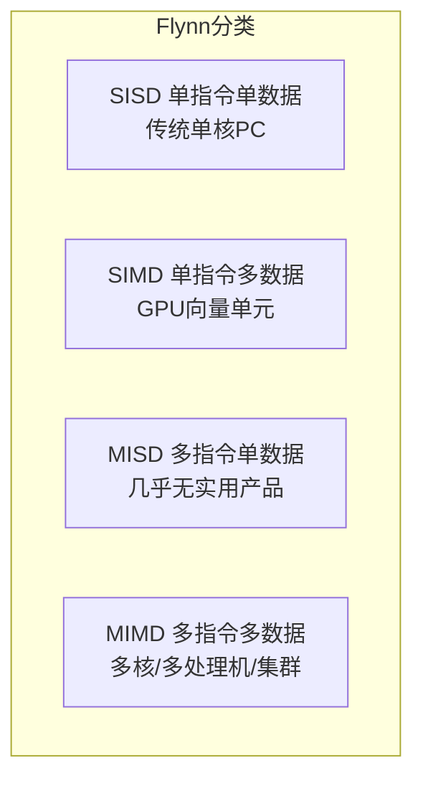
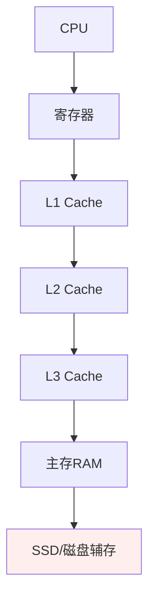
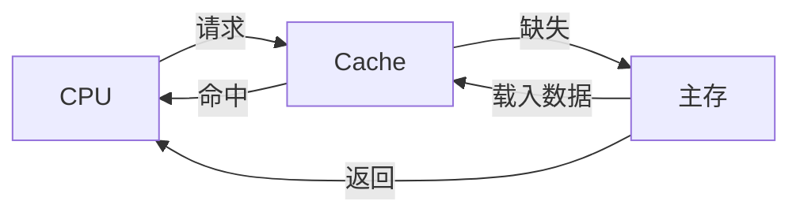
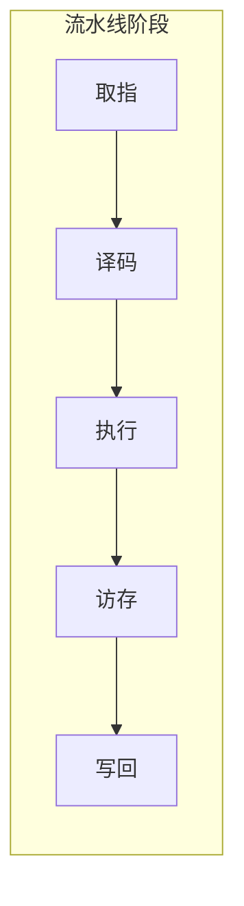
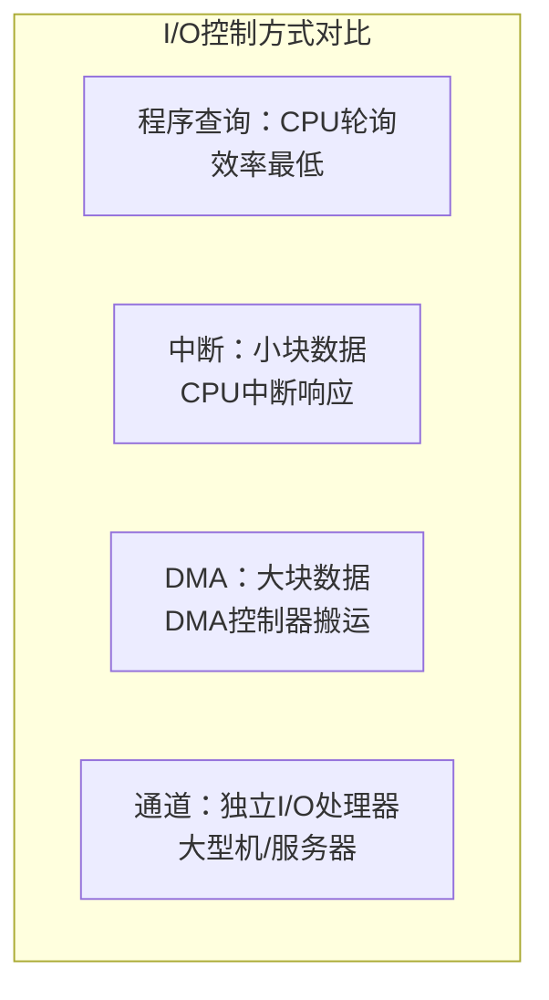
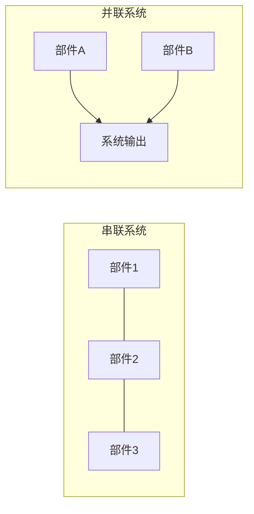

# 系统分析师｜第3章 计算机系统（完整版备考讲义+章节自测题）

> 适配系统分析师（第2版教材），包含教材删减但真题持续考查内容；上午选择题、计算题备考讲义。  
> 标签：系统分析师、上午题、计算机系统、体系结构、存储、流水线、可靠性、备考

[TOC]

## 模块1：计算机体系结构

**前置说明**：本章基于系统分析师第2版官方教材，增补第1版删减但历年真题、新考纲仍必考内容，适配上午综合选择题。  
**模块优先级**：🔴 最高优先级，体系结构分类每年必考。  
**考情分析**：每年1~2道选择题；核心：冯·诺依曼体系、Flynn分类、CISC/RISC区别。

### 1.1 核心知识点精讲

#### 1.1.1 冯·诺依曼体系

核心特征：**存储程序**，五大部件：运算器、控制器、存储器、输入设备、输出设备。

- 指令与数据存放在同一存储器；
- 指令串行顺序执行；
- 数据和指令使用同一总线。

> 哈佛结构：指令存储器、数据存储器相互独立，两套总线，常见于DSP、嵌入式芯片。考试常以"与冯·诺依曼区别"出题。

#### 1.1.2 Flynn分类（按指令流、数据流划分，高频）

| 类型 | 指令流 | 数据流 | 典型例子 |
| ---- | ---- | ---- | ---- |
| SISD 单指令单数据流 | 1 | 1 | 传统单核冯诺依曼PC |
| SIMD 单指令多数据流 | 1 | 多 | GPU、向量处理器 |
| MISD 多指令单数据流 | 多 | 1 | 极少实用案例 |
| MIMD 多指令多数据流 | 多 | 多 | 多核CPU、多处理机、集群 |

Flynn 分类关系示意：

#### 1.1.3 CISC / RISC

- **CISC 复杂指令集**：指令数量多，指令长度不固定，寻址方式丰富；早期x86。
  缺点：硬件译码复杂，流水线难设计。
- **RISC 精简指令集**：指令数量少，定长指令，大量通用寄存器，Load/Store架构（只有load/store可以访问内存，其余指令只操作寄存器）；ARM、RISC-V。
  优点：适合流水线，功耗低。

> 注意：现代x86内部会把CISC指令解码成RISC微指令，属于内部混合。

#### 1.1.4 高频易错点

1. GPU是SIMD（单指令多数据），多核CPU是MIMD，两者极易混淆；
2. RISC是Load/Store架构，运算指令不能直接访问内存；
3. 冯·诺依曼"存储程序"，哈佛结构是改进型，不是并列关系。

### 1.2 典型配套例题（真题同源，带完整解析）

#### 例题1 Flynn分类判断

下列属于MIMD体系的是？
A. GPU向量处理器 B. 传统单核PC C. 多核心服务器CPU D. 早期向量机

> 【解析】GPU是SIMD；单核PC是SISD；多核服务器每核独立指令流、处理不同数据，属于MIMD。  
> 【答案】C

#### 例题2 RISC特征判断

RISC架构的特征不包含？
A. 定长指令 B. 大量通用寄存器 C. 丰富复杂寻址方式 D. Load/Store架构

> 【解析】丰富寻址方式是CISC特征；RISC寻址方式少、定长指令、多寄存器。  
> 【答案】C

### 1.3 课后习题（带完整答案+解析）

**习题1**  
Flynn分类中GPU属于（）
A. SISD B. SIMD C. MISD D. MIMD

> 答案：B  
> 解析：GPU对大量数据执行同一运算，单指令多数据流。

**习题2**  
哈佛结构与冯·诺依曼结构最主要的区别是（）
A. 有无运算器 B. 指令与数据存储器是否分离 C. 是否使用总线 D. 是否支持中断

> 答案：B  
> 解析：哈佛结构指令存储与数据存储分离，独立总线。

---

## 模块2：存储层次与Cache

**前置说明**：本章基于系统分析师第2版官方教材，增补第1版删减但历年真题、新考纲仍必考内容，适配上午综合选择题与计算题。  
**模块优先级**：🔴 最高优先级（Cache计算题高频，必考板块）  
**考情分析**：每年1道左右计算/选择题；核心：存储层次、Cache映射方式、命中率与平均访问时间。

### 2.1 核心知识点精讲

#### 2.1.1 存储层次体系

存储金字塔：**寄存器 → Cache(L1/L2/L3) → 主存(内存) → 辅存(磁盘/SSD)**

- 越靠近CPU：速度越快、容量越小、单价越高。
- 存储层次核心思想：**局部性原理**（时间局部性、空间局部性）。

#### 2.1.2 Cache基本概念

- 命中：CPU访问的数据在Cache中；不命中（缺失）：需要访问主存。
- 命中率 H：H = 命中次数 / 总访问次数
- 平均访问时间：T_avg = H×T_c + (1-H)×(T_c+T_m)
  T_c：Cache访问时间；T_m：主存访问时间。

> 易错：不命中时CPU先访问Cache（耗时T_c），发现缺失后再访问主存（耗时T_m），所以是 (T_c+T_m)，不是只加T_m。

#### 2.1.3 Cache三种映射方式

1. **直接映射**：主存块只能固定映射到Cache唯一一行。
   优点：硬件简单；缺点：冲突缺失高。
2. **全相联映射**：主存块可以放到Cache任意行。
   优点：冲突少；缺点：硬件代价大，需要全部比较标记。
3. **组相联映射**：Cache划分为多个组；主存块映射到固定组内，组内任意行。
   是工程上最常用方案（如2路、4路组相联）。

> 替换算法：LRU（最近最少使用，考试最常考）、FIFO、随机。

#### 2.1.4 高频易错点

1. 平均访问时间计算：不命中时Cache+主存都要访问，不能只加主存时间；
2. 直接映射硬件最简单但冲突最高；全相联冲突最少但硬件最贵；
3. 命中率越高平均访问时间越接近Cache访问时间。

### 2.2 典型配套例题（真题同源，带完整解析）

#### 例题1 Cache命中率计算

某计算机，Cache访问时间1ns，主存访问时间10ns，Cache命中率90%。求平均访问时间。

> 【解析】
> T_avg = 0.9×1 + (1-0.9)×(1+10) = 0.9+1.1 = 2.0 ns
> 【答案】2.0 ns

#### 例题2 平均访问时间（0.95命中率）

某Cache命中率0.95，Cache访问时间2ns，访问主存额外需要10ns，平均访问时间为？

> 【解析】
> T_avg = 0.95×2 + 0.05×(2+10) = 1.9+0.6 = 2.6 ns
> 【答案】2.6 ns

### 2.3 课后习题（带完整答案+解析）

**习题1**  
Cache三种映射方式中，硬件实现最简单，冲突缺失概率高的是（）
A. 全相联 B. 直接映射 C. 组相联 D. 都一样

> 答案：B  
> 解析：直接映射固定映射一行，硬件简单但冲突高。

**习题2**  
存储层次的理论基础是（）
A. 局部性原理 B. 摩尔定律 C. 阿姆达尔定律 D. 香农定理

> 答案：A  
> 解析：存储层次依赖程序访问的局部性原理。

---

## 模块3：指令系统与指令流水线

**前置说明**：本章基于系统分析师第2版官方教材，增补第1版删减但历年真题、新考纲仍必考内容，适配上午综合选择题与计算题。  
**模块优先级**：🔴 最高优先级（流水线计算题高频）  
**考情分析**：每年1道左右计算题；核心：寻址方式、流水线吞吐率/加速比、三类冒险。

### 3.1 核心知识点精讲

#### 3.1.1 指令系统与寻址方式

常见寻址方式：立即寻址、直接寻址、间接寻址、寄存器寻址、寄存器间接寻址、变址寻址、基址寻址。

- 立即寻址：操作数直接写在指令内，无需访问内存。
- 基址+变址：常用于数组、程序重定位。

#### 3.1.2 指令流水线基本概念

流水线将指令拆分为多个阶段（取指IF、译码ID、执行EX、访存MEM、写回WB）。

核心指标：

1. **吞吐率TP**：单位时间完成指令数。
   理论最大吞吐率：TP_max = 1/Δt，Δt为流水线最慢段时间。
2. **加速比S**：串行执行时间 / 流水线执行时间。
3. **效率E**：流水线设备利用率，时空图中有效面积 / 总时空面积。

> 连续n条指令总时间 = 第一条指令各段时间之和 + (n-1)×最慢段时间。

#### 3.1.3 流水线冒险（冲突）三类

1. **结构冒险**：硬件资源冲突，同一时刻多指令争抢同一硬件（如同一存储器）。
   对策：资源重复、分时。
2. **数据冒险**：指令之间存在数据依赖（RAW写后读、WAR读后写、WAW写后写）。
   对策：数据旁路（转发）、插入气泡。
3. **控制冒险**：分支跳转等指令，下一条指令地址不确定。
   对策：分支预测、延迟分支。

> 注意：RISC流水线最容易出现数据冒险；CISC指令长度不固定，流水线设计更难。

#### 3.1.4 高频易错点

1. 流水线总时间瓶颈是最慢段，不是平均时间；
2. RAW是"写后读"，最容易考，不要与WAR（读后写）混淆；
3. 分支跳转产生控制冒险，不是数据冒险。

### 3.2 典型配套例题（真题同源，带完整解析）

#### 例题1 流水线吞吐率

流水线4段，每段时间分别为 2ns、3ns、2ns、2ns。连续执行10条指令，求总时间与吞吐率。

> 【解析】
> 最慢段Δt=3ns。
> 第一条指令总耗时：2+3+2+2=9ns；
> 剩余9条：9×3=27ns；
> 总时间 = 9 + 27 = 36 ns
> 吞吐率 TP = 10/36 ≈ 0.278 指令/ns。
> 【答案】总时间36ns，吞吐率10/36

#### 例题2 流水线总时间

指令流水线4段，各段时间 1ns,2ns,1ns,1ns。连续执行5条指令，总耗时？

> 【解析】
> 最慢段2ns；第一条指令总耗时：1+2+1+1=5ns；
> 后续4条每条增加最慢段时间2ns：5+4×2=13ns。
> 【答案】13 ns

#### 例题3 冒险类型判断

由分支跳转指令造成的流水线冲突是？
A. 结构冒险 B. 数据冒险 C. 控制冒险 D. 资源冒险

> 【解析】分支导致下一条指令地址不确定，属于控制冒险。  
> 【答案】C

### 3.3 课后习题（带完整答案+解析）

**习题1**  
流水线数据冒险中，RAW是指（）
A. 写后读 B. 读后写 C. 写后写 D. 读后读

> 答案：A  
> 解析：RAW（Read After Write）写后读，后一条指令读前一条刚写的寄存器。

**习题2**  
某流水线4段，各段 1ns,3ns,2ns,2ns，执行6条指令总耗时（）
A. 20ns B. 22ns C. 23ns D. 24ns

> 答案：C  
> 解析：第一条 1+3+2+2=8ns；后续5条 ×3ns=15ns；合计 8+15=23ns。

---

## 模块4：总线系统

**前置说明**：本章基于系统分析师第2版官方教材，增补第1版删减但历年真题、新考纲仍必考内容，适配上午综合选择题与计算题。  
**模块优先级**：🟡 中等优先级  
**考情分析**：年均0~1道题；核心：总线分类、带宽计算、总线仲裁。

### 4.1 核心知识点精讲

#### 4.1.1 总线分类

总线：共享传输通道。

- 分类：片内总线、系统总线、通信总线。
- 系统总线分为：数据总线、地址总线、控制总线。

#### 4.1.2 总线带宽

总线带宽：单位时间传输的数据量。

- 带宽 = 总线位宽 × 总线频率 / 8（转字节，单位B/s）

#### 4.1.3 总线仲裁

总线仲裁：多个设备竞争总线使用权。

- 仲裁方式：链式查询、计数器定时查询、独立请求。
- 链式查询：优先级由硬件连接顺序决定（靠近控制器优先）。

#### 4.1.4 高频易错点

1. 带宽计算除以8是把bit转Byte，注意单位是MB/s还是Mb/s；
2. 链式查询优先级由物理连接顺序决定，不是软件配置。

### 4.2 典型配套例题（真题同源，带完整解析）

#### 例题1 总线带宽计算

总线32位，频率100MHz，带宽是？

> 【解析】
> 32bit = 4字节；带宽 = 4 × 100MHz = 400 MB/s
> 【答案】400 MB/s

#### 例题2 链式查询仲裁

多个外设请求总线，链式查询仲裁的特点是？
A. 所有设备独立请求线 B. 优先级由硬件连接顺序决定 C. 计数器控制优先级 D. 速度最快

> 【解析】链式查询通过菊花链连接，靠近控制器的设备优先获得总线。  
> 【答案】B

### 4.3 课后习题（带完整答案+解析）

**习题1**  
总线64位，频率200MHz，带宽是（）
A. 1.6GB/s B. 12.8GB/s C. 800MB/s D. 200MB/s

> 答案：A  
> 解析：64bit=8字节；8×200MHz=1600MB/s=1.6GB/s。

---

## 模块5：I/O控制方式

**前置说明**：本章基于系统分析师第2版官方教材，增补第1版删减但历年真题、新考纲仍必考内容，适配上午综合选择题。  
**模块优先级**：🔴 最高优先级（四种方式对比必考）  
**考情分析**：每年1道左右选择题；核心：程序查询、中断、DMA、通道四种方式的适用场景与特点。

### 5.1 核心知识点精讲

#### 5.1.1 四种I/O控制方式

1. **程序查询（轮询）**：CPU循环不断检查外设状态，CPU全程等待，效率极低。
2. **中断方式**：外设准备好后主动发中断，CPU暂停当前任务处理；CPU和外设可并行。缺点：每次传输都要中断，小块数据适合。
3. **DMA 直接存储器访问**：DMA控制器接管总线，**不需要CPU干预**，主存与外设直接大块传输；传输前后需要CPU做初始化。适合大数据块（磁盘）。
4. **通道方式**：通道是独立硬件处理器，专门管理I/O，多设备；大型机/服务器。

#### 5.1.2 中断优先级

中断可以嵌套；高优先级中断可以打断低优先级中断。

> 典型优先级原则：硬件故障 > 内存访问 > I/O设备。

#### 5.1.3 高频易错点

1. DMA传输期间CPU不参与数据搬运，但初始化（设置首地址、长度）需要CPU；
2. 磁盘大批量读写用DMA；键盘输入用中断；
3. 通道本身是一个小型处理器，不是简单的DMA控制器。

### 5.2 典型配套例题（真题同源，带完整解析）

#### 例题1 I/O方式选择

磁盘大批量读写数据，优先选用哪种I/O方式？

> 【解析】磁盘数据块大、吞吐要求高，用DMA让控制器直接搬运，减少CPU干预。  
> 【答案】DMA

#### 例题2 程序查询特点

程序查询（轮询）方式的缺点是？

> 【解析】CPU需不断检查外设状态，传输期间CPU被独占，效率极低。  
> 【答案】CPU利用率低，全程等待

### 5.3 课后习题（带完整答案+解析）

**习题1**  
大批量磁盘数据传输，优先选择哪一种I/O方式（）
A. 程序查询 B. 中断 C. DMA D. 通道

> 答案：C  
> 解析：大块数据用DMA控制器搬运，CPU不干预数据传输。

**习题2**  
下列哪种I/O方式下，CPU不需要参与数据传输过程（）
A. 程序查询 B. 中断 C. DMA数据传送 D. 都是

> 答案：C  
> 解析：DMA传送期间由DMA控制器管理总线，CPU不参与搬运（初始化仍需CPU）。

---

## 模块6：系统可靠性与容错

**前置说明**：本章基于系统分析师第2版官方教材，增补第1版删减但历年真题、新考纲仍必考内容，适配上午综合选择题与计算题。  
**模块优先级**：🔴 最高优先级（可靠性计算高频）  
**考情分析**：每年1道左右计算/选择题；核心：MTBF/MTTR/可用性、串联并联可靠性模型、容错。

### 6.1 核心知识点精讲

#### 6.1.1 可用性基础指标

- MTBF：平均无故障时间；MTTR：平均修复时间。
- 可用性 A = MTBF / (MTBF+MTTR)。

#### 6.1.2 可靠性模型（串联/并联）

设单个部件可靠度Ri，故障率λi

1. **串联系统**：所有部件正常系统才正常
R串 = R1×R2×...×Rn
总故障率近似 λsum = λ1+λ2+...+λn
2. **并联系统**：至少一个部件正常，系统正常
R并 = 1-(1-R1)(1-R2)...(1-Rn)

> 串并联混合：分步拆解，先算子系统，再整体计算。

#### 6.1.3 故障分类 & 容错

- 故障：永久性故障、间歇性故障、瞬时故障。
- 容错技术：硬件冗余（静态冗余、动态冗余）、软件冗余、信息冗余（校验码）。
- 瞬时故障常用手段：重试。

#### 6.1.4 高频易错点

1. 串联可靠度直接相乘；并联用"1-全部失效概率"；
2. 可用性公式是MTBF/(MTBF+MTTR)，不是MTTR/MTBF；
3. 瞬时故障用重试，永久故障用冗余替换。

### 6.2 典型配套例题（真题同源，带完整解析）

#### 例题1 并联可靠性

两个相同部件并联，单个可靠度R=0.9。求系统可靠度。

> 【解析】
> R = 1-(1-0.9)(1-0.9) = 1-0.01 = 0.99
> 【答案】0.99

#### 例题2 串联可靠性

两个部件串联，R1=0.9，R2=0.8，系统可靠度？

> 【解析】R = 0.9×0.8 = 0.72  
> 【答案】0.72

#### 例题3 可用性计算

MTBF=900小时，MTTR=100小时，系统可用性？

> 【解析】A = 900/(900+100) = 0.9  
> 【答案】0.9

### 6.3 课后习题（带完整答案+解析）

**习题1**  
下列哪项属于瞬时故障的容错手段（）
A. 重试 B. 双机热备 C. 硬件冗余 D. 多版本程序

> 答案：A  
> 解析：瞬时故障随时间恢复，重试即可；双机热备/硬件冗余针对永久故障。

**习题2**  
三个部件串联，可靠度分别为0.9、0.9、0.8，系统可靠度为（）
A. 0.648 B. 0.72 C. 0.998 D. 0.9

> 答案：A  
> 解析：0.9×0.9×0.8=0.648。

---

## 模块7：多核与并行体系

**前置说明**：本章基于系统分析师第2版官方教材新增内容，适配上午综合选择题。  
**模块优先级**：🟡 中等优先级（第2版新增强化考点）  
**考情分析**：年均0~1道概念题；核心：多核、多处理机、集群的概念区分。

### 7.1 核心知识点精讲

#### 7.1.1 多核、多处理机、集群

- **多核**：同一个CPU芯片内多个核心，共享部分Cache（如L3）。
- **多处理机**：主板上多个独立CPU芯片，通过总线/互连网络通信。
- **集群**：多台独立计算机通过网络互联，对外作为整体提供服务。

> 三者关系：多核 < 多处理机 < 集群（规模递增），都属MIMD体系。

#### 7.1.2 高频易错点

1. 多核共享Cache是"部分共享"，不是全部共享；
2. 集群对外透明，用户看到的是单一服务。

### 7.2 典型配套例题（真题同源，带完整解析）

#### 例题1 概念区分

同一块CPU芯片内集成多个计算核心，共享部分缓存，这种体系称为？

> 【解析】芯片内多核心 = 多核处理器。  
> 【答案】多核处理器

### 7.3 课后习题（带完整答案+解析）

**习题1**  
多台独立计算机通过网络互联，对外提供统一服务，属于（）
A. 多核 B. 多处理机 C. 集群 D. 向量机

> 答案：C  
> 解析：集群由多台独立计算机组成，对外整体提供服务。

---

# 章节总复习综合模拟题（覆盖全部7模块，含答案与解析）

> 说明：题型贴合系统分析师上午真题风格，包含选择+计算，覆盖模块1~7所有核心考点；可直接放在讲义末尾作为章节自测。

## 一、单项选择题（15题）

1. 下列属于MIMD体系的是（）
A. GPU向量处理器 B. 传统单核PC C. 多核心服务器CPU D. 早期向量机
> 【解析】GPU是SIMD；单核SISD；多核服务器属于MIMD。  
> 答案：C

2. RISC架构的特征不包含（）
A. 定长指令 B. 大量通用寄存器 C. 丰富复杂寻址方式 D. Load/Store架构
> 【解析】丰富寻址是CISC特征。  
> 答案：C

3. Cache三种映射方式中，硬件实现最简单，冲突缺失概率高的是（）
A. 全相联 B. 直接映射 C. 组相联 D. 都一样
> 答案：B

4. 某Cache命中率0.95，Cache访问时间2ns，访问主存额外需要10ns，平均访问时间为（）
A. 2.5ns B. 2.6ns C. 3.0ns D. 12ns
> 【解析】0.95×2 + 0.05×(2+10) = 1.9+0.6 = 2.6 ns  
> 答案：B

5. 流水线冒险中，由分支跳转指令造成的是（）
A. 结构冒险 B. 数据冒险 C. 控制冒险 D. 资源冒险
> 答案：C

6. 指令流水线，4段，各段时间 1ns,2ns,1ns,1ns。连续执行5条指令，总耗时（）
A. 11ns B. 12ns C. 13ns D. 14ns
> 【解析】第一条 1+2+1+1=5ns；后续4条×2ns=8ns；合计13ns。  
> 答案：C

7. 总线带宽计算：总线32位，频率100MHz，带宽是（）
A. 400MB/s B. 50MB/s C. 100MB/s D. 3200MB/s
> 【解析】32bit=4字节；4×100=400MB/s。  
> 答案：A

8. 大批量磁盘数据传输，优先选择哪一种I/O方式（）
A. 程序查询 B. 中断 C. DMA D. 通道
> 答案：C

9. 多个外设请求总线，链式查询仲裁的特点（）
A. 所有设备独立请求线 B. 优先级由硬件连接顺序决定 C. 计数器控制优先级 D. 速度最快
> 答案：B

10. 两个部件串联，R1=0.9，R2=0.8，系统可靠度（）
A. 0.72 B. 0.98 C. 0.85 D. 0.18
> 【解析】串联相乘 0.9×0.8=0.72  
> 答案：A

11. MTBF=900小时，MTTR=100小时，系统可用性（）
A. 0.9 B. 0.8 C. 0.95 D. 0.1
> 【解析】A = 900/(900+100) = 0.9  
> 答案：A

12. 流水线数据冒险中，RAW是指（）
A. 写后读 B. 读后写 C. 写后写 D. 读后读
> 答案：A

13. 存储层次的理论基础是（）
A. 局部性原理 B. 摩尔定律 C. 阿姆达尔定律 D. 香农定理
> 答案：A

14. 下列哪项属于瞬时故障的容错手段（）
A. 重试 B. 双机热备 C. 硬件冗余 D. 多版本程序
> 答案：A

15. Flynn分类中GPU属于（）
A. SISD B. SIMD C. MISD D. MIMD
> 答案：B

## 二、计算题（4道，真题风格）

### 计算题1【Cache平均访问时间】

Cache访问时间1ns，主存访问时间10ns，命中率95%，求平均访问时间。
> 【解析】
> T_avg = 0.95×1 + 0.05×(1+10) = 0.95+0.55 = 1.5 ns
> 答案：1.5 ns

### 计算题2【流水线总时间与吞吐率】

流水线4段，各段 2ns,4ns,3ns,3ns，连续执行8条指令。
> 【解析】
> 最慢段4ns；第一条 2+4+3+3=12ns；后续7条×4=28ns；总时间40ns。
> 吞吐率 TP = 8/40 = 0.2 指令/ns
> 答案：总时间40ns，吞吐率0.2

### 计算题3【串并联混合可靠性】

系统由A、B两部件串联，其中A内部是两个可靠度0.9的部件并联，B可靠度0.8。求系统可靠度。
> 【解析】
> A子系统并联：R_A = 1-(1-0.9)² = 0.99
> 系统串联：R = 0.99 × 0.8 = 0.792
> 答案：0.792

### 计算题4【总线带宽】

总线64位，频率200MHz，求带宽。
> 【解析】
> 64bit=8字节；8×200=1600MB/s = 1.6GB/s
> 答案：1.6GB/s

## 三、简答概念题（3道）

1. 简述DMA方式与中断方式的区别
> 【解析】中断方式每次传输都需要CPU响应中断并参与，适合小块数据；DMA由DMA控制器直接在主存与外设间搬运大块数据，传输期间不需要CPU干预，CPU仅在传输前后做初始化。

2. 简述RISC与CISC的主要区别
> 【解析】RISC：指令少、定长、寻址方式少、多寄存器、Load/Store架构，适合流水线、功耗低；CISC：指令多、长度不定、寻址方式丰富，译码复杂、流水线设计难。

3. 简述直接映射、全相联映射、组相联映射的优缺点
> 【解析】直接映射硬件最简单但冲突缺失最高；全相联冲突最少但硬件代价大；组相联折中，工程最常用（如2路/4路）。
