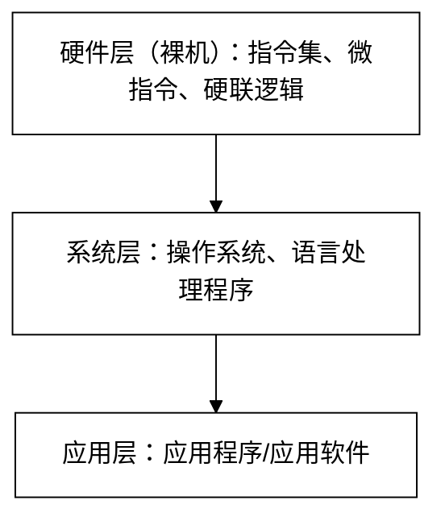
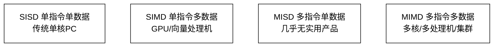
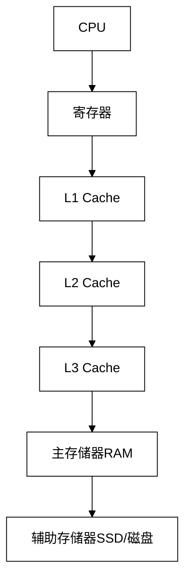
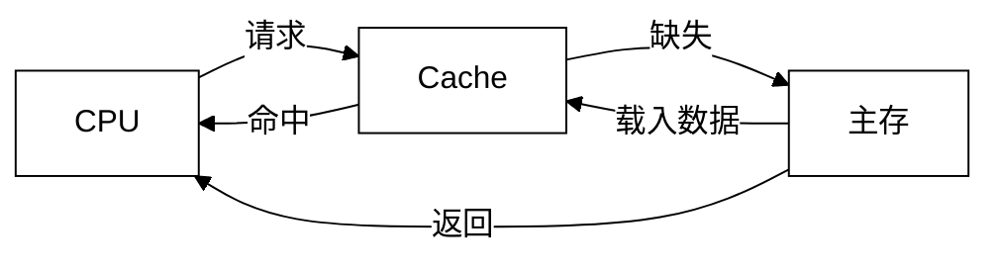
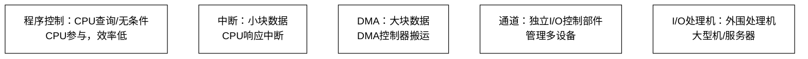
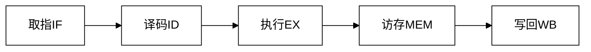
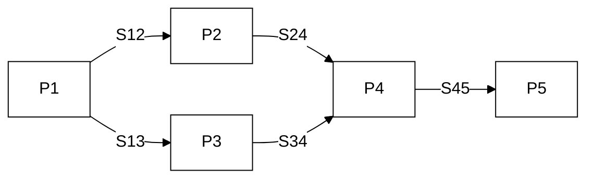

# 系统分析师｜第3章 计算机系统（备考讲义+章节自测题）

> **教材依据**：《系统分析师教程（第2版）》第3章《计算机系统》，共6节（3.1 计算机系统概述｜3.2 存储器系统｜3.3 输入输出系统｜3.4 指令系统｜3.5 多处理机系统｜3.6 操作系统）。第2版教材对指令流水线、Flynn分类、总线仲裁等未设专门小节（散见或删减），真题仍持续考查，以【第1版补充】/【真题补充】补回；操作系统（3.6）占本章近半篇幅，讲义单列为独立模块。
>
> **考纲定位说明**：2024版考纲科目一「系统分析师综合知识」第1条 **计算机系统基础知识**（子项：1.1 计算机系统概述｜1.2 存储器系统｜1.3 输入输出系统｜1.4 指令系统｜1.5 多处理机系统｜1.6 操作系统），与教材第2版第3章 3.1～3.6 各节一一对应；其中 3.6 操作系统含 3.6.1～3.6.7 七个子节，与考纲 1.6.1～1.6.7 逐项对应。
>
> **考试形式**：上午综合知识单选题＋计算题；2021年以后真题约8～9道（2021年：Cache组相联映射4道＋PV操作3道＋索引文件1道＋线程1道）；为上午题单章权重最高章节之一，操作系统为本章重中之重；亦为案例分析高频背景知识。
>
> 标签：系统分析师、上午题、计算机系统、体系结构、存储、Cache、操作系统、PV操作、流水线、备考

[TOC]

## 章节结构对照与来源标注

> 本讲义为**系统分析师（第2版）教材第3章《计算机系统》**的学习讲义，模块顺序与教材 3.1～3.6 保持一致。操作系统（3.6）占教材本章近半篇幅、考纲1.6完整列出、真题高频，讲义将其单列为独立模块；教材未设专门小节的补充内容清单见下方「⚠️ 不包含」块。

| 讲义模块 | 对应教材第2版章节 | 内容性质 | 备考要求 |
|---|---|---|---|
| 模块1 计算机系统概述 | 3.1 计算机系统概述 | 教材＋真题补充 | 必掌握：冯·诺依曼结构、层次结构；Flynn分类（真题补充）；了解：计算机软件分类 |
| 模块2 存储器系统 | 3.2 存储器系统 | 教材＋真题补充 | 必掌握：存储层次、Cache映射与地址计算、命中率/平均访问时间、写策略、磁盘容量与存取时间、RAID、存储容量编址；拓展：网络存储、虚拟存储（存储虚拟化） |
| 模块3 I/O控制方式 | 3.3.1 输入输出工作方式 | 教材 | 必掌握：程序控制/中断/DMA/通道/I/O处理机五方式对比 |
| 模块4 总线系统 | 3.3.2 总线 | 教材＋真题补充 | 必掌握：总线分类、带宽计算；了解：总线标准归类、总线仲裁（真题补充） |
| 模块5 指令系统与指令流水线 | 3.4 指令系统 | 教材＋真题补充 | 必掌握：CISC/RISC、寻址方式、流水线总时间/吞吐率/加速比/效率、三类冒险 |
| 模块6 多处理机系统 | 3.5 多处理机系统 | 教材 | 必掌握：紧/松耦合、SMP/MPP/SVM/S2MP、UMA/NUMA/COMA、互连方式；了解：多核、集群 |
| 模块7 操作系统 | 3.6 操作系统 | 教材 | 必掌握：PV/前趋图、死锁与银行家、段页式地址转换、索引文件、位示图、磁盘调度、线程共享；了解：国产操作系统 |

> 教材第2版第3章章节结构（按教材原文核读）：3.1 计算机系统概述（3.1.1 计算机系统层次结构、3.1.2 计算机系统硬件、3.1.3 计算机软件）｜3.2 存储器系统（3.2.1 主存储器、3.2.2 辅助存储器、3.2.3 高速缓冲存储器、3.2.4 网络存储技术、3.2.5 虚拟存储技术）｜3.3 输入输出系统（3.3.1 输入输出工作方式、3.3.2 总线、3.3.3 I/O接口）｜3.4 指令系统（3.4.1 基本指令系统、3.4.2 复杂指令系统、3.4.3 精简指令系统）｜3.5 多处理机系统（3.5.1 多处理机系统概述、3.5.2 海量并行处理结构、3.5.3 对称多处理机结构、3.5.4 互连网络）｜3.6 操作系统（3.6.1 操作系统概述、3.6.2 进程管理、3.6.3 存储器管理、3.6.4 设备管理、3.6.5 文件管理、3.6.6 作业与用户界面、3.6.7 国产操作系统）。

> ⚠️ 教材第2版第3章**不包含**（两源核查）：**源①**（对照第1版第3章《操作系统基本原理》逐节核对）：第1版全章均为操作系统内容，主题与第2版3.6.1～3.6.6一一对应，无第1版独有、第2版删除的内容（第2版另新增3.6.7国产操作系统）——无源①事项。**源②**（对照考纲1.1～1.6子项与教材3.1～3.6小节核对，考纲有子项、教材无对应小节即列入）——①Flynn分类（考纲1.1；教材仅散见SIMD/MIMD，讲义标【真题补充】补回）；②指令流水线总时间/吞吐率/加速比/效率及三类冒险（考纲1.4；教材仅在RISC特点中一句话带过，讲义标【第1版补充】/【真题补充】补回）；③寻址方式枚举（考纲1.4；教材无枚举小节，讲义标【真题补充】补回）；④总线仲裁（考纲1.3；教材无对应小节，讲义标【真题补充】补回）；⑤存储容量编址计算（考纲1.2；教材无系统化讲解，讲义标【真题补充】补回）。复习时注意区分，勿误当成该章本身内容。

---

## 模块1：计算机系统概述（教材3.1）【教材】

**前置说明**：本模块对应教材第2版第3章 **3.1 计算机系统概述**（3.1.1 层次结构、3.1.2 硬件、3.1.3 软件），对应考纲 **1.1 计算机系统概述**；教材原文为主，Flynn分类为教材未设专门小节但真题高频考点（标【真题补充】）；适配上午综合选择题（概念辨析）。
**模块优先级**：🔴 高频（必考）—— 冯·诺依曼结构与Flynn分类为历年稳定概念题。
**考情分析**（2021年以后真题）：近5年约每年1道概念题；核心考点：冯·诺依曼结构、计算机层次结构、Flynn分类、计算机软件分类。

### 1.1 核心知识点精讲

#### 1.1.1 计算机系统层次结构（教材3.1.1）【教材】

计算机系统通常划分为**硬件层、系统层、应用层**的多级层次结构：

- **硬件层（裸机）**：细分为硬联逻辑级（门电路、触发器）、微程序级（微指令集）、传统机器级（指令集）。
- **系统层**：操作系统级（管理软硬件资源）＋语言处理程序级（编译、汇编、解释程序）。
- **应用层**：面向不同用户的各类应用程序（应用软件）。

```mermaid
%%{
  init: {
    "theme":"base",
    "themeVariables": {
      "primaryColor":"#ffffff",
      "primaryTextColor":"#000000",
      "primaryBorderColor":"#000000",
      "lineColor":"#000000",
      "secondaryColor":"#ffffff",
      "tertiaryColor":"#ffffff"
    }
  }
}%%
graph TD
    APP[应用层：应用程序/应用软件]
    SYS[系统层：操作系统、语言处理程序]
    HW[硬件层（裸机）：指令集、微指令、硬联逻辑]
    HW --> SYS --> APP
```

#### 1.1.2 冯·诺依曼体系与计算机硬件（教材3.1.2）【教材】

核心特征：**存储程序**原理；计算机硬件由5个基本部分组成：**运算器、控制器、存储器、输入设备、输出设备**。

- 运算器、控制器集成后统称**CPU（中央处理单元）**，是硬件系统核心。
- 存储器分内存储器（主存，速度快容量小，暂存程序/数据/中间结果）与外存储器（辅存，容量大速度慢，长期保存）。
- 输入/输出设备合称外部设备（外设）。

> 哈佛结构：指令存储器、数据存储器相互独立，两套总线，常见于DSP、嵌入式芯片。考试常以「与冯·诺依曼的区别」出题。
> 记忆：冯·诺依曼「存储程序＋单总线」，哈佛「指令/数据分开＋双总线」。

#### 1.1.3 计算机系统软件（教材3.1.3）【教材】

- **系统软件**：管理、调度、监视和服务计算机系统，分为5类：操作系统、语言处理程序、服务性程序、数据库管理系统、计算机网络软件。
- **应用软件**：为解决某种应用问题而编制的程序（财务软件、项目管理软件等）。
- **固件**：存储在能永久保存信息的器件（EPROM/EEPROM）中的程序，是具有软件功能的硬件；执行速度快于软件、灵活性优于硬件。

#### 1.1.4 Flynn分类【真题补充】

按指令流、数据流划分，高频（教材未设专门小节，仅散见SIMD/MIMD，此处为真题高频补充）：

| 类型 | 指令流 | 数据流 | 典型例子 |
| ---- | ---- | ---- | ---- |
| SISD 单指令单数据流 | 1 | 1 | 传统单核冯·诺依曼PC |
| SIMD 单指令多数据流 | 1 | 多 | GPU、向量/并行处理机 |
| MISD 多指令单数据流 | 多 | 1 | 极少实用案例 |
| MIMD 多指令多数据流 | 多 | 多 | 多核CPU、多处理机、集群 |

```mermaid
%%{
  init: {
    "theme":"base",
    "themeVariables": {
      "primaryColor":"#ffffff",
      "primaryTextColor":"#000000",
      "primaryBorderColor":"#000000",
      "lineColor":"#000000",
      "secondaryColor":"#ffffff",
      "tertiaryColor":"#ffffff"
    }
  }
}%%
graph TD
    SISD[SISD 单指令单数据<br/>传统单核PC]
    SIMD[SIMD 单指令多数据<br/>GPU/向量处理机]
    MISD[MISD 多指令单数据<br/>几乎无实用产品]
    MIMD[MIMD 多指令多数据<br/>多核/多处理机/集群]
```

#### 1.1.5 典型易错点（计算机系统概述）

1. GPU是SIMD（单指令多数据），多核CPU是多处理机MIMD，两者极易混淆【🔴高频】；
2. 冯·诺依曼「存储程序」是基石，哈佛结构是改进型，不是并列关系【🟡中频】；
3. 固件是「具有软件功能的硬件」，介于软硬件之间【🟡中频】。

### 1.2 典型例题

**例题1【Flynn分类判断】**

下列属于MIMD体系的是（）
A. GPU向量处理器 B. 传统单核PC C. 多核心服务器CPU D. 向量机

> 【解析】GPU/向量机是SIMD；单核PC是SISD；多核心服务器每核独立指令流、处理不同数据，属于MIMD。
> 【答案】C

**例题2【冯·诺依曼结构】**

冯·诺依曼体系结构的核心思想是（）
A. 指令与数据分离存储 B. 存储程序 C. 多指令多数据 D. 微程序控制

> 【解析】冯·诺依曼的核心是「存储程序」原理；指令与数据分离是哈佛结构。
> 【答案】B

### 1.3 课后习题

**习题1**

Flynn分类中，GPU属于（）
A. SISD B. SIMD C. MISD D. MIMD

> 【解析】GPU对大量数据执行同一运算，单指令多数据流。
> 【答案】B

**习题2**

哈佛结构与冯·诺依曼结构最主要的区别是（）
A. 有无运算器 B. 指令与数据存储器是否分离 C. 是否使用总线 D. 是否支持中断

> 【解析】哈佛结构指令存储与数据存储分离，独立总线。
> 【答案】B

---

## 模块2：存储器系统（教材3.2）【教材】

**前置说明**：本模块对应教材第2版第3章 **3.2 存储器系统**（3.2.1 主存储器、3.2.2 辅助存储器、3.2.3 高速缓冲存储器、3.2.4 网络存储技术、3.2.5 虚拟存储技术），对应考纲 **1.2 存储器系统**；教材原文为主，其中Cache组相联映射与主存地址位数计算为2021年真题61～64连题（4道）主力考点，存储容量编址计算为教材未展开但真题轮换考点（标【真题补充】）；适配上午综合选择题与计算题。
**模块优先级**：🔴 高频（必考）—— Cache映射与命中率计算几乎每年必考。
**考情分析**（2021年以后真题）：近5年Cache命中率/平均访问时间计算接近每次必考；2021年61～64连题（共4道）考组相联映射、主存页大小、主存地址位数、组号位数计算；磁盘存取时间/容量、RAID、存储容量编址为历年轮换常客。核心考点：存储层次、Cache映射与地址计算、命中率/平均访问时间、写直达/写回、磁盘容量与平均存取时间、RAID、存储容量编址。

### 2.1 核心知识点精讲

#### 2.1.1 存储层次体系（教材3.2）【教材】

存储金字塔：**寄存器 → Cache(L1/L2/L3) → 主存储器 → 辅助存储器（磁盘/SSD）**。教材将存储器系统分为Cache、主存、辅存三级。

- 越靠近CPU：速度越快、容量越小、单价越高。
- 存储层次核心思想：**局部性原理**（时间局部性、空间局部性）。

```mermaid
%%{
  init: {
    "theme":"base",
    "themeVariables": {
      "primaryColor":"#ffffff",
      "primaryTextColor":"#000000",
      "primaryBorderColor":"#000000",
      "lineColor":"#000000",
      "secondaryColor":"#ffffff",
      "tertiaryColor":"#ffffff"
    }
  }
}%%
graph TD
    A[CPU] --> B[寄存器]
    B --> C[L1 Cache]
    C --> D[L2 Cache]
    D --> E[L3 Cache]
    E --> F[主存储器RAM]
    F --> G[辅助存储器SSD/磁盘]
```

#### 2.1.2 主存储器与存储容量编址（教材3.2.1）【教材＋真题补充】

- 主存按工艺分 **RAM（随机存取）** 与 **ROM（只读）**：RAM断电丢失（DRAM需定时刷新、SRAM不断电不丢失），ROM断电不丢失（存放BIOS等）。
- **存储容量与编址计算**（教材未展开、真题轮换，标【真题补充】）：
  - 地址线 $n$ 根可寻址 $2^n$ 个单元；数据线 $m$ 根对应字长 $m$ 位。
  - 按字节编址时：容量 ＝ 末地址－首地址＋1。
  - 芯片扩展：位扩展加数据线、字扩展加地址线；芯片数 ＝ 目标容量 / 单芯片容量。

#### 2.1.3 辅助存储器：磁盘容量与平均存取时间（教材3.2.2）【教材】

- 硬盘信息分布层次：记录面、圆柱面（柱面）、磁道、扇区；存取地址用驱动器号、柱面号、磁头号、扇区号表示。
- **格式化存储容量**：
$$存储容量 = n \times t \times s \times b$$
其中 $n$ 为总记录面数，$t$ 为每面磁道数，$s$ 为每道扇区数，$b$ 为每扇区字节数（格式化容量约为非格式化容量的60%～70%）。
- **平均存取时间**（教材：读写操作时间相对于寻道/等待可忽略）：
$$T_a \approx T_s + T_w = \dfrac{t_{smin}+t_{smax}}{2} + \dfrac{t_{wmin}+t_{wmax}}{2}$$
其中 $T_s$ 为平均寻道时间，$T_w$ 为平均等待时间（旋转延迟，取旋转一周时间的一半）。

> 记忆：格式化容量 $=n\times t\times s\times b$；平均存取时间 $=$ 平均寻道 $+$ 平均等待（旋转延迟取半）。

#### 2.1.4 磁盘阵列 RAID 级别（教材3.2.2）【教材】

教材按8个级别介绍（核心考点在0、1、5）：

| 级别 | 关键技术 | 特点 |
| --- | --- | --- |
| RAID0 | 无冗余无校验的数据分块 | I/O性能与空间利用率最高，故障率高，非冗余 |
| RAID1 | 磁盘镜像 | 工作盘与镜像盘成对，安全性最高，空间利用率50% |
| RAID2 | 纠错海明码 | 需校验盘，单纠错双验错，实际很少用 |
| RAID3/4 | 奇偶校验码＋独立校验盘 | 一盘失效可异或恢复，读快写慢；RAID3位交叉、RAID4块交叉 |
| RAID5 | 奇偶校验分布式 | 无独立校验盘，校验分布各盘，兼顾性能与容错，最常用 |
| RAID6/7 | 多校验盘/优化异步 | 冗余更强或性能更高，价格昂贵 |
| RAID10 | RAID0＋RAID1组合 | 高可靠性与高性能组合，性价比较高 |

> 记忆：RAID0无冗余、RAID1镜像、RAID5分布式校验，工程最常用。

#### 2.1.5 Cache基本原理与命中率/平均访问时间（教材3.2.3）【教材】

- 使用Cache的依据是**程序局部性原理**（时间局部性、空间局部性）。
- 命中：数据在Cache中；失效率（未命中率）$=1-h$。
- **平均存储周期**（教材3.2.3公式，$t_1$ Cache周期、$t_2$ 内存周期）：
$$t_3 = t_1 \times h + t_2 \times (1 - h)$$

> 说明：教材公式按「未命中时以一次内存周期 $t_2$ 计」；若题干表述为「未命中时先访Cache、再额外访主存」，则改用 $t_3 = h\cdot t_1 + (1-h)(t_1+t_2)$，以题面口径为准。

```mermaid
%%{
  init: {
    "theme":"base",
    "themeVariables": {
      "primaryColor":"#ffffff",
      "primaryTextColor":"#000000",
      "primaryBorderColor":"#000000",
      "lineColor":"#000000",
      "secondaryColor":"#ffffff",
      "tertiaryColor":"#ffffff"
    }
  }
}%%
graph LR
    CPU[CPU] -->|请求| C[Cache]
    C -->|命中| CPU
    C -->|缺失| M[主存]
    M -->|载入数据| C
    M -->|返回| CPU
```

#### 2.1.6 Cache三种映射方式与地址计算（教材3.2.3）【教材】

1. **直接映射**：主存块只能映射到Cache唯一行，$K = I \mod C$（$K$块号、$I$主存页号、$C$Cache块数）。硬件简单，冲突高。
2. **全相联映射**：主存每页可映射到Cache任一块。灵活但需比较全部标记，速度慢、成本高，只适合小容量。
3. **组相联映射**：先直接映射定组、再全相联定块，$J = I \mod Q$（$J$组号、$I$主存页号、$Q$Cache组数）。工程最常用（2路、4路组相联）。

**地址划分（组相联，按字节编址）**：
$$主存地址 = 标记（区号）\ |\ 组号 \ |\ 块内地址$$

- 块内地址位数 ＝ $\log_2(\text{块大小})$；
- Cache组数 ＝ Cache容量 /（块大小 × 每组块数）；
- 组号位数 ＝ $\log_2(\text{组数})$；
- 标记（区号）位数 ＝ 主存地址位数 － 块内位数 － 组号位数。

**真题连题式考点（2021年61～64题）**：给Cache容量、块大小、每组块数、主存地址位数，求Cache组数、主存页大小、主存地址各字段位数。

#### 2.1.7 Cache写策略：写直达 / 写回 / 标记法（教材3.2.3）【教材】

- **写直达（Write Through）**：写Cache同时写回内存。实现简单、主存始终正确，但可能增加不必要的主存写入、降低速度。
- **写回（Write Back）**：CPU修改Cache后不立即写内存，块被淘汰时才写回；块表中置标志位（脏位），替换时若为1则先写回。速度快，但有主存不一致窗口。
- **标记法**：为每个Cache数据设有效位，修改时写入内存并将有效位置0，读取时测试有效位。

> 记忆：写直达「同步写主存、保一致、慢」；写回「延迟写、快、需脏位标记」。

#### 2.1.8 替换算法（教材3.2.3）【教材】

最常用：随机算法、先进先出（FIFO）、近期最少使用（LRU，考试最常考）。直接映射无替换选择（唯一行）；全相联/组相联需替换策略。

#### 拓展阅读：网络存储与虚拟存储（教材原生但备考非必学内容）

##### 拓展·网络存储技术 DAS/NAS/SAN（教材3.2.4）【教材拓展｜非必学】

- **DAS 直接附加存储**：存储设备经SCSI电缆直连服务器，存储操作依赖服务器，扩展受限（又称服务器附加存储SAS）。
- **NAS 网络附加存储**：存储设备通过NFS/CIFS等文件协议经网络访问，文件级共享，即插即用、经济，但性能一般。
- **SAN 存储区域网络**：经专用交换机把磁盘阵列与服务器连成高速专用子网，块级存储，性能最高；按协议分FC SAN、IP SAN（iSCSI）、IB SAN。
> 低频（🟢），概念一句带过即可，不配例题习题。

##### 拓展·虚拟存储技术（教材3.2.5）【教材拓展｜非必学】

- 教材3.2.5「虚拟存储」指**存储虚拟化**：把多个存储介质模块（硬盘、RAID）集中管理成统一**存储池**，物理存储与逻辑表示分离，应用服务器只与逻辑卷交互。
- 分类：按拓扑分对称式/非对称式；按实现原理分数据块虚拟/虚拟文件系统。
- 实现方式：主机级、存储设备级、网络级虚拟化。
> 注意：此处的「虚拟存储」是**存储虚拟化**，与模块7（操作系统）教材3.6.3的「虚拟存储管理」（缺页换入换出）是不同概念，勿混淆。低频（🟢），不配例题习题。

#### 2.1.9 典型易错点（存储器系统）

1. 平均访问时间注意题面口径：教材公式为 $t_1h+t_2(1-h)$，勿随意多加一次Cache周期【🔴高频】；
2. 直接映射硬件最简单但冲突最高；全相联冲突最少但硬件最贵；组相联折中【🔴高频】；
3. 写直达同步写主存、写回延迟写（需脏位）；标记法用有效位【🟡中频】；
4. 存储容量按字节编址时，容量 ＝ 末地址－首地址＋1【🟡中频】。

### 2.2 典型例题

**例题1【Cache平均访问时间】**

某计算机Cache访问时间1ns，主存访问时间10ns，Cache命中率90%。求平均存储周期（按教材公式）。

> 【解析】
> $t_3 = 0.9\times1 + 0.1\times10 = 0.9 + 1.0 = 1.9$ns
> 【答案】1.9ns

**例题2【Cache组相联映射地址计算】**

Cache容量8KB，块大小256B，采用2路组相联，主存地址32位，按字节编址。求：Cache组数、块内地址位数、组号位数、标记位数。

> 【解析】
> Cache块数 $= 8KB/256B = 32$ 块；2路组相联 → 组数 $= 32/2 = 16$ 组。
> 块内地址位数 $= \log_2 256 = 8$ 位；组号位数 $= \log_2 16 = 4$ 位；标记位数 $= 32 - 8 - 4 = 20$ 位。
> 【答案】16组；块内8位、组号4位、标记20位

**例题3【磁盘平均存取时间】**

磁盘平均寻道时间10ms，旋转速度6000rpm（旋转一周10ms），读写时间忽略。求平均存取时间。

> 【解析】
> 平均等待 $T_w = 10/2 = 5$ms；$T_a \approx T_s + T_w = 10 + 5 = 15$ms。
> 【答案】15ms

### 2.3 课后习题

**习题1**

Cache三种映射方式中，硬件实现最简单、冲突缺失概率高的是（）
A. 全相联 B. 直接映射 C. 组相联 D. 都一样

> 【解析】直接映射固定映射一行，硬件简单但冲突高。
> 【答案】B

**习题2**

存储层次的理论基础是（）
A. 局部性原理 B. 摩尔定律 C. 阿姆达尔定律 D. 香农定理

> 【解析】存储层次依赖程序访问的局部性原理。
> 【答案】A

**习题3**

某Cache命中率0.95，Cache访问时间2ns，主存访问时间10ns，平均存储周期为（）
A. 2.5ns B. 2.4ns C. 2.6ns D. 3.0ns

> 【解析】$t_3 = 0.95\times2 + 0.05\times10 = 1.9 + 0.5 = 2.4$ns
> 【答案】B

**习题4**

采用「写Cache的同时写回主存」的Cache写策略是（）
A. 写回 B. 写直达 C. 写分配 D. 标记法

> 【解析】写直达同步写主存；写回延迟到替换时写。
> 【答案】B

---

## 模块3：I/O控制方式（教材3.3.1）【教材】

**前置说明**：本模块对应教材第2版第3章 **3.3.1 输入输出工作方式**，对应考纲 **1.3.1 输入输出工作方式**；教材原文为主；适配上午综合选择题。
**模块优先级**：🟡 中频 —— 近年隔年轮换0～1题。
**考情分析**（2021年以后真题）：近5年隔年轮换0～1道（2021年0题）；核心考点：程序控制、中断、DMA、通道、I/O处理机五种方式的特点与适用场景。

### 3.1 核心知识点精讲

#### 3.1.1 五种I/O工作方式（教材3.3.1）【教材】

教材给出I/O系统的5种工作方式：

1. **程序控制方式**：由CPU执行I/O程序实现数据传送，分两种：
   - **无条件传送**：CPU默认外设始终就绪，直接访问I/O端口，仅用于简单开关量控制；
   - **程序查询（轮询）**：CPU循环查询外设状态，就绪才传送，CPU被独占、利用率低。
2. **程序中断方式**：外设准备好后发中断，CPU暂停当前任务（保护现场）转去处理，处理完返回（恢复现场）；CPU无需等待、效率较高，适合小块数据（如键盘）。中断过程分中断请求、判优、响应、处理、返回五阶段。
3. **DMA工作方式**：为高速批量数据交换设置，由DMA控制器（DMAC）接管总线、提供地址与读写控制信号，主存与外设直接大块传输，**不需CPU逐字节参与**；传送前CPU做预处理、传送后经中断做后处理。DMAC获取总线有CPU停止访存法、存储器分时法、周期挪用（窃取）法。
4. **通道方式**：通道是高级I/O控制部件，硬件＋软件实现对I/O的控制与传送，更多免去CPU介入；但不能完全脱离CPU（启动、停止仍受CPU管理）。按传送方式分字节多路通道、选择通道、数组多路通道。
5. **I/O处理机（外围处理机）**：具有丰富指令系统和完善中断系统，专用于大型高效计算机系统处理外设I/O，可承担码制转换、数据校验、文件管理、人机对话等。

```mermaid
%%{
  init: {
    "theme":"base",
    "themeVariables": {
      "primaryColor":"#ffffff",
      "primaryTextColor":"#000000",
      "primaryBorderColor":"#000000",
      "lineColor":"#000000",
      "secondaryColor":"#ffffff",
      "tertiaryColor":"#ffffff"
    }
  }
}%%
graph TD
    PQ[程序控制：CPU查询/无条件<br/>CPU参与，效率低]
    INT[中断：小块数据<br/>CPU响应中断]
    DMA[DMA：大块数据<br/>DMA控制器搬运]
    CH[通道：独立I/O控制部件<br/>管理多设备]
    IOP[I/O处理机：外围处理机<br/>大型机/服务器]
```

#### 3.1.2 中断与中断优先级（教材3.3.1）【教材】

中断可嵌套，高优先级中断可打断低优先级中断。
> 典型优先级原则：硬件故障 > 内存访问 > I/O设备。

#### 3.1.3 典型易错点（I/O控制方式）

1. DMA传输期间CPU不参与数据搬运，但传送前预处理、传送后中断后处理需要CPU【🔴高频】；
2. 磁盘大批量读写用DMA；键盘输入用中断【🔴高频】；
3. 程序查询CPU被独占、利用率低；无条件传送仅适合简单开关量【🟡中频】；
4. 通道/I/O处理机仍需CPU管理启动、停止，不能完全脱离CPU【🟡中频】。

### 3.2 典型例题

**例题1【I/O方式选择】**

磁盘大批量读写数据，优先选用哪种I/O方式？

> 【解析】磁盘数据块大、吞吐要求高，用DMA让控制器直接搬运，减少CPU干预。
> 【答案】DMA

**例题2【程序查询特点】**

程序查询（轮询）方式的缺点是（）

> 【解析】CPU需不断检查外设状态，传输期间CPU被独占，效率极低。
> 【答案】CPU利用率低、全程等待

### 3.3 课后习题

**习题1**

大批量磁盘数据传输，优先选择哪一种I/O方式（）
A. 程序查询 B. 中断 C. DMA D. 通道

> 【解析】大块数据用DMA控制器搬运，CPU不干预数据传输。
> 【答案】C

**习题2**

下列哪种I/O方式下，CPU不需要参与数据传输过程（）
A. 程序查询 B. 中断 C. DMA数据传送 D. 都是

> 【解析】DMA传送期间由DMA控制器管理总线，CPU不参与搬运（预处理/后处理仍需CPU）。
> 【答案】C

---

## 模块4：总线系统（教材3.3.2）【教材】

**前置说明**：本模块对应教材第2版第3章 **3.3.2 总线**，对应考纲 **1.3.2 总线**；教材原文为主，总线仲裁为教材未设专门小节但真题轮换考点（标【真题补充】）；适配上午综合选择题与计算题。
**模块优先级**：🟡 中频 —— 近年考频0～1题。
**考情分析**（2021年以后真题）：近5年约0～1道题（2021年未考）；核心考点：总线分类、带宽计算、总线仲裁、总线标准归类。

### 4.1 核心知识点精讲

#### 4.1.1 总线的分类（教材3.3.2）【教材】

总线是一组能为多个部件**分时共享**的公共信息传送线路。教材给出4种分类方法：

1. 按总线功能：地址总线、数据总线、控制总线；
2. 按在微机系统中位置：机内总线、机外总线；
3. 按总线功用：局部总线、系统总线、通信总线；
4. 按数据线多少：并行总线（多位同时传输、速率高）、串行总线（一位按序传输、适合远距离）。

#### 4.1.2 总线性能指标与带宽计算（教材3.3.2）【教材】

总线主要性能指标5种：**总线宽度、总线带宽、总线负载、总线分时复用、总线猝发传输**。

- **总线宽度**：总线线数，影响地址线和数据线数量（如32位PCI可寻址 $2^{32}=4G$ 单元）。
- **总线带宽**（最大数据传输速率，单位B/s）：
$$总线带宽 = 总线宽度 \times 总线频率$$
其中总线宽度以**字节**计（位宽除以8）。例：一个总线周期并行传输4B、周期0.2μs，则带宽 $= 4/0.2 = 20$MB/s。

#### 4.1.3 总线仲裁【真题补充】

多设备竞争总线使用权时的仲裁方式（教材未设专门小节，真题轮换考查）：

- **链式查询**：菊花链连接，优先级由硬件连接顺序决定（靠近控制器优先）；
- **计数器定时查询**：计数器控制优先级，优先级可变；
- **独立请求**：每个设备独立请求线，速度最快、硬件最复杂。

#### 4.1.4 总线标准归类（教材3.3.2）【教材·了解】

- 总线标准分正式标准（IEEE等）与工业标准（事实标准，厂家提出广为采用）。
- 按串行/并行归类偶考：并行 PCI、PATA；串行 PCIe、USB、SATA（USB在教材3.3.3常见接口中列出，为串行总线接口）。

#### 4.1.5 典型易错点（总线系统）

1. 带宽计算时位宽除以8转字节，注意单位是MB/s还是Mb/s【🟡中频】；
2. 链式查询优先级由物理连接顺序决定，不是软件配置【🟡中频】；
3. 独立请求仲裁速度最快、硬件最复杂；链式查询硬件最简单【🟡中频】。

### 4.2 典型例题

**例题1【总线带宽计算】**

总线32位，频率100MHz，带宽是（）
A. 400MB/s B. 50MB/s C. 100MB/s D. 3200MB/s

> 【解析】
> $32$bit $=4$ 字节；$4\times100=400$MB/s。
> 【答案】A

**例题2【链式查询仲裁】**

多个外设请求总线，链式查询仲裁的特点是（）
A. 所有设备独立请求线 B. 优先级由硬件连接顺序决定 C. 计数器控制优先级 D. 速度最快

> 【解析】链式查询通过菊花链连接，靠近控制器的设备优先获得总线。
> 【答案】B

### 4.3 课后习题

**习题1**

总线64位，频率200MHz，带宽是（）
A. 1.6GB/s B. 12.8GB/s C. 800MB/s D. 200MB/s

> 【解析】$64$bit $=8$ 字节；$8\times200=1600$MB/s $=1.6$GB/s。
> 【答案】A

---

## 模块5：指令系统与指令流水线（教材3.4）【教材】

**前置说明**：本模块对应教材第2版第3章 **3.4 指令系统**（3.4.1 基本指令系统、3.4.2 复杂指令系统CISC、3.4.3 精简指令系统RISC），对应考纲 **1.4 指令系统**；教材原文为主，其中寻址方式枚举、流水线总时间/吞吐率/加速比/效率与冒险三类为教材未设专门小节但真题持续考查内容（标【第1版补充】/【真题补充】）；适配上午综合选择题与计算题。
**模块优先级**：🔴 高频（必考）—— CISC/RISC概念题与流水线计算题为历年常客。
**考情分析**（2021年以后真题）：近5年约每年1道计算/概念题；核心考点：CISC/RISC区别、寻址方式、操作周期（最慢段时间）、流水线总时间/吞吐率/加速比/效率、三类冒险。

### 5.1 核心知识点精讲

#### 5.1.1 指令系统与基本指令（教材3.4.1）【教材】

- 指令系统（指令集）＝一台计算机所有指令的集合，是软硬件分界面的主要标志。
- 设计要求：完整性、规整性（对称性/均匀性）、高效率、兼容性。
- 基本指令类型：数据传送类、运算类、程序控制类、I/O指令、处理机控制和调试指令。
- 硬软实现选择考虑速度、价格、灵活性三因素。

#### 5.1.2 寻址方式【真题补充】

教材3.4未设寻址方式专门小节（仅在CISC/RISC特点中提及），真题以概念题考查，常见寻址方式：

- **立即寻址**：操作数直接写在指令内，无需访问内存。
- **直接寻址**：操作数地址直接给出，一次访存。
- **间接寻址**：地址字段指向存放操作数地址的单元，多次访存，慢。
- **寄存器寻址**：操作数在寄存器中，最快。
- **变址/基址寻址**：有效地址 ＝ 基址/变址寄存器＋形式地址，常用于数组遍历、程序重定位（偶考有效地址计算）。

#### 5.1.3 复杂指令系统 CISC（教材3.4.2）【教材】

特点：①指令数量众多（100～250条）；②指令使用频率悬殊（约20%指令占80%使用时间，80-20规律）；③支持5～20种寻址方式；④变长指令、译码复杂；⑤指令可直接对主存单元数据处理；⑥以微程序控制为主。
缺陷：80-20规律、VLSI设计负担、软硬件功能分配问题。

#### 5.1.4 精简指令系统 RISC（教材3.4.3）【教材】

特点：①指令数量少（只提供LOAD/STORE访问存储器，其余操作在寄存器间进行）；②寻址方式少（寄存器、立即数、相对）；③指令长度固定、格式少；④以硬布线逻辑控制为主；⑤单周期执行、采用流水线技术；⑥优化的编译器；⑦通用寄存器数量多（32个以上）。

**RISC核心思想**：执行程序时间 $P = I \times CPI \times T$；RISC通过减小指令平均执行周期数CPI（约1，略大于1），使处理速度比同规模CISC提高3～5倍（CISC的CPI约4～10，T约为RISC的3倍）。

> 注意：现代x86内部会把CISC指令解码成RISC微指令，商品化RISC机器也常辅以少量复杂指令，属RISC与CISC的结合。
> 记忆：RISC＝「少、定长、多寄存器、Load/Store、硬布线、单周期、适合流水线」。

#### 5.1.5 指令流水线：总时间 / 吞吐率 / 加速比 / 效率【第1版补充】

教材仅在RISC特点与关键技术中提及流水线，未设计算节；流水线计算为真题持续考查，此处补回。

流水线将指令拆为取指IF、译码ID、执行EX、访存MEM、写回WB等阶段，各阶段并行重叠。

- **操作周期 ＝ 最慢段时间**（瓶颈段），常以独立选择题考查。
- 连续 $n$ 条指令总时间：
$$T_n = \sum_{i=1}^{k} t_i + (n - 1) \times t_{max}$$
- **吞吐率TP**：理论最大 $TP_{max} = \dfrac{1}{t_{max}}$；实际 $TP = \dfrac{n}{T_n}$。
- **加速比S**：串行执行时间 / 流水线执行时间，$S = \dfrac{n \times T_串}{T_n}$。
- **效率E**：流水线设备利用率，时空图中有效面积 / 总时空面积。

```mermaid
%%{
  init: {
    "theme":"base",
    "themeVariables": {
      "primaryColor":"#ffffff",
      "primaryTextColor":"#000000",
      "primaryBorderColor":"#000000",
      "lineColor":"#000000",
      "secondaryColor":"#ffffff",
      "tertiaryColor":"#ffffff"
    }
  }
}%%
graph LR
    IF[取指IF] --> ID[译码ID]
    ID --> EX[执行EX]
    EX --> MEM[访存MEM]
    MEM --> WB[写回WB]
```

#### 5.1.6 流水线冒险（冲突）三类【第1版补充】

1. **结构冒险**：硬件资源冲突，同一时刻多指令争抢同一硬件（如同一存储器）。对策：资源重复、分时。
2. **数据冒险**：指令间数据依赖 —— RAW写后读、WAR读后写、WAW写后写。对策：数据旁路（转发）、插入气泡。
3. **控制冒险**：分支跳转等指令使下一条指令地址不确定。对策：分支预测、延迟分支。

> 注意：RISC流水线最容易出现数据冒险；CISC指令长度不固定，流水线设计更难。

#### 5.1.7 典型易错点（指令系统与流水线）

1. 流水线总时间瓶颈是最慢段，不是平均时间【🔴高频】；
2. RAW是「写后读」最常考，勿与WAR（读后写）混淆【🔴高频】；
3. 分支跳转产生控制冒险，不是数据冒险【🔴高频】；
4. RISC是Load/Store架构，运算指令不能直接访问内存【🔴高频】；
5. 吞吐率用「总时间」分母，加速比分母是「流水线时间」不是「最慢段时间」【🟡中频】。

### 5.2 典型例题

**例题1【CISC/RISC判断】**

RISC架构的特征**不包含**（）
A. 定长指令 B. 大量通用寄存器 C. 丰富复杂寻址方式 D. Load/Store架构

> 【解析】丰富寻址方式是CISC特征；RISC寻址方式少、定长指令、多寄存器。
> 【答案】C

**例题2【流水线总时间与吞吐率】**

流水线4段，每段时间分别为2ns、3ns、2ns、2ns，连续执行10条指令。求总时间与吞吐率。

> 【解析】
> 最慢段 $t_{max}=3$ns；第一条指令总耗时 $2+3+2+2=9$ns；剩余9条每条增3ns，共 $9\times3=27$ns；总时间 $9+27=36$ns。
> 吞吐率 $TP = \dfrac{10}{36} \approx 0.278$ 指令/ns。
> 【答案】总时间36ns，吞吐率10/36

**例题3【操作周期判断】**

流水线4段，各段时间分别为1ns、4ns、1ns、1ns，则流水线操作周期为（）
A. 1ns B. 4ns C. 7ns D. 1.75ns

> 【解析】操作周期取最慢段时间，即4ns。
> 【答案】B

**例题4【冒险类型判断】**

由分支跳转指令造成的流水线冲突是（）
A. 结构冒险 B. 数据冒险 C. 控制冒险 D. 资源冒险

> 【解析】分支导致下一条指令地址不确定，属于控制冒险。
> 【答案】C

### 5.3 课后习题

**习题1**

流水线数据冒险中，RAW是指（）
A. 写后读 B. 读后写 C. 写后写 D. 读后读

> 【解析】RAW（Read After Write）写后读，后一条指令读前一条刚写的寄存器。
> 【答案】A

**习题2**

某流水线4段，各段1ns、3ns、2ns、2ns，执行6条指令总耗时（）
A. 20ns B. 22ns C. 23ns D. 24ns

> 【解析】第一条 $1+3+2+2=8$ns；后续5条 $\times3$ns=15ns；合计 $8+15=23$ns。
> 【答案】C

**习题3**

加速比的计算式是（）
A. 流水线时间/串行时间 B. 串行时间/流水线时间 C. 吞吐率/串行时间 D. 最慢段时间/总时间

> 【解析】加速比 $S=$ 串行执行时间 / 流水线执行时间。
> 【答案】B

---

## 模块6：多处理机系统（教材3.5）【教材】

**前置说明**：本模块对应教材第2版第3章 **3.5 多处理机系统**（3.5.1 概述、3.5.2 海量并行处理结构MPP/SVM、3.5.3 对称多处理机结构SMP/S2MP、3.5.4 互连网络），对应考纲 **1.5 多处理机系统**；教材原文为主，其中「多核」「集群」为教材未强调但真题补充的表述（标【真题补充】）；适配上午综合选择题。
**模块优先级**：🟡 中频 —— 近年0～1道概念题。
**考情分析**（2021年以后真题）：近5年约0～1道概念题；核心考点：多处理机/并行处理机比较、紧/松耦合、SMP/MPP/SVM/S2MP、共享存储模型（UMA/NUMA/COMA）、互连方式、多核/集群区分。

### 6.1 核心知识点精讲

#### 6.1.1 多处理机系统概述与耦合度（教材3.5.1）【教材】

- **多处理机**：两个以上处理机共享I/O子系统，在操作系统统一控制下，通过共享主存或高速通信网络通信，协同求解复杂问题。属于**MIMD**结构。
- **并行处理机（向量/阵列处理机）**：基于**SIMD**结构，只有一个控制器、多个处理单元，适合矩阵/向量计算。多处理机与并行处理机在结构灵活性、程序并行性、并行任务派生、进程同步、资源分配与调度5方面不同。
- 多处理机访问内存的两种方式，对应两种耦合：
  - **共享存储方式 → 紧耦合（直接耦合）系统**：各处理机通过互连网络共享SM，如SMP；特点易管理、编程易，但处理机数目有限、扩充难。
  - **分布式存储方式 → 松耦合（间接耦合）系统**：各处理机独占本地存储器LM，如MPP；特点结构灵活、易扩充，但数据传递/任务分配复杂，适合粗粒度并行。

> 记忆：紧耦合「共享主存（SMP）」；松耦合「各自本地存储（MPP）」。

#### 6.1.2 MPP海量并行处理与SVM（教材3.5.2）【教材】

- **MPP（海量并行处理）**：具有几百/几千台处理机的机器，采用分布式存储，可扩展性强；但各处理机不能直接访问非本地存储器，只能用消息机制共享，编程难、通信开销大。
- **SVM（虚拟共享存储器/DSM共享分布存储器）**：在分布式存储多处理机上，把物理分散的LM在逻辑上统一编址成统一虚拟地址空间，实现逻辑共享。实现途径：硬件实现、操作系统和库实现、编译实现。

#### 6.1.3 SMP对称多处理机结构与共享存储模型（教材3.5.3）【教材】

- **SMP**：共享存储多处理机，有统一共享的SM（与MPP最大差别在存储系统）。
- 共享存储有三种模型：
  - **UMA 均匀存储器存取**：物理存储器被所有处理机均匀共享，访问时间一致；
  - **NUMA 非均匀存储器存取**：SM物理分布在所有处理机的LM上，访问本地快、访问远程慢，平均访存时延低、带宽可扩展；
  - **COMA 只用高速缓存的存储器结构**：NUMA特例，把分布主存换成高速缓存。
- **S2MP（可扩展共享存储多处理机）**：本质上属NUMA结构，解决SMP性能与扩展能力问题，支持细粒度应用。

#### 6.1.4 互连网络（教材3.5.4）【教材】

- 互连网络连接各处理部件、存储模块、外设，是并行处理系统核心，影响性能/价格比。
- **互连函数**：恒等置换、交换置换、方体置换、均匀洗牌置换、蝶式置换、位序颠倒置换（以概念识别为主，不必展开计算）。
- **互连方式**（5种）：总线方式（最简单、争用最严重）、交叉开关（争用最低、复杂度最高）、开关枢纽、多端口存储器、多级互连网络（总线与交叉开关的折中，扩展性好）。

#### 6.1.5 多核与集群（衔接模块1）【真题补充】

教材3.5以「多处理机」为主，真题亦以「多核」「集群」设题，此处补充：

- **多核**：同一CPU芯片内多个核心，共享部分Cache（如L3）。
- **集群**：多台独立计算机通过网络互联，对外作为整体提供服务。
> 关系：多核 < 多处理机 < 集群（规模递增），均属MIMD体系。

#### 6.1.6 典型易错点（多处理机系统）

1. SMP紧耦合共享主存；MPP松耦合各有本地存储，勿混【🟡中频】；
2. UMA访问时间一致，NUMA本地快远程慢，COMA是NUMA特例【🟡中频】；
3. 并行处理机是SIMD（单控制器多处理单元），多处理机是MIMD【🔴高频】；
4. 多核共享Cache是「部分共享」，集群对外透明【🟡中频】。

### 6.2 典型例题

**例题1【概念区分】**

同一块CPU芯片内集成多个计算核心，共享部分缓存，这种体系称为（）

> 【解析】芯片内多核心 = 多核处理器。
> 【答案】多核处理器

### 6.3 课后习题

**习题1**

多台独立计算机通过网络互联，对外提供统一服务，属于（）
A. 多核 B. 多处理机 C. 集群 D. 向量机

> 【解析】集群由多台独立计算机组成，对外整体提供服务。
> 【答案】C

---

## 模块7：操作系统（教材3.6）【教材】

**前置说明**：本模块对应教材第2版第3章 **3.6 操作系统**（3.6.1 操作系统概述、3.6.2 进程管理、3.6.3 存储器管理、3.6.4 设备管理、3.6.5 文件管理、3.6.6 作业与用户界面、3.6.7 国产操作系统），对应考纲 **1.6 操作系统**，占教材本章近半篇幅；教材原文为主，其中前趋图/PV操作、段页式地址转换、死锁与银行家算法、索引文件、位示图为《计算题考点总览》🔴高频考点且2021年真题在本模块出5道；适配上午综合选择题与计算题（案例分析高频背景）。
**模块优先级**：🔴 高频（必考）—— 本章重中之重，真题题量占比最高。
**考情分析**（2021年以后真题）：2021年真题在本模块出5道（PV三连题3道＋索引文件1道＋线程1道）；近5年前趋图/PV操作、死锁与银行家、段页式地址转换、索引文件、位示图、磁盘调度均高频。核心考点：进程与线程、信号量/PV/前趋图、死锁四条件与银行家安全序列、分区/分页/分段/段页式地址转换、虚拟存储管理、磁盘调度（SSTF/SCAN）、索引文件与位示图。

### 7.1 核心知识点精讲

#### 7.1.1 操作系统概述与分类（教材3.6.1）【教材】

- 作用：资源管理者，通过资源管理提高效率、改善人机界面。
- 特征与功能：并发性、共享性、虚拟性、不确定性；5种主要功能——处理机管理（进程管理）、存储器管理、设备管理、文件管理、用户接口。
- 分类：批处理、分时、实时、网络、分布式、嵌入式操作系统（教材逐类介绍，其中嵌入式有微型化、可定制、实时性、可靠性、易移植性等特点）。

#### 7.1.2 进程与线程（教材3.6.2）【教材】

- **进程**：资源分配的基本单位，有独立地址空间；状态：就绪、运行、阻塞（等待），三者可迁移。
- **线程**：CPU调度的基本单位，轻量级，**共享所属进程的地址空间与资源**（2021年真题考查共享内容辨析）。
  - 线程可共享：进程内代码、数据、堆、全局变量、打开的文件；
  - 线程独有：栈、寄存器、程序计数器（PC）。

> 记忆：进程「资源」单位、有独立空间；线程「调度」单位、共享进程资源、只有栈/PC/寄存器独有。

#### 7.1.3 前趋图与PV操作（教材3.6.2）【教材】

- **信号量**：整型变量，$P$ 操作（wait）＝申请资源（减1，小于0则阻塞），$V$ 操作（signal）＝释放资源（加1，唤醒等待者）。用于**互斥**（初值1）与**同步**（初值0或资源数）。
- **前趋图**：有向边表示执行顺序约束；每对前趋关系配一个同步信号量，初值0。某进程开始执行前需对**其所有直接前驱**对应信号量执行 $P$ 操作；执行完毕后对其**所有直接后继**对应信号量执行 $V$ 操作。
- 典型模型：生产者－消费者（缓冲区）、读者－写者。

```mermaid
%%{
  init: {
    "theme":"base",
    "themeVariables": {
      "primaryColor":"#ffffff",
      "primaryTextColor":"#000000",
      "primaryBorderColor":"#000000",
      "lineColor":"#000000",
      "secondaryColor":"#ffffff",
      "tertiaryColor":"#ffffff"
    }
  }
}%%
graph LR
    P1[P1] -->|S12| P2[P2]
    P1 -->|S13| P3[P3]
    P2 -->|S24| P4[P4]
    P3 -->|S34| P4
    P4 -->|S45| P5[P5]
```

> 说明：上图中每条有向边对应一个同步信号量（初值0），如 P4 开始前需先 $P(S_{24})$、$P(S_{34})$。

#### 7.1.4 死锁四条件与银行家算法（教材3.6.2）【教材】

- **死锁四个必要条件**（缺一不可）：①互斥；②占有且等待；③不可剥夺；④循环等待。
- **处理策略**：预防（破坏四条件之一）、避免（银行家算法）、检测与解除。
- **银行家算法**：判定某分配后系统是否存在安全序列 —— 反复找一个满足 $Need_i \le Available$ 且未完成的进程，分配并回收其资源，若所有进程都能依次完成则该状态安全。

#### 7.1.5 存储管理：分区 / 分页 / 分段 / 段页式（教材3.6.3）【教材】

- **分区**：连续分配，简单但产生外部碎片，静态/动态分区。
- **分页**：主存按固定块划分（页框），进程逻辑地址按同样大小分页。**逻辑地址＝页号＋页内偏移**；经页表把页号映射为块号（页框号）。
$$物理地址 = 块号 \times 页大小 + 页内偏移$$
- **分段**：按逻辑模块分段，段长可变；逻辑地址＝段号＋段内偏移，经段表映射为段基址＋偏移（产生外部碎片）。
- **段页式**：先分段、段内再分页；逻辑地址＝段号＋页号＋页内偏移，访问需经段表查页表起始、再经页表查块号，两次查表。
- 考试核心：给定段表/页表与逻辑地址，求物理地址（分页、分段、段页式均可能）。

#### 7.1.6 虚拟存储管理（教材3.6.3）【教材】

- 基于局部性原理，只把部分页面装入主存，缺页时按淘汰算法换入换出。
- 常用淘汰算法：OPT（最优）、FIFO、LRU、Clock。页面置换缺页率计算偶考。
- **注意区分**：此「虚拟存储管理」与教材3.2.5「虚拟存储技术（存储虚拟化）」是不同概念（一个在OS内换页、一个是存储池虚拟化），考试勿混淆。

#### 7.1.7 设备管理与磁盘调度（教材3.6.4）【教材】

- 设备管理功能：设备分配、设备传输控制、设备独立性；常采用缓冲技术和虚拟技术实现设备与主机并行。
- **磁盘调度算法**：
  - **SSTF 最短寻道时间优先**：优先访问离当前磁头最近柱面，吞吐较好但可能"饥饿"；
  - **SCAN 电梯算法**：磁头沿一个方向扫到端再反向，均衡；
  - 其他：FCFS先来先服务、C-SCAN循环扫描。
  - 常考：给定当前磁头位置与请求序列，求SSTF/SCAN的访问顺序与总寻道距离。

#### 7.1.8 文件管理：索引文件与位示图（教材3.6.5）【教材】

- **文件物理结构**：连续、链接（隐式/显式）、索引（单级/多级索引）。
- **索引文件寻址判定（2021年考）**：给定盘块大小与地址占用字节数，先算每块可存盘块号数，再判某文件偏移落在直接地址、一级间接还是二级间接区：
  - 直接区覆盖大小 ＝ 直接块数 × 块大小；
  - 一级间接区覆盖大小 ＝ 每块地址数 × 块大小；
  - 二级间接区覆盖大小 ＝ 每块地址数² × 块大小。
- **位示图**：用位图管理磁盘空闲块，一位对应一块；给定字号、字长与位号可求盘块号：
$$盘块号 = 字号 \times 字长 + 位号$$
（字号、位号均从0起时；具体映射方向以教材约定为准）

#### 7.1.9 作业与用户界面（教材3.6.6）【教材·了解】

作业调度（先来先服务、短作业优先、最高响应比等）与用户界面（程序接口/操作接口）概念低频，了解即可，不配复杂计算。

#### 7.1.10 国产操作系统（教材3.6.7）【教材】

考纲 1.6.7 明确要求，教材列为独立小节。属概念记忆型考点，低频但按考纲口径纳入必掌握，了解即可、不配复杂计算。

- 共同技术基础：国产操作系统主要以**开源的 Linux 为基础进行二次开发**。
- 教材列出认知度较高的 8 款：

| 系统 | 要点 |
|---|---|
| 银河麒麟（KylinOS） | 国防科技大学、中国软件、联想、浪潮等合作研制；目标打破国外服务器操作系统垄断；完全版含实时版、安全版、服务器版 |
| 深度（deepin） | 基于 Linux 内核、以桌面应用为主的开源 GNU/Linux 系统，含深度桌面环境（DDE）与近 30 款原创应用 |
| 统信（UOS） | 统信软件技术有限公司研发，基于 deepin 深度开发，已较为完善 |
| 中标麒麟 | 上海中标软件，面向桌面应用，采用强化 Linux 内核；分桌面版、通用版、高级版、安全版 |
| 红旗 Linux | 中科红旗开发的一系列 Linux 发行版，国内较大、较成熟的发行版，较出名 |
| 安超 OS 2020 | 基于服务器架构的通用型云操作系统，软硬件解耦、支持混合业务负载 |
| 中科方德 | 基于核高基桌面操作系统基础版，采用核高基安全加固内核，与国产兆芯处理器适配优化 |
| StartOS（起点操作系统） | 前身为雨林木风 ylmfos，从 Linux 底层构建，符合中国人操作习惯的桌面 Linux |

> 记忆：国产 OS 均基于 Linux 二次开发——「麒麟两家（银河麒麟、中标麒麟）、深度统信（同源）、红旗方德、安超起点」。考试以「哪些属国产操作系统／其技术基础是 Linux」为主。

#### 7.1.11 典型易错点（操作系统）

1. 线程共享进程资源，但栈、寄存器、PC独有【🔴高频】；
2. PV前趋图中，进程开始前要P其**所有直接前驱**信号量，执行后V其所有直接后继【🔴高频】；
3. 银行家算法判定的是「是否存在安全序列」，安全状态必不死锁【🔴高频】；
4. 段页式两次查表（段表→页表），分页一次查表【🟡中频】；
5. 分页页号位数 + 页内位数 ＝ 逻辑地址位数【🔴高频】。

### 7.2 典型例题

**例题1【前趋图与PV操作】**

前趋图关系：P1→P2、P1→P3、P2→P4、P3→P4、P4→P5（每条边对应一个初值0的同步信号量）。问：进程P4开始执行前需对哪些信号量执行P操作？

> 【解析】
> P4的直接前驱为P2、P3，故需先 $P(S_{24})$、$P(S_{34})$，确保P2、P3都完成。
> 【答案】P(S₂₄)、P(S₃₄)

**例题2【分页地址转换】**

某分页系统页大小4KB，逻辑地址20位（页号4位、页内12位）。页表：页0→块10，页1→块5，页2→块8。求逻辑地址0x1A2C的物理地址。

> 【解析】
> 0x1A2C 高4位页号＝1，低12位页内＝0xA2C。页1映射块5。
> 物理地址 $= 5\times4KB + 0xA2C = 0x5000 + 0xA2C = 0x5A2C$。
> 【答案】0x5A2C

**例题3【索引文件寻址判定】**

盘块大小1KB，每块盘块号地址占4字节（每块存256个盘块号），采用10个直接块＋一级间接＋二级间接。某文件偏移100KB处，需几级间接访问？

> 【解析】
> 直接区覆盖 $10\times1KB = 10KB$；一级间接区覆盖 $256\times1KB = 256KB$（10KB～266KB）。100KB落在一级间接区，需一级间接。
> 【答案】一级间接

**例题4【位示图计算】**

位示图管理磁盘空闲块，字长16位，字号、位号均从0起，盘块号从0起。第5字的第10位对应空闲盘块，求该盘块号。

> 【解析】
> 盘块号 $= 5\times16 + 10 = 90$。
> 【答案】90

**例题5【磁盘调度·SSTF】**

当前磁头在柱面100，请求队列：55、58、39、18、90、160、150。按SSTF给出访问顺序。

> 【解析】
> 从100出发：最近90(差10)→58(差32)→55(差3)→39(差16)→18(差21)→150(差132)→160(差10)。
> 【答案】90→58→55→39→18→150→160

### 7.3 课后习题

**习题1**

下列能被多线程共享的是（）
A. 栈 B. 寄存器 C. 进程的全局变量 D. 程序计数器

> 【解析】线程共享进程的代码/数据/全局变量/打开文件；栈、寄存器、PC为线程独有。
> 【答案】C

**习题2**

死锁的四个必要条件不包括（）
A. 互斥 B. 占有且等待 C. 资源可剥夺 D. 循环等待

> 【解析】四个条件是互斥、占有且等待、不可剥夺、循环等待；"可剥夺"不是必要条件（其反面"不可剥夺"才是）。
> 【答案】C

**习题3**

某分页系统页大小1KB，逻辑地址（页号3，页内偏移512），页3映射块7，其物理地址为（）
A. 7168 B. 7680 C. 5632 D. 6656

> 【解析】物理地址 $= 7\times1024 + 512 = 7168 + 512 = 7680$。
> 【答案】B

**习题4**

下列不属于教材所列国产操作系统的是（）
A. 银河麒麟 B. 深度 deepin C. 统信 UOS D. Red Hat Enterprise Linux

> 【解析】教材所列国产操作系统为银河麒麟、深度（deepin）、统信（UOS）、中标麒麟、红旗 Linux、安超 OS 2020、中科方德、StartOS；Red Hat Enterprise Linux 为国外商业发行版。
> 【答案】D

---

# 章节总复习综合模拟题（覆盖全部7模块）

> 说明：题型贴合系统分析师上午真题风格，包含选择＋计算；本卷已去除与各模块例题/习题重复的题目，重点覆盖真题主力考点（Cache地址计算、PV前趋图、索引文件、位示图、段页式地址转换、银行家）。

## 一、单项选择题（11题）

1. 【Flynn】下列属于SIMD体系的是（）
A. GPU向量单元 B. 传统单核PC C. 多核心服务器CPU D. 大规模并行机MPP
> 【解析】GPU对多数据执行单指令为SIMD；单核PC为SISD；多核、MPP为MIMD。
> 【答案】A

2. 【CISC/RISC】RISC采用Load/Store架构的直接含义是（）
A. 指令可直接访问内存 B. 只有load/store指令访问内存，其余指令操作寄存器 C. 指令定长 D. 大量通用寄存器
> 【解析】Load/Store架构指仅load/store可访问内存，其余指令只操作寄存器。
> 【答案】B

3. 【流水线·操作周期】某流水线各段时间为1ns、4ns、1ns、1ns，其操作周期为（）
A. 1ns B. 4ns C. 7ns D. 1.75ns
> 【解析】操作周期取最慢段时间4ns。
> 【答案】B

4. 【Cache映射】Cache分为8组、每组4块（4路组相联），主存某块映射到固定组内任意行。主存块号按组号取模分配，则主存块号为33时映射到的组号是（）
A. 0 B. 1 C. 33 D. 4
> 【解析】组相联中主存块映射到固定组：组号 $= 33 \mod 8 = 1$。
> 【答案】B

5. 【虚拟存储】教材3.2.5的「虚拟存储技术」指的是（）
A. 操作系统缺页换入换出 B. 把多个存储介质集中管理成统一存储池 C. 磁盘调度 D. Cache替换
> 【解析】教材3.2.5「虚拟存储」是存储虚拟化，把硬盘/RAID等集中成存储池；OS缺页式虚拟内存在3.6.3。
> 【答案】B

6. 【操作系统·线程】下列属于线程独有、不可被共享的是（）
A. 进程的全局变量 B. 打开的磁盘文件 C. 程序计数器（PC） D. 堆
> 【解析】栈、寄存器、程序计数器为线程独有；全局变量、文件、堆为进程内共享。
> 【答案】C

7. 【操作系统·死锁】死锁的四个必要条件中，「占有且等待」的含义是（）
A. 资源只可被独享 B. 已占有资源的进程仍可请求其他资源 C. 资源不可被剥夺 D. 多个进程循环等待
> 【解析】占有且等待：进程持有已分配资源的同时还在等待获取更多资源。
> 【答案】B

8. 【总线标准】下列属于串行总线的是（）
A. PCI B. PCIe C. PATA D. 地址总线
> 【解析】PCIe、USB、SATA为串行；PCI、PATA为并行。
> 【答案】B

9. 【I/O】关于中断方式与DMA方式的区别，正确的是（）
A. 二者都需CPU逐字节搬运 B. DMA适合大块数据传输，中断适合小块 C. DMA仍需CPU响应每次中断 D. 中断方式下CPU与外设完全串行
> 【解析】DMA由控制器直接搬运大块数据，不需CPU逐字节参与；中断方式每次传输都需CPU参与，适合小块数据。
> 【答案】B

10. 【多处理机】MPP海量并行处理系统的典型特征是（）
A. 各处理机共享单一主存（紧耦合） B. 各处理机带本地存储、松耦合、规模可扩展 C. 单处理机提高主频 D. 只支持少量处理机
> 【解析】MPP各处理机各有本地存储、松耦合，可扩展性最强。
> 【答案】B

11. 【存储容量】某内存地址范围为 0x0000～0x3FFF（按字节编址），其容量为（）
A. 16KB B. 14KB C. 64KB D. 4KB
> 【解析】容量 $= 0x3FFF - 0x0000 + 1 = 0x4000 = 16384B = 16KB$。
> 【答案】A

## 二、计算题（5道，真题风格）

1. 【Cache组相联地址计算】Cache容量64KB，块大小1KB，4路组相联，主存地址32位，按字节编址。求：(1) Cache块数；(2) Cache组数；(3) 块内地址位数、组号位数、标记（区号）位数。

> 【解析】
> (1) Cache块数 $= 64KB/1KB = 64$ 块；
> (2) 4路组相联 → 组数 $= 64/4 = 16$ 组；
> (3) 块内地址位数 $= \log_2 1024 = 10$ 位；组号位数 $= \log_2 16 = 4$ 位；标记位数 $= 32 - 10 - 4 = 18$ 位。
> 【答案】64块、16组；块内10位、组号4位、标记18位

2. 【段页式地址转换】段页式存储：页大小1KB。段表：段0页表起始块号10，段1页表起始块号20；段1页表：页0→块50、页1→块60、页2→块70。求逻辑地址（段号1、页号2、页内偏移200）的物理地址。

> 【解析】
> 经段表得段1页表起始块号20，经页表得页2映射块70。
> 物理地址 $= 70\times1024 + 200 = 71680 + 200 = 71880 = 0x118C8$。
> 【答案】块号70，物理地址71880（0x118C8）

3. 【位示图】位示图管理磁盘空闲块，字长16位，字号、位号均从0起，盘块号从0起。第6字的第3位为0表示对应盘块已占用。求该盘块号。

> 【解析】
> 盘块号 $= 6\times16 + 3 = 99$。
> 【答案】盘块号99

4. 【索引文件】盘块大小1KB，盘块号地址占4字节（每块存256个盘块号），采用10个直接块＋一级间接＋二级间接。求：(1) 文件最大长度；(2) 偏移5MB处访问需几级间接。

> 【解析】
> (1) 最大长度 $= (10 + 256 + 256\times256)\times1KB = (10 + 256 + 65536)KB = 65802KB \approx 64.26MB$；
> (2) 直接区10KB，一级间接区10～266KB，二级间接区266KB以上；5MB > 266KB，落在二级间接区，需二级间接。
> 【答案】(1) 约65802KB（≈64.26MB）；(2) 二级间接

5. 【银行家安全序列】系统资源总数 $T=(10,5,7)$。5个进程的Allocation与Need如下：P0 Alloc(0,1,0) Need(7,4,3)；P1 Alloc(2,0,0) Need(1,2,2)；P2 Alloc(3,0,2) Need(6,0,0)；P3 Alloc(2,1,1) Need(0,1,1)；P4 Alloc(0,0,2) Need(4,3,1)。判断当前状态是否安全，若安全给出一个安全序列。

> 【解析】
> 已分配总和 $=(7,2,5)$，Available $= T - (7,2,5) = (3,3,2)$。
> 依次检查满足 $Need_i \le Available$ 且未完成的进程：
> - P1 Need(1,2,2)≤(3,3,2) ✓ → 回收，Available=(5,3,2)；
> - P3 Need(0,1,1)≤(5,3,2) ✓ → 回收，Available=(7,4,3)；
> - P0 Need(7,4,3)≤(7,4,3) ✓ → 回收，Available=(7,5,3)；
> - P2 Need(6,0,0)≤(7,5,3) ✓ → 回收，Available=(10,5,5)；
> - P4 Need(4,3,1)≤(10,5,5) ✓。
> 全部进程可依次完成，状态安全。
> 【答案】安全；安全序列 P1→P3→P0→P2→P4

## 三、简答概念题（3道，用于案例选择辨析）

1. 简述DMA方式与中断方式的区别

> 【解析】中断方式每次传输都需要CPU响应中断并参与，适合小块数据；DMA由DMA控制器直接在主存与外设间搬运大块数据，传输期间不需要CPU干预，CPU仅在传送前做预处理、传送后做后处理。

2. 简述RISC与CISC的主要区别

> 【解析】RISC：指令少、定长、寻址方式少、多寄存器、Load/Store架构、硬布线控制，适合流水线、功耗低；CISC：指令多、长度不定、寻址方式丰富、微程序控制，译码复杂、流水线设计难。

3. 简述直接映射、全相联映射、组相联映射的优缺点

> 【解析】直接映射硬件最简单但冲突缺失最高；全相联冲突最少但硬件代价大；组相联折中，工程最常用（如2路/4路）。

---

> **备考提示**：本章对应2024考纲科目一「第1条 计算机系统基础知识」，2021年以后真题上午约8～9道，是上午单章权重最高的章节之一。重点掌握：①操作系统模块（PV/前趋图、死锁与银行家、段页式地址转换、索引文件、位示图、磁盘调度，本章题量核心，2021年即出5道）；②Cache组相联映射与地址位数计算（2021年61～64连题4道）及命中率/平均访问时间；③指令系统CISC/RISC与流水线总时间/吞吐率/加速比；④存储器系统磁盘容量/RAID、多处理机概念与总线带宽等概念题。其余内容以理解为主，不必死记；教材3.2.5「虚拟存储」为存储虚拟化，与操作系统虚拟存储管理（3.6.3）勿混淆。
