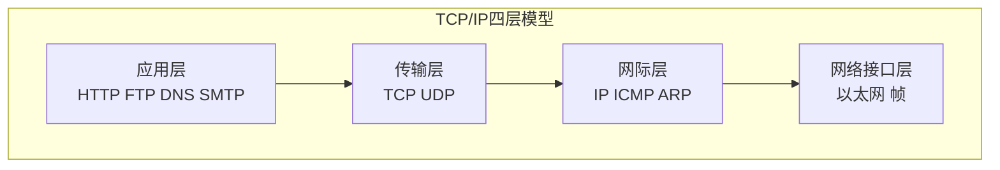
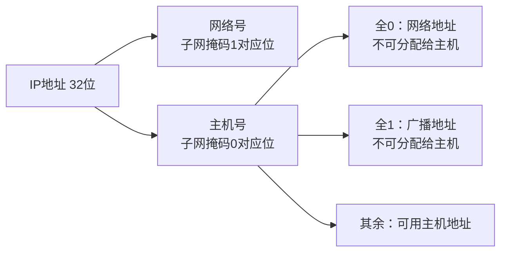
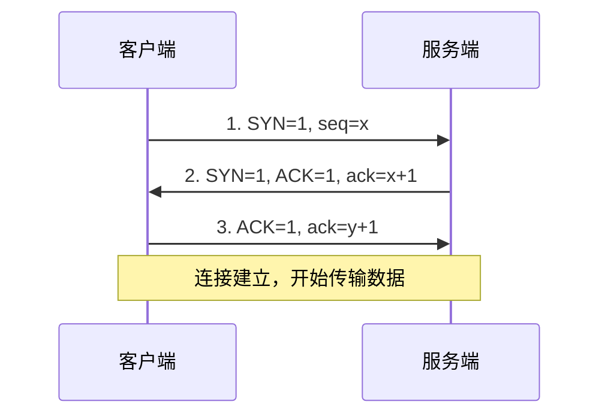
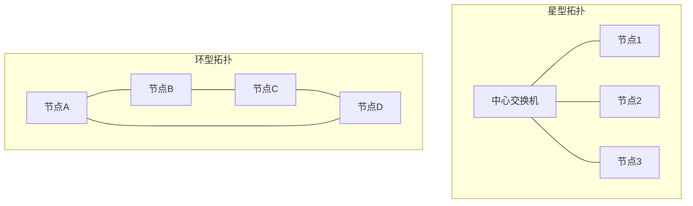
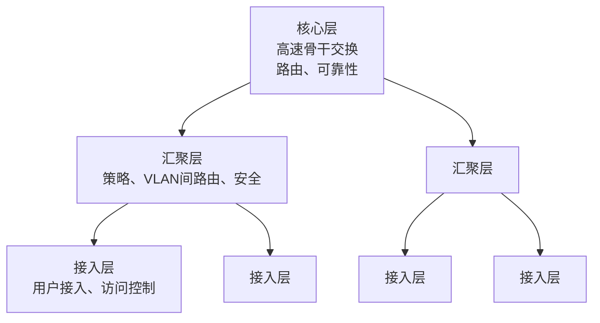
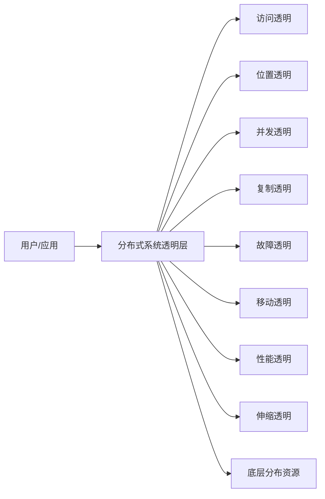
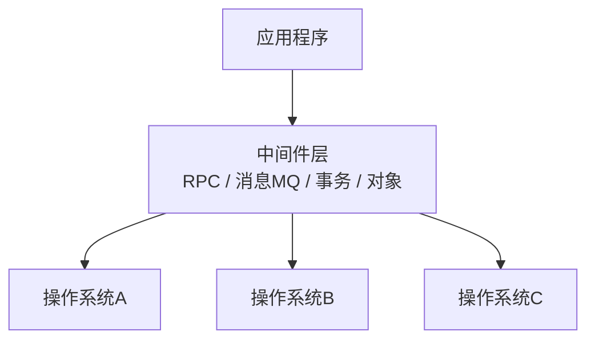

# 系统分析师｜第4章 计算机网络与分布式系统（完整版备考讲义+章节自测题）

> 适配系统分析师（第2版教材），包含教材删减但真题持续考查内容；上午选择题、计算题备考讲义。  
> 标签：系统分析师、上午题、计算机网络、分布式系统、OSI、TCP/IP、子网划分、备考

[TOC]

## 模块1：计算机网络基础（数据通信基础）

**前置说明**：本章基于系统分析师第2版官方教材，增补第1版删减但历年真题、新考纲仍必考内容，适配上午综合选择题与计算题。  
**模块优先级**：🔴 最高优先级（奈奎斯特、香农计算题每年必考）  
**考情分析**：每年1道左右计算题；核心：码元/比特率/波特率、编码方式、奈奎斯特定理、香农定理、CRC校验。

### 1.1 核心知识点精讲

#### 1.1.1 数据通信基本概念

- **模拟信号**：连续变化的信号（如语音、模拟电视）；**数字信号**：离散的脉冲序列（0/1）。
- **码元（符号）**：承载信息的最小信号单元；一个码元可携带多位比特。
- **波特率（码元速率）**：每秒传输的码元数，单位 Baud（波特）。
- **比特率（信息速率）**：每秒传输的比特数，单位 bps。
- 关系：比特率 = 波特率 × log2(码元状态数V)，即 R = B × log2V。

> 易错：波特率≠比特率；只有当每个码元只携带1比特（V=2）时二者数值相等。

#### 1.1.2 常用编码方式（高频选择题）

1. **NRZ 不归零编码**：电平直接表示0/1，简单但无自同步能力。
2. **曼彻斯特编码**：每个码元中间有一次跳变，**既表示数据又携带时钟（自同步）**；上升沿/下降沿表示0/1。
   - 以太网（IEEE 802.3）使用曼彻斯特编码。
3. **差分曼彻斯特编码**：每个码元中间必有一次跳变（仅时钟），**数据由码元开始处是否有跳变决定**；抗干扰更强，令牌环网使用。

> 考点：曼彻斯特编码"每位中间跳变，自含时钟"，是10M以太网标准编码。

#### 1.1.3 奈奎斯特定理（无噪声信道，计算必考）

无噪声信道的极限码元速率为：

$$B_{max} = 2W \text{（Baud）}$$

- W：信道带宽（Hz）。
- 若每个码元携带 log2V 比特，则极限数据传输速率：

$$C = 2W \times \log_2 V \text{（bps）}$$

> V：码元的电平状态数（离散电平数）。

#### 1.1.4 香农定理（有噪声信道，计算必考）

有噪声信道极限数据传输速率为：

$$C = W \times \log_2(1 + S/N) \text{（bps）}$$

- W：信道带宽（Hz）；S/N：信噪比（功率比值，不是dB值）。
- dB换算：$S/N(dB) = 10 \lg(S/N)$，即若信噪比30dB，则 S/N = 10³ = 1000。

> 易错：题目给的信噪比若是"dB"，必须先换算成比值再代入公式。

#### 1.1.5 差错控制：CRC与海明校验

- **CRC循环冗余校验**：检错码，能检测出大量突发错误（**只能检错，不能纠错**）。
  发送端用生成多项式G(x)对数据帧做模2除法，余数作为校验码（FCS）附在帧尾。
- **海明码**：纠错码，能定位并纠正1位错误（可检2位、纠1位）。
  校验位个数r满足：$2^r \ge k + r + 1$（k为数据位个数）。

> 区别记忆：CRC检错→重传；海明纠错→直接改正。

#### 1.1.6 高频易错点

1. 波特率与比特率混淆：比特率 = 波特率 × log2V；
2. 奈奎斯特（无噪声）与香农（有噪声）公式不要混用；
3. dB换算信噪比：30dB→1000倍，20dB→100倍，10dB→10倍；
4. CRC只检错不纠错；海明码能纠1位错。

### 1.2 典型配套例题（真题同源，带完整解析）

#### 例题1 香农定理计算

某信道带宽3000Hz，信噪比30dB，求该信道最大数据传输速率。

> 【解析】
> 30dB → S/N = 10^(30/10) = 1000
> C = 3000 × log2(1+1000) = 3000 × log2(1001) ≈ 3000 × 9.97 ≈ 29910 bps
> 【答案】约 29910 bps（≈29.9 kbps）

#### 例题2 奈奎斯特计算

无噪声信道带宽4000Hz，采用4种电平状态（V=4），求极限数据传输速率。

> 【解析】
> C = 2 × 4000 × log2(4) = 8000 × 2 = 16000 bps
> 【答案】16000 bps（16 kbps）

#### 例题3 编码方式判断

以太网（IEEE 802.3）采用下列哪种编码（）
A. NRZ B. 曼彻斯特编码 C. 差分曼彻斯特编码 D. 4B/5B

> 【解析】10M以太网采用曼彻斯特编码，每位中间跳变，自含时钟。  
> 【答案】B

### 1.3 课后习题（带完整答案+解析）

**习题1**  
某信道码元速率为2400 Baud，采用8种电平（V=8），比特率为（）
A. 2400 bps B. 4800 bps C. 7200 bps D. 9600 bps

> 答案：C  
> 解析：R = B × log2V = 2400 × log2(8) = 2400 × 3 = 7200 bps。

**习题2**  
信噪比20dB换算成功率比值为（）
A. 10 B. 20 C. 100 D. 200

> 答案：C  
> 解析：S/N = 10^(20/10) = 10² = 100。

**习题3**  
下列关于CRC校验的说法正确的是（）
A. 可以纠正错误 B. 只能检错 C. 可以定位错误位置 D. 不能检测突发错误

> 答案：B  
> 解析：CRC是检错码，只能检测错误（触发重传），不能纠错定位。

---

## 模块2：网络体系结构与协议

**前置说明**：本章基于系统分析师第2版官方教材，增补第1版删减但历年真题、新考纲仍必考内容，适配上午综合选择题与计算题。  
**模块优先级**：🔴 最高优先级（OSI/TCP/IP分层、子网划分、TCP/UDP每年必考）  
**考情分析**：每年2~3道选择题+计算题；核心：OSI七层与TCP/IP四层对照、IPv4地址与子网划分、CIDR聚合、TCP三次握手、UDP特点、应用层协议。

### 2.1 核心知识点精讲

#### 2.1.1 OSI七层模型与TCP/IP四层模型（高频）

OSI七层（自下而上）：物理层 → 数据链路层 → 网络层 → 传输层 → 会话层 → 表示层 → 应用层。
记忆口诀：**物数网传会表应**。

TCP/IP四层（自下而上）：网络接口层 → 网际层 → 传输层 → 应用层。

OSI 与 TCP/IP 对应关系：

| OSI七层 | 典型协议/设备 | TCP/IP四层 |
| ---- | ---- | ---- |
| 应用层 | HTTP、FTP、DNS、SMTP | 应用层 |
| 表示层 | 数据加密、格式转换（JPEG/ASCII） | 应用层 |
| 会话层 | 会话管理（NetBIOS） | 应用层 |
| 传输层 | TCP、UDP | 传输层 |
| 网络层 | IP、ICMP、ARP、路由器 | 网际层 |
| 数据链路层 | 以太网帧、交换机 | 网络接口层 |
| 物理层 | 集线器、中继器、双绞线 | 网络接口层 |

> 设备分层：集线器/中继器→物理层；交换机/网桥→数据链路层；路由器→网络层；网关→高层。

#### 2.1.2 IPv4地址与子网划分（计算必考）

- IPv4地址32位，点分十进制；由**网络号 + 主机号**组成。
- 地址分类：
  - A类：1.0.0.0~126，默认掩码 /8（255.0.0.0）
  - B类：128~191，默认掩码 /16（255.255.0.0）
  - C类：192~223，默认掩码 /24（255.255.255.0）
  - D类：224~239 （组播）；E类：240~255 （保留）
- 子网划分：从主机号借位作为子网号；子网掩码中连续的1表示网络位。
- 可用主机数 = 2^(主机位数) - 2（扣除全0网络地址与全1广播地址）。

- **CIDR无类别域间路由**：用 /n 表示前缀长度，如 192.168.1.0/26。
- **路由聚合**：将多个连续子网聚合成一个超网，取共同前缀。

#### 2.1.3 IPv6基础

- IPv6地址128位，冒号十六进制表示；解决IPv4地址枯竭问题。
- 不支持NAT，内置安全（IPSec）；地址类型：单播、组播、任播。

#### 2.1.4 传输层：TCP与UDP对比

| 特性 | TCP | UDP |
| ---- | ---- | ---- |
| 连接 | 面向连接（三次握手） | 无连接 |
| 可靠性 | 可靠传输、重传机制 | 尽最大努力交付 |
| 流量控制 | 滑动窗口 | 无 |
| 拥塞控制 | 有（慢启动、拥塞避免） | 无 |
| 首部开销 | 20~60字节 | 8字节 |
| 典型应用 | HTTP、FTP、SMTP | DNS、视频流、VoIP、TFTP |

- TCP三次握手：SYN → SYN+ACK → ACK。
- TCP四次挥手：FIN → ACK → FIN → ACK。

#### 2.1.5 应用层协议

- **DNS**：域名→IP解析，默认端口53，基于UDP。
- **HTTP**：超文本传输，80端口；**HTTPS**：443端口，HTTP+SSL/TLS。
- **FTP**：文件传输，21端口（控制连接），20端口（数据连接）。
- **TFTP**：简单文件传输，69端口，基于UDP。
- **SMTP**：邮件发送，25端口；**POP3**：邮件接收，110端口。

> 高频陷阱：DNS用UDP；FTP双连接（控制21+数据20）；HTTPS=HTTP+SSL/TLS。

#### 2.1.6 高频易错点

1. 路由器是网络层设备，交换机是数据链路层设备，集线器是物理层设备；
2. 子网可用主机数要减2（网络地址+广播地址）；
3. TCP面向连接可靠，UDP无连接不可靠；
4. DNS默认用UDP（53），但区域传送用TCP；
5. CIDR聚合：找所有子网的共同前缀，前缀越短覆盖范围越大。

### 2.2 典型配套例题（真题同源，带完整解析）

#### 例题1 子网划分计算

将 192.168.1.0/24 划分成4个子网，求子网掩码与每个子网的可用主机数。

> 【解析】
> 划分4个子网需要从主机位借2位（2²=4）。
> 原24位网络位 + 2 = 26位 → 子网掩码 /26 = 255.255.255.192。
> 主机位 = 32-26 = 6位；可用主机数 = 2⁶ - 2 = 62。
> 【答案】子网掩码 255.255.255.192，每个子网可用主机62台

#### 例题2 CIDR路由聚合

网络有 200.10.1.0/24、200.10.2.0/24、200.10.3.0/24 三个子网，聚合成一个超网，聚合后网络为？

> 【解析】
> 三个子网第三字节分别为 1(00000001)、2(00000010)、3(00000011)，共同前缀为 000000（前6位），即第三字节高6位相同。
> 第三字节 00000000 → 0，前缀长度 16+6=22。
> 【答案】200.10.0.0/22

#### 例题3 协议与层对应

下列协议中，工作在传输层的是（）
A. IP B. TCP C. HTTP D. ARP

> 【解析】IP/ARP在网络层（网际层）；HTTP在应用层；TCP在传输层。  
> 【答案】B

#### 例题4 三次握手过程

TCP建立连接时，客户端发送的第一个报文段标志是（）
A. ACK B. FIN C. SYN D. RST

> 【解析】三次握手第一步：客户端发送SYN=1报文请求建立连接。  
> 【答案】C

### 2.3 课后习题（带完整答案+解析）

**习题1**  
将 172.16.0.0/16 划分成8个子网，子网掩码为（）
A. 255.255.0.0 B. 255.255.128.0 C. 255.255.224.0 D. 255.255.240.0

> 答案：C  
> 解析：8=2³，借3位，前缀16+3=19，掩码255.255.224.0。

**习题2**  
下列哪个协议基于UDP（）
A. HTTP B. FTP C. DNS D. SMTP

> 答案：C  
> 解析：DNS默认UDP 53端口；HTTP/FTP/SMTP都基于TCP。

**习题3**  
IPv6地址长度为（）
A. 32位 B. 64位 C. 128位 D. 256位

> 答案：C  
> 解析：IPv6地址128位，冒号十六进制表示。

---

## 模块3：局域网与广域网

**前置说明**：本章基于系统分析师第2版官方教材，增补第1版删减但历年真题、新考纲仍必考内容，适配上午综合选择题。  
**模块优先级**：🟡 中等优先级  
**考情分析**：年均0~1道选择题；核心：网络拓扑、CSMA/CD、以太网标准、无线局域网802.11、VPN概念。

### 3.1 核心知识点精讲

#### 3.1.1 网络拓扑结构

- **星型**：所有节点连接到中心设备（交换机）；中心故障全网瘫痪，布线容易，最常用。
- **总线型**：共享一条总线，CSMA/CD；节点故障影响小，总线故障全网瘫痪。
- **环型**：数据沿环单向传递；单点故障会中断全网（令牌环）。
- **网状**：节点间多条链路，可靠性最高，成本最高；用于骨干网。

#### 3.1.2 以太网与CSMA/CD

- 以太网：IEEE 802.3标准，采用**载波侦听多路访问/冲突检测（CSMA/CD）**。
- CSMA/CD工作流程：**先听后发、边发边听、冲突停止、随机延迟重发**。
  - 先听信道：空闲才发送；
  - 发送时监听：检测到冲突立即停止；
  - 冲突后按二进制指数退避算法随机等待后重发。
- 以太网最短帧长：64字节，保证冲突能被检测到。

#### 3.1.3 无线局域网

- IEEE 802.11系列（Wi-Fi）：2.4GHz/5GHz频段。
- 无线局域网采用 **CSMA/CA（冲突避免）**，与有线以太网的CSMA/CD不同——无线难以检测冲突，改为尽量避免。

> 易错：有线以太网CSMA/CD（带冲突检测）；无线Wi-Fi CSMA/CA（带冲突避免）。

#### 3.1.4 广域网与VPN

- 广域网WAN：跨越地理范围的网络，使用运营商线路。
- **VPN虚拟专用网络**：在公共网络上建立加密隧道，实现远程安全访问。
- 常见VPN隧道协议：IPSec、SSL/TLS、PPTP、L2TP。

> 第2版删减：X.25、帧中继等老式广域网协议细节不再深挖，仅保留VPN概念。

#### 3.1.5 高频易错点

1. 有线以太网CSMA/CD与无线CSMA/CA不要混淆；
2. 星型拓扑依赖中心节点，环型/总线单点故障影响范围不同；
3. VPN本质是"公共网络上加密隧道"，不是独立物理网络。

### 3.2 典型配套例题（真题同源，带完整解析）

#### 例题1 拓扑特点

某网络所有节点都连接到一台中心交换机，该拓扑是（），其特点是（）
A. 环型，可靠性最高 B. 星型，中心节点故障全网瘫痪 C. 总线型，实现简单 D. 网状，成本低

> 【解析】所有节点连接中心交换机是星型拓扑；中心节点是单点故障。  
> 【答案】B

#### 例题2 CSMA/CD流程

以太网CSMA/CD中，节点检测到冲突后的处理方式是（）
A. 立即重发 B. 停止发送并随机延迟后重发 C. 继续发送 D. 通知管理员

> 【解析】冲突后停止发送，按二进制指数退避随机延迟，再重新侦听发送。  
> 【答案】B

### 3.3 课后习题（带完整答案+解析）

**习题1**  
无线局域网IEEE 802.11采用的介质访问控制方式是（）
A. CSMA/CD B. CSMA/CA C. 令牌传递 D. TDMA

> 答案：B  
> 解析：无线难以检测冲突，采用冲突避免CSMA/CA。

**习题2**  
在公共网络上建立加密隧道实现远程安全访问，采用的技术是（）
A. VLAN B. VPN C. NAT D. DHCP

> 答案：B  
> 解析：VPN在公共网络上建立加密隧道。

---

## 模块4：网络工程

**前置说明**：本章基于系统分析师第2版官方教材新增内容，适配上午综合选择题与案例题。  
**模块优先级**：🟡 中等优先级（第2版强化）  
**考情分析**：年均0~1道选择题，偶在案例题出现；核心：网络三层架构、网络规划设计流程、性能指标。

### 4.1 核心知识点精讲

#### 4.1.1 网络三层架构（第2版新增，高频）

企业网络采用**核心层、汇聚层、接入层**三层结构：

- **核心层**：高速数据转发，冗余设计，不在核心层做访问控制（避免性能瓶颈）。
- **汇聚层**：策略实施、VLAN间路由、安全过滤、负载均衡。
- **接入层**：用户终端接入、MAC地址过滤、接入认证。

#### 4.1.2 网络规划与设计流程

1. **需求分析**：用户数量、业务类型、带宽需求、安全要求。
2. **逻辑设计**：IP地址规划、VLAN划分、路由策略、安全策略。
3. **物理设计**：设备选型、综合布线、机房设计。
4. **实施与测试**：设备配置、连通性测试、性能测试。
5. **运行维护**：监控、故障处理、升级扩展。

#### 4.1.3 网络性能指标

- **带宽**：信道最大传输速率（bps）。
- **时延**：数据从发送到接收的延迟（传输时延+传播时延+处理时延+排队时延）。
- **吞吐量**：单位时间实际传输的数据量。
- **丢包率**：丢失数据包占比。

> 易错：带宽是"能力"，吞吐量是"实际值"，吞吐量 ≤ 带宽。

#### 4.1.4 高频易错点

1. 核心层负责高速转发，不应做复杂策略影响性能；
2. 汇聚层是策略控制点（VLAN间路由、安全）；
3. 接入层直接面向用户终端。

### 4.2 典型配套例题（真题同源，带完整解析）

#### 例题1 三层架构职责

网络三层架构中，负责VLAN间路由与安全策略的层次是（）
A. 核心层 B. 汇聚层 C. 接入层 D. 传输层

> 【解析】汇聚层负责策略、VLAN间路由、安全过滤。  
> 【答案】B

#### 例题2 性能指标

下列关于带宽与吞吐量的说法正确的是（）
A. 吞吐量一定大于带宽 B. 带宽是理论最大速率，吞吐量是实际传输速率 C. 二者完全相等 D. 带宽与吞吐量无关

> 【解析】带宽是信道理论最大能力，吞吐量是实际值，吞吐量≤带宽。  
> 【答案】B

### 4.3 课后习题（带完整答案+解析）

**习题1**  
网络三层架构中，用户终端直接接入的层次是（）
A. 核心层 B. 汇聚层 C. 接入层 D. 骨干层

> 答案：C  
> 解析：接入层负责用户终端接入。

**习题2**  
下列不属于网络性能指标的是（）
A. 带宽 B. 时延 C. 丢包率 D. IP地址分类

> 答案：D  
> 解析：IP地址分类是编址概念，不是性能指标。

---

## 模块5：分布式系统

**前置说明**：本章基于系统分析师第2版官方教材，增补第1版删减但历年真题、新考纲仍必考内容，适配上午综合选择题，部分考点支撑案例与论文。  
**模块优先级**：🔴 最高优先级（系分特色重点，案例+论文高频）  
**考情分析**：每年1~2道选择题；核心：分布式系统定义、八大特性、八种透明性、中间件、Web服务、云计算IaaS/PaaS/SaaS。

### 5.1 核心知识点精讲

#### 5.1.1 分布式系统定义

分布式系统：**组件分布在多台联网的计算机上，通过消息传递相互协作**，对外呈现为一个统一的整体。

> 关键特征：并发、无全局时钟、组件独立故障。

#### 5.1.2 分布式系统八大特性（高频概念）

1. **异构性**：不同硬件、操作系统、网络、语言并存。
2. **开放性**：遵循公开标准，易于扩展与互操作。
3. **可伸缩性**：系统规模变化时仍能保持性能。
4. **故障处理**：组件故障不应导致整个系统崩溃。
5. **并发性**：多个组件同时运行、共享资源。
6. **透明性**：对用户和应用程序隐藏分布细节（重点）。
7. **安全性**：认证、授权、加密、防攻击。
8. **服务质量QoS**：可靠性、性能、可用性保证。

#### 5.1.3 分布式系统的八种透明性（高频，重点）

1. **访问透明**：隐藏数据表示和访问方式的差异，统一访问接口。
2. **位置透明**：无需知道资源物理位置即可访问。
3. **并发透明**：多个用户并发访问同一资源互不干扰。
4. **复制透明**：资源有多个副本，用户感知不到复制。
5. **故障透明**：组件故障后系统仍能完成操作。
6. **移动透明**：资源移动不影响正在进行的访问。
7. **性能透明**：负载变化时系统自动调整性能。
8. **伸缩透明**：系统规模变化（扩缩容）无需改变应用结构。

> 记忆口诀：**访位并复故移性伸**（访问、位置、并发、复制、故障、移动、性能、伸缩）。

#### 5.1.4 中间件

- **中间件定义**：位于操作系统与应用程序之间的独立软件层，屏蔽底层异构性，为应用提供统一API。
- **作用**：隐藏网络、硬件、操作系统的差异，简化分布式应用开发。
- **分类**：远程过程调用RPC、消息中间件（MQ）、对象中间件（CORBA）、事务中间件（TP Monitor）。

#### 5.1.5 Web服务与REST

- **Web服务**：基于HTTP/XML的分布式交互技术，跨平台跨语言。
  - **SOAP**：基于XML的消息协议。
  - **WSDL**：服务描述语言，描述服务接口。
  - **UDDI**：服务注册与发现。
- **REST**：基于HTTP动词（GET/POST/PUT/DELETE）+资源URI的轻量架构风格，比SOAP更简单。

> 现代微服务多采用REST/JSON；传统企业服务常用SOAP/XML。

#### 5.1.6 云计算基础

- **服务模式**：
  - **IaaS 基础设施即服务**：提供虚拟机、存储、网络（如云主机）。
  - **PaaS 平台即服务**：提供开发运行平台（数据库、中间件、运行时）。
  - **SaaS 软件即服务**：直接提供应用软件（如在线办公）。
- **部署模式**：公有云、私有云、混合云。

> 记忆：IaaS给"机器"，PaaS给"平台"，SaaS给"软件"。

#### 5.1.7 高频易错点

1. 八种透明性名称容易混淆，结合场景记忆（"位置透明"=不用知道在哪，"复制透明"=感知不到多副本）；
2. 中间件屏蔽异构性，是"操作系统与应用之间"的层；
3. IaaS/PaaS/SaaS的区分以"提供什么"为准；
4. REST基于HTTP动词+URI，SOAP基于XML消息。

### 5.2 典型配套例题（真题同源，带完整解析）

#### 例题1 透明性判断

用户访问某个分布式服务时，无需知道该服务部署在哪台服务器上，这体现了（）
A. 访问透明 B. 位置透明 C. 复制透明 D. 故障透明

> 【解析】隐藏资源物理位置，无需知道在哪台机器 → 位置透明。  
> 【答案】B

#### 例题2 透明性判断

分布式系统中资源有多个副本，用户访问时感知不到副本的存在，这体现了（）
A. 复制透明 B. 访问透明 C. 并发透明 D. 移动透明

> 【解析】隐藏多副本细节，用户感知不到复制 → 复制透明。  
> 【答案】A

#### 例题3 云计算模式

云服务商提供虚拟机、存储和网络资源，用户自行部署操作系统与应用，该模式是（）
A. SaaS B. PaaS C. IaaS D. DaaS

> 【解析】提供基础设施（虚拟机/存储/网络）→ IaaS。  
> 【答案】C

#### 例题4 中间件作用

中间件的主要作用是（）
A. 提高CPU主频 B. 屏蔽底层异构性，为应用提供统一API C. 替代操作系统 D. 实现数据加密

> 【解析】中间件位于OS与应用之间，屏蔽网络/硬件/OS差异，提供统一接口。  
> 【答案】B

### 5.3 课后习题（带完整答案+解析）

**习题1**  
分布式系统组件故障不影响整个系统继续工作，体现了（）
A. 并发性 B. 故障处理特性 C. 异构性 D. 开放性

> 答案：B  
> 解析：故障处理特性要求组件故障不导致系统整体崩溃。

**习题2**  
用于描述Web服务接口的语言是（）
A. SOAP B. WSDL C. UDDI D. HTML

> 答案：B  
> 解析：WSDL（Web服务描述语言）描述服务接口；SOAP是消息协议，UDDI是注册发现。

**习题3**  
云服务商提供数据库、中间件等平台能力，用户只需部署自己的应用，该模式是（）
A. IaaS B. PaaS C. SaaS D. IDC

> 答案：B  
> 解析：提供开发运行平台（数据库/中间件/运行时）→ PaaS。

---

# 章节总复习综合模拟题（覆盖全部5模块，含答案与解析）

> 说明：题型贴合系统分析师上午真题风格，包含选择+计算，覆盖模块1~5所有核心考点；可直接放在讲义末尾作为章节自测。

## 一、单项选择题（15题）

1. 比特率与波特率的关系是（）
A. 相等 B. 比特率 = 波特率 × log2(码元状态数) C. 波特率 = 比特率 × log2V D. 无关
> 【解析】R = B × log2V。  
> 答案：B

2. 香农定理中，信道带宽W=4000Hz，信噪比30dB，最大数据传输速率约为（）
A. 40kbps B. 12kbps C. 32kbps D. 20kbps
> 【解析】S/N=1000；C=4000×log2(1001)≈4000×9.97≈39.9kbps≈40kbps。  
> 答案：A

3. 以太网IEEE 802.3采用的编码是（）
A. NRZ B. 曼彻斯特 C. 差分曼彻斯特 D. 归零码
> 答案：B

4. CRC校验的特点是（）
A. 能纠错 B. 只能检错 C. 能定位错误 D. 无需生成多项式
> 答案：B

5. 路由器工作在OSI模型的（）
A. 物理层 B. 数据链路层 C. 网络层 D. 传输层
> 答案：C

6. 将192.168.10.0/24划分成4个子网，每个子网可用主机数为（）
A. 62 B. 64 C. 126 D. 30
> 【解析】借2位，主机位6位，2⁶-2=62。  
> 答案：A

7. 下列基于UDP的协议是（）
A. HTTP B. FTP C. TFTP D. SMTP
> 答案：C

8. TCP三次握手中，第二次握手报文包含的标志位是（）
A. SYN B. ACK C. SYN+ACK D. FIN
> 答案：C

9. 无线局域网802.11采用（）
A. CSMA/CD B. CSMA/CA C. 令牌环 D. FDDI
> 答案：B

10. 所有节点连接到中心交换机的拓扑是（）
A. 总线型 B. 环型 C. 星型 D. 网状
> 答案：C

11. 网络三层架构中，负责高速数据转发的层次是（）
A. 接入层 B. 汇聚层 C. 核心层 D. 会话层
> 答案：C

12. 用户无需知道资源物理位置即可访问，体现的透明性是（）
A. 访问透明 B. 位置透明 C. 复制透明 D. 移动透明
> 答案：B

13. 提供虚拟机、存储、网络等基础设施的云计算模式是（）
A. SaaS B. PaaS C. IaaS D. BaaS
> 答案：C

14. 中间件位于（）
A. 应用与数据库之间 B. 操作系统与应用程序之间 C. 网络层与传输层之间 D. 用户与浏览器之间
> 答案：B

15. IPv6地址长度为（）
A. 32位 B. 64位 C. 128位 D. 256位
> 答案：C

## 二、计算题（4道，真题风格）

### 计算题1【香农定理】

信道带宽3000Hz，信噪比40dB，求极限数据传输速率。
> 【解析】
> 40dB → S/N = 10⁴ = 10000
> C = 3000 × log2(1+10000) = 3000 × log2(10001) ≈ 3000 × 13.29 ≈ 39870 bps
> 答案：约 39870 bps

### 计算题2【奈奎斯特+码元】

无噪声信道带宽2000Hz，每个码元携带3比特（V=8），求极限数据传输速率。
> 【解析】
> C = 2 × 2000 × log2(8) = 4000 × 3 = 12000 bps
> 答案：12000 bps

### 计算题3【子网划分】

将 10.0.0.0/8 划分成64个子网，求子网掩码与每个子网可用主机数。
> 【解析】
> 64=2⁶，借6位，前缀8+6=14，掩码255.252.0.0。
> 主机位 = 32-14 = 18位；可用主机数 = 2¹⁸ - 2 = 262142。
> 答案：掩码255.252.0.0，每子网262142台可用主机

### 计算题4【CIDR聚合】

网络有 172.16.4.0/24、172.16.5.0/24、172.16.6.0/24、172.16.7.0/24，聚合成一个超网。
> 【解析】
> 第三字节 4(00000100)、5(00000101)、6(00000110)、7(00000111)，共同前缀为 000001（前6位），即 4~7 覆盖 000001xx。
> 第三字节 00000100 → 4，前缀 16+6=22。
> 答案：172.16.4.0/22

## 三、简答概念题（3道）

1. 简述奈奎斯特定理与香农定理的区别
> 【解析】奈奎斯特定理适用于无噪声信道，C=2W·log2V，极限取决于带宽与码元状态数；香农定理适用于有噪声信道，C=W·log2(1+S/N)，极限取决于带宽与信噪比。噪声越大，香农极限越低。

2. 简述TCP与UDP的主要区别
> 【解析】TCP面向连接、可靠传输、有流量控制与拥塞控制，首部开销大，适合HTTP/FTP/SMTP等需要可靠传输的应用；UDP无连接、尽最大努力交付，开销小、实时性好，适合DNS、视频流、VoIP等应用。

3. 简述分布式系统的八种透明性
> 【解析】访问透明（隐藏访问方式差异）、位置透明（隐藏物理位置）、并发透明（隐藏并发冲突）、复制透明（隐藏多副本）、故障透明（隐藏组件故障）、移动透明（隐藏资源移动）、性能透明（隐藏负载变化）、伸缩透明（隐藏规模变化）。
