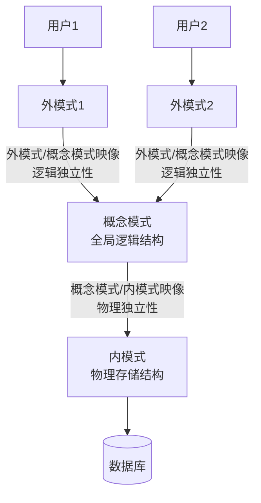
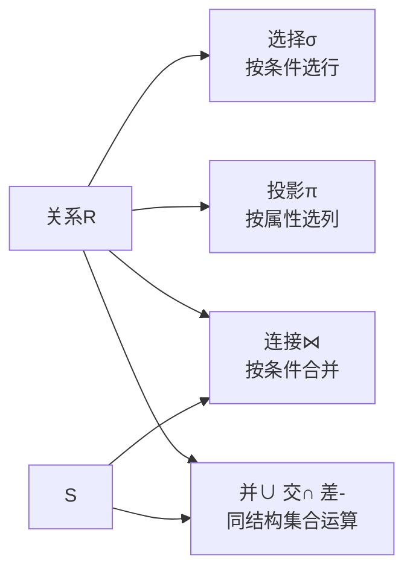
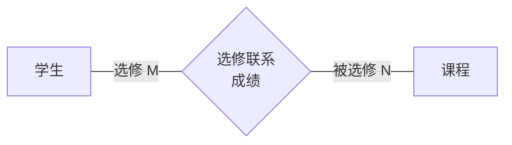
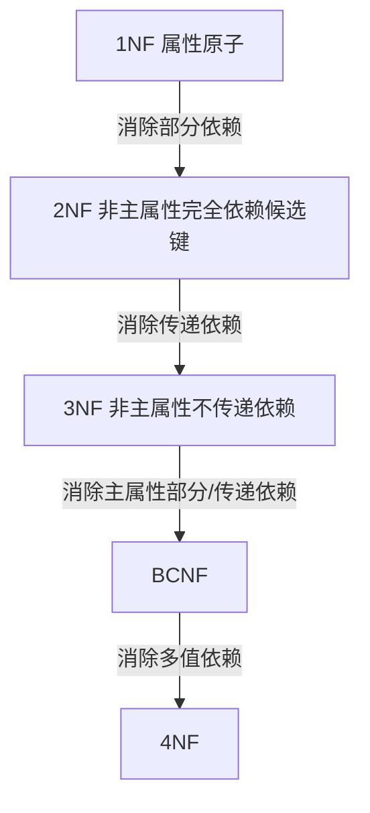
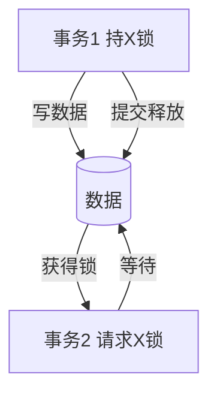
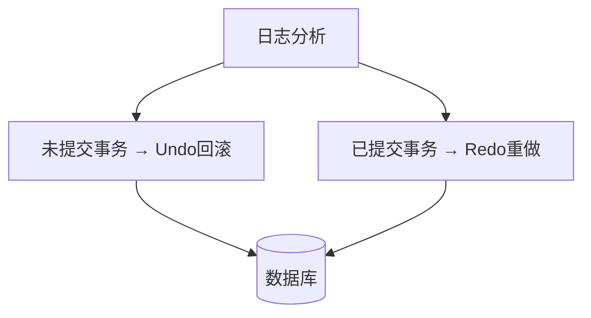
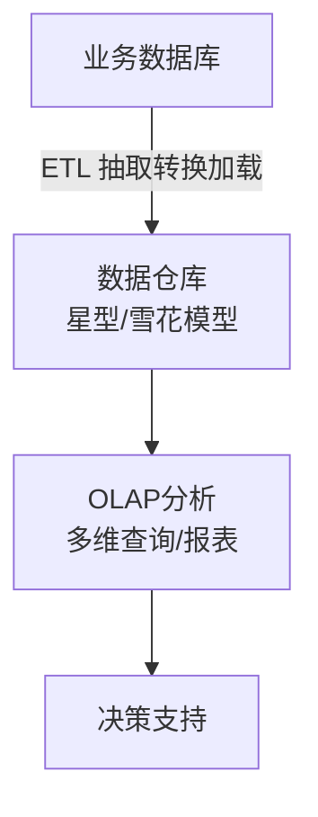

# 系统分析师｜第5章 数据库系统（完整版备考讲义+章节自测题）

> 适配系统分析师（第2版教材），包含教材删减但真题持续考查内容；上午选择题、计算题备考讲义。  
> 标签：系统分析师、上午题、数据库、关系模型、规范化、事务、并发控制、NoSQL、备考

[TOC]

## 模块1：数据库基础与体系结构

**前置说明**：本章基于系统分析师第2版官方教材，增补第1版删减但历年真题、新考纲仍必考内容，适配上午综合选择题。  
**模块优先级**：🟡 中等优先级  
**考情分析**：年均0~1道选择题；核心：三级模式两级映像、数据独立性、DBMS功能。

### 1.1 核心知识点精讲

#### 1.1.1 数据库系统组成

- **数据库系统DBS** = 数据库 + 数据库管理系统DBMS + 应用程序 + 数据库管理员DBA + 用户。
- **DBMS 主要功能**：数据定义、数据操纵、数据库运行管理（并发/恢复/安全）、数据组织与存储、数据库建立维护。

#### 1.1.2 三级模式两级映像（高频）

- **外模式（用户模式/子模式）**：用户看到的数据视图，一个数据库可有多个外模式。
- **概念模式（模式）**：全局逻辑结构，数据库中全部数据的逻辑描述，一个数据库只有一个。
- **内模式（存储模式）**：数据物理存储结构，一个数据库只有一个。

两级映像：
- **外模式/概念模式映像**：保证**逻辑独立性**——概念模式改变（如增删字段）时，外模式不变，用户程序不必修改。
- **概念模式/内模式映像**：保证**物理独立性**——存储结构改变时，概念模式不变。

#### 1.1.3 数据独立性

- **逻辑独立性**：概念模式变化不影响外模式与应用——由外模式/概念模式映像保证。
- **物理独立性**：内模式变化不影响概念模式——由概念模式/内模式映像保证。

> 易错：逻辑独立性对应"外模式-概念模式"映像；物理独立性对应"概念模式-内模式"映像，两者不要混淆。

#### 1.1.4 高频易错点

1. 外模式一个库多个，概念模式/内模式一个库各一个；
2. 逻辑独立性≠物理独立性，看谁变、谁不受影响；
3. DBMS核心功能是运行管理（并发、恢复、安全）。

### 1.2 典型配套例题（真题同源，带完整解析）

#### 例题1 三级模式对应

数据库的全局逻辑结构描述称为（）
A. 外模式 B. 概念模式 C. 内模式 D. 物理模式

> 【解析】概念模式描述全局逻辑结构，一个数据库只有一个。  
> 【答案】B

#### 例题2 数据独立性判断

数据库存储结构改变，概念模式与应用程序不受影响，这体现了（）
A. 逻辑独立性 B. 物理独立性 C. 并发控制 D. 完整性

> 【解析】内模式变化不影响概念模式与应用 → 物理独立性。  
> 【答案】B

### 1.3 课后习题（带完整答案+解析）

**习题1**  
关于三级模式，下列说法正确的是（）
A. 外模式只能有一个 B. 内模式可以有多个 C. 概念模式只有一个 D. 三者数量相同

> 答案：C  
> 解析：概念模式一个；外模式可多个；内模式一个。

**习题2**  
概念模式改变而外模式不变，用户程序无需修改，体现了（）
A. 物理独立性 B. 逻辑独立性 C. 数据完整性 D. 数据安全性

> 答案：B  
> 解析：概念模式（逻辑结构）变化不影响外模式 → 逻辑独立性。

---

## 模块2：关系代数与SQL

**前置说明**：本章基于系统分析师第2版官方教材，增补第1版删减但历年真题、新考纲仍必考内容，适配上午综合选择题。  
**模块优先级**：🔴 最高优先级（关系模型真题考频14次）  
**考情分析**：每年1道左右选择题；核心：关系模型基本概念、关系代数运算、SQL查询、完整性约束。

### 2.1 核心知识点精讲

#### 2.1.1 关系模型基本概念（高频）

- **关系**：一张二维表；**元组**：表中的一行；**属性**：表中的一列。
- **候选键**：能唯一标识元组的最小属性集合；候选键可有多个。
- **主键**：从候选键中选定的一个。
- **外键**：本表属性，引用另一表的主键，用于建立表间联系。

> 考点：候选键"最小性"；主键取值唯一且非空。

#### 2.1.2 关系代数运算（高频）

- **选择 σ**：按条件选**行**（水平切片）。
- **投影 π**：按属性选**列**（垂直切片）。
- **连接 ⋈**：按连接条件合并两个关系；自然连接按同名属性等值连接并去重列。
- **并∪ / 交∩ / 差−**：集合运算，要求两关系同结构（属性同、序同）。
- **除 ÷**：求解"包含全部…的…"，如查询选修了全部课程的学生。

> 易错：选择是行，投影是列；自然连接会去除重复属性列。

#### 2.1.3 SQL基础（标准SQL）

- **DDL**：CREATE、DROP、ALTER（定义结构）。
- **DML**：SELECT、INSERT、UPDATE、DELETE（操作数据）。
- **DCL**：GRANT、REVOKE（权限控制）。
- 常用查询：SELECT ... FROM ... WHERE ... GROUP BY ... HAVING ... ORDER BY ...
  - WHERE：行级过滤；HAVING：分组后过滤；GROUP BY：分组聚合。

> 易错：WHERE不能使用聚合函数，HAVING可以。

#### 2.1.4 完整性约束

- **实体完整性**：主键取值唯一且非空。
- **参照完整性**：外键取值要么为空，要么等于被引用表的主键值。
- **用户自定义完整性**：业务规则（如年龄≥0、性别取值）。

> 记忆：实体完整性管主键，参照完整性管外键。

#### 2.1.5 高频易错点

1. 候选键是"最小"超键，主键是选定候选键；
2. 选择σ选行、投影π选列；
3. WHERE过滤行、HAVING过滤分组；
4. 外键可为空，但引用时必须等于主键值。

### 2.2 典型配套例题（真题同源，带完整解析）

#### 例题1 关系代数

从学生关系中查询"计算机系"的学生，应使用的运算是（）
A. 投影 B. 选择 C. 连接 D. 并

> 【解析】按系别条件选取满足条件的行 → 选择σ。  
> 【答案】B

#### 例题2 候选键判断

关系R(学号, 姓名, 班级, 课程号, 成绩)，能唯一标识一个元组的最小属性集是（）
A. 学号 B. 课程号 C. (学号,课程号) D. (姓名,班级)

> 【解析】一个学生可选多门课，同一课程多人选，必须(学号,课程号)才能唯一确定一条选课记录。  
> 【答案】C

#### 例题3 SQL过滤条件

下列SQL子句中，可以使用聚合函数的是（）
A. WHERE B. HAVING C. 都不行 D. 都行

> 【解析】HAVING用于分组后过滤，可以使用聚合函数（如HAVING COUNT(*)>5）；WHERE不行。  
> 【答案】B

### 2.3 课后习题（带完整答案+解析）

**习题1**  
从关系中选取指定列，去掉重复，应使用（）
A. 选择σ B. 投影π C. 连接⋈ D. 除÷

> 答案：B  
> 解析：投影按属性选列；选择按条件选行。

**习题2**  
参照完整性规则约束的是（）
A. 主键取值 B. 外键取值 C. 属性取值范围 D. 表名唯一

> 答案：B  
> 解析：参照完整性要求外键为空或等于被引用主键值。

---

## 模块3：数据库设计

**前置说明**：本章基于系统分析师第2版官方教材，增补第1版删减但历年真题、新考纲仍必考内容，适配上午综合选择题与案例题。  
**模块优先级**：🔴 最高优先级（ER模型、ER转关系模式案例高频）  
**考情分析**：每年1道左右选择题，案例题常考；核心：设计生命周期、ER模型、ER图转关系模式。

### 3.1 核心知识点精讲

#### 3.1.1 数据库设计生命周期

1. **需求分析**：收集用户需求，输出数据流图、数据字典。
2. **概念设计**：抽象现实世界，输出 **ER 模型**（与具体DBMS无关）。
3. **逻辑设计**：ER模型转为关系模式，规范化，输出关系表结构。
4. **物理设计**：确定存储结构、索引、存取路径。
5. **实施与运维**：建库、测试、运行维护。

#### 3.1.2 ER模型（高频）

- **实体**：现实世界中可区分的对象（矩形表示）。
- **属性**：实体的特征（椭圆表示）；主属性下划线。
- **联系**：实体间的关联（菱形表示），联系也有属性。
  - 1:1 一对一：一个实体对应另一个至多一个。
  - 1:N 一对多：一个实体对应多个。
  - M:N 多对多：双方都可对应多个。

#### 3.1.3 ER图转关系模式（重点）

1. **1:1 联系**：联系并入任一端实体关系表（在任一端加对方主键）。
2. **1:N 联系**：在 N 端实体关系表中加入 1 端实体的主键作为外键。
3. **M:N 联系**：**联系转换为独立的关系表**，主键 = 两端实体的主键组合（复合主键），联系属性并入该表。

> 易错：M:N 必须独立成表；1:N 不独立建表（并入N端）；1:1 并入任一端。

#### 3.1.4 高频易错点

1. M:N 联系转关系时必建新表，主键为双方主键组合；
2. 概念设计产出ER模型，逻辑设计产出关系模式；
3. 联系自身有属性（如成绩）时，属性放在联系转换的关系表中。

### 3.2 典型配套例题（真题同源，带完整解析）

#### 例题1 ER转关系

学生与课程是M:N联系（联系属性：成绩）。转换为关系模式时，下列做法正确的是（）
A. 成绩加入学生表 B. 成绩加入课程表 C. 建立独立选课表(学号,课程号,成绩) D. 建立两个表即可

> 【解析】M:N联系必须独立建表，主键为(学号,课程号)，成绩作为该表属性。  
> 【答案】C

#### 例题2 设计阶段输出

数据库概念设计阶段的主要输出是（）
A. 关系模式 B. ER模型 C. 物理存储结构 D. SQL脚本

> 【解析】概念设计输出ER模型；逻辑设计输出关系模式。  
> 【答案】B

### 3.3 课后习题（带完整答案+解析）

**习题1**  
部门与员工是1:N联系（一个部门多名员工），转换为关系模式时正确做法是（）
A. 建立独立部门-员工表 B. 在员工表中加入部门主键作外键 C. 在部门表中加员工主键 D. 无需处理

> 答案：B  
> 解析：1:N联系在N端（员工）表中加入1端（部门）主键作外键，不独立建表。

**习题2**  
下列属于逻辑设计阶段工作的是（）
A. 绘制ER图 B. 确定索引 C. ER图转关系模式 D. 需求调研

> 答案：C  
> 解析：ER转关系模式是逻辑设计核心工作。

---

## 模块4：关系规范化理论

**前置说明**：本章基于系统分析师第2版官方教材，增补第1版删减但历年真题、新考纲仍必考内容，适配上午综合选择题与计算题。  
**模块优先级**：🔴 最高优先级（真题考频27次，系分数据库第一考点）  
**考情分析**：每年1~2道选择题/计算题；核心：函数依赖、范式判定、候选键求解、无损分解。

### 4.1 核心知识点精讲

#### 4.1.1 函数依赖

- **函数依赖** X→Y：X取值确定后，Y取值唯一确定。
- **完全函数依赖**：X→Y，且X的任何真子集都不能决定Y。
- **部分函数依赖**：X→Y，X的某个真子集就能决定Y（即依赖非主键部分）。
- **传递函数依赖**：X→Y，Y→Z，且Y不包含X，则X→Z是传递依赖。

#### 4.1.2 范式（高频，判定必考）

| 范式 | 要求 | 消除什么 |
| ---- | ---- | ---- |
| 1NF | 每个属性不可再分（原子性） | 非原子属性 |
| 2NF | 1NF + 非主属性完全依赖于候选键 | 部分函数依赖 |
| 3NF | 2NF + 非主属性不传递依赖于候选键 | 传递函数依赖 |
| BCNF | 3NF + 主属性也不部分/传递依赖 | 主属性对候选键的部分/传递依赖 |
| 4NF | BCNF + 无多值依赖 | 多值依赖 |

> 记忆：1NF原子 → 2NF完全依赖 → 3NF无传递依赖 → BCNF主属性也无部分传递依赖 → 4NF无多值依赖。

#### 4.1.3 候选键求解（属性闭包法）

求候选键步骤：
1. 求每个属性（或属性组合）的**闭包**：由已知函数依赖推导出该属性集能决定的全部属性。
2. 闭包 = 全部属性 且 无冗余子集的属性集，即为候选键。

> 典型技巧：只出现在函数依赖左边的属性（不出现在右边）必属于每个候选键；只出现在右边的属性不属于任何候选键。

#### 4.1.4 模式分解

- **无损连接分解**：分解后能通过自然连接还原原关系，不丢失信息。
  判定：两子模式交集能决定其中任一子模式（A∩B → A 或 A∩B → B）。
- **保持函数依赖**：分解后所有函数依赖仍被覆盖。

> 3NF分解可同时满足无损连接+保持依赖；BCNF分解保证无损连接但不一定保持依赖。

#### 4.1.5 反规范化（第2版强化）

- 目的：提升查询性能，用空间/冗余换时间。
- 手段：增加冗余列、派生列（如统计值）、合并表、分割表。
- 代价：增加数据一致性维护成本。

> 易错：反规范化是为性能牺牲部分规范化，需配合应用层保证一致性。

#### 4.1.6 高频易错点

1. 2NF消除部分依赖，3NF消除传递依赖，BCNF针对主属性；
2. 候选键求解用闭包法，先找"只在左边"的属性；
3. 无损连接判定：交集→决定一方；
4. 反规范化是"性能优先"的主动设计，不是错误。

### 4.2 典型配套例题（真题同源，带完整解析）

#### 例题1 范式判定

关系R(A,B,C)，函数依赖：AB→C。R属于最高范式为（）
A. 1NF B. 2NF C. 3NF D. BCNF

> 【解析】
> 候选键：AB（AB→C，且A、B单独都不能决定C）。
> 无非主属性（C是唯一非主属性且完全依赖AB），无部分/传递依赖；主属性A、B对候选键AB无部分/传递依赖。
> R属于 BCNF。
> 【答案】D

#### 例题2 候选键求解

关系R(A,B,C,D)，函数依赖：A→B，B→C，D→A。求候选键。

> 【解析】
> D→A→B→C，即D能决定全部属性；且D不能由其他属性决定。
> 候选键：D。
> 【答案】D

#### 例题3 无损分解判定

关系R(A,B,C)，分解为R1(A,B)、R2(B,C)，函数依赖B→C。该分解是否无损连接？

> 【解析】
> 交集 = B；判断 B→A 或 B→C 是否成立。已知 B→C 成立。
> 故分解是无损连接分解。
> 【答案】无损连接

### 4.3 课后习题（带完整答案+解析）

**习题1**  
关系R(A,B,C,D)，候选键AB，函数依赖：B→D。R属于第几范式？
A. 1NF B. 2NF C. 3NF D. BCNF

> 答案：A  
> 解析：非主属性D部分依赖于候选键AB（B→D），未达到2NF，属于1NF。

**习题2**  
关系R(A,B,C)，函数依赖：A→B，B→C。R属于（）
A. 1NF B. 2NF C. 3NF D. BCNF

> 答案：B  
> 解析：候选键A；非主属性C传递依赖A（A→B→C），未达3NF，但无部分依赖，属于2NF。

**习题3**  
关系R(A,B,C)，函数依赖：A→B，A→C。R属于最高范式（）
A. 2NF B. 3NF C. BCNF D. 4NF

> 答案：C  
> 解析：候选键A；无非主属性对候选键的部分/传递依赖，主属性唯一，属于BCNF。

---

## 模块5：事务与并发控制

**前置说明**：本章基于系统分析师第2版官方教材，增补第1版删减但历年真题、新考纲仍必考内容，适配上午综合选择题。  
**模块优先级**：🔴 最高优先级（ACID、并发问题每年必考）  
**考情分析**：每年1道左右选择题；核心：事务ACID、并发异常、封锁协议、隔离级别。

### 5.1 核心知识点精讲

#### 5.1.1 事务与ACID（高频）

事务：数据库操作的最小逻辑工作单元，要么全做要么全不做。

- **原子性 Atomicity**：操作要么全部成功要么全部回滚。
- **一致性 Consistency**：事务执行前后数据库保持一致状态。
- **隔离性 Isolation**：并发事务互不干扰，像串行执行。
- **持久性 Durability**：提交后结果永久保存，故障也不丢失。

> 记忆：原子、一致、隔离、持久。

#### 5.1.2 并发操作异常（高频）

1. **丢失更新**：两个事务先后修改同一数据，后提交覆盖先提交（都读旧值，各写各的）。
2. **脏读**：事务读到另一事务**未提交**的数据（该事务可能回滚）。
3. **不可重复读**：同一事务两次读同一数据，因其他事务修改而结果不同（针对**修改**）。
4. **幻读**：同一事务两次查询，因其他事务插入/删除行，结果集变化（针对**增删**）。

> 易错：不可重复读针对"行数据被改"，幻读针对"结果集增删行"。

#### 5.1.3 封锁协议

- **共享锁 S（读锁）**：可读不可写，多个事务可同时持S锁。
- **排他锁 X（写锁）**：可读可写，同一数据同时只允许一个事务持X锁。
- **两段锁协议 2PL**：事务分"扩展阶段（只加锁）"和"收缩阶段（只释放）"，保证可串行化。

#### 5.1.4 死锁

- **死锁产生**：两个以上事务互相等待对方持有的锁。
- **预防**：一次封锁法（一次申请所有锁）、顺序封锁法（按固定顺序加锁）。
- **检测与解除**：等待图检测，选择牺牲事务回滚。

#### 5.1.5 隔离级别（第2版强化）

| 隔离级别 | 脏读 | 不可重复读 | 幻读 |
| ---- | ---- | ---- | ---- |
| 读未提交 | 可能 | 可能 | 可能 |
| 读已提交 | 避免 | 可能 | 可能 |
| 可重复读 | 避免 | 避免 | 可能 |
| 串行化 | 避免 | 避免 | 避免 |

> 级别越高隔离越强、并发越低、性能越差。

#### 5.1.6 高频易错点

1. 脏读=读未提交数据；不可重复读=行被改；幻读=行增删；
2. X锁互斥，S锁可共享；2PL保证可串行化；
3. 隔离级别从低到高：读未提交→读已提交→可重复读→串行化。

### 5.2 典型配套例题（真题同源，带完整解析）

#### 例题1 并发异常判断

事务T1读取数据X，事务T2修改X但未提交，随后回滚；T1读取的X是旧值，但T1以为读到的是最新值。该现象是（）
A. 丢失更新 B. 脏读 C. 不可重复读 D. 幻读

> 【解析】读到未提交且可能回滚的数据 → 脏读。  
> 【答案】B

#### 例题2 锁类型

事务对数据加了共享锁S后，其他事务可以（）
A. 对该数据加X锁 B. 对该数据加S锁 C. 修改该数据 D. 什么都不能做

> 【解析】S锁共享：其他事务可再加S锁读，但不能加X锁写。  
> 【答案】B

#### 例题3 隔离级别

可重复读隔离级别可以避免（），但不能避免（）
A. 脏读；幻读 B. 幻读；脏读 C. 不可重复读；脏读 D. 串行化；不可重复读

> 【解析】可重复读避免脏读、不可重复读，但可能幻读。  
> 【答案】A

### 5.3 课后习题（带完整答案+解析）

**习题1**  
事务要么全部执行成功，要么全部回滚，体现的事务特性是（）
A. 原子性 B. 一致性 C. 隔离性 D. 持久性

> 答案：A  
> 解析：原子性=操作不可分割，全做或全不做。

**习题2**  
同一事务两次查询，因其他事务插入新行导致结果集不同，属于（）
A. 脏读 B. 不可重复读 C. 幻读 D. 丢失更新

> 答案：C  
> 解析：结果集因插入/删除而变化 → 幻读。

**习题3**  
两个事务互相等待对方持有的锁，导致都无法继续执行，属于（）
A. 死锁 B. 活锁 C. 饥饿 D. 级联回滚

> 答案：A  
> 解析：互相等待对方锁 → 死锁。

---

## 模块6：数据库恢复与安全

**前置说明**：本章基于系统分析师第2版官方教材，增补第1版删减但历年真题、新考纲仍必考内容，适配上午综合选择题。  
**模块优先级**：🟡 中等优先级  
**考情分析**：年均0~1道选择题；核心：故障分类、日志与检查点、Redo/Undo、备份策略、授权控制。

### 6.1 核心知识点精讲

#### 6.1.1 故障分类

1. **事务故障**：单个事务内部出错（如除零、死锁被回滚）——需Undo回滚。
2. **系统故障**：系统崩溃、断电，内存数据丢失——Undo未提交事务 + Redo已提交未落盘事务。
3. **介质故障**：磁盘损坏，数据物理丢失——需备份恢复。

#### 6.1.2 日志与恢复技术（高频）

- **日志文件**：记录事务对数据库的每次修改（事务标识、数据项、旧值、新值）。
- **Redo（重做）**：对已提交但结果可能未写入磁盘的事务，重新执行日志操作。
- **Undo（撤销）**：对未提交的事务，按日志逆操作回滚。

- **检查点Checkpoint**：定期记录"已提交事务清单+缓冲区状态"，缩短故障恢复时间——恢复时只需处理检查点之后的事务。

#### 6.1.3 备份策略

- **全量备份**：备份全部数据，恢复简单，耗时长。
- **增量备份**：只备份自上次备份以来变化的数据（依赖上一次任何备份），备份快，恢复需按链回放。
- **差异备份**：备份自上次**全量备份**以来变化的数据，介于两者之间。

> 易错：增量备份依赖最近一次备份；差异备份依赖最近一次全量备份。

#### 6.1.4 数据库安全

- **用户认证**：口令、强认证。
- **授权控制**：GRANT授权 / REVOKE回收，最小权限原则。
- **视图**：通过视图限制用户访问部分列/行，实现逻辑隔离。
- **审计**：记录操作日志，事后追踪。
- **数据脱敏**（第2版强化）：对敏感数据变形处理（如手机号打码）。

#### 6.1.5 高频易错点

1. 事务故障→Undo；介质故障→备份恢复；系统故障→Undo+Redo；
2. 检查点减少恢复时需扫描的日志量；
3. 增量vs差异：依赖对象不同。

### 6.2 典型配套例题（真题同源，带完整解析）

#### 例题1 恢复技术

系统崩溃后，对故障前已提交但结果未写入磁盘的事务，应执行（）
A. Undo B. Redo C. 检查点 D. 备份

> 【解析】已提交事务的结果需重做落盘 → Redo。  
> 【答案】B

#### 例题2 备份策略

只备份自上次备份以来发生变化的数据，备份速度快但恢复需按顺序回放多次备份，该策略是（）
A. 全量备份 B. 增量备份 C. 差异备份 D. 镜像备份

> 【解析】增量备份只备份增量，恢复需从全量开始按增量链回放。  
> 【答案】B

### 6.3 课后习题（带完整答案+解析）

**习题1**  
事务执行中发生除零错误被系统回滚，属于（）故障，采用（）恢复。
A. 系统故障；Redo B. 事务故障；Undo C. 介质故障；备份 D. 事务故障；Redo

> 答案：B  
> 解析：单个事务出错 → 事务故障，Undo回滚。

**习题2**  
检查点机制的主要作用是（）
A. 防止死锁 B. 缩短故障恢复时间 C. 提高查询速度 D. 加密数据

> 答案：B  
> 解析：检查点定期记录状态，恢复只需处理检查点之后的事务。

---

## 模块7：数据库新技术

**前置说明**：本章基于系统分析师第2版官方教材新增内容，适配上午综合选择题。  
**模块优先级**：🟡 中等优先级（第2版新增，近年考频上升）  
**考情分析**：年均0~1道选择题；核心：NoSQL分类与选型、数据仓库、数据湖、OLAP/OLTP。

### 7.1 核心知识点精讲

#### 7.1.1 NoSQL数据库（第2版新增，高频）

| 类型 | 代表 | 适用场景 | 特点 |
| ---- | ---- | ---- | ---- |
| 键值存储 | Redis、Memcached | 缓存、会话、简单查询 | 极高性能，结构简单 |
| 文档数据库 | MongoDB | 内容管理、柔性schema | 存JSON文档，灵活 |
| 列族数据库 | HBase、Cassandra | 海量数据分析 | 按列存储，扩展性强 |
| 图数据库 | Neo4j | 社交关系、推荐 | 节点-边模型，关系查询强 |

> 特点对比：关系型强调ACID与强一致；NoSQL强调高可用、水平扩展、最终一致性、灵活schema。

#### 7.1.2 数据仓库与OLAP

- **数据仓库**：面向主题、集成、相对稳定（非易失）、反映历史变化的数据集合，用于**决策分析**。
- **ETL**：抽取（Extract）→ 转换（Transform）→ 加载（Load）。
- **星型模型**：中心事实表 + 维度表（雪花模型为维度表再规范化）。
- **OLAP vs OLTP**：
  - OLTP 联机事务处理：面向日常业务，事务频繁，强调实时一致。
  - OLAP 联机分析处理：面向分析查询，数据量大，强调汇总分析。

#### 7.1.3 数据湖与分布式数据库

- **数据湖**：存储原始格式的海量异构数据（结构化/半结构化/非结构化），"先存后理"。
- **数据湖 vs 数据仓库**：数据仓库存"已加工、结构化"数据（schema-on-write）；数据湖存"原始、多样"数据（schema-on-read）。
- **分布式数据库**：数据分片+复制，多节点协同，支持水平扩展。

> 记忆：数据仓库"先治理后存储"；数据湖"先存储后治理"。

#### 7.1.4 高频易错点

1. NoSQL四类：键值/文档/列族/图，对应场景要能选；
2. OLTP面向业务事务，OLAP面向分析；
3. 数据仓库存结构化已加工数据，数据湖存原始多样数据；
4. ETL方向：业务库 → 数据仓库。

### 7.2 典型配套例题（真题同源，带完整解析）

#### 例题1 NoSQL选型

需要存储社交网络中"用户-好友"关系并进行多跳关系查询，最适合的数据库是（）
A. 关系型 B. 键值存储 C. 图数据库 D. 列族数据库

> 【解析】关系型关系查询适合图数据库，擅长节点-边多跳查询。  
> 【答案】C

#### 例题2 数据仓库特征

下列关于数据仓库的说法正确的是（）
A. 面向日常事务处理 B. 存储原始未加工数据 C. 面向主题、反映历史、用于分析 D. 强调实时写入

> 【解析】数据仓库面向主题、集成、相对稳定、反映历史，用于决策分析。  
> 【答案】C

#### 例题3 OLTP/OLAP区分

银行柜台交易系统属于（），数据仓库分析报表属于（）
A. OLTP；OLAP B. OLAP；OLTP C. 都是OLTP D. 都是OLAP

> 【解析】柜台交易是日常业务事务 → OLTP；分析报表 → OLAP。  
> 【答案】A

### 7.3 课后习题（带完整答案+解析）

**习题1**  
适合做缓存的NoSQL数据库类型是（）
A. 文档数据库 B. 键值存储 C. 图数据库 D. 列族数据库

> 答案：B  
> 解析：键值存储（如Redis）性能极高，适合缓存、会话。

**习题2**  
数据湖区别于数据仓库的主要特点是（）
A. 只存结构化数据 B. 存储原始格式的多样异构数据 C. 不支持大数据 D. 必须先建好schema再存

> 答案：B  
> 解析：数据湖"先存后理"，存储原始格式海量异构数据。

---

# 章节总复习综合模拟题（覆盖全部7模块，含答案与解析）

> 说明：题型贴合系统分析师上午真题风格，包含选择+计算，覆盖模块1~7所有核心考点；可直接放在讲义末尾作为章节自测。

## 一、单项选择题（15题）

1. 数据库存储结构改变，概念模式与应用不受影响，体现（）
A. 逻辑独立性 B. 物理独立性 C. 完整性 D. 安全性
> 答案：B

2. 一个数据库只能有一个的模式是（）
A. 外模式 B. 概念模式 C. 子模式 D. 用户模式
> 答案：B

3. 从关系中选择满足条件的行，使用（）
A. 投影 B. 选择 C. 连接 D. 除法
> 答案：B

4. 关系R(学号,课程号,成绩)，候选键为（）
A. 学号 B. 课程号 C. (学号,课程号) D. 成绩
> 答案：C

5. 下列SQL子句可用于分组后过滤且能使用聚合函数的是（）
A. WHERE B. HAVING C. GROUP BY D. ORDER BY
> 答案：B

6. 实体完整性约束要求（）
A. 外键非空 B. 主键唯一且非空 C. 属性取值范围 D. 表间引用有效
> 答案：B

7. 学生与课程M:N联系，转为关系模式时应（）
A. 建独立选课表 B. 并入学生表 C. 并入课程表 D. 无需建表
> 答案：A

8. 关系R(A,B,C)，函数依赖AB→C，R属于（）
A. 1NF B. 2NF C. 3NF D. BCNF
> 答案：D

9. 关系R(A,B,C,D)，候选键AB，函数依赖B→D，R属于（）
A. 1NF B. 2NF C. 3NF D. BCNF
> 【解析】D部分依赖AB → 未达2NF。  
> 答案：A

10. 事务T1读到T2未提交后被回滚的数据，属于（）
A. 脏读 B. 不可重复读 C. 幻读 D. 丢失更新
> 答案：A

11. 事务要么全做要么全不做，体现（）
A. 原子性 B. 一致性 C. 隔离性 D. 持久性
> 答案：A

12. 可重复读隔离级别不能避免（）
A. 脏读 B. 不可重复读 C. 幻读 D. 丢失更新
> 答案：C

13. 系统崩溃后，对已提交但未落盘的事务执行（）
A. Undo B. Redo C. 备份 D. 审计
> 答案：B

14. 存储社交关系并做多跳查询，最适合（）
A. 关系型 B. 键值存储 C. 图数据库 D. 列族数据库
> 答案：C

15. 面向主题、集成、反映历史、用于分析的数据集合是（）
A. 操作型数据库 B. 数据仓库 C. 数据湖 D. 缓存
> 答案：B

## 二、计算题（4道，真题风格）

### 计算题1【候选键求解】

关系R(A,B,C,D,E)，函数依赖：A→B，B→C，CD→E。求候选键。
> 【解析】
> 只在左边不出现在右边的属性：A、D（必属候选键）。
> 闭包(A,D)+ = A,D → B（A→B）→ C（B→C）→ E（CD→E）= 全部属性。
> 且(A,D)无冗余子集可决定全部属性。
> 答案：候选键为 (A,D)

### 计算题2【范式判定】

关系R(A,B,C,D)，函数依赖：A→B，A→C，C→D。判断R属于第几范式。
> 【解析】
> 候选键：A（A能决定B、C、D）。
> 非主属性D传递依赖A（A→C→D），未达3NF；无非主属性部分依赖，属于2NF。
> 答案：2NF

### 计算题3【无损连接判定】

关系R(A,B,C)，函数依赖：A→B，B→C。分解为R1(A,B)、R2(A,C)。该分解是否无损连接？
> 【解析】
> 交集 = A；判断 A→B 或 A→C 是否成立。已知 A→B 成立。
> 答案：无损连接分解

### 计算题4【ER转关系模式】

有实体"医生"（属性：医生号、姓名）与"病人"（属性：病历号、姓名），一位医生可看多个病人，一个病人可由多位医生诊治（联系属性：就诊日期）。请给出转换后的关系模式。
> 【解析】
> 医生与病人是 M:N 联系，需独立建表：
> 医生(医生号, 姓名)，主键医生号
> 病人(病历号, 姓名)，主键病历号
> 就诊(医生号, 病历号, 就诊日期)，主键(医生号,病历号)，外键医生号、病历号
> 答案：医生(医生号,姓名)；病人(病历号,姓名)；就诊(医生号,病历号,就诊日期)

## 三、简答概念题（3道）

1. 简述三级模式两级映像及其作用
> 【解析】三级模式：外模式（用户视图）、概念模式（全局逻辑）、内模式（物理存储）。两级映像：外模式/概念模式映像保证逻辑独立性，概念模式/内模式映像保证物理独立性，使应用与数据库结构变化解耦。

2. 简述两段锁协议
> 【解析】事务分两个阶段：扩展阶段只加锁不释放锁，收缩阶段只释放锁不加锁。两段锁协议保证并发事务可串行化，是并发控制的重要协议。

3. 简述NoSQL与关系型数据库的主要区别
> 【解析】关系型强调ACID、强一致、固定schema、SQL查询；NoSQL强调高可用、水平扩展、灵活schema、最终一致性，按数据模型分为键值、文档、列族、图四类，适合大数据量、高并发、结构多变场景。
