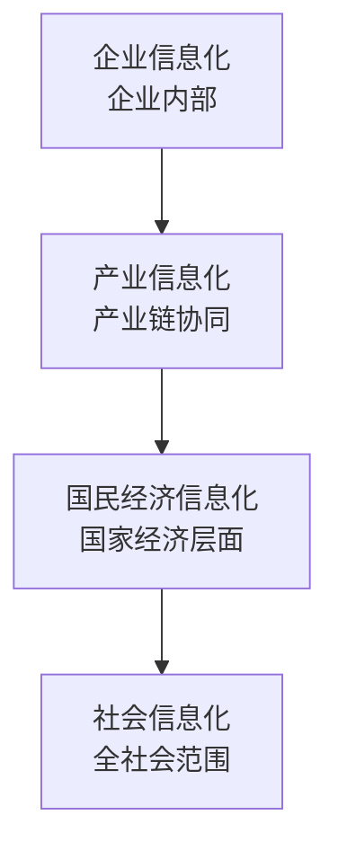
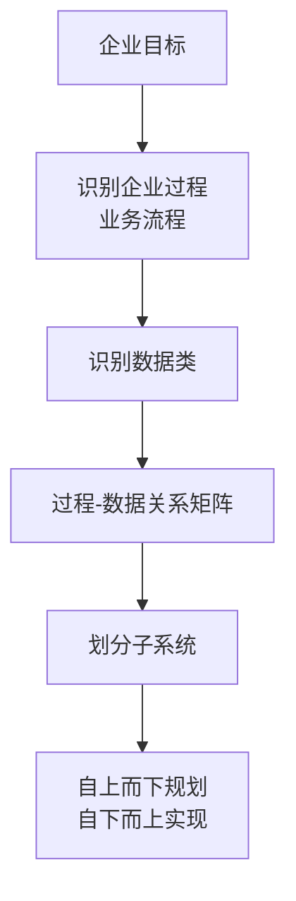
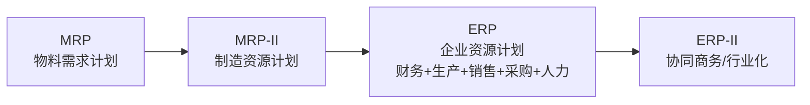
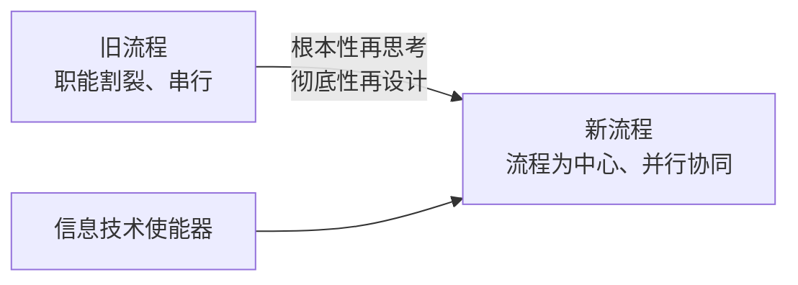
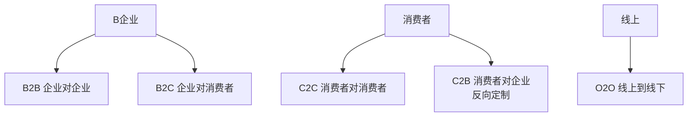
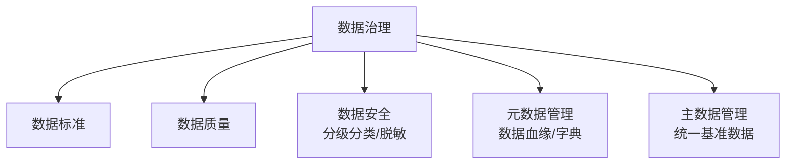
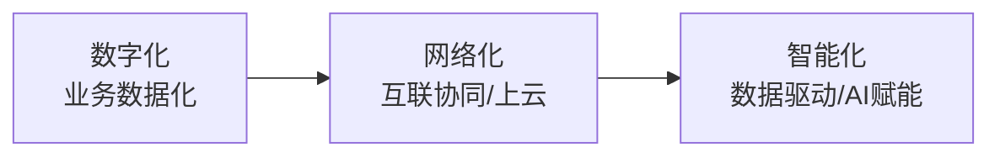

# 系统分析师｜第6章 企业信息化（完整版备考讲义+章节自测题）

> 适配系统分析师（第2版教材），包含教材删减但真题持续考查内容；上午选择题备考讲义。  
> 标签：系统分析师、上午题、企业信息化、信息化规划、ERP、BPR、数据治理、数字化转型、备考

[TOC]

## 模块1：信息化基础概念

**前置说明**：本章基于系统分析师第2版官方教材，增补第1版删减但历年真题、新考纲仍必考内容，适配上午综合选择题。  
**模块优先级**：🟡 中等优先级  
**考情分析**：年均0~1道选择题；核心：信息化层次、信息系统类型区分。

### 1.1 核心知识点精讲

#### 1.1.1 信息化的内涵与层次

- **信息化定义**：以信息资源开发利用为核心，以信息技术为手段，推动社会/企业转型的过程。
- **信息化的层次**（由低到高）：
  1. **企业信息化**：单个企业内部的信息化建设。
  2. **产业信息化**：整个行业产业链的信息化协同。
  3. **国民经济信息化**：国家经济层面信息基础设施与产业升级。
  4. **社会信息化**：全社会范围的信息化（教育、医疗、政务等）。

> 记忆：企业 → 产业 → 国民经济 → 社会，范围逐层扩大。

#### 1.1.2 信息系统的基本类型（高频区分）

- **TPS 事务处理系统**：处理日常业务事务（订单、记账），最底层、最基础。
- **MIS 管理信息系统**：面向中层管理，提供报表与汇总信息。
- **DSS 决策支持系统**：面向高层决策，支持半结构化/非结构化决策，人机交互。
- **ES 专家系统**：模拟领域专家推理，基于知识库+推理机。
- **OA 办公自动化**：文档流转、协同办公。

> 易错：MIS面向中层管理出报表；DSS面向高层决策做分析；ES模拟专家。

#### 1.1.3 战略信息系统 SIS

SIS：支持企业获取竞争优势的信息系统（如银行ATM、航空订票系统），直接改变企业的竞争地位。

#### 1.1.4 高频易错点

1. 信息化核心是信息资源开发利用，不是"买硬件"；
2. TPS/MIS/DSS 分别面向操作层/管理层/决策层；
3. 信息化的四个层次顺序不可颠倒。

### 1.2 典型配套例题（真题同源，带完整解析）

#### 例题1 信息化层次

信息化建设的层次从低到高顺序是（）
A. 社会信息化→国民经济信息化→产业信息化→企业信息化
B. 企业信息化→产业信息化→国民经济信息化→社会信息化
C. 产业信息化→企业信息化→社会信息化→国民经济信息化
D. 国民经济信息化→社会信息化→企业信息化→产业信息化

> 【解析】范围由小到大：企业→产业→国民经济→社会。  
> 【答案】B

#### 例题2 系统类型判断

为高层管理者提供决策分析支持，辅助半结构化决策的信息系统是（）
A. TPS B. MIS C. DSS D. OA

> 【解析】DSS面向高层决策，支持半结构化/非结构化决策。  
> 【答案】C

### 1.3 课后习题（带完整答案+解析）

**习题1**  
面向中层管理、提供汇总报表的信息系统是（）
A. TPS B. MIS C. DSS D. ES

> 答案：B  
> 解析：MIS面向中层管理，提供报表与汇总信息。

**习题2**  
信息化的核心是（）
A. 网络设备采购 B. 信息资源的开发利用 C. 软件开发 D. 系统集成

> 答案：B  
> 解析：信息化核心是信息资源开发利用。

---

## 模块2：企业信息化规划方法

**前置说明**：本章基于系统分析师第2版官方教材，增补第1版删减但历年真题、新考纲仍必考内容，适配上午综合选择题。  
**模块优先级**：🔴 最高优先级（CSF/SST/BSP三种方法对比必考）  
**考情分析**：每年1道左右选择题；核心：关键成功因素法CSF、战略集合转化法SST、业务系统规划法BSP的原理与区别。

### 2.1 核心知识点精讲

#### 2.1.1 关键成功因素法 CSF

- **思路**：识别影响企业目标实现的关键成功因素 → 逐层分解 → 确定信息系统需求与优先级。
- **特点**：抓主要矛盾，聚焦少数关键因素（通常3~6个），与高层访谈结合。
- 步骤：目标 → 识别CSF → 识别性能指标 → 定义数据需求。

#### 2.1.2 战略集合转化法 SST

- **思路**：把企业战略集合（使命、目标、战略、管理属性）转化为信息系统战略集合（系统目标、约束、设计原则）。
- **特点**：强调企业战略与信息系统战略的对齐，自上而下。

#### 2.1.3 业务系统规划法 BSP（最常用）

- **思路**：从企业目标出发，**识别企业过程** → 识别数据类 → 分析过程与数据关系 → **划分子系统**。
- **原则**：自上而下规划、自下而上实现；以过程（业务流程）为中心，而非以职能部门为中心。
- **产出**：企业过程定义、数据类、子系统划分、信息系统总体结构。

#### 2.1.4 三种方法对比（高频）

| 方法 | 出发点 | 特点 | 适用 |
| ---- | ---- | ---- | ---- |
| CSF | 关键成功因素 | 抓关键、聚焦少数因素 | 高层关注点明确 |
| SST | 企业战略集合 | 战略与信息系统对齐 | 战略驱动型企业 |
| BSP | 企业过程 | 过程导向、全面系统 | 大中型企业整体规划 |

> 记忆：CSF抓关键、SST对战略、BSP看过程（最常用）。

#### 2.1.5 高频易错点

1. BSP 的核心是"识别企业过程"，不是"从需求出发"；
2. BSP 原则：自上而下规划、自下而上实现；
3. CSF 与高层访谈强相关，聚焦少数关键因素；
4. 三种方法不互斥，可组合使用。

### 2.2 典型配套例题（真题同源，带完整解析）

#### 例题1 BSP 核心

业务系统规划法（BSP）的核心工作是（）
A. 识别关键成功因素 B. 识别企业过程 C. 制定企业战略 D. 设计数据库

> 【解析】BSP从企业目标出发，识别企业过程，再识别数据类、划分子系统。  
> 【答案】B

#### 例题2 方法匹配

强调"自上而下规划、自下而上实现"，以企业过程为中心的规划方法是（）
A. CSF B. SST C. BSP D. SWOT

> 【解析】BSP以过程为中心，自上而下规划、自下而上实现。  
> 【答案】C

### 2.3 课后习题（带完整答案+解析）

**习题1**  
通过识别少数关键因素来确定信息系统建设优先级的规划方法是（）
A. CSF B. SST C. BSP D. 价值链分析

> 答案：A  
> 解析：CSF关键成功因素法抓主要矛盾，聚焦少数关键因素。

**习题2**  
关于BSP说法错误的是（）
A. 以企业过程为中心 B. 自上而下规划 C. 自下而上实现 D. 从信息系统需求出发规划

> 答案：D  
> 解析：BSP从企业目标出发识别过程，不是从信息系统需求出发。

---

## 模块3：典型企业信息系统

**前置说明**：本章基于系统分析师第2版官方教材，增补第1版删减但历年真题、新考纲仍必考内容，适配上午综合选择题。  
**模块优先级**：🔴 最高优先级（ERP/CRM/SCM/PLM区分必考）  
**考情分析**：每年1道左右选择题；核心：ERP演进、CRM/SCM/PLM/BI的定位与区别。

### 3.1 核心知识点精讲

#### 3.1.1 ERP 企业资源计划

- **演进**：MRP（物料需求计划）→ MRP-II（制造资源计划）→ ERP（企业资源计划）。
- **ERP 范围**：整合**财务、采购、生产、销售、人力资源**等企业全部核心资源，实现物流、资金流、信息流"三流合一"。
- 特点：面向供应链、模块化、集成化、实时共享。

> 考点：ERP 是 MRP-II 的扩展，覆盖整个企业资源，不只是制造。

#### 3.1.2 CRM 客户关系管理

- **定位**：管理客户**全生命周期**（获取、保留、提升价值）。
- 三大模块：**营销管理、销售管理、客户服务**。
- 核心思想：以客户为中心，提升客户满意度与忠诚度。

#### 3.1.3 SCM 供应链管理

- **定位**：从**供应商→制造商→分销商→客户**全链条的物流、信息流、资金流协同。
- 核心：需求预测、库存协同、采购协同、物流配送。

#### 3.1.4 PLM 产品生命周期管理

- **定位**：管理产品**从概念、设计、制造、销售到退市**全过程的产品数据。
- 与ERP区别：PLM管"产品数据/研发过程"；ERP管"资源与交易"。

#### 3.1.5 BI 商业智能

- **组成**：数据仓库 + OLAP + 数据挖掘 + 报表可视化。
- **定位**：把企业数据转化为决策信息，支撑高层分析。
- 与DSS区别：BI 更强调大数据量与自动化分析。

#### 3.1.6 高频易错点

1. ERP 覆盖"整个企业资源"，MRP 只管物料；
2. CRM 管客户、SCM 管供应链、PLM 管产品数据，定位易混；
3. PLM 管研发产品数据，ERP 管经营资源交易；
4. BI = 数据仓库 + OLAP + 挖掘，面向分析决策。

### 3.2 典型配套例题（真题同源，带完整解析）

#### 例题1 ERP 演进

ERP 是在下列哪个系统基础上扩展而来的（）
A. MRP-II B. CRM C. SCM D. PLM

> 【解析】演进路径：MRP → MRP-II → ERP。  
> 【答案】A

#### 例题2 系统定位

管理产品从概念设计到退市全过程产品数据的系统是（）
A. CRM B. SCM C. PLM D. BI

> 【解析】PLM管理产品全生命周期数据。  
> 【答案】C

### 3.3 课后习题（带完整答案+解析）

**习题1**  
以客户为中心，管理客户全生命周期（营销、销售、服务）的系统是（）
A. ERP B. CRM C. SCM D. PLM

> 答案：B  
> 解析：CRM客户关系管理，三大模块营销/销售/服务。

**习题2**  
BI商业智能的核心组成不包括（）
A. 数据仓库 B. OLAP C. 数据挖掘 D. 生产排程

> 答案：D  
> 解析：BI=数据仓库+OLAP+数据挖掘+报表；生产排程属于制造执行范畴。

---

## 模块4：业务流程重组与信息化集成

**前置说明**：本章基于系统分析师第2版官方教材，增补第1版删减但历年真题、新考纲仍必考内容，适配上午综合选择题。  
**模块优先级**：🟡 中等优先级  
**考情分析**：年均0~1道选择题；核心：BPR定义与原则、EAI集成层次、SOA在集成中的应用。

### 4.1 核心知识点精讲

#### 4.1.1 BPR 业务流程重组

- **定义**：对企业业务流程进行**根本性再思考**和**彻底性再设计**，在成本、质量、服务、速度等关键指标上取得**显著改善**。
- **核心思想**：以**流程**为中心，打破职能部门壁垒。
- **BPR 与 IT**：信息技术是 BPR 的重要**使能器（enabler）**——IT 支撑新流程，新流程驱动 IT 价值。

> 易错：BPR强调"根本性、彻底性、显著改善"，不是渐进式优化（那是BPI持续改进）。

**BPR 实施步骤（第2版考纲补充）**：
1. **识别流程**：梳理现有核心业务流程，识别增值与非增值环节。
2. **分析诊断**：分析流程瓶颈、冗余、断点与问题根因。
3. **再设计**：以流程为中心设计新流程，配套组织与IT方案。
4. **实施变革**：组织调整、系统落地、人员培训。
5. **持续评价**：以成本、质量、服务、速度等指标评估改进效果并持续优化。

> 记忆：识别→诊断→再设计→实施→评价五步；IT作为使能器贯穿其中。

#### 4.1.2 EAI 企业应用集成

- **定义**：把企业内部多个孤立系统（如ERP、CRM、OA）集成，实现数据与流程贯通。
- **集成层次**（由低到高）：
  1. **数据集成**：数据库层面的共享与同步。
  2. **应用集成**：应用接口（API）互操作。
  3. **流程集成**：跨系统业务流程协同编排。
  4. **界面集成**：统一门户入口。

#### 4.1.3 SOA 与集成

- **SOA 面向服务架构**：把系统能力封装为**服务**，通过服务调用实现松耦合集成。
- 优点：松耦合、可复用、跨平台、便于流程编排。
- 相关标准：Web服务（SOAP/WSDL/UDDI）、REST。

> 记忆：SOA核心是"服务封装、松耦合"，是现代EAI的主流实现方式。

#### 4.1.4 高频易错点

1. BPR是"根本性、彻底性"再造；BPI是渐进式改进；
2. BPR以流程为中心，不是以部门为中心；
3. IT是BPR的使能器，不是"IT决定一切"；
4. EAI四层次：数据→应用→流程→界面（从低到高）。

### 4.2 典型配套例题（真题同源，带完整解析）

#### 例题1 BPR 特征

业务流程重组（BPR）的特点是（）
A. 渐进式优化 B. 根本性再思考与彻底性再设计 C. 以职能部门为中心 D. 仅优化某个环节

> 【解析】BPR强调根本性再思考、彻底性再设计、显著改善。  
> 【答案】B

#### 例题2 EAI 层次

企业应用集成中，实现跨系统业务流程协同编排属于（）
A. 数据集成 B. 应用集成 C. 流程集成 D. 界面集成

> 【解析】流程集成：跨系统业务流程协同编排。  
> 【答案】C

### 4.3 课后习题（带完整答案+解析）

**习题1**  
在BPR中，信息技术扮演的角色是（）
A. 唯一决定因素 B. 使能器 C. 无关 D. 替代流程

> 答案：B  
> 解析：IT是BPR的重要使能器，支撑新流程实现。

**习题2**  
把系统能力封装为服务、通过服务调用实现松耦合集成的是（）
A. BPR B. SOA C. ERP D. CSF

> 答案：B  
> 解析：SOA面向服务架构，服务封装、松耦合集成。

---

## 模块5：电子政务与电子商务

**前置说明**：本章基于系统分析师第2版官方教材，增补第1版删减但历年真题、新考纲仍必考内容，适配上午综合选择题。  
**模块优先级**：🟡 中等优先级  
**考情分析**：年均0~1道选择题；核心：电子商务模式、电子政务模式识别。

### 5.1 核心知识点精讲

#### 5.1.1 电子商务模式（高频）

- **B2B**：企业对企业（如阿里巴巴批发、供应链平台）。
- **B2C**：企业对消费者（如京东自营、天猫旗舰店）。
- **C2C**：消费者对消费者（如闲鱼、淘宝个人店）。
- **C2B**：消费者对企业（反向定制、团购）。
- **O2O**：线上到线下（线上引流、线下服务，如美团）。

> 记忆：按交易主体识别：企业B、消费者C、线上O2O。

#### 5.1.2 电子政务模式（高频）

- **G2G**：政府与政府（上下级、部门间协同）。
- **G2B**：政府与企业（行政审批、招投标、税务）。
- **G2C**：政府与公民（社保、户政、便民服务）。
- **G2E**：政府与公务员（内部办公OA）。

> 易错：G2E 是政府内部面向公务员；G2C 是面向公民个人。

#### 5.1.3 电子支付与安全

- 电子支付：网上银行、第三方支付（支付宝/微信）、移动支付。
- 安全基础：加密、数字签名、CA证书、SSL/TLS。

#### 5.1.4 高频易错点

1. B2B企业对企业、B2C企业对消费者、C2C个人对个人；
2. O2O强调线上引流+线下消费；
3. G2C面向公民、G2E面向公务员，勿混；
4. 电子政务"一站式服务"是G2C/G2B典型场景。

### 5.2 典型配套例题（真题同源，带完整解析）

#### 例题1 电商模式

消费者在闲鱼平台向其他个人购买二手商品，属于（）
A. B2B B. B2C C. C2C D. O2O

> 【解析】个人对个人的交易 → C2C。  
> 【答案】C

#### 例题2 政务模式

政府通过网上办事大厅为公民提供社保查询服务，属于（）
A. G2G B. G2B C. G2C D. G2E

> 【解析】政府面向公民个人服务 → G2C。  
> 【答案】C

### 5.3 课后习题（带完整答案+解析）

**习题1**  
企业通过在线平台向政府提交招投标申请，属于（）
A. G2G B. G2B C. G2C D. B2C

> 答案：B  
> 解析：政府与企业之间的电子政务 → G2B。

**习题2**  
线上购买优惠券、线下到店消费的模式是（）
A. B2B B. C2C C. O2O D. C2B

> 答案：C  
> 解析：线上引流+线下消费 → O2O。

---

## 模块6：数据治理与数字化转型

**前置说明**：本章基于系统分析师第2版官方教材新增/强化内容，适配上午综合选择题，部分考点支撑案例与论文。  
**模块优先级**：🔴 最高优先级（第2版强化，近年考频上升）  
**考情分析**：每年0~1道选择题，论文方向热门；核心：数据治理框架、数据资产、数字化转型路径、两化融合。

### 6.1 核心知识点精讲

#### 6.1.1 数据治理

- **定义**：对数据资产管理行使权力和控制的活动集合，确保数据可用、一致、安全、合规。
- **数据治理核心领域**：
  1. **数据标准**：统一数据定义、编码、格式。
  2. **数据质量**：完整性、准确性、一致性、及时性。
  3. **数据安全**：分级分类、脱敏、权限控制。
  4. **元数据管理**：关于数据的数据（血缘、字典）。
  5. **主数据管理 MDM**：核心业务实体的统一基准数据（客户、物料、供应商）。

> 易错：主数据是"跨系统共享的核心基准数据"，不是所有数据。

#### 6.1.2 数据资产

- **数据资产**：企业拥有或控制的、能带来价值的数据资源。
- 数据资产化：数据确权、定价、入表（资产负债表），是数字化转型的重要方向。

#### 6.1.3 数字化转型路径

- **三阶段路径**：**数字化 → 网络化 → 智能化**。
  1. 数字化：业务数据化（信息系统覆盖）。
  2. 网络化：数据互联、协同（上云、工业互联网）。
  3. 智能化：数据驱动决策、AI赋能。
- 典型技术：云计算、大数据、物联网IoT、**数字孪生**、人工智能。

#### 6.1.4 两化融合与数字孪生

- **两化融合**：信息化与工业化深度融合（中国制造业特色战略）。
- **数字孪生**：物理实体在数字空间的实时镜像，用于仿真、监控、优化（智能制造核心）。

#### 6.1.5 CIO 与信息资源规划 IRP

- **CIO 首席信息官**：企业信息化战略的最高负责人，负责IT战略与业务战略对齐。
- **IRP 信息资源规划**：对企业信息资源的采集、处理、传输、使用的全面规划，产出信息模型。

#### 6.1.6 高频易错点

1. 数据治理≠数据管理：治理定"规则与责权"，管理做"日常执行"；
2. 主数据是跨系统共享基准数据（客户/物料），区别于交易数据；
3. 数字化转型路径：数字化→网络化→智能化；
4. 数字孪生是物理世界的数字镜像。

### 6.2 典型配套例题（真题同源，带完整解析）

#### 例题1 数据治理内容

下列不属于数据治理核心内容的是（）
A. 数据标准 B. 数据质量 C. 设备采购 D. 主数据管理

> 【解析】数据治理包括标准、质量、安全、元数据、主数据；设备采购不属于。  
> 【答案】C

#### 例题2 数字化转型路径

企业数字化转型的三个阶段依次是（）
A. 智能化→网络化→数字化 B. 数字化→网络化→智能化 C. 网络化→数字化→智能化 D. 数字化→智能化→网络化

> 【解析】数字化（业务数据化）→网络化（互联协同）→智能化（AI赋能）。  
> 【答案】B

### 6.3 课后习题（带完整答案+解析）

**习题1**  
对客户、物料等跨系统共享的核心基准数据进行统一管理，属于（）
A. 元数据管理 B. 主数据管理 C. 数据质量管理 D. 数据安全管理

> 答案：B  
> 解析：主数据管理统一跨系统共享的核心基准数据。

**习题2**  
物理实体在数字空间的实时镜像，用于仿真与优化的技术是（）
A. 区块链 B. 数字孪生 C. 边缘计算 D. 5G

> 答案：B  
> 解析：数字孪生是物理实体的数字镜像。

---

# 章节总复习综合模拟题（覆盖全部6模块，含答案与解析）

> 说明：题型贴合系统分析师上午真题风格，包含选择+计算，覆盖模块1~6所有核心考点；可直接放在讲义末尾作为章节自测。

## 一、单项选择题（15题）

1. 信息化建设的最高层次是（）
A. 企业信息化 B. 产业信息化 C. 国民经济信息化 D. 社会信息化
> 答案：D

2. 面向中层管理、提供汇总报表的系统是（）
A. TPS B. MIS C. DSS D. ES
> 答案：B

3. 业务系统规划法BSP的核心是（）
A. 识别关键成功因素 B. 识别企业过程 C. 战略集合转化 D. 数据挖掘
> 答案：B

4. 强调"自上而下规划、自下而上实现"的方法是（）
A. CSF B. SST C. BSP D. SWOT
> 答案：C

5. 通过识别少数关键因素确定信息化建设优先级的方法是（）
A. CSF B. SST C. BSP D. IRP
> 答案：A

6. ERP 直接扩展自（）
A. MRP B. MRP-II C. CRM D. PLM
> 答案：B

7. 管理产品从概念到退市全过程数据的系统是（）
A. CRM B. SCM C. PLM D. BI
> 答案：C

8. 以客户为中心，管理营销、销售、服务的系统是（）
A. ERP B. CRM C. SCM D. OA
> 答案：B

9. 业务流程重组BPR强调（）
A. 渐进式优化 B. 根本性再思考与彻底性再设计 C. 以部门为中心 D. 仅改进单个环节
> 答案：B

10. 企业应用集成中，统一门户入口属于（）
A. 数据集成 B. 应用集成 C. 流程集成 D. 界面集成
> 答案：D

11. 个人在闲鱼平台向其他个人购买二手商品，属于（）
A. B2B B. B2C C. C2C D. O2O
> 答案：C

12. 政府为公民提供社保查询服务，属于（）
A. G2G B. G2B C. G2C D. G2E
> 答案：C

13. 数据治理中，统一数据定义、编码、格式属于（）
A. 数据标准 B. 数据质量 C. 数据安全 D. 元数据
> 答案：A

14. 对跨系统共享的核心基准数据（客户、物料）统一管理，属于（）
A. 元数据管理 B. 主数据管理 C. 数据湖 D. 数据仓库
> 答案：B

15. 企业数字化转型三阶段路径为（）
A. 数字化→网络化→智能化 B. 智能化→网络化→数字化 C. 网络化→智能化→数字化 D. 数字化→智能化→网络化
> 答案：A

## 二、计算题（4道，真题风格）

> 说明：本章以概念辨析为主，计算题转为"场景判断/匹配题"，贴合上午题实际考法。

### 计算题1【规划方法匹配】

某企业希望从"企业战略"出发，把使命、目标转化为信息系统战略集合。应选用哪种规划方法？
> 【解析】把企业战略集合转化为信息系统战略集合 → 战略集合转化法SST。
> 答案：SST

### 计算题2【系统类型匹配】

某系统每天处理订单录入、库存扣减等日常业务操作，属于哪类信息系统？
> 【解析】处理日常业务事务 → 事务处理系统TPS。
> 答案：TPS

### 计算题3【电商模式匹配】

企业通过自营电商平台直接向个人消费者销售商品，属于哪种模式？
> 【解析】企业对消费者 → B2C。
> 答案：B2C

### 计算题4【数据治理场景匹配】

企业发现各系统"客户编号"定义不一致，导致数据无法整合，应优先开展哪项数据治理工作？
> 【解析】统一数据定义、编码 → 数据标准管理（主数据标准化）。
> 答案：数据标准/主数据管理

## 三、简答概念题（3道）

1. 简述CSF、SST、BSP三种信息化规划方法的区别
> 【解析】CSF关键成功因素法：从识别关键成功因素出发，抓主要矛盾，聚焦少数因素；SST战略集合转化法：把企业战略集合转化为信息系统战略集合，强调战略对齐；BSP业务系统规划法：从企业目标出发识别企业过程与数据类，划分子系统，自上而下规划、自下而上实现，过程导向最常用。

2. 简述BPR与BPI的区别
> 【解析】BPR业务流程重组：根本性再思考、彻底性再设计，追求成本/质量/服务/速度的显著改善，风险高、变革大；BPI业务流程持续改进：渐进式、小步优化，风险低。BPR以流程为中心，IT是重要使能器。

3. 简述数据治理的主要内容和意义
> 【解析】数据治理是对数据资产行使权力和控制，核心内容：数据标准（统一定义编码）、数据质量（完整准确一致）、数据安全（分级分类脱敏）、元数据管理（血缘字典）、主数据管理（统一基准数据）。意义：保障数据可用、一致、安全、合规，支撑数据资产化与数字化转型。
