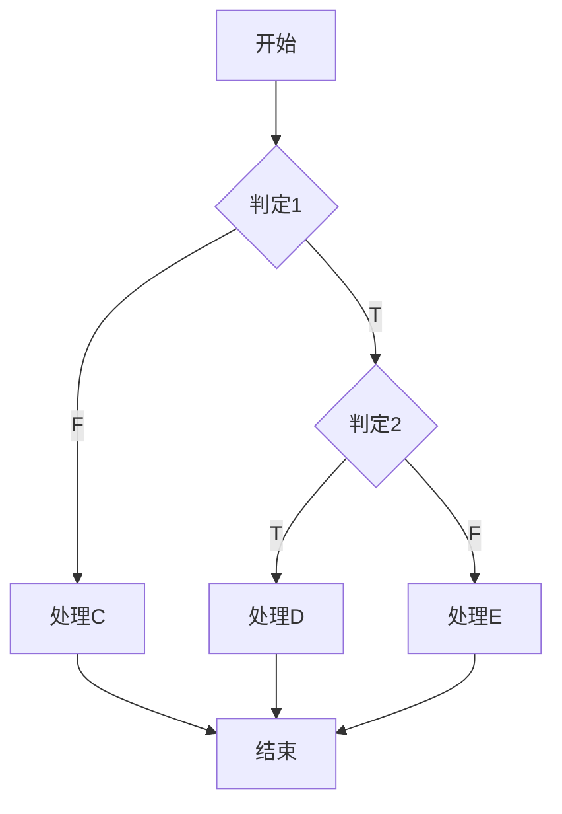
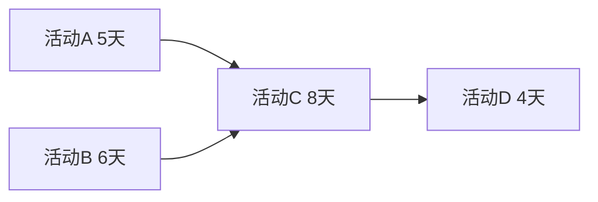
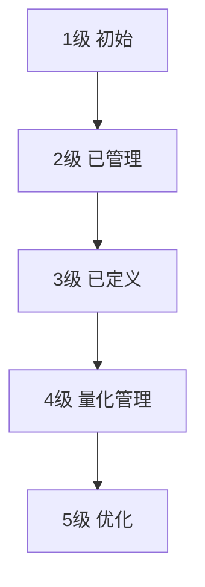

# 系统分析师｜第7章 软件工程（完整版备考讲义+章节自测题）

> 适配系统分析师（第2版教材），包含教材删减但真题持续考查内容；上午选择题备考讲义，部分考点支撑案例与论文。  
> 标签：系统分析师、上午题、软件工程、生命周期模型、内聚耦合、软件测试、CMMI、COCOMO、备考

[TOC]

## 模块1：软件工程概述与生命周期模型

**前置说明**：本章基于系统分析师第2版官方教材，增补第1版删减但历年真题、新考纲仍必考内容，适配上午综合选择题。  
**模块优先级**：🔴 最高优先级（过程模型对比高频）  
**考情分析**：每年1~2道选择题；核心：软件危机、生命周期、瀑布/原型/增量/螺旋模型特点、敏捷开发。

### 1.1 核心知识点精讲

#### 1.1.1 软件危机与软件工程

- **软件危机**：软件生产率低、质量差、成本高、维护困难、进度失控。
- **软件工程定义**（IEEE）：将系统化、规范化、可度量的方法应用于软件的开发、运行和维护，即工程化方法开发软件。
- **软件工程三要素**：过程、方法、工具。

#### 1.1.2 软件生命周期

可行性研究 → 需求分析 → 概要设计 → 详细设计 → 编码 → 测试 → 运行维护。

#### 1.1.3 过程模型对比（高频）

| 模型 | 特点 | 适用 |
| ---- | ---- | ---- |
| 瀑布模型 | 线性顺序、文档驱动、阶段不可回溯 | 需求明确稳定的项目 |
| 原型模型 | 快速构建原型、用户反馈驱动 | 需求不明确 |
| 增量模型 | 分批交付功能、逐步完善 | 核心功能优先交付 |
| 螺旋模型 | 风险驱动、每圈含风险分析 | 大型高风险项目 |
| 喷泉模型 | 面向对象、迭代无间隙 | OO开发 |

> 记忆：瀑布线性文档驱动；原型解决需求不明；螺旋强调风险分析；喷泉面向对象。

#### 1.1.4 敏捷开发（第2版强化）

- **敏捷宣言**：个体与交互重于流程工具；可工作软件重于详实文档；客户合作重于合同谈判；响应变化重于遵循计划。
- **XP极限编程**：结对编程、持续集成、测试驱动开发TDD、重构、简单设计。
- **Scrum**：产品待办列表（Product Backlog）、冲刺（Sprint）、每日站会、燃尽图。

#### 1.1.5 高频易错点

1. 螺旋模型核心是**风险驱动**；
2. 瀑布模型不适应需求频繁变化；
3. 喷泉模型专用于面向对象开发；
4. 敏捷强调可工作软件与响应变化。

### 1.2 典型配套例题（真题同源，带完整解析）

#### 例题1 螺旋模型特点

强调风险分析、每轮迭代都进行风险评估的软件过程模型是（）
A. 瀑布模型 B. 原型模型 C. 螺旋模型 D. 增量模型

> 【解析】螺旋模型是风险驱动的迭代模型，每圈都包含风险分析。  
> 【答案】C

#### 例题2 敏捷实践

下列属于XP极限编程实践的是（）
A. 瀑布式文档 B. 结对编程 C. 螺旋风险分析 D. 数据流图

> 【解析】XP核心实践：结对编程、持续集成、TDD、重构。  
> 【答案】B

#### 例题3 生命周期阶段顺序（由第01章绪论迁移）

软件生命周期中，可行性研究之后是（）
A. 需求分析 B. 概要设计 C. 编码 D. 测试

> 【解析】软件生命周期：可行性研究→需求分析→概要设计→详细设计→编码→测试→运行维护。可行性研究之后进入需求分析阶段。  
> 【答案】A

### 1.3 课后习题（带完整答案+解析）

**习题1**  
需求明确且稳定的项目最适合采用（）
A. 螺旋模型 B. 原型模型 C. 瀑布模型 D. 喷泉模型

> 答案：C  
> 解析：瀑布模型适合需求明确稳定的项目，线性文档驱动。

**习题2**  
Scrum中固定时长的迭代开发周期称为（）
A. Sprint B. Backlog C. 燃尽图 D. 看板

> 答案：A  
> 解析：Scrum中Sprint（冲刺）是固定时长的迭代周期。

---

## 模块2：软件需求工程

**前置说明**：本章基于系统分析师第2版官方教材，增补第1版删减但历年真题、新考纲仍必考内容，适配上午综合选择题。  
**模块优先级**：🟡 中等优先级  
**考情分析**：年均0~1道选择题；核心：需求分类、需求获取、DFD与用例、需求管理。

### 2.1 核心知识点精讲

#### 2.1.1 需求分类

- **功能需求**：系统必须提供的功能行为（如"用户可查询订单"）。
- **非功能需求**：性能、安全、可用性、可靠性、可维护性等约束（如"响应时间<2秒"）。

#### 2.1.2 需求获取方法

访谈、问卷调查、现场观察、原型法、用例分析、头脑风暴。

#### 2.1.3 需求分析建模

- **数据流图 DFD**：描述数据流向与加工；要素：数据流、加工、数据存储、外部实体。
- **数据字典 DD**：定义数据流图中各元素的含义与组成。
- **用例图**：从用户视角描述系统功能（参与者、用例、关系）。

#### 2.1.4 需求规格与验证

- **SRS 软件需求规格说明**：需求文档化的正式产物。
- 需求验证：需求评审、原型确认、测试用例推导。

#### 2.1.5 需求管理（重点）

- **需求变更控制**：变更申请→影响分析→CCB评审→批准→实施→验证。
- **需求跟踪矩阵**：建立需求与设计、代码、测试之间的双向跟踪。

> 易错：需求变更必须走变更控制流程，不能随意修改。

#### 2.1.6 高频易错点

1. 非功能需求包括性能、安全、可用性；
2. DFD要素：数据流、加工、数据存储、外部实体；
3. 需求变更需CCB评审控制；
4. 需求跟踪矩阵保障需求可追溯。

### 2.2 典型配套例题（真题同源，带完整解析）

#### 例题1 非功能需求

"系统应支持1000个并发用户"属于（）
A. 功能需求 B. 非功能需求 C. 业务规则 D. 用例

> 【解析】并发用户数是性能约束 → 非功能需求。  
> 【答案】B

#### 例题2 DFD要素

数据流图中，表示数据加工处理的是（）
A. 数据流 B. 加工 C. 数据存储 D. 外部实体

> 【解析】DFD四要素：数据流、加工（圆圈/圆角矩形）、数据存储、外部实体。  
> 【答案】B

### 2.3 课后习题（带完整答案+解析）

**习题1**  
下列属于需求管理活动的是（）
A. 编码 B. 需求变更控制 C. 白盒测试 D. 系统部署

> 答案：B  
> 解析：需求管理核心是变更控制与需求跟踪。

**习题2**  
描述系统数据流向与加工处理的需求分析模型是（）
A. 类图 B. 数据流图 C. 甘特图 D. 状态图

> 答案：B  
> 解析：DFD描述数据流向与加工，配套数据字典。

---

## 模块3：软件设计方法

**前置说明**：本章基于系统分析师第2版官方教材，增补第1版删减但历年真题、新考纲仍必考内容，适配上午综合选择题。  
**模块优先级**：🔴 最高优先级（内聚耦合必考）  
**考情分析**：每年1道左右选择题；核心：概要/详细设计、结构化设计、内聚与耦合判定、OO设计原则。

### 3.1 核心知识点精讲

#### 3.1.1 设计与划分

- **概要设计**：系统总体结构、模块划分、接口设计。
- **详细设计**：模块内部算法与数据结构、界面设计。

#### 3.1.2 结构化设计 SD

- 从**数据流图**导出**结构图**。
- **变换分析**：将变换型DFD（输入→变换→输出）映射为结构图。
- **事务分析**：将事务型DFD（多个处理路径）按事务中心映射为结构图。

#### 3.1.3 内聚（高频，重点）

**内聚**：模块内部各元素结合的紧密程度。由低到高：
**偶然内聚 < 逻辑内聚 < 时间内聚 < 过程内聚 < 通信内聚 < 顺序内聚 < 功能内聚**

| 类型 | 特征 |
| ---- | ---- |
| 偶然内聚 | 元素无关联，偶然凑在一起 |
| 逻辑内聚 | 执行逻辑上相似的功能 |
| 时间内聚 | 同一时间执行 |
| 过程内聚 | 按特定顺序执行 |
| 通信内聚 | 使用同一数据 |
| 顺序内聚 | 前一个输出是后一个输入 |
| 功能内聚 | 完成单一功能（最高） |

#### 3.1.4 耦合（高频，重点）

**耦合**：模块之间相互依赖的程度。由低到高：
**非直接耦合 < 数据耦合 < 标记耦合 < 控制耦合 < 外部耦合 < 公共耦合 < 内容耦合**

| 类型 | 特征 |
| ---- | ---- |
| 非直接耦合 | 模块间无直接联系 |
| 数据耦合 | 通过参数传递数据 |
| 标记耦合 | 传递数据结构（记录） |
| 控制耦合 | 传递控制信号（标志） |
| 外部耦合 | 共享外部数据格式/协议 |
| 公共耦合 | 共享公共数据区 |
| 内容耦合 | 一个模块直接访问另一个模块内部（最坏） |

> 记忆：设计原则=高内聚、低耦合；功能内聚最好、内容耦合最坏。

#### 3.1.5 面向对象设计原则

- **单一职责原则 SRP**：一个类只负责一个职责。
- **开闭原则 OCP**：对扩展开放、对修改关闭。
- **里氏替换原则 LSP**：子类可替换父类。
- **依赖倒置原则 DIP**：依赖抽象不依赖具体。
- **接口隔离原则 ISP**：使用多个专门接口。

#### 3.1.6 高频易错点

1. 内聚高好：功能内聚最高；耦合低好：数据耦合很低（非直接最低）；
2. 内容耦合最坏，功能内聚最好；
3. 变换分析/事务分析是DFD转结构图的方法；
4. OCP=对扩展开放对修改关闭。

### 3.2 典型配套例题（真题同源，带完整解析）

#### 例题1 内聚类型

模块内各元素按特定顺序执行，且前一个处理输出作为后一个处理输入，属于（）
A. 过程内聚 B. 顺序内聚 C. 通信内聚 D. 功能内聚

> 【解析】前一个输出是后一个输入 → 顺序内聚。  
> 【答案】B

#### 例题2 耦合类型

模块A通过参数向模块B传递一个控制标志，B根据标志选择执行路径，属于（）
A. 数据耦合 B. 标记耦合 C. 控制耦合 D. 公共耦合

> 【解析】传递控制信号改变执行路径 → 控制耦合。  
> 【答案】C

### 3.3 课后习题（带完整答案+解析）

**习题1**  
模块内部完成单一功能，内聚程度最高，属于（）
A. 通信内聚 B. 顺序内聚 C. 功能内聚 D. 逻辑内聚

> 答案：C  
> 解析：功能内聚完成单一功能，是最高内聚。

**习题2**  
模块之间共享公共数据区，属于（）
A. 数据耦合 B. 标记耦合 C. 公共耦合 D. 内容耦合

> 答案：C  
> 解析：共享公共数据区 → 公共耦合（耦合度较高）。

---

## 模块4：软件测试

**前置说明**：本章基于系统分析师第2版官方教材，增补第1版删减但历年真题、新考纲仍必考内容，适配上午综合选择题与计算题。  
**模块优先级**：🔴 最高优先级（白盒/黑盒、圈复杂度必考）  
**考情分析**：每年1~2道选择题/计算题；核心：测试目的、白盒覆盖、McCabe圈复杂度、黑盒方法、测试级别。

### 4.1 核心知识点精讲

#### 4.1.1 测试原则

- 测试目的是**发现错误**（证明缺陷存在），不是证明无错。
- 测试不能穷尽，需选择代表性用例。

#### 4.1.2 白盒测试（高频）

白盒测试（结构测试）：依据程序内部逻辑结构设计用例。

| 覆盖方法 | 覆盖目标 | 强度 |
| ---- | ---- | ---- |
| 语句覆盖 | 每条语句至少执行一次 | 最低 |
| 判定覆盖 | 每个判定的真假分支至少一次 | 中 |
| 条件覆盖 | 每个条件的真假取值至少一次 | 中 |
| 判定/条件覆盖 | 判定与条件都覆盖 | 较高 |
| 路径覆盖 | 每条可能路径至少一次 | 最高 |

> 记忆：覆盖强度：语句<判定<条件<判定/条件<路径。

#### 4.1.3 McCabe 圈复杂度（高频计算）

- **公式1**：V(G) = E − N + 2（E边数，N节点数）
- **公式2**：V(G) = 判定节点数 + 1
- 圈复杂度 = 独立路径数量，决定测试用例最少数量。

> 示例：上图判定节点2个 → V(G)=2+1=3，最少3条独立路径。

#### 4.1.4 黑盒测试（高频）

黑盒测试（功能测试）：依据需求规格设计用例，不关心内部结构。

- **等价类划分**：有效等价类+无效等价类。
- **边界值分析**：取边界值及其附近值测试（最易发现错误）。
- 错误推测、因果图法。

#### 4.1.5 测试级别与集成策略（高频）

- **单元测试**：模块级，多采用白盒。
- **集成测试**：模块间接口；策略：**自顶向下**（需要桩Stub）、**自底向上**（需要驱动Driver）、回归测试。
- **系统测试**：全系统功能/性能/安全测试。
- **验收测试**：α测试（开发环境、内部人员）、β测试（真实环境、用户）。

> 易错：自顶向下需要桩模块；自底向上需要驱动模块。

#### 4.1.6 高频易错点

1. 白盒看内部逻辑、黑盒看功能规格；
2. 边界值分析最易发现边界错误；
3. V(G)=E−N+2 或 判定数+1；
4. α测试在开发方、β测试在用户方。

### 4.2 典型配套例题（真题同源，带完整解析）

#### 例题1 圈复杂度计算

某程序流程图有E=10条边、N=8个节点，其中判定节点2个。McCabe圈复杂度为（）
A. 2 B. 3 C. 4 D. 5

> 【解析】V(G)=E−N+2=10−8+2=4；或判定节点数+1=2+1=3？两公式应一致。
> 注意：若E−N+2=4，则判定节点数应为3，题干"判定节点2个"与边数不一致时，以E−N+2为准（标准定义）。
> 严谨做法：V(G)=E−N+2=4。
> 【答案】C

#### 例题2 测试方法

针对"年龄输入范围为0~120"这一需求，设计测试用例取-1、0、60、120、121，主要采用了（）
A. 等价类划分 B. 边界值分析 C. 因果图 D. 错误推测

> 【解析】取边界值0、120及边界附近-1、121 → 边界值分析。  
> 【答案】B

#### 例题3 集成策略

自顶向下集成测试时，为模拟尚未开发的底层模块，需要编写（）
A. 驱动模块 B. 桩模块 C. 测试用例 D. 测试报告

> 【解析】自顶向下先测上层，需桩模块模拟下层未开发模块。  
> 【答案】B

### 4.3 课后习题（带完整答案+解析）

**习题1**  
要求程序中每个判定的真假分支都至少执行一次，属于（）
A. 语句覆盖 B. 判定覆盖 C. 条件覆盖 D. 路径覆盖

> 答案：B  
> 解析：判定覆盖要求每个判定真假分支至少执行一次。

**习题2**  
某程序判定节点数为4，其McCabe圈复杂度为（）
A. 3 B. 4 C. 5 D. 6

> 答案：C  
> 解析：V(G)=判定节点数+1=4+1=5。

**习题3**  
在真实用户环境、由用户执行的验收测试是（）
A. α测试 B. β测试 C. 单元测试 D. 冒烟测试

> 答案：B  
> 解析：β测试在真实环境由用户执行；α测试在开发环境。

---

## 模块5：软件维护与复用

**前置说明**：本章基于系统分析师第2版官方教材，增补第1版删减但历年真题、新考纲仍必考内容，适配上午综合选择题。  
**模块优先级**：🟡 中等优先级  
**考情分析**：年均0~1道选择题；核心：维护四类型、再工程/逆向工程、软件复用。

### 5.1 核心知识点精讲

#### 5.1.1 软件维护类型（高频）

1. **改正性维护**：修复运行中发现的缺陷错误。
2. **适应性维护**：适应外部环境变化（操作系统升级、硬件变化）。
3. **完善性维护**：增加新功能、改进性能——**占比最大**。
4. **预防性维护**：为将来维护方便进行的改进（重构、文档完善）。

> 记忆：改缺陷=改正性、改环境=适应性、加功能=完善性（最多）、防未来=预防性。

#### 5.1.2 再工程与逆向工程

- **正向工程**：从需求/设计到代码的传统开发方向。
- **逆向工程**：从代码出发，恢复设计/规格（理解已有系统）。
- **再工程**：对现有系统重构改造，提升可维护性（含逆向+正向）。
- **重构**：不改变外部行为，改善内部结构。

> 易错：逆向工程是"从代码到设计"；再工程=重构现有系统。

#### 5.1.3 软件复用

- **复用内容**：代码、构件、设计模式、需求、文档、测试用例。
- **构件（Component）**：可独立部署、可复用的软件单元。
- **领域工程**：在特定领域内系统化复用（领域分析、领域设计、领域实现）。

#### 5.1.4 高频易错点

1. 完善性维护占比最大；
2. 逆向工程从代码恢复设计，再工程含改造；
3. 重构不改变外部行为。

### 5.2 典型配套例题（真题同源，带完整解析）

#### 例题1 维护类型

操作系统升级后，修改软件以兼容新系统，属于（）
A. 改正性维护 B. 适应性维护 C. 完善性维护 D. 预防性维护

> 【解析】适应外部环境（系统）变化 → 适应性维护。  
> 【答案】B

#### 例题2 维护占比

软件维护中工作量占比最大的是（）
A. 改正性维护 B. 适应性维护 C. 完善性维护 D. 预防性维护

> 【解析】完善性维护（新增/改进功能）占比最大。  
> 【答案】C

### 5.3 课后习题（带完整答案+解析）

**习题1**  
修复软件运行中发现的缺陷，属于（）
A. 改正性维护 B. 适应性维护 C. 完善性维护 D. 预防性维护

> 答案：A  
> 解析：修复缺陷 → 改正性维护。

**习题2**  
从已有源代码出发，恢复其设计文档的过程称为（）
A. 正向工程 B. 逆向工程 C. 再工程 D. 集成测试

> 答案：B  
> 解析：逆向工程从代码恢复设计/规格。

---

## 模块6：软件项目管理

**前置说明**：本章基于系统分析师第2版官方教材，增补第1版删减但历年真题、新考纲仍必考内容，适配上午综合选择题与计算题。  
**模块优先级**：🔴 最高优先级（PERT、COCOMO、风险管理必考）  
**考情分析**：每年1~2道选择题/计算题；核心：进度管理PERT、成本估算COCOMO、风险管理、配置管理。

### 6.1 核心知识点精讲

#### 6.1.1 项目管理范围

范围、时间（进度）、成本、质量、人力资源、沟通、风险、采购、干系人管理。

#### 6.1.2 进度管理（高频）

- **甘特图**：横道图，直观但难以体现任务依赖关系。
- **PERT网络图**：活动网络，体现依赖关系。
  - 关键路径 = 工期最长的路径，决定项目最短工期。
  - 关键路径上的活动无浮动时间（松弛时间为0）。

> 示例：路径A-C-D=5+8+4=17天；B-C-D=6+8+4=18天 → 关键路径B-C-D，工期18天。

#### 6.1.3 成本估算 COCOMO（高频）

**COCOMO基本模型**：E = a × (KLOC)^b（人月）

| 类型 | 特点 | a | b |
| ---- | ---- | ---- | ---- |
| 有机型 | 小规模、经验团队、需求稳定 | 2.4 | 1.05 |
| 半独立型 | 中等规模、混合团队 | 3.0 | 1.12 |
| 嵌入型 | 大型复杂、严格约束（如实时系统） | 3.6 | 1.20 |

- 其他方法：功能点估算（按功能点数×生产率）、代码行估算（LOC）。

> 记忆：有机2.4/1.05、半独立3.0/1.12、嵌入3.6/1.20。

#### 6.1.4 风险管理

- **风险识别**：识别潜在风险（技术/管理/商业）。
- **风险分析**：评估概率与影响（风险暴露=概率×影响）。
- **风险应对**：规避、转移（外包/保险）、减轻、接受。

#### 6.1.5 配置管理（重点）

- **配置项 CI**：受控管理的软件工作产品（代码、文档、数据）。
- **基线**：经过评审、可作为后续开发基础、受变更控制的配置项集合。
- **变更控制委员会 CCB**：审批变更请求。
- 版本控制：记录配置项历史版本，防止"混乱"。

> 易错：基线后变更必须走CCB审批流程。

#### 6.1.6 高频易错点

1. 关键路径=最长路径，决定最短工期；
2. COCOMO三类型参数要记牢；
3. 风险应对四策略：规避/转移/减轻/接受；
4. 基线变更需CCB审批。

### 6.2 典型配套例题（真题同源，带完整解析）

#### 例题1 关键路径

项目活动：A(3天)→C(5天)，B(4天)→C(5天)，C→D(2天)。项目最短工期为（）
A. 8天 B. 10天 C. 11天 D. 12天

> 【解析】路径A-C-D=3+5+2=10天；B-C-D=4+5+2=11天。关键路径为B-C-D，工期11天。  
> 【答案】C

#### 例题2 COCOMO 估算

某实时嵌入式系统估算规模为100 KLOC，应采用COCOMO基本模型中的（）
A. 有机型 B. 半独立型 C. 嵌入型 D. 增量型

> 【解析】实时嵌入式系统属于严格约束的大型复杂系统 → 嵌入型。  
> 【答案】C

#### 例题3 配置管理

经评审后正式发布、后续变更需经CCB审批的配置项集合称为（）
A. 版本 B. 基线 C. 变更 D. 里程碑

> 【解析】基线是受变更控制的配置项集合。  
> 【答案】B

### 6.3 课后习题（带完整答案+解析）

**习题1**  
某项目活动：A(4)→C(6)，B(5)→C(6)，C→D(3)。关键路径是（）
A. A-C-D B. B-C-D C. A-B-D D. A-B-C-D

> 答案：B  
> 解析：A-C-D=4+6+3=13；B-C-D=5+6+3=14 → 关键路径B-C-D。

**习题2**  
小型项目、经验丰富团队、需求稳定，COCOMO应采用（）
A. 有机型 B. 半独立型 C. 嵌入型 D. 嵌入式

> 答案：A  
> 解析：有机型适用小规模、经验团队、需求稳定。

**习题3**  
将风险转移给第三方（如购买保险、外包），属于风险应对的（）
A. 规避 B. 转移 C. 减轻 D. 接受

> 答案：B  
> 解析：风险转移：通过保险/外包等将风险影响转移。

---

## 模块7：软件质量与过程改进

**前置说明**：本章基于系统分析师第2版官方教材，增补第1版删减但历年真题、新考纲仍必考内容，适配上午综合选择题。  
**模块优先级**：🟡 中等优先级  
**考情分析**：年均0~1道选择题；核心：ISO 9126质量模型、CMMI等级、软件度量。

### 7.1 核心知识点精讲

#### 7.1.1 软件质量模型（高频）

**ISO/IEC 9126 质量特性**：
1. **功能性**：满足功能需求。
2. **可靠性**：故障率低、容错。
3. **易用性**：易学易用。
4. **效率**：时间/资源利用率。
5. **可维护性**：易修改。
6. **可移植性**：跨平台迁移。

> 记忆：功能、可靠、易用、效率、可维护、可移植（六特性）。

#### 7.1.2 SQA 与质量控制

- **软件质量保证 SQA**：过程层面的保证活动（评审、审计、标准）。
- **质量控制 QC**：产品层面的检测活动（测试、检查）。

#### 7.1.3 CMMI 能力成熟度模型（高频）

| 等级 | 名称 | 特征 |
| ---- | ---- | ---- |
| 1级 | 初始级 | 过程混乱、依赖个人 |
| 2级 | 已管理级 | 项目级管理（需求/计划/配置受控） |
| 3级 | 已定义级 | 组织级标准过程 |
| 4级 | 量化管理级 | 过程量化度量与控制 |
| 5级 | 优化级 | 持续改进、过程创新 |

> 记忆：初始→已管理→已定义→量化管理→优化（1~5级递增）。

#### 7.1.4 软件度量

- **规模度量**：代码行LOC、功能点FP。
- **复杂度度量**：McCabe圈复杂度、Halstead度量。
- **质量度量**：缺陷密度、测试覆盖率。

#### 7.1.5 DevOps（第2版强化）

DevOps：开发（Dev）与运维（Ops）一体化，强调持续集成CI、持续交付CD、自动化部署、监控反馈。

#### 7.1.6 高频易错点

1. ISO 9126六特性要能识别；
2. CMMI等级顺序与特征要匹配（3级=组织级标准过程）；
3. SQA管过程、QC管产品；
4. DevOps=开发运维一体化。

### 7.2 典型配套例题（真题同源，带完整解析）

#### 例题1 质量特性

"软件在故障发生后能恢复到正常状态继续运行"体现的质量特性是（）
A. 功能性 B. 可靠性 C. 易用性 D. 效率

> 【解析】容错、故障恢复 → 可靠性。  
> 【答案】B

#### 例题2 CMMI 等级

CMMI中，组织建立了标准软件过程并在组织范围内推广，属于（）
A. 2级已管理 B. 3级已定义 C. 4级量化管理 D. 5级优化

> 【解析】组织级标准过程 → 3级已定义。  
> 【答案】B

### 7.3 课后习题（带完整答案+解析）

**习题1**  
"软件在不同平台间可移植运行"体现的质量特性是（）
A. 可维护性 B. 可移植性 C. 效率 D. 易用性

> 答案：B  
> 解析：跨平台迁移能力 → 可移植性。

**习题2**  
CMMI最高等级是（）
A. 已管理级 B. 已定义级 C. 量化管理级 D. 优化级

> 答案：D  
> 解析：5级优化级，持续改进、过程创新。

---

# 章节总复习综合模拟题（覆盖全部7模块，含答案与解析）

> 说明：题型贴合系统分析师上午真题风格，包含选择+计算，覆盖模块1~7所有核心考点；可直接放在讲义末尾作为章节自测。

## 一、单项选择题（16题）

> 说明：第16题由第01章绪论迁移而来（软件生命周期阶段顺序，第2版属本章内容）。

1. 以风险分析为核心驱动力的软件过程模型是（）
A. 瀑布模型 B. 原型模型 C. 螺旋模型 D. 增量模型
> 答案：C

2. 结对编程、测试驱动开发属于（）的实践
A. 瀑布开发 B. XP极限编程 C. 螺旋模型 D. 喷泉模型
> 答案：B

3. "系统响应时间不超过2秒"属于（）
A. 功能需求 B. 非功能需求 C. 业务用例 D. 数据流
> 答案：B

4. 数据流图DFD的基本要素不包括（）
A. 数据流 B. 加工 C. 数据字典 D. 外部实体
> 答案：C

5. 模块内各元素按特定顺序执行、前一个输出是后一个输入，属于（）
A. 过程内聚 B. 顺序内聚 C. 通信内聚 D. 逻辑内聚
> 答案：B

6. 模块间通过参数传递控制标志、影响对方执行路径，属于（）
A. 数据耦合 B. 标记耦合 C. 控制耦合 D. 内容耦合
> 答案：C

7. 要求每条独立路径至少执行一次，覆盖强度最高的白盒方法是（）
A. 语句覆盖 B. 判定覆盖 C. 条件覆盖 D. 路径覆盖
> 答案：D

8. 某程序判定节点数为3，McCabe圈复杂度为（）
A. 2 B. 3 C. 4 D. 5
> 答案：C

9. 针对输入范围0~100，设计用例取-1、0、50、100、101，主要采用（）
A. 等价类划分 B. 边界值分析 C. 错误推测 D. 因果图
> 答案：B

10. 自底向上集成测试需要编写（）
A. 桩模块 B. 驱动模块 C. 测试计划 D. 基线
> 答案：B

11. 软件升级以兼容新的操作系统，属于（）
A. 改正性维护 B. 适应性维护 C. 完善性维护 D. 预防性维护
> 答案：B

12. 从源代码恢复设计文档的过程属于（）
A. 正向工程 B. 逆向工程 C. 再工程 D. 重构
> 答案：B

13. 项目活动A(3)→C(4)，B(5)→C(4)，C→D(2)，关键路径工期为（）
A. 9天 B. 10天 C. 11天 D. 12天
> 答案：C

14. 大型复杂、严格约束的实时系统，COCOMO应选用（）
A. 有机型 B. 半独立型 C. 嵌入型 D. 基础型
> 答案：C

15. CMMI中"组织建立标准过程并推广"属于（）
A. 2级已管理 B. 3级已定义 C. 4级量化管理 D. 5级优化
> 答案：B

16. 软件生命周期中，需求分析之后是（）
A. 概要设计 B. 编码 C. 测试 D. 维护
> 答案：A
> 解析：软件生命周期：可行性→需求分析→概要设计→详细设计→编码→测试→运行维护。

## 二、计算题（5道，真题风格）

> 说明：计算题5【生命周期阶段评估】由第01章绪论迁移而来。

### 计算题1【McCabe圈复杂度】

某程序控制流图有 E=12 条边、N=9 个节点。求圈复杂度，并说明最少需要的独立路径测试用例数。
> 【解析】V(G)=E−N+2=12−9+2=5。
> 最少需要5个独立路径测试用例（独立路径数=圈复杂度）。
> 答案：V(G)=5，最少5个用例

### 计算题2【COCOMO成本估算】

某有机型项目规模约 20 KLOC，COCOMO基本模型 E=a×(KLOC)^b（有机型 a=2.4，b=1.05）。估算开发工作量（人月，结果保留1位小数）。
> 【解析】E=2.4×(20)^1.05。20^1.05 ≈ e^(1.05×ln20)=e^(1.05×2.9957)=e^3.1455≈23.24。
> E≈2.4×23.24≈55.8人月。
> 答案：约55.8人月

### 计算题3【关键路径】

项目活动依赖：A(4天)→C(6天)、B(5天)→C(6天)、C(6天)→D(3天)。求关键路径与项目最短工期。
> 【解析】路径1：A-C-D=4+6+3=13天；路径2：B-C-D=5+6+3=14天。
> 关键路径为B-C-D（最长路径），最短工期14天。
> 答案：关键路径B-C-D，工期14天

### 计算题4【内聚耦合判定】

模块M包含三个处理：初始化变量、读取输入、输出结果，三者仅在"同时执行"上有联系。判定其内聚类型；若模块P直接访问模块Q的内部数据，判定其耦合类型。
> 【解析】仅因同时执行而结合 → 时间内聚。
> 直接访问对方内部数据 → 内容耦合（耦合度最高）。
> 答案：时间内聚；内容耦合

### 计算题5【生命周期阶段评估】（由第01章绪论迁移）

某信息系统项目已完需求分析，进入设计阶段，预计实施6个月、测试2个月、上线试运行3个月。请回答：①当前处于软件生命周期第几阶段；②距离系统正式验收还需约多少个月。
> 【解析】
> ①软件生命周期：可行性→需求分析→概要设计→详细设计→编码→测试→运行维护；已完成需求分析，处于概要设计阶段。
> ②剩余=实施6+测试2+试运行3=11个月。
> 答案：概要设计阶段；约11个月

## 三、简答概念题（4道）

> 说明：原简答4（软件生命周期）由第01章绪论迁移而来。

1. 简述瀑布模型与螺旋模型的主要区别
> 【解析】瀑布模型：线性顺序、文档驱动、阶段严格不可回溯，适合需求明确稳定的项目；螺旋模型：风险驱动、迭代循环，每圈包含目标设定、风险分析、开发验证、评审，适合大型高风险项目。螺旋模型比瀑布更强调风险管理和需求演化。

2. 简述白盒测试与黑盒测试的区别及常用方法
> 【解析】白盒测试（结构测试）：依据程序内部逻辑结构设计用例，常用语句覆盖、判定覆盖、条件覆盖、路径覆盖，用McCabe圈复杂度度量；黑盒测试（功能测试）：依据需求规格设计用例，不关心内部结构，常用等价类划分、边界值分析、错误推测、因果图。白盒用于单元测试，黑盒用于功能/系统测试。

3. 简述CMMI五级成熟度模型
> 【解析】1级初始级：过程混乱依赖个人；2级已管理级：项目级管理受控；3级已定义级：组织级标准过程建立；4级量化管理级：过程量化度量与控制；5级优化级：持续改进与过程创新。等级越高，过程能力越成熟、质量越有保障。

4. 简述软件生命周期各阶段及主要任务（由第01章绪论迁移）
> 【解析】软件生命周期：可行性研究（技术/经济可行性评估）→需求分析（需求获取与SRS规格）→概要设计（总体结构与接口）→详细设计（模块内算法与数据结构）→编码（实现）→测试（发现错误）→运行维护（改正/适应/完善/预防性维护）。各阶段层层递进、可迭代反馈。
