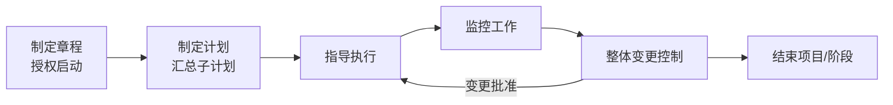
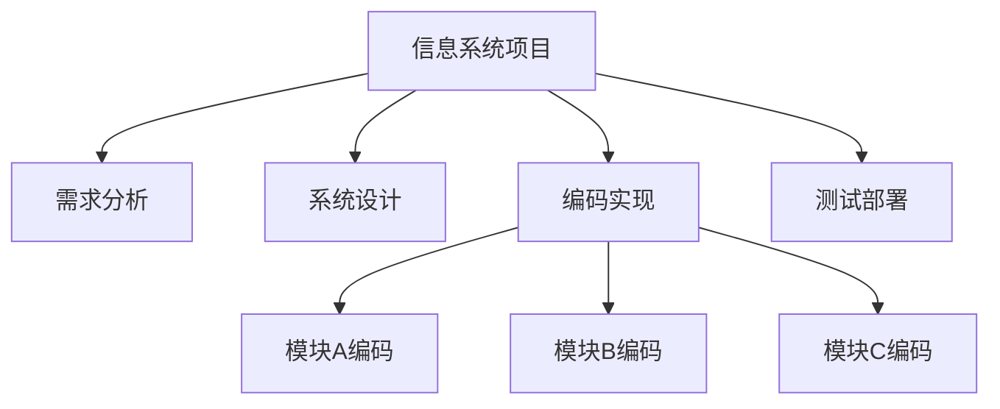
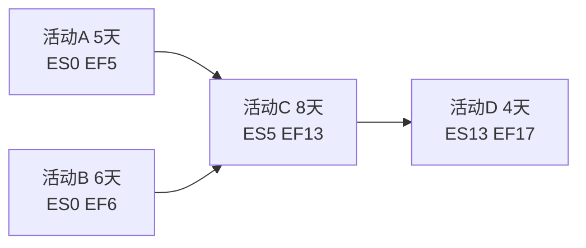
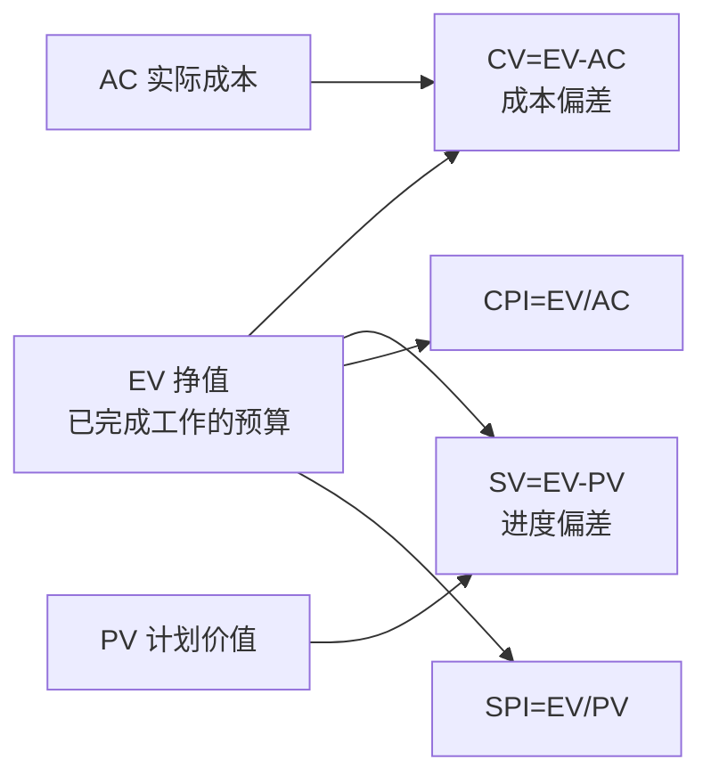
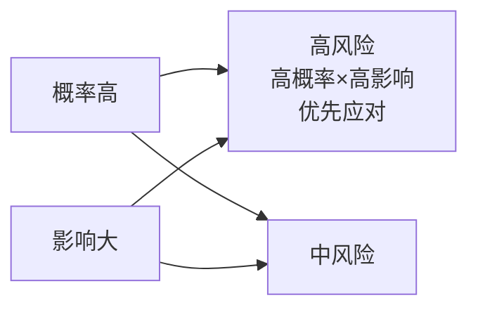
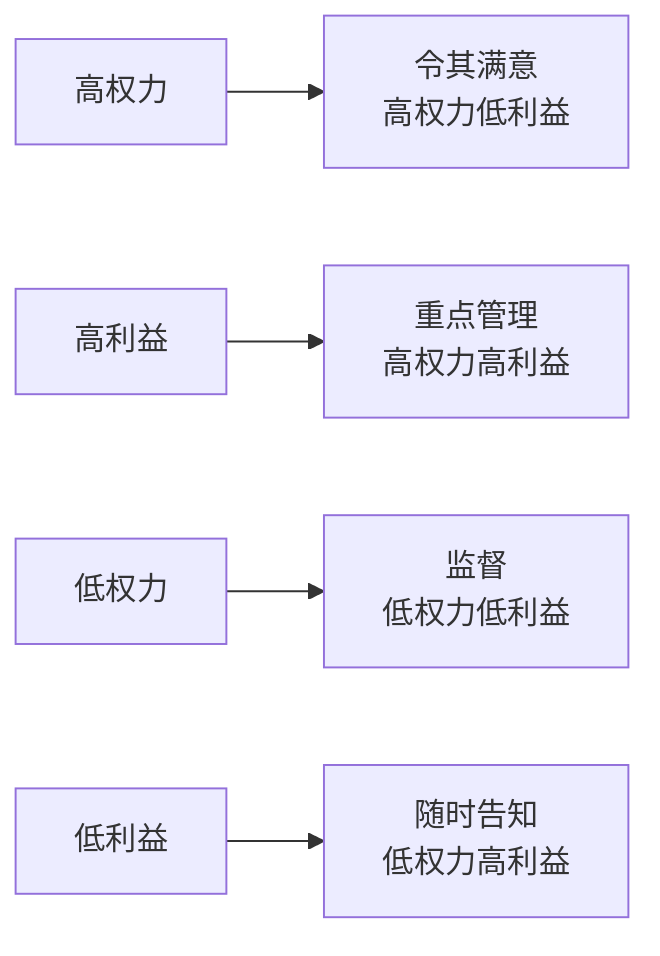

# 系统分析师｜第8章 项目管理（完整版备考讲义+章节自测题）

> 适配系统分析师（第2版教材），包含教材删减但真题持续考查内容；上午选择题+案例题备考讲义，论文高频素材。  
> 标签：系统分析师、上午题、项目管理、挣值管理、关键路径、风险管理、WBS、备考

[TOC]

## 模块1：项目管理基础与整体管理

**前置说明**：本章基于系统分析师第2版官方教材，增补第1版删减但历年真题、新考纲仍必考内容，适配上午综合选择题与案例题。  
**模块优先级**：🟡 中等优先级  
**考情分析**：年均0~1道选择题；核心：项目特征、项目集/组合区分、整体管理过程、变更控制。

### 1.1 核心知识点精讲

#### 1.1.1 项目的基本概念

- **项目**：为创造独特的产品、服务或成果而进行的**临时性**工作。
- 项目特征：**临时性**（有明确开始结束）、**独特性**（每次不同）、**渐进明细**（逐步完善）。
- 区分：
  - **项目集**：一组相互关联、协调管理的项目（如"智慧城市"项目集）。
  - **项目组合**：为战略目标而组合管理的一组项目/项目集（按优先级分配资源）。
  - **运营**：持续重复的活动（与项目不同，无临时性）。

> 易错：项目临时性≠成果临时，成果可长期存在；项目集关注项目间依赖，组合关注战略优先级。

#### 1.1.2 项目整体管理

项目整体管理过程（五大过程组贯穿）：
1. **制定项目章程**：授权项目开始，任命项目经理。
2. **制定项目管理计划**：汇总各子计划。
3. **指导与管理项目执行**：按计划执行。
4. **监控项目工作**：跟踪、审查、报告进展。
5. **实施整体变更控制**：变更统一入口，评审与批准。
6. **结束项目或阶段**：收尾、移交、归档。

> 记忆：章程启动→计划→执行→监控→变更控制→收尾。

#### 1.1.3 变更控制

- **CCB 变更控制委员会**：审批变更请求的权威机构。
- 变更流程：变更申请 → 影响分析 → CCB评审 → 批准/拒绝 → 实施 → 验证 → 更新基线。
- 原则：变更必须走统一流程，不能"先斩后奏"。

#### 1.1.4 高频易错点

1. 项目临时性指"工作临时"，成果长期；
2. 项目集管"相互关联项目"，组合管"战略优先级"；
3. 变更批准权在CCB；
4. 章程授权项目经理并正式启动项目。

### 1.2 典型配套例题（真题同源，带完整解析）

#### 例题1 项目特征

下列关于项目的说法正确的是（）
A. 项目成果是临时的 B. 项目具有临时性、独特性、渐进明细 C. 项目可无限期进行 D. 项目没有明确目标

> 【解析】项目三特征：临时性、独特性、渐进明细。  
> 【答案】B

#### 例题2 整体管理

正式授权项目开始、任命项目经理的文件是（）
A. 项目管理计划 B. 项目章程 C. WBS D. 需求规格说明

> 【解析】项目章程授权项目启动并任命项目经理。  
> 【答案】B

### 1.3 课后习题（带完整答案+解析）

**习题1**  
一组相互关联、需要协调管理的项目集合称为（）
A. 项目组合 B. 项目集 C. 运营 D. 程序

> 答案：B  
> 解析：项目集=相互关联协调管理的项目集合；组合=按战略优先级管理。

**习题2**  
项目变更请求的最终审批机构是（）
A. 项目经理 B. 客户 C. CCB变更控制委员会 D. 开发团队

> 答案：C  
> 解析：CCB负责审批变更请求。

---

## 模块2：范围管理

**前置说明**：本章基于系统分析师第2版官方教材，增补第1版删减但历年真题、新考纲仍必考内容，适配上午综合选择题与案例题。  
**模块优先级**：🔴 最高优先级（WBS与范围蔓延辨析必考）  
**考情分析**：每年1道左右选择题；核心：WBS原则、范围确认与控制、范围蔓延vs镀金。

### 2.1 核心知识点精讲

#### 2.1.1 范围管理过程

规划范围管理 → 收集需求 → 定义范围（范围说明书） → **创建WBS** → **确认范围**（验收） → **控制范围**。

#### 2.1.2 WBS 工作分解结构（高频）

- WBS：把项目可交付成果**分解为更小、更易管理的组成部分**的层级结构。
- WBS 原则：
  - 面向**可交付成果**分解（不是按活动/部门）；
  - **100%原则**：WBS必须完整覆盖全部工作；
  - **8/80原则**：工作包大小建议8~80小时；
  - 最底层称为**工作包**，可分配责任。

> 记忆：WBS是"可交付物"树，不是活动清单。

#### 2.1.3 范围确认 vs 范围控制

- **确认范围（范围验证）**：正式验收已完成的可交付成果（与客户签字确认）。
- **控制范围**：监控范围变更，防止范围蔓延。

#### 2.1.4 范围蔓延与镀金（高频辨析）

- **范围蔓延**：未经控制的**范围扩大**（客户/干系人不断加需求，未走变更流程）。
- **镀金**：**团队成员**自己添加未要求的额外功能（超出范围）。

> 易错：蔓延=外部需求失控加入；镀金=内部主动画蛇添足。

#### 2.1.5 高频易错点

1. WBS按可交付物分解，100%原则；
2. 确认范围=验收可交付成果；
3. 蔓延是外部加需求、镀金是内部加功能；
4. 控制范围防止蔓延，变更走CCB。

### 2.2 典型配套例题（真题同源，带完整解析）

#### 例题1 WBS 原则

关于WBS工作分解结构，下列说法错误的是（）
A. 面向可交付成果分解 B. 必须完整覆盖全部工作 C. 按部门职能分解 D. 最底层为工作包

> 【解析】WBS面向可交付成果，不是按部门职能分解。  
> 【答案】C

#### 例题2 范围蔓延

客户不断口头提出新功能要求，开发团队直接实现，导致项目范围不断扩大且未走变更流程，属于（）
A. 镀金 B. 范围蔓延 C. 范围确认 D. 范围基准

> 【解析】外部需求未控加入 → 范围蔓延；内部主动加功能才是镀金。  
> 【答案】B

### 2.3 课后习题（带完整答案+解析）

**习题1**  
开发人员自行给系统添加客户未要求的导出功能，属于（）
A. 范围蔓延 B. 镀金 C. 范围确认 D. 偏差

> 答案：B  
> 解析：团队内部主动加额外功能 → 镀金。

**习题2**  
正式验收项目可交付成果的过程是（）
A. 控制范围 B. 确认范围 C. 定义范围 D. 创建WBS

> 答案：B  
> 解析：确认范围=正式验收可交付成果。

---

## 模块3：进度管理

**前置说明**：本章基于系统分析师第2版官方教材，增补第1版删减但历年真题、新考纲仍必考内容，适配上午综合选择题与计算题。  
**模块优先级**：🔴 最高优先级（关键路径、时差计算必考）  
**考情分析**：每年1道左右选择题/计算题；核心：PDM/ADM、关键路径CPM、总时差自由时差、进度压缩。

### 3.1 核心知识点精讲

#### 3.1.1 进度管理过程

规划进度管理 → 定义活动 → 排列活动顺序 → 估算活动资源 → 估算活动持续时间 → 制定进度计划 → 控制进度。

#### 3.1.2 网络图（高频）

- **PDM 前导图（单代号）**：节点表示活动，箭头表示依赖关系；常用FS（完成-开始）。
- **ADM 箭线图（双代号）**：箭线表示活动，节点表示事件；可能出现**虚活动**（不消耗资源，表示逻辑关系）。

#### 3.1.3 关键路径法 CPM（高频计算）

- **关键路径**：项目网络图中**工期最长**的路径。
- 关键路径决定项目最短工期；关键路径上的活动**总时差=0**。
- **总时差 TF**：活动可推迟而不影响**项目总工期**的时间。
  - TF = 最迟开始LS − 最早开始ES = 最迟完成LF − 最早完成EF
- **自由时差 FF**：活动可推迟而不影响**紧后活动最早开始**的时间。
  - FF = 紧后活动ES − 本活动EF

> 示例：A-C-D=5+8+4=17天；B-C-D=6+8+4=18天。关键路径B-C-D，工期18天；C的ES=6（受B制约）。

#### 3.1.4 资源与进度压缩

- **资源平衡**：调整活动时间消除资源过度分配（可能延长工期）。
- **资源平滑**：在总工期不变内调整。
- **进度压缩**：
  - **赶工**：增加资源缩短工期（增加成本，不改变逻辑关系）。
  - **快速跟进**：并行执行原本串行的活动（改变逻辑关系，增加风险）。

> 易错：赶工加钱不改变依赖；快速跟进改变依赖增加返工风险。

#### 3.1.5 高频易错点

1. 关键路径=最长路径，总时差0；
2. 总时差不影响总工期；自由时差不影响紧后活动；
3. 赶工增加资源；快速跟进并行；
4. 虚活动只表逻辑，不耗资源。

### 3.2 典型配套例题（真题同源，带完整解析）

#### 例题1 关键路径计算

项目活动：A(4)→C(7)，B(5)→C(7)，C→D(3)。关键路径与工期为（）
A. A-C-D，14天 B. B-C-D，15天 C. A-C-D，15天 D. B-C-D，14天

> 【解析】A-C-D=4+7+3=14；B-C-D=5+7+3=15。关键路径B-C-D，工期15天。  
> 【答案】B

#### 例题2 进度压缩

通过增加资源（加班、加人）来压缩工期、但不改变活动逻辑关系的方法称为（）
A. 快速跟进 B. 赶工 C. 资源平衡 D. 关键链

> 【解析】赶工=增加资源压缩工期，不改变逻辑关系。  
> 【答案】B

### 3.3 课后习题（带完整答案+解析）

**习题1**  
某活动最早开始ES=3，最迟开始LS=8，其总时差为（）
A. 3 B. 5 C. 8 D. 11

> 答案：B  
> 解析：TF=LS−ES=8−3=5。

**习题2**  
将原本串行的两个活动改为并行执行以压缩工期，属于（）
A. 赶工 B. 快速跟进 C. 资源平滑 D. 关键路径

> 答案：B  
> 解析：并行执行串行活动 → 快速跟进（增加返工风险）。

---

## 模块4：成本管理

**前置说明**：本章基于系统分析师第2版官方教材，增补第1版删减但历年真题、新考纲仍必考内容，适配上午综合选择题与计算题。  
**模块优先级**：🔴 最高优先级（挣值EVM计算必考）  
**考情分析**：每年1~2道计算题；核心：PV/EV/AC、CV/SV/CPI/SPI、EAC典型/非典型、储备。

### 4.1 核心知识点精讲

#### 4.1.1 成本管理过程

规划成本管理 → 估算成本 → 制定预算 → 控制成本。

- **估算成本**：对完成活动所需资源的成本近似估算。
- **制定预算**：汇总估算，形成**成本基准**（经批准的分阶段预算）。

#### 4.1.2 挣值管理 EVM（高频计算核心）

三个基本指标：
- **PV 计划价值**：截至某时点，按计划应完成的**预算价值**。
- **EV 挣值**：截至某时点，**实际完成工作**对应的预算价值。
- **AC 实际成本**：截至某时点，实际花费的成本。

偏差指标：
- **CV 成本偏差 = EV − AC**（>0 成本节约，<0 成本超支）
- **SV 进度偏差 = EV − PV**（>0 进度超前，<0 进度落后）

绩效指数：
- **CPI 成本绩效指数 = EV / AC**（>1 成本效率好，<1 成本超支）
- **SPI 进度绩效指数 = EV / PV**（>1 进度超前，<1 进度落后）

> 记忆：偏差=EV减（EV−AC成本、EV−PV进度）；指数=EV除（EV/AC成本、EV/PV进度）。

#### 4.1.3 完工估算 EAC（高频计算）

- **非典型偏差**（当前偏差是偶然的，后续按原计划执行）：
  - EAC = AC + (BAC − EV)
- **典型偏差**（当前偏差持续，按当前CPI延续）：
  - EAC = BAC / CPI
- **ETC 完工尚需估算** = EAC − AC
- **VAC 完工偏差** = BAC − EAC

> 记忆：非典型=补上缺口；典型=按效率外推（BAC÷CPI）。

#### 4.1.4 成本储备

- **应急储备**：应对"已知的未知"风险，纳入成本基准，项目经理可支配。
- **管理储备**：应对"未知的未知"风险，不纳入成本基准，需高层批准。

> 易错：应急储备在基准内；管理储备在基准外。

#### 4.1.5 高频易错点

1. CV=EV−AC、SV=EV−PV（都用EV减）；
2. CPI=EV/AC、SPI=EV/PV（都用EV除）；
3. 非典型EAC=AC+BAC−EV；典型EAC=BAC/CPI；
4. 应急储备属基准、管理储备不属基准。

### 4.2 典型配套例题（真题同源，带完整解析）

#### 例题1 挣值指标

某项目到检查点：PV=100万，EV=90万，AC=95万。则CV和SV分别为（）
A. −5万，−10万 B. 5万，10万 C. −10万，−5万 D. 10万，5万

> 【解析】CV=EV−AC=90−95=−5万；SV=EV−PV=90−100=−10万。成本超支、进度落后。  
> 【答案】A

#### 例题2 EAC 计算

项目BAC=200万，当前CPI=0.8，若偏差持续（典型），EAC为（）
A. 160万 B. 200万 C. 250万 D. 240万

> 【解析】典型偏差 EAC=BAC/CPI=200/0.8=250万。  
> 【答案】C

#### 例题3 储备类型

应对"已知的未知"风险、纳入成本基准、项目经理可直接支配的储备是（）
A. 管理储备 B. 应急储备 C. 固定储备 D. 风险储备

> 【解析】应急储备应对已知的未知，纳入基准；管理储备应对未知的未知。  
> 【答案】B

### 4.3 课后习题（带完整答案+解析）

**习题1**  
某项目EV=80万，AC=100万，则CPI为（）
A. 1.25 B. 0.8 C. 1.2 D. 0.75

> 答案：B  
> 解析：CPI=EV/AC=80/100=0.8<1，成本超支。

**习题2**  
项目BAC=500万，到检查点AC=200万，EV=180万。若偏差非典型，EAC为（）
A. 520万 B. 500万 C. 480万 D. 550万

> 答案：A  
> 解析：非典型 EAC=AC+(BAC−EV)=200+(500−180)=520万。

---

## 模块5：质量管理

**前置说明**：本章基于系统分析师第2版官方教材，增补第1版删减但历年真题、新考纲仍必考内容，适配上午综合选择题。  
**模块优先级**：🟡 中等优先级  
**考情分析**：年均0~1道选择题；核心：质量成本COQ、七大质量工具、质量审计。

### 5.1 核心知识点精讲

#### 5.1.1 质量管理过程

1. **规划质量管理**：确定质量标准与如何满足。
2. **管理质量**（质量保证）：审计质量要求、过程改进。
3. **控制质量**：检测可交付成果，识别缺陷。

#### 5.1.2 质量成本 COQ（高频）

- **预防成本**：为预防缺陷投入（培训、设计评审）——**投入最少、收益最大**。
- **评估成本**：检测评估（测试、检查）。
- **内部失败成本**：交付前发现缺陷的返工成本。
- **外部失败成本**：交付后缺陷导致的成本（索赔、召回）——**代价最高**。

> 记忆：预防 > 评估 > 内部失败 > 外部失败（成本递增）。

#### 5.1.3 七大质量工具（高频识别）

- **因果图（鱼骨图/石川图）**：分析问题原因。
- **帕累托图**：二八法则，识别关键少数。
- **控制图**：监控过程是否受控（上下控制限）。
- **直方图**：数据分布。
- **散点图**：两变量相关性。
- **检查表**：收集数据。
- **流程图**：过程步骤。

> 易错：因果图找原因、帕累托找重点、控制图看过程稳定。

#### 5.1.4 质量审计

管理质量（QA）的活动：独立审查项目是否符合质量政策，识别改进机会，不用于缺陷检测。

#### 5.1.5 高频易错点

1. 预防成本最低、外部失败成本最高；
2. 因果图找根因、帕累托定重点（80/20）；
3. 质量审计属于管理质量（过程），控制质量（产品）才测缺陷；
4. 质量是"规划"出来的，不是"检验"出来的。

### 5.2 典型配套例题（真题同源，带完整解析）

#### 例题1 质量工具

用于识别"少数关键原因贡献了多数问题"（二八法则）的工具是（）
A. 因果图 B. 帕累托图 C. 控制图 D. 散点图

> 【解析】帕累托图体现二八法则，定位关键少数。  
> 【答案】B

#### 例题2 质量成本

产品交付给客户后发现缺陷并召回，产生的成本属于（）
A. 预防成本 B. 评估成本 C. 内部失败成本 D. 外部失败成本

> 【解析】交付后缺陷导致 → 外部失败成本（代价最高）。  
> 【答案】D

### 5.3 课后习题（带完整答案+解析）

**习题1**  
分析问题产生的根本原因，适合使用的工具是（）
A. 因果图 B. 直方图 C. 控制图 D. 帕累托图

> 答案：A  
> 解析：因果图（鱼骨图）用于分析问题根因。

**习题2**  
质量审计属于下列哪个过程的活动（）
A. 规划质量管理 B. 管理质量 C. 控制质量 D. 收尾

> 答案：B  
> 解析：质量审计是管理质量（质量保证）的典型活动。

---

## 模块6：风险管理

**前置说明**：本章基于系统分析师第2版官方教材，增补第1版删减但历年真题、新考纲仍必考内容，适配上午综合选择题与案例题。  
**模块优先级**：🔴 最高优先级（风险应对策略辨析+EMV计算必考）  
**考情分析**：每年1道左右选择题/计算题；核心：风险过程、定性/定量分析、应对策略、EMV。

### 6.1 核心知识点精讲

#### 6.1.1 风险管理过程

规划风险管理 → 识别风险 → 定性风险分析 → 定量风险分析 → 规划风险应对 → 实施风险应对 → 监督风险。

#### 6.1.2 定性 vs 定量风险分析

- **定性风险分析**：按**概率×影响**排序风险优先级，快速主观判断。
- **定量风险分析**：数值化分析（**EMV预期货币价值**、蒙特卡洛模拟、决策树）。

#### 6.1.3 概率影响矩阵（高频）

- 横轴=影响、纵轴=概率（或反之），交叉单元格表示风险等级。
- 高概率×高影响 = **高风险**（红色区域，优先应对）。
- 低概率×低影响 = 低风险。

#### 6.1.4 EMV 预期货币价值（高频计算）

**EMV = 概率 × 影响（货币值）**

- 机会（正向影响）取正值；威胁（负向影响）取负值。
- 决策树中：各分支EMV求和比较，选EMV最大（或成本最小）方案。

> 示例：某风险概率30%，若发生损失50万 → EMV=−50×0.3=−15万。

#### 6.1.5 风险应对策略（高频辨析）

1. **规避**：改变计划消除风险（换方案、取消高风险活动）。
2. **转移**：把风险影响转移给第三方（保险、外包、担保）。
3. **减轻**：降低概率或影响（冗余、测试）。
4. **接受**：主动接受（预留应急储备）或被动接受（不采取措施）。

> 易错：规避=消除、转移=外包/保险、减轻=降概率影响、接受=认了。

#### 6.1.6 残余风险与次生风险

- **残余风险**：采取应对措施后仍存在的风险。
- **次生风险**：因采取应对措施而**新产生**的风险。

#### 6.1.7 高频易错点

1. EMV=概率×影响，威胁取负；
2. 规避消除、转移保险外包、减轻降概率、接受认了；
3. 残余=剩下没消掉的；次生=措施引出的新风险；
4. 定性用概率影响矩阵，定量用EMV/蒙特卡洛。

### 6.2 典型配套例题（真题同源，带完整解析）

#### 例题1 风险应对策略

为关键系统增加冗余服务器以降低单点故障风险，属于（）
A. 规避 B. 转移 C. 减轻 D. 接受

> 【解析】冗余降低故障概率/影响 → 减轻。  
> 【答案】C

#### 例题2 EMV 计算

某风险发生概率25%，若发生将损失80万元，其EMV为（）
A. 20万 B. −20万 C. 80万 D. −80万

> 【解析】EMV=概率×影响=−80×0.25=−20万（威胁取负）。  
> 【答案】B

#### 例题3 残余风险

采取风险应对措施后仍然存在的风险称为（）
A. 次生风险 B. 残余风险 C. 已识别风险 D. 应急风险

> 【解析】残余风险=应对后仍存在的风险；次生风险=应对引出的新风险。  
> 【答案】B

### 6.3 课后习题（带完整答案+解析）

**习题1**  
将项目部分工作外包以转移技术风险，属于（）
A. 规避 B. 转移 C. 减轻 D. 接受

> 答案：B  
> 解析：外包=把风险影响转移给第三方。

**习题2**  
因采取风险应对措施而新产生的风险称为（）
A. 残余风险 B. 次生风险 C. 固有风险 D. 残余威胁

> 答案：B  
> 解析：次生风险由应对措施引发。

---

## 模块7：干系人、沟通与采购管理

**前置说明**：本章基于系统分析师第2版官方教材，增补第1版删减但历年真题、新考纲仍必考内容，适配上午综合选择题。  
**模块优先级**：🟡 中等优先级  
**考情分析**：年均0~1道选择题；核心：沟通渠道计算、权力利益方格、合同类型。

### 7.1 核心知识点精讲

#### 7.1.1 沟通管理（高频计算）

- **沟通渠道数 = n(n−1)/2**（n为干系人数量）。
- 沟通管理计划：明确沟通内容、对象、频率、方式。

> 示例：5个干系人 → 5×4/2=10条沟通渠道。

#### 7.1.2 干系人管理

- **干系人识别**：识别所有受项目影响或影响项目的人/组织。
- **权力利益方格**（高频）：按"权力（影响力）×利益（关注度）"四象限管理：
  - 高权力高利益：**重点管理**（定期沟通、参与决策）。
  - 高权力低利益：**令其满意**。
  - 低权力高利益：**随时告知**。
  - 低权力低利益：**监督**（最小投入）。

> 记忆：高权高利重点管、高权低利令满意、低权高利随时告、低权低利仅监督。

#### 7.1.3 采购管理

- 采购规划 → 实施采购（招标/选择卖方） → 控制采购（合同管理） → 结束采购。
- **合同类型**（高频）：
  - **固定总价合同 FFP**：价格固定，卖方承担成本风险，买方风险最小。
  - **成本加酬金合同 CP**：成本实报实销+酬金，买方承担成本风险。
  - **工料合同 T&M**：按工时/材料计价，介于两者之间，双方共担。

> 易错：固定总价买方风险最低；成本加酬金买方风险最高。

#### 7.1.4 高频易错点

1. 沟通渠道=n(n−1)/2；
2. 权力利益方格四象限管理策略；
3. 固定总价买方风险最小；成本加酬金买方风险最大；
4. 干系人管理目标是"满意"而非"全部同意"。

### 7.2 典型配套例题（真题同源，带完整解析）

#### 例题1 沟通渠道计算

项目团队共8人（含项目经理），沟通渠道数为（）
A. 28 B. 32 C. 56 D. 64

> 【解析】n=8，渠道=8×7/2=28。  
> 【答案】A

#### 例题2 权力利益方格

对"权力高、利益低"的干系人，应采取的管理策略是（）
A. 重点管理 B. 令其满意 C. 随时告知 D. 监督

> 【解析】高权力低利益 → 令其满意（避免其反对）。  
> 【答案】B

#### 例题3 合同类型

需求明确、风险主要在卖方，买方希望成本风险最小，宜采用（）
A. 成本加酬金合同 B. 固定总价合同 C. 工料合同 D. 开口合同

> 【解析】固定总价合同：价格固定，卖方承担成本风险。  
> 【答案】B

### 7.3 课后习题（带完整答案+解析）

**习题1**  
项目干系人由6人增加到8人，沟通渠道增加（）
A. 7条 B. 13条 C. 15条 D. 28条

> 答案：B  
> 解析：6人渠道=6×5/2=15；8人渠道=8×7/2=28；增加28−15=13条。

**习题2**  
买方承担全部成本风险、卖方按实际成本加酬金结算的合同是（）
A. 固定总价 B. 成本加酬金 C. 工料 D. 单价

> 答案：B  
> 解析：成本加酬金合同买方承担成本风险。

---

## 模块8：项目团队与项目绩效

**前置说明**：本章基于系统分析师第2版官方教材，增补第1版删减但历年真题、新考纲仍必考内容，适配上午综合选择题。  
**模块优先级**：🟡 中等优先级  
**考情分析**：年均0~1道选择题；核心：塔克曼团队阶段、冲突解决策略、组织类型对比、激励理论。

### 8.1 核心知识点精讲

#### 8.1.1 团队发展阶段（塔克曼模型，高频）

1. **形成期**：团队组建，相互试探。
2. **震荡期**：冲突显现，角色不清（最困难阶段）。
3. **规范期**：规则建立，协作增强。
4. **成熟期（执行期）**：高效运转。
5. **解散期**：项目结束团队解散。

> 记忆：形成→震荡→规范→成熟→解散。

#### 8.1.2 冲突管理（高频）

**冲突解决五策略**：
1. **撤退/回避**：退出冲突，暂缓。
2. **缓和/包容**：求同存异，强调一致。
3. **妥协/调解**：双方各让一步。
4. **强迫/命令**：以权压人，快速但伤关系。
5. **合作/解决问题**：双赢，最佳但耗时。

> 易错：合作是理想策略；强迫见效快但关系受损。

#### 8.1.3 组织结构对比（高频）

| 类型 | 项目经理权力 | 特点 |
| ---- | ---- | ---- |
| 职能型 | 几乎没有 | 按职能划分，项目协调困难 |
| 弱矩阵 | 低 | 职能经理主导，项目协调员 |
| 平衡矩阵 | 中 | 项目经理与职能经理权力均衡 |
| 强矩阵 | 高 | 项目经理主导，专职团队 |
| 项目型 | 很高 | 项目经理全权，资源专属 |

> 记忆：职能→弱矩阵→平衡→强矩阵→项目型，项目经理权力递增。

#### 8.1.4 激励理论

- **马斯洛需求层次**：生理→安全→社交→尊重→自我实现。
- **赫茨伯格双因素**：保健因素（薪金、环境，不满消除但无激励）+ 激励因素（成就、认可，真正激励）。
- **期望理论**：激励力=期望值×效价。

#### 8.1.5 高频易错点

1. 震荡期冲突最多；
2. 合作解决最佳、强迫最伤关系；
3. 项目经理权力：职能型<矩阵型<项目型；
4. 保健因素防不满、激励因素促干劲。

### 8.2 典型配套例题（真题同源，带完整解析）

#### 例题1 团队阶段

团队刚组建、成员相互试探、角色尚不明确，处于（）
A. 形成期 B. 震荡期 C. 规范期 D. 成熟期

> 【解析】形成期团队组建、相互试探。  
> 【答案】A

#### 例题2 冲突策略

项目经理利用职权强制推行方案、快速解决分歧，属于（）
A. 合作 B. 妥协 C. 强迫 D. 撤退

> 【解析】以权压人 → 强迫/命令策略。  
> 【答案】C

#### 例题3 组织类型

项目经理对项目资源拥有最高控制权、团队专职的组织类型是（）
A. 职能型 B. 弱矩阵 C. 强矩阵 D. 项目型

> 【解析】项目型组织项目经理全权，资源专属。  
> 【答案】D

### 8.3 课后习题（带完整答案+解析）

**习题1**  
团队冲突最集中、角色不清的阶段是（）
A. 形成期 B. 震荡期 C. 规范期 D. 解散期

> 答案：B  
> 解析：震荡期冲突显现、角色不清。

**习题2**  
员工工资、办公环境属于赫茨伯格双因素理论中的（）
A. 激励因素 B. 保健因素 C. 成就因素 D. 期望因素

> 答案：B  
> 解析：薪金、环境是保健因素，消除不满但不产生激励。

---

# 章节总复习综合模拟题（覆盖全部8模块，含答案与解析）

> 说明：题型贴合系统分析师上午真题风格，包含选择+计算，覆盖模块1~8所有核心考点；可直接放在讲义末尾作为章节自测。

## 一、单项选择题（15题）

1. 项目区别于运营的关键特征是（）
A. 独特性 B. 临时性 C. 渐进明细 D. 持续性
> 答案：B

2. 正式授权项目启动、任命项目经理的文件是（）
A. 项目章程 B. 项目管理计划 C. WBS D. 范围说明书
> 答案：A

3. WBS工作分解结构应面向（）分解
A. 部门职能 B. 可交付成果 C. 活动顺序 D. 人员分工
> 答案：B

4. 开发团队自行添加客户未要求的功能，属于（）
A. 范围蔓延 B. 镀金 C. 范围确认 D. 偏差管理
> 答案：B

5. 某活动ES=4、LS=7，其总时差为（）
A. 3 B. 4 C. 7 D. 11
> 答案：A

6. 增加资源压缩工期、不改变活动逻辑关系，属于（）
A. 快速跟进 B. 赶工 C. 资源平滑 D. 关键链
> 答案：B

7. 项目PV=120万、EV=100万、AC=110万，则CV为（）
A. 10万 B. −10万 C. 20万 D. −20万
> 答案：B

8. 某项目BAC=300万、CPI=1.2，典型偏差下EAC为（）
A. 250万 B. 300万 C. 360万 D. 240万
> 答案：A

9. 应对"未知的未知"风险、不纳入成本基准的储备是（）
A. 应急储备 B. 管理储备 C. 固定储备 D. 缓冲储备
> 答案：B

10. 用于识别"关键少数原因"的质量工具是（）
A. 因果图 B. 帕累托图 C. 控制图 D. 散点图
> 答案：B

11. 产品交付后缺陷导致客户索赔，属于（）
A. 预防成本 B. 评估成本 C. 内部失败成本 D. 外部失败成本
> 答案：D

12. 为系统增加冗余以降低故障概率，风险应对策略是（）
A. 规避 B. 转移 C. 减轻 D. 接受
> 答案：C

13. 某威胁概率40%、若发生损失60万，其EMV为（）
A. 24万 B. −24万 C. 60万 D. −60万
> 答案：B

14. 团队10人（含项目经理），沟通渠道数为（）
A. 45 B. 55 C. 90 D. 100
> 答案：A

15. 项目经理对资源拥有最高控制权的组织结构是（）
A. 职能型 B. 弱矩阵 C. 强矩阵 D. 项目型
> 答案：D

## 二、计算题（4道，真题风格）

### 计算题1【挣值管理EVM】

项目BAC=500万。第3个月检查：PV=300万，EV=260万，AC=280万。
(1) 求CV、SV、CPI、SPI，并判断成本与进度状态；
(2) 若偏差为典型，求EAC；若偏差为非典型，求EAC。

> 【解析】
> (1) CV=EV−AC=260−280=−20万（成本超支20万）；
> SV=EV−PV=260−300=−40万（进度落后40万）；
> CPI=EV/AC=260/280≈0.93（<1，成本效率不佳）；
> SPI=EV/PV=260/300≈0.87（<1，进度效率不佳）。
> (2) 典型：EAC=BAC/CPI=500/0.93≈537.6万；
> 非典型：EAC=AC+(BAC−EV)=280+(500−260)=520万。
> 答案：(1) CV=−20万、SV=−40万、CPI≈0.93、SPI≈0.87，成本超支且进度落后；(2) 典型EAC≈537.6万、非典型EAC=520万

### 计算题2【关键路径与时差】

项目活动及依赖：A(3)→C(4)，B(5)→C(4)，C(4)→D(2)，B→E(3)，E→F(2)。
(1) 求关键路径与项目最短工期；
(2) 求活动C的总时差。

> 【解析】
> 路径1：A-C-D=3+4+2=9天；路径2：B-C-D=5+4+2=11天；路径3：B-E-F=5+3+2=10天。
> 关键路径：B-C-D，工期11天。
> 活动C在关键路径上，总时差TF=0。
> 答案：关键路径B-C-D，工期11天；活动C总时差=0

### 计算题3【沟通渠道】

项目团队由9人增至12人，沟通渠道增加了多少条？

> 【解析】9人渠道=9×8/2=36；12人渠道=12×11/2=66；增加=66−36=30条。
> 答案：增加30条

### 计算题4【EMV决策】

项目面临两个方案：
方案甲：成功概率60%，收益200万；失败概率40%，损失80万。
方案乙：成功概率80%，收益100万；失败概率20%，损失30万。
用EMV选择较优方案。

> 【解析】方案甲EMV=200×0.6+(−80)×0.4=120−32=88万；
> 方案乙EMV=100×0.8+(−30)×0.2=80−6=74万。
> 甲EMV(88)>乙EMV(74)，选方案甲。
> 答案：方案甲（EMV=88万 > 74万）

## 三、简答概念题（3道）

1. 简述范围蔓延与镀金的区别
> 【解析】范围蔓延：客户或干系人未经变更控制流程不断提出新需求，导致范围非受控扩大，责任在外部需求管理失控；镀金：开发团队自己主动添加未要求的额外功能，责任在内部画蛇添足。两者都导致范围超出基准，应通过范围控制与变更管理避免。

2. 简述挣值管理（EVM）中PV、EV、AC的含义及CPI、SPI的判定
> 【解析】PV计划价值=计划完成工作的预算；EV挣值=实际完成工作的预算价值；AC实际成本=实际花费。CPI=EV/AC，>1成本节约、<1成本超支；SPI=EV/PV，>1进度超前、<1进度落后。偏差CV=EV−AC、SV=EV−PV。

3. 简述项目型、职能型、矩阵型组织结构的优缺点
> 【解析】职能型：资源利用率高、专业化强，但项目经理权力小、跨部门协调难；项目型：项目经理权力大、目标明确、沟通高效，但资源利用率低、机构重复；矩阵型（弱/平衡/强）介于两者之间，平衡资源利用与项目控制，但存在双重领导、冲突管理复杂。
