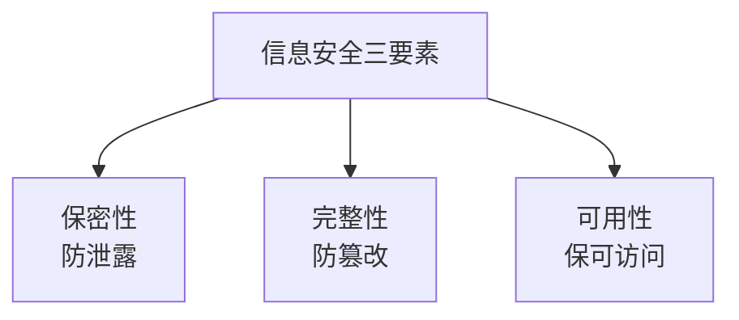
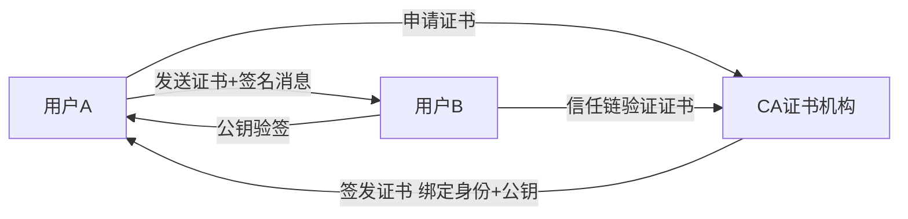
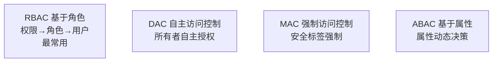
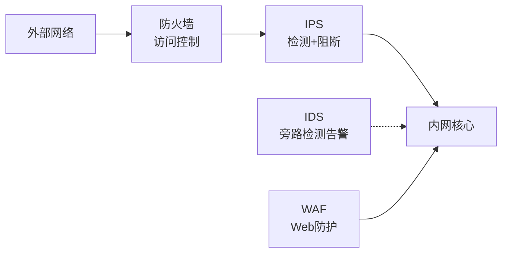
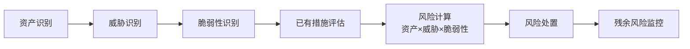
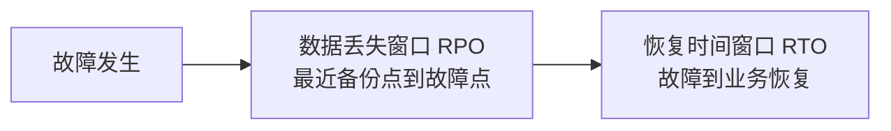
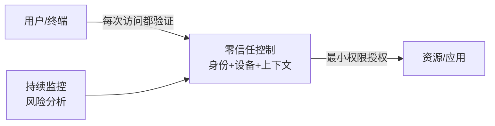

# 系统分析师｜第9章 信息安全（完整版备考讲义+章节自测题）

> 适配系统分析师（第2版教材），包含教材删减但真题持续考查内容；上午选择题+案例题备考讲义，论文高频素材。  
> 标签：系统分析师、上午题、信息安全、密码学、访问控制、风险评估、等保、零信任、备考

[TOC]

## 模块1：信息安全基础与安全体系

**前置说明**：本章基于系统分析师第2版官方教材，增补第1版删减但历年真题、新考纲仍必考内容，适配上午综合选择题与案例题。  
**模块优先级**：🟡 中等优先级  
**考情分析**：年均0~1道选择题；核心：CIA三元组、攻击分类、安全模型。

### 1.1 核心知识点精讲

#### 1.1.1 CIA 三元组（高频）

- **保密性 Confidentiality**：信息不被未授权者获取。
- **完整性 Integrity**：信息不被未授权篡改，保持准确一致。
- **可用性 Availability**：授权者在需要时可访问信息。

附加属性：可审计性（操作可追溯）、不可否认性（无法抵赖）、真实性（来源可靠）。

> 记忆：保密防偷看、完整防篡改、可用防瘫痪。

#### 1.1.2 安全威胁分类

- **被动攻击**：窃听、流量分析——不修改数据，难检测，重预防。
- **主动攻击**：篡改、伪造、拒绝服务——修改数据，易检测，重防护。

> 易错：被动攻击难检测、主动攻击易检测。

#### 1.1.3 风险相关概念

- **威胁**：可能造成损害的行为主体/事件（黑客、病毒）。
- **脆弱性（漏洞）**：系统的弱点。
- **风险**：威胁利用脆弱性造成损害的可能性与影响。

> 记忆：威胁×脆弱性→风险。

#### 1.1.4 安全模型（高频）

- **Bell-LaPadula（BLP）模型**：保障**保密性**；规则"**不上读、不下写**"（低密级不能读高密级，高密级不能写低密级）。
- **Biba 模型**：保障**完整性**；规则"**不下读、不上写**"（高完整性不能读低完整性，低完整性不能写高完整性）。

> 易错：BLP管保密（上读下写限制）、Biba管完整（下读上写限制），两者规则相反。

#### 1.1.5 信息安全体系框架

- **P2DR 模型**：策略（Policy）、防护（Protection）、检测（Detection）、响应（Response）——策略是核心。
- **WPDRRC 模型**：预警、防护、检测、响应、恢复、反击。

#### 1.1.6 高频易错点

1. CIA三要素属性要分清；
2. 被动攻击难检测、主动攻击易检测；
3. BLP保密不上读不下写；Biba完整不下读不上写；
4. P2DR中策略是核心。

### 1.2 典型配套例题（真题同源，带完整解析）

#### 例题1 CIA属性

信息被未授权者获取，违反了信息安全属性的（）
A. 完整性 B. 保密性 C. 可用性 D. 真实性

> 【解析】未授权获取 → 保密性被破坏。  
> 【答案】B

#### 例题2 安全模型

Bell-LaPadula模型主要保障（），其核心规则是（）
A. 完整性；不上读不下写 B. 保密性；不上读不下写 C. 保密性；不下读不上写 D. 完整性；下读上写

> 【解析】BLP保障保密性，规则"不上读、不下写"。  
> 【答案】B

### 1.3 课后习题（带完整答案+解析）

**习题1**  
攻击者窃听网络流量而不修改数据，属于（）
A. 主动攻击 B. 被动攻击 C. 拒绝服务 D. 中间人攻击

> 答案：B  
> 解析：窃听不修改数据 → 被动攻击，难检测。

**习题2**  
Biba模型主要保障信息的（）
A. 保密性 B. 完整性 C. 可用性 D. 真实性

> 答案：B  
> 解析：Biba模型保障完整性，规则"不下读、不上写"。

---

## 模块2：密码学基础

**前置说明**：本章基于系统分析师第2版官方教材，增补第1版删减但历年真题、新考纲仍必考内容，适配上午综合选择题。  
**模块优先级**：🔴 最高优先级（加密体制、数字签名必考）  
**考情分析**：每年1~2道选择题；核心：对称/非对称加密、哈希、数字签名、PKI。

### 2.1 核心知识点精讲

#### 2.1.1 对称加密（高频）

- **特点**：加密解密用**同一密钥**；速度快、效率高；**密钥分发与管理困难**。
- 代表算法：**DES**（64位分组/56位密钥）、**3DES**、**AES**（现代标准）。

#### 2.1.2 非对称加密（高频）

- **特点**：**公钥加密、私钥解密**（或私钥签名、公钥验签）；密钥管理容易；**运算慢**。
- 代表算法：**RSA**、**ECC**（椭圆曲线，更短密钥同强度）。
- 典型应用：密钥交换（如DH）、数字签名、数字证书。

| 类型 | 密钥 | 速度 | 密钥管理 | 代表 |
| ---- | ---- | ---- | ---- | ---- |
| 对称 | 加解密同一密钥 | 快 | 分发困难 | DES/3DES/AES |
| 非对称 | 公私钥对 | 慢 | 管理容易 | RSA/ECC |

> 易错：对称快但密钥分发难；非对称慢但密钥管理好。

#### 2.1.3 哈希函数（高频）

- **特点**：单向（不可逆）、定长输出、雪崩效应（输入微变输出大变）、抗碰撞。
- 代表算法：**MD5**（128位，已不安全）、**SHA-1**（160位，已弱化）、**SHA-256**（现代安全）。
- 用途：完整性校验、数字签名基础、口令存储。

#### 2.1.4 数字签名（高频）

- 过程：发送方用**自己的私钥**对消息摘要加密 → 接收方用**发送方公钥**验签。
- 作用：**身份认证**（确认发送者）、**完整性**（摘要比对）、**不可否认性**（防抵赖）。
- 与加密区别：加密用接收方公钥（保密）；签名用发送方私钥（认证）。

> 记忆：公钥加密保机密、私钥签名证身份。

#### 2.1.5 PKI 与数字证书（高频）

- **PKI 公钥基础设施**：管理公钥的信任体系。
- **CA 证书机构**：签发、管理数字证书的可信第三方。
- **数字证书**：绑定"身份 + 公钥"，由CA签名。
- **证书链**：根CA→中间CA→用户证书的信任链。
- **CRL 证书吊销列表 / OCSP**：查询证书是否已吊销。

#### 2.1.6 高频易错点

1. 对称=同一密钥、非对称=公私钥对；
2. 加密用接收方公钥、签名用发送方私钥；
3. 哈希单向不可逆、有雪崩效应；
4. CA签发证书、CRL吊销列表。

### 2.2 典型配套例题（真题同源，带完整解析）

#### 例题1 加密体制

下列关于对称加密与非对称加密的说法正确的是（）
A. 对称加密密钥分发容易 B. 非对称加密速度更快 C. 对称加密加解密用同一密钥 D. 非对称加密只有一把密钥

> 【解析】对称加密加解密用同一密钥，速度快但密钥分发难；非对称慢但管理好。  
> 【答案】C

#### 例题2 数字签名

数字签名技术中，签名者使用（）对消息摘要加密，验证者使用（）验签
A. 接收方公钥；接收方私钥 B. 签名者私钥；签名者公钥 C. 签名者公钥；签名者私钥 D. 接收方私钥；接收方公钥

> 【解析】私钥签名、公钥验签——签名者用自己的私钥，验证者用签名者的公钥。  
> 【答案】B

#### 例题3 哈希函数

对输入消息的任意微小修改都会导致输出摘要发生巨大变化，体现哈希函数的（）
A. 单向性 B. 雪崩效应 C. 可逆性 D. 对称性

> 【解析】输入微变、输出巨变 → 雪崩效应。  
> 【答案】B

### 2.3 课后习题（带完整答案+解析）

**习题1**  
下列属于对称加密算法的是（）
A. RSA B. ECC C. AES D. SHA-256

> 答案：C  
> 解析：AES对称加密；RSA/ECC非对称；SHA-256哈希。

**习题2**  
用于查询证书是否已被吊销的机制是（）
A. CA B. CRL/OCSP C. PKI D. 证书链

> 答案：B  
> 解析：CRL证书吊销列表/OCSP在线查询用于证书吊销状态验证。

---

## 模块3：身份认证与访问控制

**前置说明**：本章基于系统分析师第2版官方教材，增补第1版删减但历年真题、新考纲仍必考内容，适配上午综合选择题。  
**模块优先级**：🔴 最高优先级（访问控制模型必考）  
**考情分析**：每年1道左右选择题；核心：认证三要素、DAC/MAC/RBAC/ABAC对比、审计。

### 3.1 核心知识点精讲

#### 3.1.1 身份认证三要素（高频）

1. **所知**（你知道的）：口令、PIN码。
2. **所有**（你拥有的）：智能卡、令牌、手机。
3. **特征**（你是什么）：指纹、人脸、虹膜（生物识别）。

**多因素认证 MFA**：组合两种以上要素（如口令+短信验证码），安全性更高。

> 记忆：所知/所有/特征 = 口令/令牌/生物。

#### 3.1.2 访问控制模型（高频，重点）

- **DAC 自主访问控制**：**资源所有者**自主决定谁可访问（如文件权限设置）；灵活但安全性低。
- **MAC 强制访问控制**：系统按**安全标签**强制控制（主体/客体密级），用户不能自主改变；安全性高（多用于军队、政府）。
- **RBAC 基于角色**：把权限授予**角色**，用户分配角色（如管理员/普通用户）；**最常用**，管理高效。
- **ABAC 基于属性**：根据主体、客体、环境**属性**动态决策（如"上班时间+部门=财务"）；灵活、细粒度（第2版强化）。

> 记忆：DAC自主、MAC强制、RBAC角色、ABAC属性。

#### 3.1.3 安全审计

- **审计**：记录、分析用户操作日志，实现操作可追溯、责任认定。
- 审计与认证、授权共同构成"认证→授权→审计"AAA体系。

#### 3.1.4 高频易错点

1. 认证三要素：所知/所有/特征；
2. DAC所有者自主、MAC标签强制、RBAC角色、ABAC属性；
3. RBAC最常用；ABAC最灵活；
4. 多因素认证=两种以上要素组合。

### 3.2 典型配套例题（真题同源，带完整解析）

#### 例题1 认证要素

使用"口令+手机短信验证码"登录，属于（）
A. 单因素认证 B. 多因素认证 C. 生物认证 D. 证书认证

> 【解析】口令（所知）+验证码（所有）→ 两种要素组合，多因素认证MFA。  
> 【答案】B

#### 例题2 访问控制

系统按主体与客体的密级标签强制决定访问权限，用户不能自主更改，属于（）
A. DAC B. MAC C. RBAC D. ABAC

> 【解析】按安全标签强制控制 → 强制访问控制MAC。  
> 【答案】B

#### 例题3 RBAC特点

基于角色的访问控制RBAC的核心思想是（）
A. 所有者自主授权 B. 把权限授予角色、用户分配角色 C. 按安全标签控制 D. 按属性动态决策

> 【解析】RBAC：权限→角色→用户。  
> 【答案】B

### 3.3 课后习题（带完整答案+解析）

**习题1**  
指纹、人脸识别属于身份认证要素中的（）
A. 所知 B. 所有 C. 特征 D. 位置

> 答案：C  
> 解析：生物特征属于"特征"要素。

**习题2**  
根据主体、客体和环境属性进行动态访问决策的模型是（）
A. DAC B. MAC C. RBAC D. ABAC

> 答案：D  
> 解析：ABAC基于属性访问控制，灵活细粒度。

---

## 模块4：网络安全与应用安全

**前置说明**：本章基于系统分析师第2版官方教材，增补第1版删减但历年真题、新考纲仍必考内容，适配上午综合选择题与案例题。  
**模块优先级**：🔴 最高优先级（安全设备、攻击类型必考）  
**考情分析**：每年1~2道选择题；核心：防火墙/IDS/IPS、VPN、常见攻击、安全协议。

### 4.1 核心知识点精讲

#### 4.1.1 网络安全设备（高频）

- **防火墙**：网络边界访问控制（包过滤、状态检测、应用代理）；过滤规则控制进出流量。
- **WAF Web应用防火墙**：针对Web应用的防护（防SQL注入、XSS）。
- **IDS 入侵检测系统**：**检测**并**告警**，不阻断（旁路部署）。
- **IPS 入侵防御系统**：**检测并阻断**攻击（串联部署）。

> 易错：IDS只告警不阻断；IPS主动阻断。

#### 4.1.2 VPN 虚拟专用网

- **作用**：在公共网络上建立加密隧道，实现安全远程接入。
- **IPSec VPN**：网络层加密，常用于站点间（Site-to-Site）。
- **SSL VPN**：传输层加密，基于浏览器，常用于远程用户接入。

#### 4.1.3 常见攻击（高频）

- **DDoS 分布式拒绝服务**：大量请求耗尽资源，破坏**可用性**。
- **SQL注入**：向输入框注入SQL语句，窃取/篡改数据库。
- **XSS 跨站脚本**：向网页注入恶意脚本，窃取用户Cookie。
- **CSRF 跨站请求伪造**：诱导用户浏览器发送伪造请求。
- **中间人攻击**：拦截并篡改通信双方数据。

> 记忆：DDoS打可用性、SQL注入打数据库、XSS盗Cookie、CSRF伪造请求。

#### 4.1.4 恶意代码

- **病毒**：寄生、需宿主程序触发传播。
- **木马**：伪装成正常程序，远程控制（不自我复制）。
- **蠕虫**：自我复制、网络自动传播（不需宿主）。
- **勒索病毒**：加密用户数据勒索赎金。

> 易错：木马不自我复制、蠕虫自我复制网络传播。

#### 4.1.5 安全协议（高频）

- **HTTPS**：HTTP + TLS/SSL，加密Web通信。
- **SSH**：安全的远程登录协议（替代Telnet明文）。
- **TLS/SSL**：传输层安全协议，握手协商密钥。
- **IPSec**：网络层IP安全协议。

#### 4.1.6 高频易错点

1. IDS告警不阻断、IPS阻断；
2. WAF防护Web应用；
3. 木马不复制、蠕虫自动传播；
4. HTTPS=TLS之上的HTTP。

### 4.2 典型配套例题（真题同源，带完整解析）

#### 例题1 安全设备

部署在网络上、能够检测并主动阻断攻击流量的设备是（）
A. IDS B. IPS C. 防火墙 D. 交换机

> 【解析】IPS串联部署，检测并阻断；IDS只告警。  
> 【答案】B

#### 例题2 攻击类型

攻击者向登录表单注入恶意SQL语句以绕过身份验证，属于（）
A. XSS B. SQL注入 C. CSRF D. DDoS

> 【解析】注入SQL语句攻击数据库 → SQL注入。  
> 【答案】B

#### 例题3 恶意代码

能够自我复制并通过网络自动传播、无需宿主程序的恶意代码是（）
A. 病毒 B. 木马 C. 蠕虫 D. 间谍软件

> 【解析】蠕虫自我复制、网络自动传播。  
> 【答案】C

### 4.3 课后习题（带完整答案+解析）

**习题1**  
针对Web应用、专门防御SQL注入和XSS的设备是（）
A. WAF B. IDS C. 防火墙 D. 负载均衡

> 答案：A  
> 解析：WAF Web应用防火墙专防Web攻击。

**习题2**  
大量僵尸主机同时向目标服务器发起请求导致服务瘫痪，属于（）
A. SQL注入 B. DDoS C. CSRF D. 中间人攻击

> 答案：B  
> 解析：分布式拒绝服务DDoS破坏可用性。

---

## 模块5：信息安全风险评估

**前置说明**：本章基于系统分析师第2版官方教材，增补第1版删减但历年真题、新考纲仍必考内容，适配上午综合选择题与案例题。  
**模块优先级**：🔴 最高优先级（风险计算与处置策略必考）  
**考情分析**：每年1道左右选择题/计算题；核心：风险要素、定量计算、处置策略、残余风险。

### 5.1 核心知识点精讲

#### 5.1.1 风险评估要素（高频）

- **资产**：有价值的信息/系统/设备。
- **威胁**：可能损害资产的行为。
- **脆弱性**：资产存在的弱点。
- **已有安全措施**：现有防护。

风险关系：威胁利用脆弱性作用于资产，产生风险；已有措施可降低风险。

#### 5.1.2 风险评估方法

- **定性评估**：用等级（高/中/低）描述，主观、快速。
- **定量评估**：用数值计算风险值。

**定量计算公式（高频）**：
- 风险值 = 资产价值 × 威胁发生频率 × 脆弱性严重程度
- 或：风险 = 资产价值 × 威胁概率 × 影响程度

#### 5.1.3 风险处置策略（高频）

1. **规避**：放弃高风险业务/系统，从源头消除风险。
2. **转移**：把风险转给第三方（保险、外包）。
3. **减轻（降低）**：采取控制措施降低概率/影响（加密、备份、补丁）。
4. **接受**：风险在可接受范围，承担残余风险（需书面记录）。

> 易错：规避=不做；转移=保险外包；减轻=加防护；接受=认了。

#### 5.1.4 残余风险

采取处置措施后**仍然存在**的风险；残余风险必须可接受（≤可接受水平），否则需进一步处置。

#### 5.1.5 高频易错点

1. 风险=资产×威胁×脆弱性；
2. 定量用数值、定性用等级；
3. 规避消除、转移保险、减轻加防护、接受记录；
4. 残余风险不可完全消除。

### 5.2 典型配套例题（真题同源，带完整解析）

#### 例题1 风险计算

某资产价值100万元，威胁发生概率为0.2，脆弱性严重程度为0.5，该风险值为（）
A. 10万 B. 20万 C. 50万 D. 100万

> 【解析】风险=资产×概率×脆弱性=100×0.2×0.5=10万。  
> 【答案】A

#### 例题2 风险处置

为重要系统部署入侵防御系统以降低被攻击的风险，属于（）
A. 规避 B. 转移 C. 减轻 D. 接受

> 【解析】部署防护措施降低风险 → 减轻。  
> 【答案】C

#### 例题3 残余风险

下列关于残余风险的说法正确的是（）
A. 处置后风险可完全消除 B. 残余风险必须可接受 C. 残余风险无需关注 D. 残余风险=初始风险

> 【解析】残余风险是处置后仍存在的风险，必须控制在可接受水平。  
> 【答案】B

### 5.3 课后习题（带完整答案+解析）

**习题1**  
某资产价值50万，威胁概率0.4，脆弱性0.8，风险值为（）
A. 16万 B. 20万 C. 32万 D. 40万

> 答案：A  
> 解析：50×0.4×0.8=16万。

**习题2**  
购买网络安全保险以转嫁风险损失，属于（）
A. 规避 B. 转移 C. 减轻 D. 接受

> 答案：B  
> 解析：保险=风险转移。

---

## 模块6：信息安全管理与等保

**前置说明**：本章基于系统分析师第2版官方教材，增补第1版删减但历年真题、新考纲仍必考内容，适配上午综合选择题与案例题。  
**模块优先级**：🟡 中等优先级  
**考情分析**：年均0~1道选择题；核心：等保2.0、RTO/RPO、容灾备份、业务连续性。

### 6.1 核心知识点精讲

#### 6.1.1 信息安全管理体系

- 安全策略 → 安全组织 → 人员安全 → 资产管理 → 物理与环境安全 → 运维安全。
- **PDCA循环**应用于安全管理持续改进（策划→实施→检查→处置）。

#### 6.1.2 等级保护2.0（高频）

- **等保2.0**：网络安全法要求的合规制度，全国统一5个安全等级。
- 等级划分（1~5级，安全要求递增）：
  1. 第一级：用户自主保护级。
  2. 第二级：系统审计保护级。
  3. 第三级：安全标记保护级（重要系统，如政务/金融核心）。
  4. 第四级：结构化保护级。
  5. 第五级：访问验证保护级（国家关键设施最高级）。
- 流程：**定级 → 备案 → 建设整改 → 等级测评 → 监督检查**。

> 记忆：等保2.0五级，第三级是重要系统常用级别。

#### 6.1.3 RTO 与 RPO（高频辨析）

- **RTO 恢复时间目标**：故障后**恢复业务**允许的最长时间（"多久恢复"）。
- **RPO 恢复点目标**：可接受的数据丢失量/时间（"丢多少数据"）。

> 示例：RTO=2小时（2小时内必须恢复）、RPO=30分钟（最多丢失30分钟数据）。

#### 6.1.4 容灾与备份（高频）

- 备份策略：**全量备份**（全部数据，慢）、**增量备份**（上次以来变化，快）、**差异备份**（上次全量以来变化）。
- 容灾级别：数据级容灾（备份数据）→ 应用级容灾（应用切换）→ 业务级容灾（业务连续）。
- 异地容灾：主备中心异地部署，防区域性灾难。

#### 6.1.5 业务连续性管理 BCM

- **BCM**：识别业务中断影响，制定预防与恢复策略的全面管理过程。
- **BCP 业务连续性计划**：灾难时的具体恢复预案与演练。
- **DRP 灾难恢复计划**：IT系统恢复专项计划。

#### 6.1.6 高频易错点

1. RTO管"恢复多快"、RPO管"丢多少"；
2. 等保流程：定级→备案→整改→测评→监督；
3. 增量备份依赖上次备份、差异备份依赖上次全量；
4. BCP是业务计划、DRP是IT恢复计划。

### 6.2 典型配套例题（真题同源，带完整解析）

#### 例题1 RTO/RPO辨析

某系统要求故障后2小时内恢复业务、最多允许丢失30分钟数据。则RTO和RPO分别为（）
A. RTO=2小时，RPO=30分钟 B. RTO=30分钟，RPO=2小时 C. RTO=2小时，RPO=2小时 D. RTO=30分钟，RPO=30分钟

> 【解析】恢复时间2小时 → RTO=2小时；数据丢失30分钟 → RPO=30分钟。  
> 【答案】A

#### 例题2 等保等级

某重要政务系统需要防范敌对势力攻击，定级为安全标记保护级，属于等保（）
A. 第一级 B. 第二级 C. 第三级 D. 第五级

> 【解析】安全标记保护级 = 第三级（重要系统常用）。  
> 【答案】C

#### 例题3 备份策略

只备份自上次备份以来发生变化的数据，备份速度最快但恢复最复杂，属于（）
A. 全量备份 B. 增量备份 C. 差异备份 D. 镜像备份

> 【解析】增量备份只备份增量，恢复需按链回放。  
> 【答案】B

### 6.3 课后习题（带完整答案+解析）

**习题1**  
数据丢失允许的最大时间/数据量，用（）描述
A. RTO B. RPO C. BCP D. DRP

> 答案：B  
> 解析：RPO恢复点目标=可接受数据丢失量；RTO=恢复时间。

**习题2**  
等保2.0的流程顺序是（）
A. 测评→定级→备案→整改 B. 定级→备案→整改→测评 C. 备案→定级→测评→整改 D. 定级→测评→备案→整改

> 答案：B  
> 解析：定级→备案→建设整改→等级测评→监督检查。

**习题3（第2版考纲补充）**  
CC（Common Criteria）通用评估准则主要用于（）
A. 风险评估定价 B. IT产品安全评估与认证 C. 网络布线 D. 项目管理

> 答案：B  
> 解析：CC通用评估准则是IT产品/系统安全评估的国际标准（对应GB/T 18336）。

#### 6.1.6 CC评估标准（第2版考纲补充，高频）

- **CC（Common Criteria，通用评估准则）**：IT产品与系统安全评估的国际标准（ISO/IEC 15408，对应国标GB/T 18336）。
- 核心要素：
  1. **保护轮廓PP**：用户侧安全需求描述。
  2. **安全目标ST**：产品侧安全功能声明。
  3. **评估保证级EAL**：EAL1~EAL7，级别越高保证程度越高（如EAL4常用于商用产品）。
- 与等保关系：等保面向**系统**分级，CC面向**产品**评估认证。

> 记忆：CC评估产品安全、PP说需求、ST说功能、EAL分级保证。

---

## 模块7：数据安全、隐私与新技术安全

**前置说明**：本章基于系统分析师第2版官方教材新增/强化内容，适配上午综合选择题。  
**模块优先级**：🟡 中等优先级（第2版强化，考频上升）  
**考情分析**：年均0~1道选择题；核心：数据分级分类、脱敏、云安全共享责任、零信任。

### 7.1 核心知识点精讲

#### 7.1.1 数据安全治理（第2版强化）

- **数据分类分级**：按敏感程度分级（如公开/内部/机密/绝密），分级防护。
- **数据脱敏**：对敏感数据变形处理（手机号138****1234），用于测试/分析环境。
- **数据加密**：存储加密、传输加密（TDE、HTTPS）。
- **数据销毁**：物理销毁、逻辑销毁，防止数据残留泄露。

> 记忆：分级定防护、脱敏防泄露、加密保机密、销毁防残留。

#### 7.1.2 个人信息保护

- **最小必要原则**：仅收集与业务直接相关的最少信息。
- 告知同意：收集前告知用途并获得同意。
- 数据主体权利：查询、更正、删除（被遗忘权）。

#### 7.1.3 云安全共享责任模型（高频，第2版强化）

- **云服务商负责"云的安全"**：物理设施、虚拟化平台、云平台自身。
- **租户负责"云中的安全"**：数据、应用、账号权限、配置。
- 不同服务模式责任边界不同：IaaS（租户管最多）→ PaaS → SaaS（租户管最少）。

> 易错：无论哪种模式，**数据安全责任始终在租户**。

#### 7.1.4 零信任安全（高频，第2版强化）

- **核心思想**："**永不信任，始终验证**"（Never Trust, Always Verify）。
- 不再区分内网外网，所有访问请求都要持续认证授权。
- 关键组件：身份认证、动态授权、微隔离、持续监控。

#### 7.1.5 物联网与AI安全

- **物联网安全**：设备弱口令、固件漏洞、僵尸网络风险。
- **AI安全**：对抗样本攻击、数据投毒、模型窃取。

#### 7.1.6 高频易错点

1. 云安全：云服务商管云、租户管云中（数据责任在租户）；
2. 零信任=永不信任始终验证；
3. 数据分级分类是数据安全治理基础；
4. 最小必要原则是个人信息保护核心。

### 7.2 典型配套例题（真题同源，带完整解析）

#### 例题1 云安全责任

在云服务模式下，数据安全的责任主要由（）承担
A. 云服务商 B. 租户 C. 监管机构 D. 第三方审计

> 【解析】无论IaaS/PaaS/SaaS，数据安全责任始终在租户。  
> 【答案】B

#### 例题2 零信任

零信任安全架构的核心思想是（）
A. 内外网隔离 B. 永不信任，始终验证 C. 边界防护 D. 一次认证长期有效

> 【解析】零信任"永不信任，始终验证"，持续认证授权。  
> 【答案】B

#### 例题3 数据安全

将测试环境中的手机号改为138****1234，属于（）
A. 数据加密 B. 数据脱敏 C. 数据销毁 D. 数据分类

> 【解析】对敏感数据变形处理 → 数据脱敏。  
> 【答案】B

### 7.3 课后习题（带完整答案+解析）

**习题1**  
按敏感程度对数据划分级别并实施分级防护，属于（）
A. 数据分类分级 B. 数据脱敏 C. 数据备份 D. 数据归档

> 答案：A  
> 解析：数据分类分级是数据安全治理的基础。

**习题2**  
个人信息保护中"仅收集与业务直接相关的最少信息"体现了（）
A. 最小必要原则 B. 告知同意原则 C. 完整保留原则 D. 公开透明原则

> 答案：A  
> 解析：最小必要原则=只收集必要的最少信息。

---

# 章节总复习综合模拟题（覆盖全部7模块，含答案与解析）

> 说明：题型贴合系统分析师上午真题风格，包含选择+计算，覆盖模块1~7所有核心考点；可直接放在讲义末尾作为章节自测。

## 一、单项选择题（15题）

1. 信息系统被病毒破坏导致无法访问，破坏了安全属性的（）
A. 保密性 B. 完整性 C. 可用性 D. 真实性
> 答案：C

2. Bell-LaPadula模型的核心规则是（）
A. 不下读不上写 B. 不上读不下写 C. 上读下写 D. 任意读写
> 答案：B

3. 下列属于对称加密算法的是（）
A. RSA B. ECC C. AES D. SHA-256
> 答案：C

4. 数字签名中，验证者使用（）验证签名
A. 签名者公钥 B. 签名者私钥 C. 接收方私钥 D. CA私钥
> 答案：A

5. 哈希函数最重要的特性是（）
A. 可逆性 B. 单向性 C. 对称性 D. 加密性
> 答案：B

6. "口令+动态令牌"双因素登录属于（）
A. 单因素认证 B. 多因素认证 C. 生物认证 D. 证书认证
> 答案：B

7. 把权限授予角色、用户通过分配角色获得权限的模型是（）
A. DAC B. MAC C. RBAC D. ABAC
> 答案：C

8. 能检测并主动阻断攻击的网络安全设备是（）
A. IDS B. IPS C. 防火墙 D. 交换机
> 答案：B

9. 诱导用户浏览器向已登录网站发送伪造请求的攻击是（）
A. SQL注入 B. XSS C. CSRF D. DDoS
> 答案：C

10. 资产价值80万、威胁概率0.3、脆弱性0.6，风险值为（）
A. 14.4万 B. 24万 C. 48万 D. 80万
> 答案：A

11. 放弃某项高风险业务以消除风险，属于（）
A. 规避 B. 转移 C. 减轻 D. 接受
> 答案：A

12. 系统要求故障后4小时内恢复、最多丢1小时数据，则（）
A. RTO=4h，RPO=1h B. RTO=1h，RPO=4h C. RTO=4h，RPO=4h D. RTO=1h，RPO=1h
> 答案：A

13. 只备份自上次全量备份以来变化数据的策略是（）
A. 全量备份 B. 增量备份 C. 差异备份 D. 镜像
> 答案：C

14. 云安全共享责任模型中，数据安全责任由（）承担
A. 云服务商 B. 租户 C. 平台 D. 运营商
> 答案：B

15. 零信任架构的核心思想是（）
A. 内外网隔离 B. 永不信任，始终验证 C. 一次认证长期有效 D. 边界防护优先
> 答案：B

## 二、计算题（4道，真题风格）

### 计算题1【风险定量计算】

某核心数据库资产价值500万元，评估威胁发生概率为0.1，脆弱性严重程度为0.8。求风险值；若部署防护措施后脆弱性降为0.2，新风险值为多少？
> 【解析】
> 原风险=500×0.1×0.8=40万元。
> 防护后风险=500×0.1×0.2=10万元。
> 防护降低了30万元风险。
> 答案：原风险40万；防护后10万

### 计算题2【RTO/RPO场景判断】

某支付系统灾难恢复要求：故障后30分钟内恢复交易服务；数据丢失不超过5分钟。请给出RTO与RPO指标值，并说明哪项指标更严格。
> 【解析】
> RTO=30分钟（恢复时间目标）；RPO=5分钟（数据丢失目标）。
> RPO=5分钟意味着需接近实时的数据复制（如同步复制/异地容灾），实现难度更高。
> 答案：RTO=30min、RPO=5min；RPO更严格

### 计算题3【哈希摘要校验】

发送方计算文件哈希摘要并加密传输，接收方如何验证文件完整性？请描述过程。
> 【解析】
> 接收方对收到的文件重新计算哈希摘要，与发送方传输的摘要比对；
> 若两者一致，说明文件传输中未被篡改（完整性）；
> 摘要用发送方私钥签名传输时，同时可验证身份（不可否认性）。
> 答案：重算哈希→比对摘要→一致则完整（配合数字签名可认证身份）

### 计算题4【加解密场景判定】

场景A：需要向多个接收方安全传输大文件，要求速度快；场景B：需实现数字签名防抵赖。分别说明应采用的加密/签名方式及原因。
> 【解析】
> 场景A：大文件传输用**对称加密**（速度快、效率高），密钥可通过非对称加密安全分发（混合加密：非对称传密钥+对称传数据）。
> 场景B：数字签名用**发送方私钥**对消息摘要加密，接收方用**发送方公钥**验签，实现身份认证与不可否认性。
> 答案：A用对称加密（混合加密传密钥）；B用私钥签名+公钥验签

## 三、简答概念题（3道）

1. 简述对称加密与非对称加密的区别及应用场景
> 【解析】对称加密加解密用同一密钥，速度快、效率高，但密钥分发管理困难，代表DES/AES，用于大文件加密；非对称加密用公私钥对，公钥加密私钥解密（或私钥签名公钥验签），速度慢但密钥管理容易，代表RSA/ECC，用于密钥交换、数字签名。实践中常混合使用（非对称传密钥、对称传数据）。

2. 简述DAC、MAC、RBAC、ABAC四种访问控制模型的特点
> 【解析】DAC自主访问控制：资源所有者自主授权，灵活但安全性低；MAC强制访问控制：按安全标签强制控制，用户不能自主更改，安全性高；RBAC基于角色：权限授予角色、用户分配角色，管理高效，最常用；ABAC基于属性：按主体/客体/环境属性动态决策，灵活细粒度。

3. 简述风险评估的基本流程与风险处置策略
> 【解析】流程：资产识别→威胁识别→脆弱性识别→已有措施评估→风险分析（定性/定量）→风险处置→残余风险监控。风险处置四策略：规避（放弃消除风险）、转移（保险/外包转嫁）、减轻（防护措施降低概率影响）、接受（风险可接受并书面记录）。处置后仍存在的风险为残余风险，必须控制在可接受水平。
