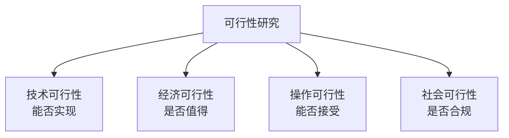
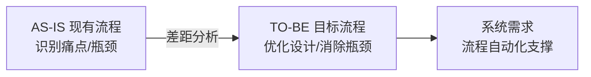
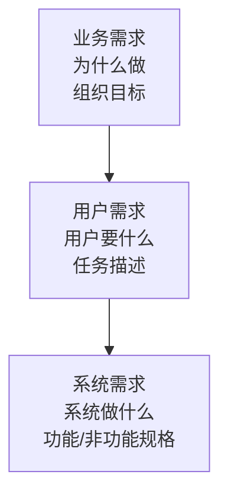

# 系统分析师｜第10章 系统规划与分析（完整版备考讲义+章节自测题）

> 适配系统分析师（第2版教材），包含教材删减但真题持续考查内容；上午选择题+案例题备考讲义，论文高频素材。  
> 标签：系统分析师、上午题、系统规划、可行性研究、业务建模、需求分析、方案选型、备考

[TOC]

## 模块1：系统规划概述

**前置说明**：本章基于系统分析师第2版官方教材，增补第1版删减但历年真题、新考纲仍必考内容，适配上午综合选择题与案例题。  
**模块优先级**：🟡 中等优先级  
**考情分析**：年均0~1道选择题；核心：系统规划定位、阶段划分、规划原则。

### 1.1 核心知识点精讲

#### 1.1.1 系统规划定位

- **系统规划**：信息系统生命周期**最前端**的活动，从组织战略目标出发，确定信息系统的目标、总体结构与实施安排。
- 区别于软件开发：系统规划面向**顶层战略**，回答"做什么、为什么做、值不值得做"；软件开发面向"怎么做"。

#### 1.1.2 系统规划三阶段（高频）

1. **战略规划**：信息系统总体目标与战略对齐，确定信息系统架构方向。
2. **需求分析规划**：梳理业务需求，定义系统范围与功能框架。
3. **资源分配规划**：估算资源、预算、进度，制定实施路线图。

> 记忆：战略→需求→资源，层层细化。

#### 1.1.3 系统规划原则（高频）

1. **战略一致性**：信息系统规划必须与组织战略一致。
2. **信息资源为核心**：以信息资源开发利用为中心。
3. **整体性**：全局统筹，避免信息孤岛。
4. **可落地性**：规划要可执行、可实施。
5. **渐进实施**：分阶段、分优先级推进。

#### 1.1.4 规划参与角色

- **高层管理者**：提供战略方向与决策支持（关键，缺失易失败）。
- **业务专家**：提供业务需求与流程知识。
- **系统分析师**：连接业务与技术，主导分析与设计。
- **技术架构师**：提供技术方案与可行性判断。

> 易错：系统规划失败最常见原因=高层支持不足、业务目标不清。

#### 1.1.5 高频易错点

1. 系统规划是生命周期最前端、战略层面；
2. 三阶段：战略→需求→资源；
3. 战略一致性是首要原则；
4. 高层参与是规划成功关键。

### 1.2 典型配套例题（真题同源，带完整解析）

#### 例题1 系统规划定位

系统规划处于信息系统生命周期的（），主要回答的问题是（）
A. 最前端；做什么、值不值得做 B. 中间；怎么做 C. 最后端；如何维护 D. 最前端；如何编码

> 【解析】系统规划是生命周期最前端，面向顶层战略，回答"做什么、值不值得做"。  
> 【答案】A

#### 例题2 规划原则

信息系统规划的首要原则是（）
A. 技术先进性 B. 战略一致性 C. 设备最优化 D. 成本最低

> 【解析】战略一致性是系统规划的首要原则。  
> 【答案】B

### 1.3 课后习题（带完整答案+解析）

**习题1**  
系统规划三阶段依次是（）
A. 需求→战略→资源 B. 战略→需求→资源 C. 资源→需求→战略 D. 战略→资源→需求

> 答案：B  
> 解析：战略规划→需求分析规划→资源分配规划。

**习题2**  
下列属于系统规划常见失败原因的是（）
A. 高层支持不足 B. 技术过于先进 C. 文档过多 D. 测试充分

> 答案：A  
> 解析：高层支持不足、业务目标不清是系统规划失败常见原因。

---

## 模块2：可行性研究

**前置说明**：本章基于系统分析师第2版官方教材，增补第1版删减但历年真题、新考纲仍必考内容，适配上午综合选择题与计算题。  
**模块优先级**：🔴 最高优先级（四维度+经济指标计算必考）  
**考情分析**：每年1道左右选择题/计算题；核心：四个可行性维度、NPV/回收期/ROI、可研报告。

### 2.1 核心知识点精讲

#### 2.1.1 可行性研究四维度（高频）

1. **技术可行性**：现有技术能否实现、团队技术能力。
2. **经济可行性**：成本收益分析，是否值得投资。
3. **操作可行性**：用户/组织是否接受，流程是否可落地。
4. **社会可行性**：法律、政策、伦理、社会影响。

> 记忆：技术行不行、经济值不值、操作认不认、社会合不合规。

#### 2.1.2 经济可行性指标（高频计算）

- **净现值 NPV**：未来各期净现金流的现值之和。
  - NPV = Σ(第t年净现金流量 / (1+贴现率)^t) − 初始投资
  - NPV > 0：项目可行；NPV < 0：不可行。
- **静态投资回收期**：累计净现金流量由负转正所需的年数。
  - 回收期 = 累计净现金流首次为正的前一年数 + |上年累计| / 当年净现金流
- **投资回报率 ROI**：年均收益 / 总投资 × 100%。

> 易错：NPV考虑资金时间价值（贴现）；静态回收期不考虑。

#### 2.1.3 可行性研究阶段

- **初步可行性研究**：快速粗筛，判断是否有必要详细研究。
- **详细可行性研究**：全面深入分析，形成可行性研究报告。

#### 2.1.4 可行性研究报告结论

结论类型：**立即开发**、**暂缓开发**（条件成熟再开发）、**不可行（放弃）**、**修改方案后再评估**。

#### 2.1.5 高频易错点

1. 四维度：技术/经济/操作/社会；
2. NPV>0可行，考虑时间价值；
3. 静态回收期不考虑贴现；
4. 可研结论：立即/暂缓/放弃/修改。

### 2.2 典型配套例题（真题同源，带完整解析）

#### 例题1 可行性维度

"系统上线后用户是否能适应新流程"属于（）
A. 技术可行性 B. 经济可行性 C. 操作可行性 D. 社会可行性

> 【解析】用户接受度与流程落地 → 操作可行性。  
> 【答案】C

#### 例题2 NPV 判断

某项目初始投资100万，第1年净现金流40万，第2年60万，贴现率10%。NPV约为（）
A. 100万 B. −13.2万 C. 13.2万 D. 0

> 【解析】NPV=40/(1.1)+60/(1.1²)−100=36.36+49.59−100≈−13.95万。
> 简化取整：40/1.1≈36.4，60/1.21≈49.6，和≈86，−100=−14万（选项中最接近−13.2）。
> 【答案】B

#### 例题3 可研结论

经评估，某系统技术上可实现、经济上不划算，可行性研究报告结论应为（）
A. 立即开发 B. 暂缓开发或放弃 C. 无条件开发 D. 仅做技术方案

> 【解析】经济不可行 → 项目不可行，结论为暂缓或放弃。  
> 【答案】B

### 2.3 课后习题（带完整答案+解析）

**习题1**  
"现有技术团队是否具备开发能力"属于（）
A. 技术可行性 B. 经济可行性 C. 操作可行性 D. 社会可行性

> 答案：A  
> 解析：团队技术能力与实现条件 → 技术可行性。

**习题2**  
静态投资回收期的计算（）
A. 考虑资金时间价值 B. 不考虑资金时间价值 C. 考虑贴现率 D. 等于NPV

> 答案：B  
> 解析：静态回收期不考虑资金时间价值；动态才考虑。

---

## 模块3：业务分析与业务建模

**前置说明**：本章基于系统分析师第2版官方教材，增补第1版删减但历年真题、新考纲仍必考内容，适配上午综合选择题与案例题（案例大题核心）。  
**模块优先级**：🔴 最高优先级（AS-IS/TO-BE流程分析案例必考）  
**考情分析**：案例题高频考点；核心：业务分析目标、AS-IS/TO-BE、业务流程图、痛点分析。

### 3.1 核心知识点精讲

#### 3.1.1 业务分析目标

- 梳理业务流程、识别业务痛点、明确业务目标。
- 输出：业务现状描述、问题清单、改进机会、系统需求依据。

#### 3.1.2 AS-IS 与 TO-BE（高频，案例核心）

- **AS-IS 现有业务流程**：描述当前流程（现状），识别问题与瓶颈。
- **TO-BE 目标业务流程**：设计优化后的流程（目标），消除痛点、提升效率。
- 分析重点：AS-IS找问题 → 设计TO-BE → 明确差距（Gap）→ 支撑系统需求。

> 记忆：AS-IS看现状找问题，TO-BE看目标做优化。

#### 3.1.3 业务模型工具（高频）

- **业务流程图 BFD**：描述业务流程的流转与节点。
- **业务用例**：从角色视角描述业务功能。
- **组织架构图**：梳理组织与职责。
- **业务规则**：业务逻辑约束。

#### 3.1.4 业务痛点分析工具

- **鱼骨图（因果图）**：分析问题根因。
- **帕累托分析**：识别关键少数问题（80/20）。

> 易错：鱼骨图找根因、帕累托定优先级，两者配合使用。

#### 3.1.5 业务架构

- 业务域划分：按业务板块拆分（销售、采购、财务）。
- 业务能力：组织具备的业务能力清单。
- 业务架构 → 应用架构 → 数据架构 → 技术架构逐层映射。

#### 3.1.6 高频易错点

1. AS-IS现状、TO-BE目标，中间做差距分析；
2. 业务流程图描述流程、业务用例描述功能；
3. 鱼骨图根因、帕累托优先级；
4. 业务架构是应用/数据/技术架构的基础。

### 3.2 典型配套例题（真题同源，带完整解析）

#### 例题1 AS-IS/TO-BE

在业务流程优化中，描述当前业务运行状态、用于识别问题的模型是（）
A. TO-BE模型 B. AS-IS模型 C. 技术架构 D. 数据模型

> 【解析】AS-IS描述现状，用于识别问题；TO-BE描述目标。  
> 【答案】B

#### 例题2 业务分析工具

分析业务流程问题根本原因，适合使用（）
A. 帕累托图 B. 鱼骨图 C. 甘特图 D. 网络图

> 【解析】鱼骨图（因果图）用于分析问题根因。  
> 【答案】B

### 3.3 课后习题（带完整答案+解析）

**习题1**  
业务分析中，识别"少数关键问题贡献了大部分业务损失"应使用（）
A. 鱼骨图 B. 帕累托分析 C. 业务流程图 D. 用例图

> 答案：B  
> 解析：帕累托分析体现二八法则，定位关键少数。

**习题2**  
从角色视角描述业务功能的模型是（）
A. 业务流程图 B. 业务用例 C. 组织架构图 D. 数据流图

> 答案：B  
> 解析：业务用例从角色视角描述业务功能。

---

## 模块4：系统需求分析与需求获取

**前置说明**：本章基于系统分析师第2版官方教材，增补第1版删减但历年真题、新考纲仍必考内容，适配上午综合选择题。  
**模块优先级**：🟡 中等优先级  
**考情分析**：年均0~1道选择题；核心：三层需求分层、需求获取方法、SRS与基线。

### 4.1 核心知识点精讲

#### 4.1.1 三层需求分层（高频辨析）

1. **业务需求**：组织/业务层面的目标与动机（"为什么做"）。
2. **用户需求**：用户完成任务的描述（"用户要什么"）。
3. **系统需求**：系统的功能与非功能规格（"系统做什么"）。

> 记忆：业务需求管动机、用户需求管任务、系统需求管规格。

#### 4.1.2 需求获取方法（高频）

- **访谈**：与干系人一对一/小组交流（最常用）。
- **问卷调查**：大批量收集意见。
- **现场观察**：观察实际工作流程。
- **原型法**：快速构建原型确认需求。
- **JAD 联合需求会议**：干系人集中会议，高效达成共识。
- **文档研读**：分析现有文档资料。

> 易错：JAD强调干系人集中、高效；访谈最常用。

#### 4.1.3 需求分析工具

- **数据流图 DFD**：数据流向与加工。
- **数据字典 DD**：数据元素定义。
- **用例图**：参与者与用例关系。

#### 4.1.4 需求规格与基线（高频）

- **SRS 软件需求规格说明书**：需求文档化正式产物。
- **需求评审**：确认需求正确、完整、一致、可验证。
- **需求基线**：评审通过后冻结的需求版本，变更需走变更控制。

> 易错：基线后需求变更必须走变更控制流程。

#### 4.1.5 高频易错点

1. 业务/用户/系统三层需求递进；
2. JAD集中高效、访谈最常用；
3. SRS是需求基线载体；
4. 基线后变更受控。

### 4.2 典型配套例题（真题同源，带完整解析）

#### 例题1 需求分层

"通过信息系统提升订单处理效率30%"属于（）
A. 业务需求 B. 用户需求 C. 系统需求 D. 技术需求

> 【解析】组织层面的目标 → 业务需求。  
> 【答案】A

#### 例题2 需求获取方法

组织项目干系人集中召开会议，快速收集需求并达成共识，属于（）
A. 访谈 B. 问卷调查 C. JAD联合需求会议 D. 文档研读

> 【解析】JAD：干系人集中会议，高效达成共识。  
> 【答案】C

### 4.3 课后习题（带完整答案+解析）

**习题1**  
"用户在界面上点击'提交'后系统生成订单"属于（）
A. 业务需求 B. 用户需求 C. 系统需求 D. 战略需求

> 答案：C  
> 解析：描述系统具体功能规格 → 系统需求。

**习题2**  
需求评审通过后冻结的需求版本称为（）
A. 需求清单 B. 需求基线 C. 需求草案 D. 需求追踪

> 答案：B  
> 解析：需求基线是评审通过后冻结、受变更控制的版本。

---

## 模块5：系统方案制定与选型

**前置说明**：本章基于系统分析师第2版官方教材，增补第1版删减但历年真题、新考纲仍必考内容，适配上午综合选择题与案例题。  
**模块优先级**：🔴 最高优先级（加权评分选型计算必考）  
**考情分析**：每年1道左右选择题/计算题；核心：系统边界、架构选型、加权评分、选型原则。

### 5.1 核心知识点精讲

#### 5.1.1 系统目标与边界

- **系统目标**：明确系统要解决的问题与达到的指标。
- **系统边界**：划定系统范围，明确系统内/外（与外部系统的接口）。

#### 5.1.2 架构方案选型（高频）

- **集中式 vs 分布式**：集中式管理简单、扩展受限；分布式扩展性好、管理复杂。
- **B/S vs C/S**：
  - B/S（浏览器/服务器）：免安装、易维护、跨平台，适合广域网。
  - C/S（客户端/服务器）：响应快、交互强，适合局域网专业应用。
- **云原生方案**：容器化、微服务、弹性伸缩（第2版强化）。

> 易错：B/S易维护跨平台；C/S响应快交互强。

#### 5.1.3 软硬件选型原则

业务适配、技术成熟度、可扩展性、成本（总拥有成本TCO）、厂商服务能力、安全合规。

#### 5.1.4 加权评分法（高频计算）

- 步骤：
  1. 确定评估准则（如功能、性能、成本、扩展性）。
  2. 为每个准则分配权重（合计=1或100%）。
  3. 对每个候选方案按准则打分（如1~10分）。
  4. 计算加权总分 = Σ(权重 × 得分)，选最高分。

> 记忆：权重定重要性、打分定优劣、加权总分定选择。

#### 5.1.5 备选方案与推荐

- 至少设计2~3个备选方案；
- 对比分析后给出**推荐方案**及理由（成本、风险、收益平衡）。

#### 5.1.6 高频易错点

1. B/S易维护、C/S响应快；
2. 加权评分=Σ权重×得分；
3. 权重合计应为1（或100%）；
4. 选型考虑TCO总拥有成本。

### 5.2 典型配套例题（真题同源，带完整解析）

#### 例题1 架构选型

面向互联网用户、要求免安装、跨平台、易维护，宜采用（）
A. C/S架构 B. B/S架构 C. 单机版 D. 嵌入式

> 【解析】B/S免安装、跨平台、易维护，适合互联网应用。  
> 【答案】B

#### 例题2 加权评分计算

方案评分：准则权重（功能0.5、成本0.3、性能0.2），方案A得分（8,6,9）。方案A加权总分为（）
A. 7.5 B. 7.6 C. 7.7 D. 8.0

> 【解析】总分=0.5×8+0.3×6+0.2×9=4+1.8+1.8=7.6。  
> 【答案】B

### 5.3 课后习题（带完整答案+解析）

**习题1**  
局域网内专业应用、要求响应快交互强，宜采用（）
A. B/S架构 B. C/S架构 C. 纯静态网页 D. 消息队列

> 答案：B  
> 解析：C/S响应快、交互强，适合局域网专业应用。

**习题2**  
加权评分法中，各准则权重之和应为（）
A. 0 B. 1（或100%） C. 10 D. 无限制

> 答案：B  
> 解析：权重合计应为1或100%，否则总分无意义。

---

## 模块6：系统规划成果与项目启动

**前置说明**：本章基于系统分析师第2版官方教材，增补第1版删减但历年真题、新考纲仍必考内容，适配上午综合选择题。  
**模块优先级**：🟡 中等优先级  
**考情分析**：年均0~1道选择题；核心：规划产出物、立项、规划风险、与信息化规划方法联动。

### 6.1 核心知识点精讲

#### 6.1.1 系统规划主要产出物（高频）

1. **系统规划报告**：目标、总体架构、实施路线图。
2. **可行性研究报告**：四维度分析结论。
3. **项目章程**：授权项目启动、任命项目经理。
4. **项目初步范围说明书**：范围、目标、主要交付物。

> 记忆：规划报告→可研报告→章程→范围说明书→启动。

#### 6.1.2 项目立项

- **立项流程**：规划 → 可研 → 评审 → 批准 → 立项。
- 立项评审：审查可研结论、资源、风险，决定是否立项。

#### 6.1.3 系统规划风险（高频）

1. **需求膨胀**：范围不断扩大。
2. **业务目标不一致**：业务与IT目标脱节。
3. **高层支持不足**：资源与决策不到位。
4. 技术选型失误、规划与预算脱节。

#### 6.1.4 与信息化规划方法联动（承接第6章）

- **BSP 业务系统规划**：过程导向，识别企业过程与数据类。
- **CSF 关键成功因素法**：抓关键因素。
- **SST 战略集合转化法**：战略对齐。
- 系统规划是信息化规划在**具体项目层面**的落地。

> 记忆：信息化规划管"全局方向"，系统规划管"项目落地"。

#### 6.1.5 高频易错点

1. 章程授权启动、任命项目经理；
2. 立项需评审批准；
3. 需求膨胀是最常见规划风险；
4. 系统规划承接BSP/CSF/SST落地。

### 6.2 典型配套例题（真题同源，带完整解析）

#### 例题1 规划产出物

正式授权项目开始、任命项目经理的文档是（）
A. 可行性研究报告 B. 项目章程 C. 系统规划报告 D. 范围说明书

> 【解析】项目章程授权项目启动并任命项目经理。  
> 【答案】B

#### 例题2 规划风险

系统规划阶段最常出现的风险是（）
A. 需求膨胀 B. 代码错误 C. 服务器宕机 D. 网络延迟

> 【解析】需求膨胀（范围失控）是系统规划阶段常见风险。  
> 【答案】A

### 6.3 课后习题（带完整答案+解析）

**习题1**  
对系统规划进行全局方向管理、识别企业过程与数据类的方法论是（）
A. BSP B. 瀑布 C. 敏捷 D. 原型

> 答案：A  
> 解析：BSP业务系统规划识别企业过程与数据类，系统规划是其项目落地。

**习题2**  
下列属于系统规划产出物的是（）
A. 系统规划报告 B. 源代码 C. 测试报告 D. 部署脚本

> 答案：A  
> 解析：系统规划报告、可研报告、章程、范围说明书是规划阶段产出物。

---

# 章节总复习综合模拟题（覆盖全部6模块，含答案与解析）

> 说明：题型贴合系统分析师上午真题风格，包含选择+计算，覆盖模块1~6所有核心考点；可直接放在讲义末尾作为章节自测。

## 一、单项选择题（15题）

1. 系统规划处于信息系统生命周期（）
A. 最前端 B. 中间 C. 最后端 D. 编码阶段
> 答案：A

2. 系统规划三阶段的正确顺序是（）
A. 需求→战略→资源 B. 战略→需求→资源 C. 资源→战略→需求 D. 战略→资源→需求
> 答案：B

3. "法律政策是否允许系统上线"属于（）
A. 技术可行性 B. 经济可行性 C. 操作可行性 D. 社会可行性
> 答案：D

4. 项目初始投资100万，第1年净现金流50万、第2年50万，静态回收期为（）
A. 1年 B. 2年 C. 2.5年 D. 3年
> 答案：B

5. 净现值NPV>0表示项目（）
A. 不可行 B. 可行 C. 需暂缓 D. 无法判断
> 答案：B

6. 描述当前业务流程、识别问题与瓶颈的模型是（）
A. TO-BE B. AS-IS C. 用例图 D. 架构图
> 答案：B

7. 分析业务问题根本原因应使用（）
A. 帕累托图 B. 鱼骨图 C. 甘特图 D. 网络图
> 答案：B

8. "组织希望通过系统提升客户满意度"属于（）
A. 业务需求 B. 用户需求 C. 系统需求 D. 界面需求
> 答案：A

9. 组织干系人集中召开会议快速收集需求的方法是（）
A. 访谈 B. JAD C. 问卷 D. 观察
> 答案：B

10. 面向互联网用户、免安装易维护的架构是（）
A. C/S B. B/S C. 单机 D. 嵌入式
> 答案：B

11. 加权评分中准则权重（功能0.4、成本0.4、性能0.2），方案得分（9,5,8），总分为（）
A. 7.0 B. 7.2 C. 7.4 D. 7.6
> 答案：B

12. 正式授权项目启动、任命项目经理的文档是（）
A. 可研报告 B. 项目章程 C. 规划报告 D. 招标书
> 答案：B

13. 系统规划阶段最常见的风险是（）
A. 需求膨胀 B. 磁盘故障 C. 网络拥塞 D. 编译错误
> 答案：A

14. 识别企业过程与数据类、用于全局信息化规划的方法是（）
A. BSP B. DFD C. UML D. COCOMO
> 答案：A

15. 可行性研究四维度不包括（）
A. 技术可行性 B. 经济可行性 C. 操作可行性 D. 编码可行性
> 答案：D

## 二、计算题（4道，真题风格）

### 计算题1【净现值NPV】

项目初始投资200万元，第1~3年净现金流量分别为80万、90万、100万，贴现率10%。求NPV并判断项目是否可行。

> 【解析】
> NPV=80/(1.1)+90/(1.1²)+100/(1.1³)−200
> =72.73+74.38+75.13−200≈22.24万元。
> NPV=22.24>0，项目可行。
> 答案：NPV≈22.24万>0，可行

### 计算题2【静态投资回收期】

某项目初始投资150万元，各年净现金流量：第1年30万、第2年50万、第3年60万、第4年60万。求静态投资回收期。

> 【解析】
> 累计：第1年30、第2年80、第3年140、第4年200。
> 第3年末还差150−140=10万；第4年净现金流60万。
> 回收期=3+10/60=3.17年。
> 答案：约3.17年

### 计算题3【投资回报率ROI】

项目总投资100万元，年均净收益25万元。求ROI；若年均净收益为15万元，ROI为多少？
> 【解析】
> ROI=年均净收益/总投资×100%=25/100=25%。
> 若年均净收益15万：ROI=15/100=15%。
> 答案：25%；15%

### 计算题4【加权评分选型】

三个候选方案在准则（功能、性能、成本、扩展性）上的得分如下表，权重分别为0.4、0.2、0.3、0.1。选最优方案。

| 方案 | 功能 | 性能 | 成本 | 扩展性 |
| ---- | ---- | ---- | ---- | ---- |
| A | 9 | 8 | 6 | 7 |
| B | 7 | 9 | 8 | 6 |
| C | 8 | 7 | 9 | 8 |

> 【解析】
> A=0.4×9+0.2×8+0.3×6+0.1×7=3.6+1.6+1.8+0.7=7.7
> B=0.4×7+0.2×9+0.3×8+0.1×6=2.8+1.8+2.4+0.6=7.6
> C=0.4×8+0.2×7+0.3×9+0.1×8=3.2+1.4+2.7+0.8=8.1
> C方案总分最高。
> 答案：选方案C（总分8.1）

## 三、简答概念题（3道）

1. 简述可行性研究的四个维度
> 【解析】技术可行性：现有技术能否实现、团队能力是否具备；经济可行性：成本收益分析，NPV/回收期/ROI判断是否值得投资；操作可行性：用户与组织能否接受、流程能否落地；社会可行性：法律、政策、伦理、社会影响是否合规。四维度全部通过方可进入详细可研与立项。

2. 简述AS-IS与TO-BE模型在业务分析中的作用
> 【解析】AS-IS现有业务流程模型：描述当前业务运行状态，识别流程瓶颈、重复环节、信息孤岛等问题；TO-BE目标业务流程模型：设计优化后的流程，消除痛点、提升效率、支撑系统需求。两者通过差距分析（Gap Analysis）连接：从AS-IS找问题、设计TO-BE、明确差距，为系统需求与方案设计提供依据。

3. 简述业务需求、用户需求、系统需求三者的区别与联系
> 【解析】业务需求：组织层面的目标与动机，回答"为什么做"；用户需求：用户完成任务的具体描述，回答"用户要什么"；系统需求：系统的功能与非功能规格，回答"系统做什么"。三者层层细化：业务需求驱动用户需求，用户需求转化为系统需求，系统需求是开发与验收的依据。
