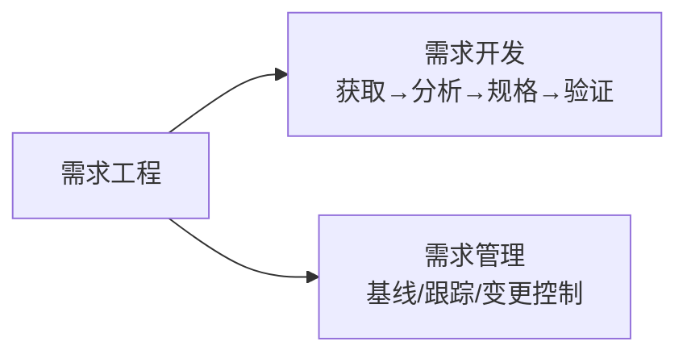
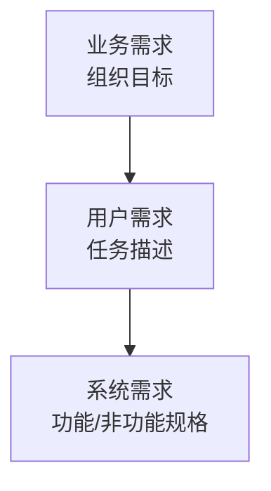
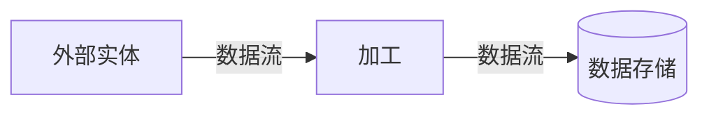
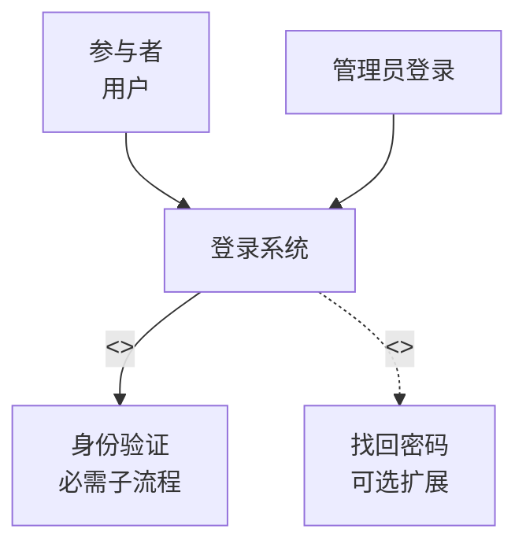
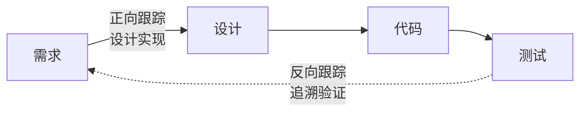
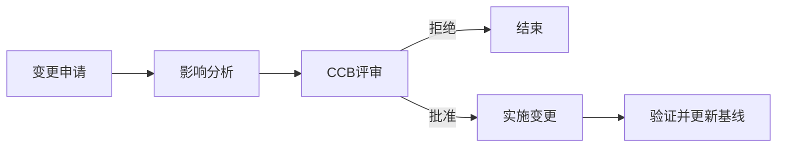

# 系统分析师｜第11章 软件需求工程（完整版备考讲义+章节自测题）

> 适配系统分析师（第2版教材），包含教材删减但真题持续考查内容；上午选择题+案例题备考讲义，论文高频素材。  
> 标签：系统分析师、上午题、需求工程、需求获取、用例图、SRS、需求管理、需求跟踪、备考

[TOC]

## 模块1：需求工程基础

**前置说明**：本章基于系统分析师第2版官方教材，增补第1版删减但历年真题、新考纲仍必考内容，适配上午综合选择题与案例题。  
**模块优先级**：🟡 中等优先级  
**考情分析**：年均0~1道选择题；核心：需求工程两大分支、需求分类、需求质量特性。

### 1.1 核心知识点精讲

#### 1.1.1 需求工程两大分支（高频）

需求工程 = **需求开发** + **需求管理**：
- **需求开发**：需求获取 → 需求分析 → 需求规格说明 → 需求验证（产需求）。
- **需求管理**：需求基线、需求跟踪、需求变更控制、需求状态管理（管需求）。

> 记忆：需求开发"造需求"、需求管理"管需求"。

#### 1.1.2 需求层次（高频）

1. **业务需求**：组织层面的目标与动机。
2. **用户需求**：用户完成任务的具体描述。
3. **系统需求**：系统的功能与非功能规格。

> 记忆：业务管动机、用户管任务、系统管规格。

#### 1.1.3 需求分类（高频）

- **功能需求**：系统必须提供的功能行为。
- **非功能需求**：性能、安全性、可用性、可维护性、兼容性、可移植性等质量属性。
- **约束需求**：业务约束（流程限制）、技术约束（平台要求）、法规约束（合规要求）。

> 易错：非功能需求≠约束；非功能是质量属性，约束是限制条件。

#### 1.1.4 需求质量特性（高频）

好的需求应具备：**完整性**、**一致性**、**无歧义**、**可验证**、**可追溯**、**可修改**。

> 记忆：完整一致无歧义、可验可溯可修改。

#### 1.1.5 高频易错点

1. 需求工程=开发+管理两大分支；
2. 三层需求：业务/用户/系统；
3. 非功能需求是质量属性、约束是限制条件；
4. 需求六特性要能识别。

### 1.2 典型配套例题（真题同源，带完整解析）

#### 例题1 需求工程分支

下列属于需求管理活动的是（）
A. 需求获取 B. 需求分析 C. 需求变更控制 D. 需求验证

> 【解析】需求管理=基线、跟踪、变更控制、状态管理；获取/分析/验证属于需求开发。  
> 【答案】C

#### 例题2 需求分类

"系统必须在Windows和Linux平台上运行"属于（）
A. 功能需求 B. 非功能需求 C. 技术约束 D. 业务约束

> 【解析】平台限制属于技术约束。  
> 【答案】C

### 1.3 课后习题（带完整答案+解析）

**习题1**  
下列不属于需求开发阶段活动的是（）
A. 需求获取 B. 需求分析 C. 需求规格说明 D. 需求变更控制

> 答案：D  
> 解析：需求变更控制属于需求管理，不属于需求开发。

**习题2**  
"需求必须无歧义、可验证"描述的是需求的（）
A. 分类 B. 质量特性 C. 层次 D. 来源

> 答案：B  
> 解析：无歧义、可验证是需求质量特性。

---

## 模块2：需求获取

**前置说明**：本章基于系统分析师第2版官方教材，增补第1版删减但历年真题、新考纲仍必考内容，适配上午综合选择题与案例题。  
**模块优先级**：🔴 最高优先级（获取方法辨析+难点识别必考）  
**考情分析**：每年1道左右选择题，案例大题常考；核心：获取方法、获取难点、涉众识别。

### 2.1 核心知识点精讲

#### 2.1.1 需求获取方法（高频）

- **访谈**：与干系人一对一/小组交流（最常用）。
- **问卷调查**：大批量收集意见，适合分散用户。
- **现场观察**：观察实际工作流程，发现隐性需求。
- **原型法**：快速构建原型，用户直观反馈。
- **JAD 联合应用开发**：干系人集中会议，高效达成共识。
- **头脑风暴**：激发创意，收集发散想法。
- **文档考古**：分析现有系统/文档资料，提取需求。
- **场景/用例**：通过场景描述用户与系统的交互。

> 记忆：访谈最常用、JAD最高效、原型最直观、观察挖隐性。

#### 2.1.2 需求获取难点（高频）

1. **认知模糊**：用户说不清自己的需求。
2. **需求冲突**：不同干系人需求矛盾。
3. **立场不一致**：高层与操作员关注点不同。
4. **需求隐藏**：隐含需求未明说。
5. **需求变化**：业务环境变化导致需求漂移。

> 易错：需求获取最大的难点=用户"不知道自己想要什么"。

#### 2.1.3 涉众识别（干系人）

- **高层管理者**：关注战略与投资回报。
- **业务操作员**：关注易用与效率。
- **运维人员**：关注可维护与稳定。
- **最终客户**：关注功能价值。

不同涉众需求关注点不同，需综合权衡。

#### 2.1.4 高频易错点

1. 访谈最常用、JAD最高效；
2. 现场观察发现隐性需求；
3. 认知模糊是需求获取最大难点；
4. 涉众需求需权衡，不能只听一方。

### 2.2 典型配套例题（真题同源，带完整解析）

#### 例题1 获取方法

组织项目干系人集中召开会议，在短时间内收集需求并达成共识，属于（）
A. 访谈 B. JAD联合应用开发 C. 问卷调查 D. 文档考古

> 【解析】JAD：干系人集中会议，高效达成共识。  
> 【答案】B

#### 例题2 获取难点

需求获取中最大的困难通常是（）
A. 用户不清楚自己的需求 B. 技术无法实现 C. 预算不足 D. 设备不够

> 【解析】用户认知模糊（不知道自己想要什么）是需求获取最大难点。  
> 【答案】A

### 2.3 课后习题（带完整答案+解析）

**习题1**  
通过深入工作现场观察用户实际操作过程来发现隐性需求，属于（）
A. 问卷调查 B. 现场观察 C. 头脑风暴 D. 文档考古

> 答案：B  
> 解析：现场观察可发现用户未明说的隐性需求。

**习题2**  
高层管理者与业务操作员对系统需求关注点不同，体现了（）
A. 需求隐藏 B. 立场不一致 C. 认知模糊 D. 需求变化

> 答案：B  
> 解析：不同层级涉众关注点不同 → 立场不一致。

---

## 模块3：需求分析与建模

**前置说明**：本章基于系统分析师第2版官方教材，增补第1版删减但历年真题、新考纲仍必考内容，适配上午综合选择题与案例题。  
**模块优先级**：🔴 最高优先级（用例图关系辨析必考）  
**考情分析**：每年1道左右选择题；核心：需求分析目标、DFD、用例图（包含/扩展/泛化）、原型分类。

### 3.1 核心知识点精讲

#### 3.1.1 需求分析目标

提炼需求、结构化、消除歧义、识别冲突、建立需求模型。

#### 3.1.2 结构化建模

- **DFD 数据流图**：数据流向与加工；要素：数据流、加工、数据存储、外部实体。
- **数据字典 DD**：定义数据元素。
- **STD 状态迁移图**：描述系统状态及状态间迁移（事件驱动）。

#### 3.1.3 用例图（高频，重点）

- **参与者（Actor）**：与系统交互的外部角色（人/系统）。
- **用例（Use Case）**：系统提供的一个功能单元。
- **关系（高频辨析）**：
  - **包含 <<include>>**：基础用例总是调用被包含用例（必需子流程）。
  - **扩展 <<extend>>**：扩展用例在特定条件下附加到基础用例（可选分支）。
  - **泛化**：用例/参与者之间的继承关系（子用例继承父用例）。

> 易错：include是"必须包含"、extend是"可选扩展"；泛化是继承。

#### 3.1.4 原型分类（高频）

- **抛弃型原型**：快速验证需求后**丢弃**，不进入最终系统。
- **演化型原型**：原型逐步**演化**为最终系统（增量迭代）。

> 记忆：抛弃型验证完就扔；演化型不断进化成产品。

#### 3.1.5 需求冲突解决

识别冲突 → 协商 → 权衡 → 达成一致；必要时由决策层拍板。

#### 3.1.6 高频易错点

1. include必需、extend可选、泛化继承；
2. DFD要素：数据流/加工/存储/外部实体；
3. 抛弃型验证后丢弃、演化型变产品；
4. 冲突需协商解决。

### 3.2 典型配套例题（真题同源，带完整解析）

#### 例题1 用例关系

"用户登录系统"用例总是调用"身份验证"用例，后者属于（）
A. <<extend>> B. <<include>> C. 泛化 D. 依赖

> 【解析】身份验证是登录的必需子流程 → <<include>>包含关系。  
> 【答案】B

#### 例题2 用例关系

"下单"用例在满足特定条件时才附加"申请发票"用例，后者属于（）
A. <<include>> B. <<extend>> C. 泛化 D. 关联

> 【解析】特定条件下可选附加 → <<extend>>扩展关系。  
> 【答案】B

#### 例题3 原型分类

为快速验证界面交互效果，构建原型并在验证后直接丢弃，属于（）
A. 演化型原型 B. 抛弃型原型 C. 增量型原型 D. 螺旋型原型

> 【解析】验证后丢弃 → 抛弃型原型。  
> 【答案】B

### 3.3 课后习题（带完整答案+解析）

**习题1**  
子用例继承父用例的行为与属性，属于（）
A. 包含关系 B. 扩展关系 C. 泛化关系 D. 聚合关系

> 答案：C  
> 解析：泛化=继承关系（子继承父）。

**习题2**  
描述系统状态及状态间迁移（事件驱动）的模型是（）
A. DFD B. STD状态迁移图 C. 数据字典 D. 甘特图

> 答案：B  
> 解析：STD描述状态及迁移，事件驱动。

---

## 模块4：需求规格说明与需求评审

**前置说明**：本章基于系统分析师第2版官方教材，增补第1版删减但历年真题、新考纲仍必考内容，适配上午综合选择题。  
**模块优先级**：🟡 中等优先级  
**考情分析**：年均0~1道选择题；核心：SRS内容、SRS质量标准、评审类型、需求基线。

### 4.1 核心知识点精讲

#### 4.1.1 SRS 软件需求规格说明书（高频）

SRS主要内容：
1. 引言（目的、范围、术语）。
2. **总体描述**（产品视角、用户特征、运行环境）。
3. **功能需求**（详细功能规格）。
4. **非功能需求**（性能、安全、可用性等）。
5. **接口需求**（外部接口、内部接口）。
6. **约束与假设**。
7. **验收标准**。

> 记忆：SRS是需求开发的核心产出物，开发与验收的依据。

#### 4.1.2 SRS 质量评价标准（IEEE标准，高频）

- **无歧义**：每条需求只有一种理解。
- **完整**：覆盖所有功能与非功能需求。
- **一致**：需求之间无冲突。
- **可验证**：可测试、可确认。
- **可修改**：便于变更维护。
- **可追溯**：可向前向后追溯。

> 记忆：无歧义、完整、一致、可验、可改、可溯（与需求质量特性呼应）。

#### 4.1.3 需求评审（高频）

- **评审类型**：非正式评审、**审查（Inspection）**、走查（Walkthrough）、轮查。
- 评审目的：尽早发现需求缺陷，降低修复成本。
- 参与人员：系统分析师、用户代表、开发、测试、质量人员。

> 易错：需求缺陷越早发现修复成本越低——评审是性价比最高的质量活动。

#### 4.1.4 需求基线（高频）

- **基线**：需求评审通过后**正式冻结**的版本，作为后续设计、开发、测试的基准。
- 基线后的变更必须走**变更控制流程**。

> 记忆：基线=冻结版本，变更受控。

#### 4.1.5 高频易错点

1. SRS包含功能/非功能/接口/约束/验收标准；
2. IEEE质量标准六条；
3. 审查是最正式评审类型；
4. 基线后变更必须受控。

### 4.2 典型配套例题（真题同源，带完整解析）

#### 例题1 SRS内容

下列不属于SRS软件需求规格说明书内容的是（）
A. 功能需求 B. 非功能需求 C. 验收标准 D. 源代码

> 【解析】SRS含功能/非功能/接口/约束/验收标准；源代码是编码产物。  
> 【答案】D

#### 例题2 评审类型

需求评审中最正式、流程最严格的评审类型是（）
A. 非正式评审 B. 审查 C. 走查 D. 邮件评审

> 【解析】审查（Inspection）是最正式的评审类型。  
> 【答案】B

### 4.3 课后习题（带完整答案+解析）

**习题1**  
需求评审通过后正式冻结、作为后续开发基准的版本称为（）
A. 需求草案 B. 需求基线 C. 需求清单 D. 需求变更

> 答案：B  
> 解析：需求基线=评审通过后冻结、受变更控制的版本。

**习题2**  
"每条需求只有一种理解"体现SRS的（）
A. 完整性 B. 无歧义性 C. 可修改性 D. 可追溯性

> 答案：B  
> 解析：无歧义=每条需求只有一种理解。

---

## 模块5：需求管理

**前置说明**：本章基于系统分析师第2版官方教材，增补第1版删减但历年真题、新考纲仍必考内容，适配上午综合选择题与案例题（案例核心）。  
**模块优先级**：🔴 最高优先级（需求跟踪+变更控制必考）  
**考情分析**：每年1道左右选择题，案例大题常考；核心：需求跟踪矩阵、变更控制流程、需求状态管理。

### 5.1 核心知识点精讲

#### 5.1.1 需求跟踪（高频，重点）

- **正向跟踪**：从**需求 → 设计 → 代码 → 测试**（验证需求是否全部实现）。
- **反向跟踪**：从**测试/代码 → 设计 → 需求**（验证工作产物是否都来自需求，防镀金）。
- **需求跟踪矩阵 RTM**：建立需求与设计、代码、测试用例之间的对应关系表。

> 记忆：正向查"需求做了没"，反向查"做的是不是需求要的"。

#### 5.1.2 需求变更管理（高频，重点）

**变更流程**：
1. 变更申请（提交变更请求）。
2. **影响分析**（评估影响范围、成本、进度、风险）。
3. **CCB 评审**（变更控制委员会审批）。
4. 批准/拒绝。
5. 实施变更（更新需求、设计、代码、测试）。
6. 验证并更新基线。

> 易错：变更必须走完整流程，不能"先改后批"。

#### 5.1.3 需求状态管理

需求状态流转：**草稿 → 评审 → 基线 → 已批准 → 已废弃**。

#### 5.1.4 常见需求问题（高频）

- **需求蔓延**：范围非受控扩大（外部需求失控）。
- **需求镀金**：团队自行添加未要求功能（内部画蛇添足）。
- **需求歧义**：同一需求多种理解。
- **需求遗漏**：重要需求未被识别。

> 易错：蔓延外部、镀金内部；歧义需无歧义化处理、遗漏需补充获取。

#### 5.1.5 高频易错点

1. 正向跟踪需求→测试、反向跟踪测试→需求；
2. RTM是跟踪矩阵工具；
3. 变更流程：申请→影响分析→CCB→实施→验证；
4. 蔓延外部、镀金内部。

### 5.2 典型配套例题（真题同源，带完整解析）

#### 例题1 需求跟踪

从测试用例出发，追溯其对应的设计、需求，验证工作产物都来自需求，属于（）
A. 正向跟踪 B. 反向跟踪 C. 横向跟踪 D. 双向确认

> 【解析】从测试/产物向需求追溯 → 反向跟踪（防镀金）。  
> 【答案】B

#### 例题2 变更流程

需求变更管理中，评估变更对成本、进度、风险的影响属于（）
A. 变更申请 B. 影响分析 C. CCB评审 D. 实施变更

> 【解析】影响分析：评估变更影响范围与代价。  
> 【答案】B

#### 例题3 需求问题

开发团队自行给系统增加客户未要求的报表功能，属于（）
A. 需求蔓延 B. 需求镀金 C. 需求歧义 D. 需求遗漏

> 【解析】团队内部主动加功能 → 需求镀金。  
> 【答案】B

### 5.3 课后习题（带完整答案+解析）

**习题1**  
从需求出发，跟踪到设计、代码、测试，验证需求是否全部实现，属于（）
A. 正向跟踪 B. 反向跟踪 C. 需求基线 D. 需求评审

> 答案：A  
> 解析：正向跟踪：需求→设计→代码→测试。

**习题2**  
需求变更的最终审批机构是（）
A. 开发组长 B. CCB变更控制委员会 C. 测试人员 D. 运维人员

> 答案：B  
> 解析：CCB负责审批需求变更请求。

---

## 模块6：需求质量与需求验证

**前置说明**：本章基于系统分析师第2版官方教材，增补第1版删减但历年真题、新考纲仍必考内容，适配上午综合选择题。  
**模块优先级**：🟡 中等优先级  
**考情分析**：年均0~1道选择题；核心：需求验证手段、质量指标、敏捷需求。

### 6.1 核心知识点精讲

#### 6.1.1 需求验证 vs 需求评审

- **需求评审**：检查需求文档本身的质量（缺陷检查）。
- **需求验证**：确认需求是否满足用户**真实目标**（价值确认）。

> 易错：评审管"文档对不对"，验证管"需求值不值/对不对用户胃口"。

#### 6.1.2 需求验证手段（高频）

1. **原型演示**：用户通过原型确认需求符合预期。
2. **验收测试用例推演**：用需求推导验收用例，确认可测试。
3. **场景走查**：模拟真实场景走查需求。

#### 6.1.3 需求质量指标

- 完整性（覆盖率）、一致性（冲突数）、可追溯性（跟踪完成度）、可测试性（可验比例）。

#### 6.1.4 敏捷需求工程（第2版强化）

- **用户故事**：格式"作为<角色>，我想要<功能>，以便<价值>"（As a / I want / So that）。
- **产品待办列表（Product Backlog）**：按优先级排序的需求池。
- 迭代开发中需求持续细化（史诗故事→故事→任务）。

> 记忆：用户故事三要素：角色+功能+价值。

#### 6.1.5 大规模复杂系统需求难点

- 涉众多、需求冲突多、需求变化快、可追溯性要求高。
- 对策：分层建模、需求基线、严格变更控制、工具支撑。

#### 6.1.6 高频易错点

1. 评审查文档、验证查价值；
2. 原型演示是最直观的验证手段；
3. 用户故事：角色+功能+价值；
4. 产品待办列表按优先级排序。

### 6.2 典型配套例题（真题同源，带完整解析）

#### 例题1 验证手段

通过构建原型让用户实际操作确认需求符合预期，属于（）
A. 需求评审 B. 原型演示验证 C. 代码走查 D. 单元测试

> 【解析】原型演示：用户通过原型确认需求。  
> 【答案】B

#### 例题2 用户故事

用户故事的标准格式是（）
A. 作为<角色>，我想要<功能>，以便<价值> B. 系统必须提供<功能> C. 当<事件>时，系统执行<操作> D. 输入<数据>，输出<结果>

> 【解析】用户故事：As a角色/I want功能/So that价值。  
> 【答案】A

### 6.3 课后习题（带完整答案+解析）

**习题1**  
需求验证与需求评审的主要区别在于（）
A. 验证确认需求满足用户真实目标 B. 评审比验证更正式 C. 两者完全相同 D. 验证只查文档格式

> 答案：A  
> 解析：评审查文档质量、验证确认需求价值。

**习题2**  
敏捷开发中按优先级排序的需求池称为（）
A. Sprint B. 产品待办列表 C. 燃尽图 D. 用户故事地图

> 答案：B  
> 解析：产品待办列表（Product Backlog）是按优先级排序的需求池。

---

# 章节总复习综合模拟题（覆盖全部6模块，含答案与解析）

> 说明：题型贴合系统分析师上午真题风格，包含选择+计算，覆盖模块1~6所有核心考点；可直接放在讲义末尾作为章节自测。

## 一、单项选择题（15题）

1. 下列属于需求管理活动的是（）
A. 需求获取 B. 需求分析 C. 需求基线管理 D. 需求验证
> 答案：C

2. "系统支持1000并发用户"属于（）
A. 功能需求 B. 非功能需求 C. 业务约束 D. 技术约束
> 答案：B

3. 需求必须完整、一致、可验证，描述的是（）
A. 需求层次 B. 需求质量特性 C. 需求来源 D. 需求优先级
> 答案：B

4. 组织干系人集中会议快速收集需求的方法是（）
A. 访谈 B. JAD C. 问卷 D. 观察
> 答案：B

5. 需求获取中最大难点通常是（）
A. 技术实现 B. 用户不清楚自己的需求 C. 预算不足 D. 设备落后
> 答案：B

6. "登录"用例总是调用"身份验证"用例，后者属于（）
A. <<extend>> B. <<include>> C. 泛化 D. 依赖
> 答案：B

7. 特定条件下可选附加到基础用例的关系是（）
A. <<include>> B. <<extend>> C. 泛化 D. 聚合
> 答案：B

8. 快速验证需求后丢弃、不进入最终系统的原型属于（）
A. 演化型原型 B. 抛弃型原型 C. 增量型原型 D. 螺旋原型
> 答案：B

9. 下列不属于SRS内容的是（）
A. 功能需求 B. 非功能需求 C. 验收标准 D. 测试报告
> 答案：D

10. "每条需求只有一种理解"体现SRS的（）
A. 完整性 B. 无歧义性 C. 可修改性 D. 一致性
> 答案：B

11. 从需求出发跟踪到设计、代码、测试，属于（）
A. 反向跟踪 B. 正向跟踪 C. 横向跟踪 D. 深度跟踪
> 答案：B

12. 需求变更流程的正确顺序是（）
A. 评审→申请→实施 B. 申请→影响分析→CCB评审→实施 C. 实施→申请→评审 D. 影响分析→申请→实施
> 答案：B

13. 开发团队自行添加客户未要求的功能，属于（）
A. 需求蔓延 B. 需求镀金 C. 需求歧义 D. 需求遗漏
> 答案：B

14. 用户故事格式"作为<角色>，我想要<功能>，以便<价值>"属于（）
A. 瀑布需求 B. 敏捷需求 C. 结构化需求 D. 形式化需求
> 答案：B

15. 需求评审管"文档对不对"、需求验证管（）
A. 需求是否满足用户真实目标 B. 代码是否正确 C. 测试是否通过 D. 部署是否成功
> 答案：A

## 二、计算题（4道，真题风格）

### 计算题1【需求追溯链路分析】

某需求R1对应设计模块D1、代码C1和测试用例T1、T2；另有代码模块C2无对应需求。请分析：正向跟踪验证什么？反向跟踪会发现什么问题？
> 【解析】
> 正向跟踪（R1→D1→C1→T1/T2）：验证需求R1是否被完整实现并有测试覆盖。
> 反向跟踪（C2→无需求）：发现C2是"镀金"代码（无需求来源），应删除或补充需求说明。
> 答案：正向验证需求实现完整性；反向发现无需求来源的镀金代码C2

### 计算题2【原型选型判断】

场景A：需求极不明确，需快速与用户确认界面与交互；场景B：需求基本明确但需持续迭代完善。分别应选择何种原型策略？
> 【解析】
> 场景A：需求不明确 → 抛弃型原型，快速验证后丢弃，明确需求。
> 场景B：需求基本明确需迭代 → 演化型原型，逐步演化为最终系统。
> 答案：A用抛弃型原型；B用演化型原型

### 计算题3【用例关系辨析】

用例"在线支付"与用例"优惠券抵扣"：仅当用户持有优惠券时才执行抵扣。请判定关系类型并说明理由。
> 【解析】
> 优惠券抵扣仅在特定条件（持有优惠券）下附加执行 → <<extend>>扩展关系。
> 若抵扣是每次支付必需的子流程，则为<<include>>包含关系。
> 答案：<<extend>>扩展关系（特定条件可选）

### 计算题4【需求变更影响评估】

需求"增加导出Excel功能"变更会影响：界面（新增按钮）、功能（新增导出逻辑）、性能（大数据量导出）、测试（新增用例）。请按影响范围列出需要更新的工作产物。
> 【解析】
> 影响分析应覆盖：需求规格说明书（新增功能需求）、界面设计（按钮）、详细设计（导出模块）、编码（导出逻辑）、测试用例（新增导出测试）、用户文档（操作说明）。
> 变更需经CCB评审批准后实施，并更新基线。
> 答案：需求文档/设计/代码/测试用例/用户文档均需更新，走变更控制流程

## 三、简答概念题（3道）

1. 简述需求工程中"需求开发"与"需求管理"的关系
> 【解析】需求开发：获取→分析→规格→验证，产出经过验证的需求规格说明书，解决"需求是什么"；需求管理：基线管理、需求跟踪、变更控制、状态管理，解决"需求如何受控"。两者相辅相成：开发产出需求，管理保障需求在整个生命周期中清晰、受控、可追溯，防止蔓延与镀金。

2. 简述正向需求跟踪与反向需求跟踪的区别及作用
> 【解析】正向跟踪：从需求→设计→代码→测试，验证每条需求是否被完整实现并有测试覆盖，防止需求遗漏；反向跟踪：从测试/代码→设计→需求，验证每个工作产物是否都来自需求，防止镀金（无需求来源的功能）。两者结合形成需求跟踪矩阵，保障需求与实现的双向可追溯。

3. 简述需求变更管理的基本流程
> 【解析】需求变更管理流程：变更申请（提交变更请求并说明理由）→ 影响分析（评估变更对范围、成本、进度、风险的影响）→ CCB变更控制委员会评审（审批通过或拒绝）→ 批准后实施变更（更新需求文档、设计、代码、测试）→ 验证变更结果并更新需求基线。核心原则：所有变更必须走统一受控流程，不能绕过评审直接实施。
