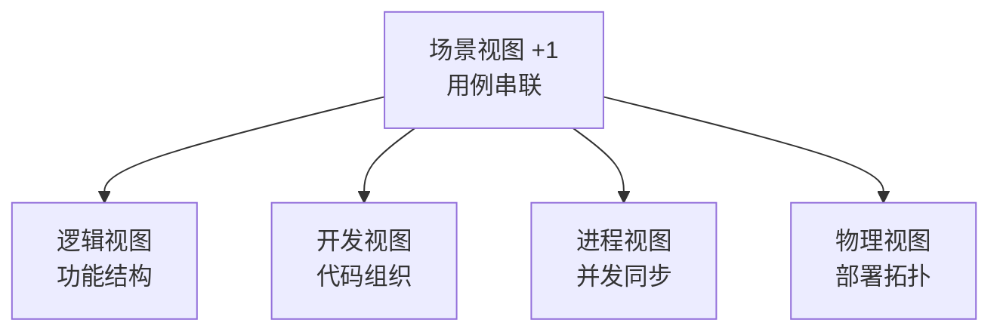
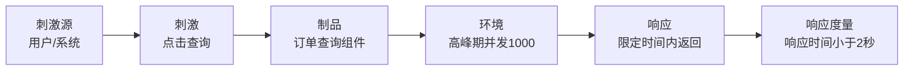
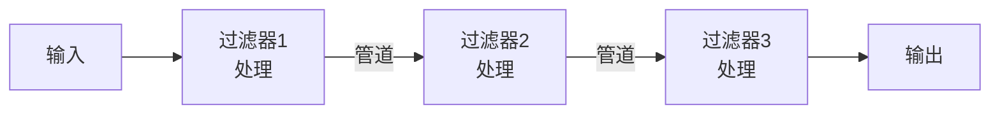
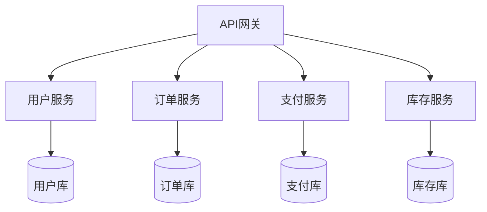
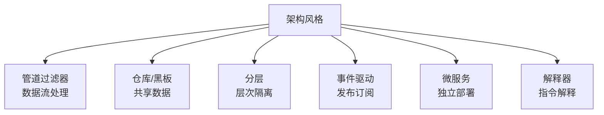
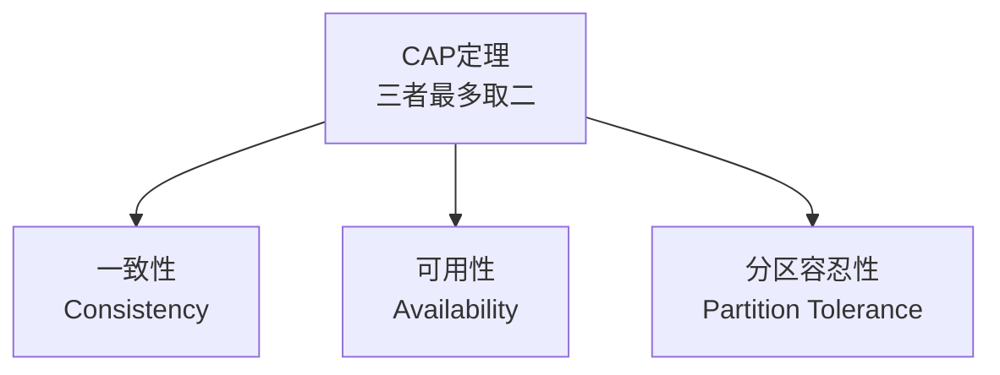
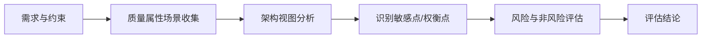

# 系统分析师｜第12章 软件架构设计（完整版备考讲义+章节自测题）

> 适配系统分析师（第2版教材），包含教材删减但真题持续考查内容；上午选择题+案例题备考讲义，论文高频素材。  
> 标签：系统分析师、上午题、软件架构、4+1视图、质量属性、架构风格、ATAM、微服务、备考

[TOC]

## 模块1：软件架构基础

**前置说明**：本章基于系统分析师第2版官方教材，增补第1版删减但历年真题、新考纲仍必考内容，适配上午综合选择题与案例题。  
**模块优先级**：🟡 中等优先级  
**考情分析**：年均0~1道选择题；核心：架构定义、4+1视图、架构与设计区别。

### 1.1 核心知识点精讲

#### 1.1.1 软件架构定义

- **软件架构**：系统的**组件**（Component）及其**连接器**（Connector）、**配置**（Configuration）与**约束**（Constraint）的集合。
- 架构回答：系统由哪些部分构成、如何交互、受什么约束、满足什么质量属性。

#### 1.1.2 4+1 视图模型（高频，重点）

- **逻辑视图**：系统的功能结构（类、对象、模块划分）。
- **开发视图**：开发人员的视角（代码组织、包结构、构件）。
- **进程视图**：运行时并发与同步（进程、线程、通信）。
- **物理视图**：部署拓扑（服务器、网络、硬件映射）。
- **场景视图（+1）**：把上述视图串联的用例场景。

> 记忆：逻辑管功能、开发管代码、进程管并发、物理管部署、场景管串联。

#### 1.1.3 架构与设计、框架的区别

- **架构**：系统高层结构决策（组件、连接、约束）。
- **设计**：模块内部细节（算法、数据结构）。
- **框架**：可复用的半成品骨架（代码层面）。

> 易错：架构是大局、设计是细节、框架是代码骨架。

#### 1.1.4 架构师角色

- 架构师关注：功能需求 + **质量属性（非功能需求）** 的权衡。
- 架构决策影响整个系统生命周期。

#### 1.1.5 高频易错点

1. 4+1视图五个视图名称与职责；
2. 架构管组件连接、设计管内部细节；
3. 架构师核心关注质量属性权衡；
4. 场景视图是+1串联视图。
### 1.2 典型配套例题（真题同源，带完整解析）

#### 例题1 4+1视图

描述系统运行时进程与线程并发同步关系的视图是（）
A. 逻辑视图 B. 开发视图 C. 进程视图 D. 物理视图

> 【解析】进程视图关注运行时并发与同步。  
> 【答案】C

#### 例题2 架构定义

软件架构的核心要素不包括（）
A. 组件 B. 连接器 C. 配置与约束 D. 源代码注释

> 【解析】架构要素：组件、连接器、配置、约束。  
> 【答案】D

### 1.3 课后习题（带完整答案+解析）

**习题1**  
描述系统部署拓扑（服务器、网络）的视图是（）
A. 逻辑视图 B. 进程视图 C. 物理视图 D. 开发视图

> 答案：C  
> 解析：物理视图描述部署拓扑与硬件映射。
**习题2**  
把逻辑、开发、进程、物理视图串联起来的视图是（）
A. 场景视图 B. 数据视图 C. 安全视图 D. 性能视图

> 答案：A  
> 解析：场景视图（+1）用用例串联其他四视图。

---

## 模块2：软件质量属性

**前置说明**：本章基于系统分析师第2版官方教材，增补第1版删减但历年真题、新考纲仍必考内容，适配上午综合选择题与案例题。  
**模块优先级**：🔴 最高优先级（质量属性场景与权衡必考）  
**考情分析**：每年1道左右选择题，案例大题常考；核心：六大质量属性、质量场景、架构战术、属性权衡。

### 2.1 核心知识点精讲

#### 2.1.1 六大核心质量属性（高频）

1. **性能**：响应时间、吞吐量、并发能力。
2. **可用性**：系统正常运行时间比例、故障恢复。
3. **安全性**：防攻击、保密、完整、认证授权。
4. **可修改性**：变更的容易程度。
5. **易用性**：用户使用的容易程度。
6. **可测试性**：测试的容易程度。

> 记忆：性能、可用、安全、可改、易用、可测。
#### 2.1.2 质量属性场景（高频，重点）

质量属性场景六要素：
1. **刺激源**：谁发起刺激（用户/系统/外部）。
2. **刺激**：什么事件（如"用户点击查询"）。
3. **制品**：被刺激的对象（系统/组件）。
4. **环境**：发生的条件（正常/高负载）。
5. **响应**：系统的反应（2秒内返回）。
6. **响应度量**：可测的指标（响应时间<2秒）。

> 记忆：刺激源→刺激→制品→环境→响应→响应度量（六要素）。

#### 2.1.3 架构战术（第2版强化）

架构战术=实现质量属性的底层设计手段：
- **性能战术**：引入并发、资源池、缓存、负载均衡。
- **可用性战术**：冗余、心跳检测、故障转移、恢复。
- **安全战术**：认证、授权、加密、审计。
- **可修改性战术**：模块化、解耦、接口抽象。

#### 2.1.4 质量属性权衡（高频，重点）

- 质量属性常**相互冲突**：
  - **性能 vs 安全性**：加密消耗资源降低性能。
  - **性能 vs 可修改性**：为性能优化可能增加耦合。
  - **可用性 vs 一致性**：分布式中高可用可能牺牲强一致（CAP）。
- 架构师核心工作：识别权衡点，做出合理取舍。

> 易错：没有"完美架构"，只有"权衡后的架构"。
#### 2.1.5 高频易错点

1. 六大质量属性要能识别；
2. 质量场景六要素顺序；
3. 战术是质量属性的实现手段；
4. 质量属性冲突需权衡（性能vs安全典型）。

### 2.2 典型配套例题（真题同源，带完整解析）

#### 例题1 质量属性

"系统故障后5分钟内自动恢复"体现的质量属性是（）
A. 性能 B. 可用性 C. 安全性 D. 易用性

> 【解析】故障恢复能力 → 可用性。  
> 【答案】B

#### 例题2 质量场景

质量属性场景中，"用户在高负载下点击查询"中的"高负载"属于（）
A. 刺激源 B. 刺激 C. 环境 D. 响应

> 【解析】高负载是事件发生的条件 → 环境。  
> 【答案】C

#### 例题3 属性权衡

分布式系统中，为提升可用性而降低数据强一致性，体现了质量属性间的（）
A. 增强 B. 权衡 C. 依赖 D. 包含

> 【解析】可用性与一致性冲突 → 权衡取舍。  
> 【答案】B
### 2.3 课后习题（带完整答案+解析）

**习题1**  
对用户操作进行身份认证与权限控制，体现的质量属性是（）
A. 性能 B. 可用性 C. 安全性 D. 可测试性

> 答案：C  
> 解析：认证授权属于安全性。

**习题2**  
通过缓存、负载均衡提升系统响应速度，属于（）战术
A. 性能战术 B. 可用性战术 C. 安全战术 D. 可修改性战术

> 答案：A  
> 解析：缓存、负载均衡是性能战术。

---

## 模块3：经典架构风格

**前置说明**：本章基于系统分析师第2版官方教材，增补第1版删减但历年真题、新考纲仍必考内容，适配上午综合选择题与案例题（选型大题核心）。  
**模块优先级**：🔴 最高优先级（架构风格选型必考）  
**考情分析**：每年1~2道选择题，案例大题常考；核心：各风格特点、适用场景、风格对比。

### 3.1 核心知识点精讲

#### 3.1.1 主程序-子程序风格

- 结构化方法：主程序调用子程序，层次调用关系。
- 特点：简单直接，适合小型系统；可修改性差。
#### 3.1.2 管道过滤器风格（高频）

- 数据以**流**的方式经过一系列**过滤器**（处理单元）与**管道**（连接）。
- 特点：**高内聚低耦合**、可复用、可并行；不适合交互式应用。
- 典型：Unix命令管道（ls | grep）、编译器词法/语法分析。

#### 3.1.3 仓库风格（高频）

- 所有数据集中存放在**中央仓库**，各组件通过仓库共享数据。
- 子类：**黑板风格**（黑板=共享知识库，多个专家组件协作，AI专家系统典型）。
- 特点：数据共享方便；性能瓶颈在仓库、并发控制复杂。
- 典型：数据库系统、知识库系统、语音识别。
#### 3.1.4 分层架构（高频）

- 系统按层次划分（表现层→业务层→数据层），每层只与相邻层交互。
- 特点：**关注点分离**、可维护性好、易于替换；层次间调用有性能开销。
- 典型：OSI七层、三层B/S架构。

#### 3.1.5 事件驱动架构（隐式调用）

- 组件通过**发布/订阅事件**通信，松耦合（隐式调用）。
- 特点：高度解耦、易扩展；事件顺序难保证、调试困难。
- 典型：GUI消息机制、消息中间件。

#### 3.1.6 客户/服务器与B/S

- **C/S**：客户端+服务器，响应快、交互强，适合局域网。
- **B/S**：浏览器+服务器，免安装、易维护，适合广域网。

#### 3.1.7 微服务架构（高频，第2版强化）

- 把系统拆分为**一组独立部署的小服务**，服务间通过轻量通信（HTTP/RPC）协作。
- 优点：独立部署、技术异构、弹性伸缩、故障隔离。
- 缺点：分布式复杂（网络/事务/一致性）、运维成本高、调试困难。
- 适用：大型复杂系统、频繁迭代、团队规模大。

#### 3.1.8 解释器风格（虚拟机风格）

- 用解释器执行自定义指令/规则（虚拟机模式）。
- 典型：Java虚拟机、脚本语言解释器、规则引擎。

#### 3.1.9 风格对比速记（高频）

| 风格 | 核心 | 典型场景 |
| ---- | ---- | ---- |
| 管道过滤器 | 数据流处理 | Unix、编译器 |
| 仓库/黑板 | 共享数据 | 数据库、专家系统 |
| 分层 | 层次隔离 | 三层架构、OSI |
| 事件驱动 | 发布订阅 | GUI、消息中间件 |
| 微服务 | 独立部署服务 | 大型互联网系统 |
| 解释器 | 指令解释 | JVM、规则引擎 |

#### 3.1.10 高频易错点

1. 管道过滤器高内聚低耦合、数据流；
2. 黑板是仓库子类、AI专家系统；
3. 分层关注点分离、可维护；
4. 微服务独立部署、故障隔离、运维复杂。
### 3.2 典型配套例题（真题同源，带完整解析）

#### 例题1 架构风格识别

Unix命令管道（如 ls | grep）采用（）
A. 仓库风格 B. 管道过滤器风格 C. 黑板风格 D. 分层风格

> 【解析】数据经管道在过滤器间流转 → 管道过滤器。  
> 【答案】B

#### 例题2 黑板风格

多个专家组件通过共享知识库协作解决问题的风格是（）
A. 仓库风格 B. 黑板风格 C. 分层风格 D. 解释器风格

> 【解析】黑板是仓库子类，共享知识库多组件协作，AI专家系统典型。  
> 【答案】B

#### 例题3 微服务特点

下列关于微服务架构说法错误的是（）
A. 服务可独立部署 B. 技术栈可异构 C. 运维成本低 D. 故障可隔离

> 【解析】微服务独立部署、技术异构、故障隔离，但分布式复杂、运维成本高。  
> 【答案】C
### 3.3 课后习题（带完整答案+解析）

**习题1**  
系统按表现层、业务层、数据层划分，每层只与相邻层交互，属于（）
A. 管道过滤器 B. 分层架构 C. 黑板风格 D. 事件驱动

> 答案：B  
> 解析：分层架构关注点分离，层间单向依赖。

**习题2**  
组件通过发布/订阅事件进行通信、高度解耦的风格是（）
A. 主程序-子程序 B. 事件驱动 C. 仓库 D. 解释器

> 答案：B  
> 解析：事件驱动（隐式调用）通过事件发布订阅解耦。

---

## 模块4：分布式架构技术

**前置说明**：本章基于系统分析师第2版官方教材强化内容，适配上午综合选择题与案例题。  
**模块优先级**：🟡 中等优先级（第2版强化，考频上升）  
**考情分析**：年均0~1道选择题；核心：CAP、BASE、分布式事务、服务治理。

### 4.1 核心知识点精讲

#### 4.1.1 CAP 定理（高频，重点）

分布式系统无法同时满足三者，最多满足其二：
- **C 一致性**：所有节点同一时刻看到相同数据。
- **A 可用性**：每个请求都能得到响应（不保证最新）。
- **P 分区容忍性**：网络分区时系统仍能工作。

> 记忆：网络分区不可避免，实际常在C与A之间权衡（CP或AP）。
#### 4.1.2 BASE 理论

- **Basically Available 基本可用**：系统允许部分不可用。
- **Soft state 软状态**：状态可暂时不一致。
- **Eventually consistent 最终一致**：经过一段时间后达到一致。

> 易错：BASE是最终一致性思路，与ACID强一致相对。

#### 4.1.3 一致性类型

- **强一致性**：更新后所有节点立即可见（成本高）。
- **最终一致性**：更新后经过一段时间所有节点一致（高可用常见）。

#### 4.1.4 分布式事务（高频，第2版强化）

- **2PC 两阶段提交**：准备阶段+提交阶段，强一致但阻塞、协调者单点。
- **TCC**：Try（预留）/Confirm（确认）/Cancel（取消），业务补偿，无全局锁。
- **SAGA**：长事务拆分为本地事务序列，失败逐级补偿。

> 记忆：2PC强一致易阻塞；TCC/SAGA柔性事务（最终一致）。
#### 4.1.5 服务治理（高频）

- **服务注册与发现**：服务启动注册、调用方发现（如Nacos、Eureka）。
- **API网关**：统一入口、路由、鉴权、限流。
- **熔断**：下游故障时快速失败，防止雪崩。
- **限流**：控制请求速率，保护系统。
- **降级**：故障时牺牲非核心功能保核心功能。

> 记忆：注册发现管寻址、网关管入口、熔断限流降级保稳定。

#### 4.1.6 高频易错点

1. CAP三选二，分区不可避，常在C/A间权衡；
2. BASE=基本可用+软状态+最终一致；
3. 2PC强一致、TCC/SAGA柔性；
4. 熔断防雪崩、限流控速率、降级保核心。

### 4.2 典型配套例题（真题同源，带完整解析）

#### 例题1 CAP 定理

分布式系统中，当网络分区发生时，为保证可用性而牺牲强一致性，属于（）
A. CP系统 B. AP系统 C. CA系统 D. 单机系统

> 【解析】分区时保可用性 → AP系统（最终一致）。  
> 【答案】B
#### 例题2 分布式事务

采用Try/Confirm/Cancel三步业务补偿实现分布式事务，属于（）
A. 2PC B. TCC C. SAGA D. XA

> 【解析】TCC：Try预留、Confirm确认、Cancel取消。  
> 【答案】B

#### 例题3 服务治理

下游服务故障时快速失败、防止故障蔓延的机制是（）
A. 限流 B. 熔断 C. 降级 D. 网关

> 【解析】熔断：下游故障快速失败，防雪崩。  
> 【答案】B

### 4.3 课后习题（带完整答案+解析）

**习题1**  
BASE理论的核心思想是（）
A. 强一致性 B. 最终一致性 C. 同步复制 D. 单点写入

> 答案：B  
> 解析：BASE=基本可用+软状态+最终一致。

**习题2**  
服务注册与发现、统一入口路由鉴权分别由（）承担
A. 注册中心；API网关 B. 网关；注册中心 C. 熔断器；限流器 D. 数据库；缓存

> 答案：A  
> 解析：注册中心管服务发现，API网关管统一入口。
---

## 模块5：架构评估方法

**前置说明**：本章基于系统分析师第2版官方教材，增补第1版删减但历年真题、新考纲仍必考内容，适配上午综合选择题与案例题（案例高频）。  
**模块优先级**：🔴 最高优先级（ATAM必考）  
**考情分析**：每年1道左右选择题，案例大题常考；核心：ATAM、SAAM、风险/敏感点/权衡点。

### 5.1 核心知识点精讲

#### 5.1.1 ATAM 架构权衡分析方法（高频，重点）

- **ATAM**：基于质量属性场景的架构评估方法，核心是**权衡质量属性**。
- 评估产出（高频辨析）：
  - **风险**：可能导致问题的架构决策。
  - **非风险**：不会导致问题的架构决策。
  - **敏感点**：对某个质量属性影响大的架构决策。
  - **权衡点**：影响**多个**质量属性、需要取舍的决策。

> 记忆：风险=有问题、敏感点=影响单个属性、权衡点=影响多个属性需取舍。
#### 5.1.2 SAAM 软件架构分析方法

- **SAAM**：侧重评估**可修改性**，通过场景对架构进行评估。
- 与ATAM区别：SAAM早期方法、侧重可修改；ATAM更全面、侧重权衡。

#### 5.1.3 架构评估流程

收集场景 → 架构描述与视图分析 → 场景映射到架构 → 识别敏感点/权衡点 → 评估风险 → 形成结论。

#### 5.1.4 高频易错点

1. ATAM核心=权衡质量属性；
2. 敏感点影响一个属性、权衡点影响多个属性；
3. SAAM侧重可修改性；
4. 评估产出：风险/非风险/敏感点/权衡点。

### 5.2 典型配套例题（真题同源，带完整解析）

#### 例题1 ATAM 产出

ATAM评估中，对**多个**质量属性都有显著影响、需要权衡取舍的架构决策称为（）
A. 风险 B. 敏感点 C. 权衡点 D. 非风险

> 【解析】权衡点影响多个质量属性、需取舍；敏感点只影响单个属性。  
> 【答案】C
#### 例题2 评估方法

侧重评估系统可修改性、基于场景的架构评估方法是（）
A. ATAM B. SAAM C. COCOMO D. PERT

> 【解析】SAAM侧重可修改性评估；ATAM侧重权衡。  
> 【答案】B

#### 例题3 风险判断

架构决策"所有服务共用单一数据库"在高并发场景下可能导致性能瓶颈，该决策属于（）
A. 非风险 B. 风险 C. 敏感点 D. 权衡点

> 【解析】可能导致问题（性能瓶颈）的决策 → 风险。  
> 【答案】B

### 5.3 课后习题（带完整答案+解析）

**习题1**  
ATAM评估中，对**单个**质量属性影响大的架构决策称为（）
A. 敏感点 B. 权衡点 C. 风险 D. 非风险

> 答案：A  
> 解析：敏感点对单个质量属性影响大；权衡点影响多个。

**习题2**  
ATAM的核心评估目标是（）
A. 评估代码质量 B. 权衡质量属性 C. 计算开发成本 D. 优化算法

> 答案：B  
> 解析：ATAM架构权衡分析方法，核心是权衡质量属性。
---

## 模块6：架构文档与架构实现

**前置说明**：本章基于系统分析师第2版官方教材，增补第1版删减但历年真题、新考纲仍必考内容，适配上午综合选择题。  
**模块优先级**：🟡 中等优先级  
**考情分析**：年均0~1道选择题；核心：架构文档内容、ADR、架构原型、架构腐化。

### 6.1 核心知识点精讲

#### 6.1.1 架构文档内容

1. 架构概述与目标。
2. **4+1视图**描述。
3. 质量属性说明（含质量场景）。
4. 约束与技术选型。
5. **ADR 架构决策记录**：记录关键架构决策的理由与备选方案。

> 记忆：架构文档=视图+质量属性+约束+决策理由。

#### 6.1.2 架构原型验证

- 在正式开发前构建**架构原型**，验证关键技术可行性、性能、风险。
- 降低架构风险，验证后进入正式开发。

#### 6.1.3 架构腐化（高频）

- **架构腐化**：随着迭代，实际架构偏离设计架构（技术债累积）。
- 原因：快速迭代、缺乏重构、文档缺失。
- 对策：定期架构评审、重构、架构治理。
#### 6.1.4 遗留系统改造策略

- **包装**：保留系统，增加接口封装（API化）。
- **重新开发**：推倒重来（风险高）。
- **逐步迁移**：增量改造、绞杀者模式（新系统逐步替换旧系统功能）。

> 记忆：改造策略：包装、重开发、逐步迁移（绞杀者模式推荐）。

#### 6.1.5 高频易错点

1. ADR记录架构决策理由；
2. 架构原型验证关键技术风险；
3. 架构腐化=实际偏离设计（技术债）；
4. 绞杀者模式逐步替换遗留系统。

### 6.2 典型配套例题（真题同源，带完整解析）

#### 例题1 ADR

记录关键架构决策及其理由、备选方案的文档称为（）
A. SRS B. ADR C. WBS D. DFD

> 【解析】ADR架构决策记录：记录决策理由与备选方案。  
> 【答案】B

#### 例题2 架构腐化

系统长期快速迭代后，实际代码架构逐渐偏离设计架构，这种现象称为（）
A. 架构腐化 B. 架构演进 C. 架构复用 D. 架构评估

> 【解析】实际偏离设计 → 架构腐化（技术债累积）。  
> 【答案】A
### 6.3 课后习题（带完整答案+解析）

**习题1**  
在正式开发前验证关键技术可行性与性能风险，应（）
A. 构建架构原型 B. 直接编码 C. 跳过设计 D. 只写文档

> 答案：A  
> 解析：架构原型在开发前验证关键技术风险。

**习题2**  
新系统以增量方式逐步替换遗留系统功能，属于（）
A. 包装策略 B. 绞杀者模式 C. 推倒重来 D. 无改造

> 答案：B  
> 解析：绞杀者模式：新系统逐步替换旧系统，风险低。

---

## 模块7：架构模式与架构选型

**前置说明**：本章基于系统分析师第2版官方教材，增补第1版删减但历年真题、新考纲仍必考内容，适配上午综合选择题。  
**模块优先级**：🟡 中等优先级  
**考情分析**：年均0~1道选择题；核心：架构模式与风格区别、选型维度、反模式。

### 7.1 核心知识点精讲

#### 7.1.1 架构模式 vs 架构风格

- **架构风格**：系统级的组织方式（管道过滤器、分层等），宏观。
- **架构模式**：解决特定场景问题的可复用方案（微服务、CQRS等），比风格更具体。

> 易错：风格更宏观、模式更具体可落地。
#### 7.1.2 常见架构模式（高频）

- **分层模式**：经典分层。
- **微服务模式**：服务拆分独立部署。
- **事件驱动模式**：消息异步解耦。
- **CQRS 命令查询职责分离**：读写分离模型，提升扩展性。
- **MVVM/MVC**：界面与逻辑分离。

#### 7.1.3 架构选型考量维度（高频）

1. **业务复杂度**：简单系统用简单架构。
2. **团队能力**：团队是否熟悉该架构。
3. **运维成本**：架构的部署运维复杂度。
4. **质量属性诉求**：性能、可用性、可扩展性要求。
5. 技术成熟度、生态支持。

> 记忆：业务、团队、运维、质量属性四维考量。

#### 7.1.4 架构反模式（高频）

- **大泥球（Big Ball of Mud）**：无清晰结构、随意依赖的混乱系统。
- **环形依赖**：模块互相依赖形成环。
- **上帝类/上帝对象**：单个类承担过多职责。
- 识别反模式是架构治理的第一步。
#### 7.1.5 高频易错点

1. 风格宏观、模式具体；
2. 选型看业务/团队/运维/质量属性；
3. 大泥球是最典型反模式；
4. CQRS读写分离提升扩展性。

### 7.2 典型配套例题（真题同源，带完整解析）

#### 例题1 模式与风格

"管道过滤器、分层"属于（），"CQRS、微服务"属于（）
A. 架构风格；架构模式 B. 架构模式；架构风格 C. 设计模式；架构风格 D. 框架；组件

> 【解析】管道过滤器/分层是宏观风格；CQRS/微服务是更具体的模式。  
> 【答案】A

#### 例题2 反模式

系统模块之间随意依赖、无清晰结构、难以维护，属于（）
A. 分层模式 B. 大泥球反模式 C. 微服务模式 D. 事件驱动

> 【解析】无清晰结构、随意依赖 → 大泥球反模式。  
> 【答案】B
#### 例题3 架构选型

选择架构时，首要考虑的因素是（）
A. 技术最新 B. 业务复杂度与团队能力 C. 代码行数 D. 开发人数

> 【解析】选型首要看业务复杂度、团队能力、运维成本、质量属性。  
> 【答案】B

### 7.3 课后习题（带完整答案+解析）

**习题1**  
将读操作与写操作分离、分别优化扩展性的模式是（）
A. CQRS B. MVC C. 单例 D. 工厂

> 答案：A  
> 解析：CQRS命令查询职责分离，读写分离。

**习题2**  
模块之间互相依赖形成环状结构，属于（）
A. 分层模式 B. 环形依赖反模式 C. 黑板风格 D. 管道过滤器

> 答案：B  
> 解析：模块互相依赖成环 → 环形依赖反模式。
---

# 章节总复习综合模拟题（覆盖全部7模块，含答案与解析）

> 说明：题型贴合系统分析师上午真题风格，包含选择+计算，覆盖模块1~7所有核心考点；可直接放在讲义末尾作为章节自测。

## 一、单项选择题（15题）

1. 描述系统功能结构（类、模块）的视图是（）
A. 逻辑视图 B. 开发视图 C. 进程视图 D. 物理视图
> 答案：A

2. 系统故障后自动恢复能力体现的质量属性是（）
A. 性能 B. 可用性 C. 安全性 D. 可测试性
> 答案：B

3. 质量属性场景中"响应时间<2秒"属于（）
A. 刺激 B. 环境 C. 响应度量 D. 制品
> 答案：C

4. Unix命令管道（ls | grep）采用的架构风格是（）
A. 仓库 B. 管道过滤器 C. 黑板 D. 分层
> 答案：B

5. 多个专家组件通过共享知识库协作解决复杂问题，属于（）
A. 黑板风格 B. 管道过滤器 C. 主程序-子程序 D. 解释器
> 答案：A
6. 微服务架构的优点不包括（）
A. 独立部署 B. 技术异构 C. 运维成本低 D. 故障隔离
> 答案：C

7. 分布式系统网络分区时，保可用性而牺牲强一致性，属于（）
A. CP B. AP C. CA D. AC
> 答案：B

8. 采用Try/Confirm/Cancel业务补偿的分布式事务方案是（）
A. 2PC B. TCC C. XA D. 单库事务
> 答案：B

9. 下游服务故障时快速失败、防止雪崩的机制是（）
A. 限流 B. 熔断 C. 降级 D. 网关
> 答案：B

10. ATAM评估中，对多个质量属性影响大、需权衡的决策是（）
A. 风险 B. 敏感点 C. 权衡点 D. 非风险
> 答案：C

11. 侧重评估可修改性的架构评估方法是（）
A. ATAM B. SAAM C. COCOMO D. CMMI
> 答案：B
12. 记录关键架构决策及理由的文档是（）
A. SRS B. ADR C. WBS D. RTM
> 答案：B

13. 长期迭代后实际架构偏离设计架构，称为（）
A. 架构演进 B. 架构腐化 C. 架构复用 D. 架构评估
> 答案：B

14. 模块之间随意依赖、无清晰结构的反模式是（）
A. 分层 B. 大泥球 C. 微服务 D. 黑板
> 答案：B

15. 将读操作与写操作分离的架构模式是（）
A. MVC B. CQRS C. MVP D. 单例
> 答案：B

## 二、计算题（4道，真题风格）

### 计算题1【质量属性场景分析】

请为质量属性"性能"编写一个完整的质量场景（含六要素）。
> 【解析】
> 刺激源：在线用户；刺激：点击"查询订单"；制品：订单查询组件；环境：高峰期（并发1000）；响应：系统在限定时间内返回查询结果；响应度量：平均响应时间<2秒、99%请求<3秒。
> 答案：六要素齐全即完整场景
### 计算题2【架构风格选型判断】

场景A：编译器需按阶段顺序处理源程序（词法→语法→语义）；场景B：AI专家系统需多个专家组件共享知识协作推理。分别选择何种架构风格？
> 【解析】
> 场景A：数据按阶段流式处理 → 管道过滤器风格（编译器经典应用）。
> 场景B：多专家组件共享知识库 → 黑板风格（仓库子类）。
> 答案：A管道过滤器；B黑板风格

### 计算题3【CAP约束分析】

某电商系统在网络分区时必须保证用户可下单（可用性），但允许订单数据短暂不一致后同步。请分析系统在CAP中的取舍及理由。
> 【解析】
> 分区时保可用性 → 放弃强一致性，属于AP系统。
> 订单数据采用最终一致性（BASE）：写入后异步同步，短暂不一致可接受。
> 若要求强一致则需CP（分区时可能拒绝服务）。
> 答案：AP系统+最终一致性；电商下单场景可接受
### 计算题4【ATAM敏感点/权衡点识别】

某架构决策"使用缓存提升性能"，同时带来数据一致性风险（缓存与数据库可能不一致）。请判断该决策属于敏感点还是权衡点，并说明理由。
> 【解析】
> 该决策同时影响性能（正面）与一致性/可用性（负面）多个质量属性，需要权衡取舍 → 权衡点。
> 若某决策只显著影响单一属性（如仅影响性能），则为敏感点。
> 答案：权衡点（同时影响多个质量属性）

## 三、简答概念题（3道）

1. 简述4+1视图模型及其作用
> 【解析】4+1视图：逻辑视图（功能结构）、开发视图（代码组织）、进程视图（并发同步）、物理视图（部署拓扑），场景视图（+1）用用例把四视图串联。作用：从不同干系人视角全面描述系统架构，逻辑视图给业务与设计、开发视图给开发、进程视图给并发设计、物理视图给运维，场景视图验证一致性。
2. 简述ATAM架构评估方法的核心思想与主要产出
> 【解析】ATAM架构权衡分析方法：以质量属性场景为核心，把架构决策与质量属性关联，识别架构决策对质量属性的影响并进行权衡。主要产出：风险（可能导致问题的决策）、非风险（无问题的决策）、敏感点（对单一质量属性影响大的决策）、权衡点（对多个质量属性影响大需取舍的决策）。

3. 简述微服务架构的优缺点及适用场景
> 【解析】优点：服务独立部署、技术栈异构、弹性伸缩、故障隔离、团队自治；缺点：分布式复杂性（网络延迟、分布式事务、一致性）、运维成本高、服务间调试困难、部署治理复杂。适用：大型复杂系统、需求频繁迭代、团队规模大、需要独立扩展的业务域。
