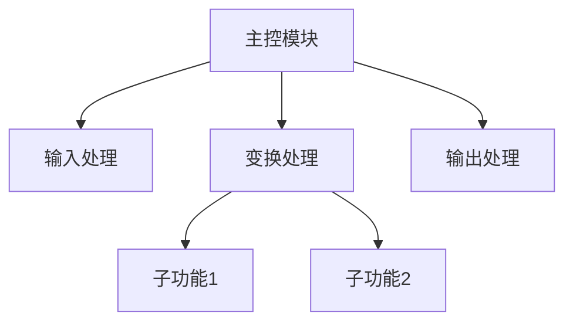
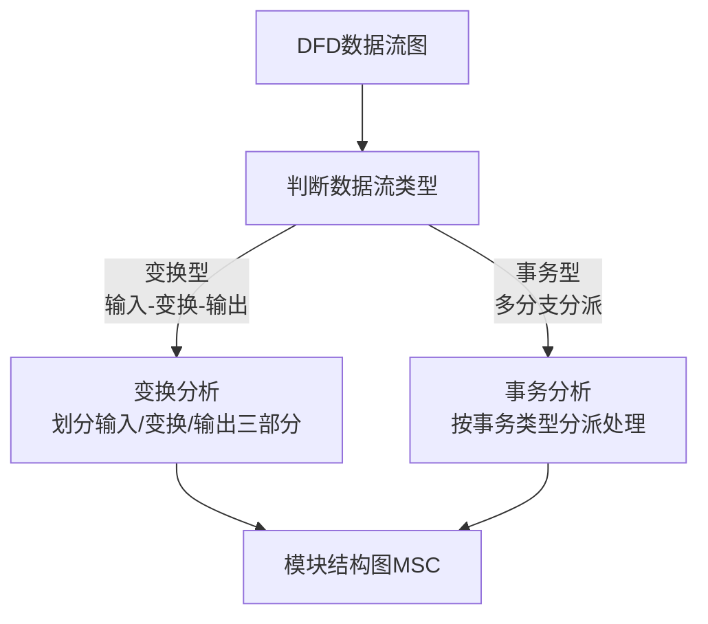
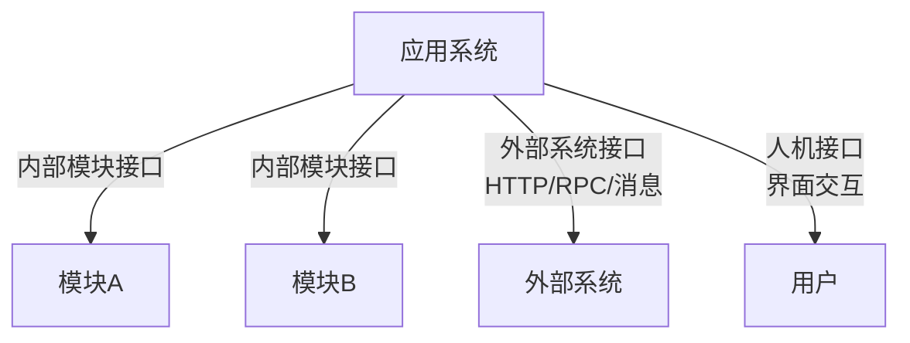
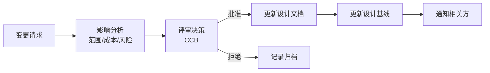

# 系统分析师｜第13章 系统设计（完整版备考讲义+章节自测题）

> 适配系统分析师（第2版教材），包含教材删减但真题持续考查内容；上午选择题+案例题备考讲义，论文高频素材。  
> 标签：系统分析师、上午题、系统设计、概要设计、详细设计、数据设计、人机界面、设计评审、备考

[TOC]

## 模块1：系统设计基础

**前置说明**：本章基于系统分析师第2版官方教材，增补第1版删减但历年真题、新考纲仍必考内容，适配上午综合选择题与案例题。  
**模块优先级**：🟡 中等优先级  
**考情分析**：年均0~1道选择题；核心：设计阶段定位、概要/详细设计任务、设计原则、输入输出物。

### 1.1 核心知识点精讲

#### 1.1.1 系统设计阶段定位（高频）

- 系统设计承接**需求工程与架构设计**，是"把架构蓝图落地为可实现的模块与接口"的阶段。
- 全流程：需求工程 → 架构设计 → **概要设计（总体设计）→ 详细设计** → 编码实现 → 测试。
- 输入：SRS、架构设计文档；输出：概要设计说明书、详细设计说明书。
#### 1.1.2 概要设计（总体设计）任务

- **划分子系统/模块**：把系统分解为可独立设计实现的模块。
- **定义模块间接口**：确定模块间调用关系、数据与控制信息传递。
- **全局数据结构设计**：核心数据组织与存储方案。
- **部署方案设计**：软硬件环境、网络拓扑、物理分布。
- **设计约束**：性能、安全、合规等非功能约束落实。

#### 1.1.3 详细设计任务

- 模块内部逻辑与**算法**设计。
- **局部数据结构**设计。
- 模块接口的**细节**（参数、异常、超时、重试）。
- 编码规格与单元测试准备。

> 记忆：架构定结构、概要定模块接口、详细定内部逻辑。
#### 1.1.4 系统设计原则（高频）

1. **模块化**：系统分解为可独立设计实现的模块。
2. **抽象**：只暴露必要接口，隐藏实现细节。
3. **信息隐藏**：模块内部细节对外不可见。
4. **高内聚低耦合**：模块内部紧密、模块之间松散。
5. **一致性**：命名、接口、错误处理风格统一。
6. **可复用、可扩展**：为后续演化预留空间。

> 易错：信息隐藏是抽象的具体化，两者常一起考。

#### 1.1.5 高频易错点

1. 概要设计管模块划分与接口、详细设计管内部逻辑；
2. 设计输入是SRS+架构文档；
3. 六大设计原则要能识别；
4. 信息隐藏与抽象区别。

### 1.2 典型配套例题（真题同源，带完整解析）

#### 例题1 设计阶段

确定子系统划分与模块间接口，属于（）
A. 需求分析 B. 概要设计 C. 详细设计 D. 编码实现

> 【解析】概要设计（总体设计）负责子系统划分、模块接口定义。  
> 【答案】B
#### 例题2 设计原则

模块对外只暴露必要接口、隐藏内部实现细节，体现（）
A. 模块化 B. 信息隐藏 C. 高内聚 D. 可复用

> 【解析】隐藏内部实现细节 → 信息隐藏。  
> 【答案】B

### 1.3 课后习题（带完整答案+解析）

**习题1**  
模块内部逻辑与算法设计属于（）
A. 概要设计 B. 详细设计 C. 架构设计 D. 需求分析

> 答案：B  
> 解析：详细设计负责模块内部逻辑、算法、局部数据结构。

**习题2**  
系统设计阶段的输入文档是（）
A. SRS与架构设计文档 B. 测试报告 C. 用户手册 D. 运维手册

> 答案：A  
> 解析：设计输入=SRS+架构设计文档，输出=概要/详细设计说明书。

---

## 模块2：概要设计（总体设计）

**前置说明**：本章基于系统分析师第2版官方教材，增补第1版删减但历年真题、新考纲仍必考内容，适配上午综合选择题与案例题（案例高频）。  
**模块优先级**：🔴 最高优先级（模块划分与结构图必考）  
**考情分析**：每年1~2道选择题，案例大题常考；核心：结构化设计、模块结构图、扇入扇出、子系统划分。
### 2.1 核心知识点精讲

#### 2.1.1 结构化设计 SD（高频）

- **结构化设计**：以 DFD（数据流图）为基础，按一定策略映射出**模块结构图（MSC）**。
- 两种映射策略：
  - **变换分析**：针对"变换型"数据流（输入→变换→输出），从变换中心向两侧分解模块。
  - **事务分析**：针对"事务型"数据流（多分支），按事务类型分派处理模块。

> 记忆：变换型走变换分析、事务型走事务分析。

#### 2.1.2 模块结构图 MSC

- **模块**：具有名字、完成特定功能的程序单元。
- **调用关系**：上层模块调用下层模块。
- 图中元素：模块（方框）、调用（带箭头的连线）、数据信息（空心圆箭头）、控制信息（实心圆箭头）。

#### 2.1.3 扇入与扇出（高频，重点）

- **扇出（Fan-out）**：一个模块直接**调用**的下层模块个数。
  - 扇出过大：模块职责过重、控制复杂；一般建议**3~4个以内**。
  - 扇出过小（如1）：可考虑并入上层。
- **扇入（Fan-in）**：直接**调用**该模块的上层模块个数。
  - 扇入越大越好：说明复用度高、公共模块。

> 易错：扇入越大越好（复用）、扇出适中（3~4），扇出过大需拆分。

#### 2.1.4 子系统划分策略（高频）

- 按**业务域**划分：贴合业务组织，减少跨域耦合。
- 按**数据**划分：数据内聚，适合数据密集系统。
- 按**功能**划分：功能内聚，简单直接。
- 按**部署**划分：贴合物理分布（分布式、多节点）。
- 原则：子系统之间**高内聚、低耦合**，接口清晰。

#### 2.1.5 系统异常与故障处理机制

- 全局异常分类：输入异常、资源异常、外部系统异常、并发冲突。
- 处理机制：错误码、异常重试、降级、日志审计、故障隔离。
- 设计目标：故障可发现、可定位、可恢复。
#### 2.1.6 变换分析与事务分析映射（高频）

> 记忆：先判类型（变换/事务），再按策略映射为模块结构图。

#### 2.1.7 高频易错点

1. 变换分析/事务分析适用对象；
2. 扇入越大越好、扇出适中（3~4）；
3. 子系统划分按业务/数据/功能/部署；
4. MSC元素：模块、调用、数据信息、控制信息。

### 2.2 典型配套例题（真题同源，带完整解析）

#### 例题1 扇入扇出

某模块被5个上层模块直接调用，且直接调用4个下层模块，则该模块的扇入、扇出为（）
A. 扇入5，扇出4 B. 扇入4，扇出5 C. 扇入5，扇出5 D. 扇入4，扇出4

> 【解析】被5个上层调用→扇入5；调用4个下层→扇出4。  
> 【答案】A
#### 例题2 结构化设计

针对事务型数据流，应采用（）
A. 变换分析 B. 事务分析 C. 数据字典 D. 判定表

> 【解析】事务型数据流→事务分析；变换型→变换分析。  
> 【答案】B

#### 例题3 子系统划分

为贴合分布式部署环境，子系统划分宜优先采用（）
A. 按业务域 B. 按数据 C. 按部署 D. 按功能

> 【解析】分布式多节点环境按部署划分，贴合物理分布。  
> 【答案】C

### 2.3 课后习题（带完整答案+解析）

**习题1**  
某模块扇出为1，且结构简单，设计上宜（）
A. 并入上层模块 B. 继续拆分子模块 C. 增加扇出 D. 保持不动

> 答案：A  
> 解析：扇出过小（如1）可考虑并入上层，减少调用层次。

**习题2**  
扇入越大说明（）
A. 模块越复杂 B. 复用度越高 C. 内聚越差 D. 耦合越高

> 答案：B  
> 解析：扇入=被调用次数，越大说明公共复用程度越高。

---
## 模块3：详细设计

**前置说明**：本章基于系统分析师第2版官方教材，增补第1版删减但历年真题、新考纲仍必考内容，适配上午综合选择题与案例题。  
**模块优先级**：🟡 中等优先级  
**考情分析**：年均0~1道选择题；核心：详细设计工具、接口设计三类、接口要素、设计约束。

### 3.1 核心知识点精讲

#### 3.1.1 详细设计工具（高频）

1. **程序流程图（FC）**：经典流程表达，箭头可任意转向。
2. **N-S盒图**：结构化约束，无箭头跳转，强制结构化。
3. **PAD图**：树形结构，支持递归与逐步细化。
4. **判定表**：多条件多动作组合，消除歧义。
5. **判定树**：判定表的图形化，直观但规模大时复杂。

> 记忆：FC自由易转向、N-S强制结构化、PAD树形可细化、判定表/树管多条件。

#### 3.1.2 模块算法与局部数据结构设计

- 算法设计：确定处理逻辑、复杂度控制、边界处理。
- 局部数据结构：模块私有数据、缓存、状态机。
- 与全局数据设计衔接，遵循信息隐藏。
#### 3.1.3 接口设计三大类（高频）

1. **内部模块接口**：模块间调用、参数传递、返回约定。
2. **外部系统接口**：与第三方系统、遗留系统、硬件设备的交互。
3. **人机接口**：用户操作界面与交互流程。

> 记忆：内部接口管模块间、外部接口管系统间、人机接口管用户。

#### 3.1.4 接口设计要素（高频）

- **数据格式**：字段、类型、长度、编码。
- **通信协议**：HTTP/RPC/消息队列/数据库直连。
- **异常与超时**：超时阈值、重试次数、失败降级。
- **版本兼容**：接口版本号、兼容策略（向前/向后兼容）。

> 易错：接口设计必须包含异常、超时、重试与版本兼容，不只是数据格式。

#### 3.1.5 设计约束

- 性能约束：响应时间、吞吐量、并发数。
- 安全约束：认证、授权、加密、审计。
- 合规约束：数据合规、行业标准。
- 软硬件约束：操作系统、中间件、部署环境。

#### 3.1.6 高频易错点

1. 三类接口要分清；
2. 接口要素含异常/超时/重试/版本兼容；
3. 判定表处理多条件组合；
4. 设计约束含性能/安全/合规/软硬件。
### 3.2 典型配套例题（真题同源，带完整解析）

#### 例题1 详细设计工具

强制结构化、不允许任意转向的详细设计工具是（）
A. 程序流程图 B. N-S盒图 C. PAD图 D. 判定树

> 【解析】N-S盒图无箭头跳转，强制结构化。  
> 【答案】B

#### 例题2 接口设计

接口设计中，明确超时阈值、重试次数与失败降级策略，属于接口的（）
A. 数据格式 B. 异常与超时设计 C. 版本兼容 D. 通信协议

> 【解析】超时、重试、降级属于接口异常与超时设计。  
> 【答案】B

### 3.3 课后习题（带完整答案+解析）

**习题1**  
系统与第三方支付系统之间的交互接口属于（）
A. 内部模块接口 B. 外部系统接口 C. 人机接口 D. 数据接口

> 答案：B  
> 解析：与外部第三方系统的交互 → 外部系统接口。

**习题2**  
多条件多动作组合决策，为避免歧义宜采用（）
A. 程序流程图 B. 判定表 C. N-S盒图 D. PAD图

> 答案：B  
> 解析：判定表适合多条件多动作组合，消除歧义。

---
## 模块4：数据设计

**前置说明**：本章基于系统分析师第2版官方教材，增补第1版删减但历年真题、新考纲仍必考内容，适配上午综合选择题与案例题（案例高频）。  
**模块优先级**：🔴 最高优先级（三层数据模型必考）  
**考情分析**：每年1~2道选择题，案例大题常考；核心：三层数据模型、ER转关系、物理设计、数据完整性。

### 4.1 核心知识点精讲

#### 4.1.1 数据设计目标

- 数据结构合理、存储组织高效、数据完整、访问性能满足要求。
- 数据设计贯穿：概念模型 → 逻辑模型 → 物理模型。

#### 4.1.2 三层数据模型（高频，重点）

1. **概念数据模型**：ER图，描述业务实体与关系，与实现无关。
2. **逻辑数据模型**：关系模式（表、字段、主外键、约束），面向具体数据库类型。
3. **物理数据模型**：物理存储设计（索引、分区、表空间、存储引擎）。

> 记忆：概念管业务实体、逻辑管关系表、物理管存储实现。
#### 4.1.3 ER图转关系模式规则（高频）

- 实体 → 关系表；属性 → 字段。
- **1:1** 联系：可并入任一端表，或独立成表。
- **1:N** 联系：在N端表中加入1端主键作为外键。
- **M:N** 联系：**独立成表**，包含两端主键。
- 三元联系：独立成表，包含各实体主键。

> 易错：M:N必须独立成表；1:N在N端加外键；1:1可并入任一端。

#### 4.1.4 物理设计（高频）

- **索引设计**：加速查询，但增删改有代价、占存储；区分聚簇/非聚簇。
- **分区**：按范围/哈希/列表分区，提升管理性与查询性能。
- **表空间/存储引擎选型**：依据访问模式（OLTP/OLAP）。
- 冗余与反规范化：为性能适度冗余，需保证一致性维护。

> 记忆：索引提速有代价；分区提管理；OLTP/OLAP选型不同。

#### 4.1.5 数据完整性（高频）

1. **实体完整性**：主键唯一且非空。
2. **参照完整性**：外键引用有效（不引用不存在的主键）。
3. **用户自定义完整性**：业务规则约束（如年龄>0）。

> 记忆：实体靠主键、参照靠外键、自定义靠业务规则。

#### 4.1.6 数据字典与数据归档

- **数据字典**：集中描述数据项、数据结构、数据流、数据存储的元数据。
- 数据冗余控制：消除不必要重复。
- 历史数据归档策略：冷热分离、定期归档、保留策略。
#### 4.1.7 高频易错点

1. 三层模型转换顺序不可倒；
2. M:N独立成表；
3. 索引提速有代价；
4. 实体完整性=主键、参照完整性=外键。

### 4.2 典型配套例题（真题同源，带完整解析）

#### 例题1 数据模型

与具体数据库实现无关、描述业务实体关系的模型是（）
A. 概念数据模型 B. 逻辑数据模型 C. 物理数据模型 D. 存储模型

> 【解析】概念数据模型（ER图）与实现无关。  
> 【答案】A

#### 例题2 ER转关系

实体A与实体B为M:N联系，转换关系模式时该联系应（）
A. 并入A表 B. 并入B表 C. 独立成表 D. 不处理

> 【解析】M:N联系必须独立成表，包含两端主键。  
> 【答案】C

### 4.3 课后习题（带完整答案+解析）

**习题1**  
1:N联系转换时，外键应加在（）
A. 1端表 B. N端表 C. 两端表 D. 独立表

> 答案：B  
> 解析：1:N在N端表中加入1端主键作为外键。

**习题2**  
主键唯一且非空，保证的是（）
A. 实体完整性 B. 参照完整性 C. 自定义完整性 D. 域完整性

> 答案：A  
> 解析：实体完整性由主键保证：唯一且非空。

---
## 模块5：人机界面设计与输入输出设计

**前置说明**：本章基于系统分析师第2版官方教材，增补第1版删减但历年真题、新考纲仍必考内容，适配上午综合选择题。  
**模块优先级**：🟡 中等优先级  
**考情分析**：年均0~1道选择题；核心：界面设计原则、输入校验、输出设计、交互模型、可用性评估。

### 5.1 核心知识点精讲

#### 5.1.1 人机界面设计原则（高频）

1. **一致性**：界面风格、操作方式统一。
2. **容错性**：允许误操作、可撤销。
3. **易学性**：降低学习成本。
4. **高效性**：常用操作快捷。
5. **防误操作**：危险操作二次确认。

> 记忆：一致、容错、易学、高效、防误。

#### 5.1.2 输入设计（高频）

- **输入校验**：
  - 类型校验：数字/日期/文本。
  - 范围校验：数值边界。
  - 格式校验：身份证、电话、邮箱。
  - 逻辑校验：业务规则（如结束时间>开始时间）。
- **输入简化**：默认值、下拉选择、自动填充。
- **防重复提交**：幂等控制、按钮禁用。

> 易错：输入校验四类（类型/范围/格式/逻辑）要能区分。
#### 5.1.3 输出设计（高频）

- 输出形式：报表、屏幕展示、文件导出（Excel/PDF）、打印。
- 输出内容设计：字段选择、格式、排序、汇总。
- **输出权限控制**：不同角色可见不同数据（敏感数据脱敏）。
- 输出性能：大数据量分页、异步导出。

> 记忆：输出设计=内容+格式+权限+性能。

#### 5.1.4 人机交互模型

- 交互方式：菜单、表单、对话框、向导、快捷键。
- 错误提示：明确、可操作（指出错误位置与修改方法）。
- 帮助机制：上下文帮助、操作指引。
- 反馈机制：操作结果即时反馈（成功/失败/进度）。

#### 5.1.5 可用性评估

- 评估指标：任务成功率、完成时间、错误率、用户满意度。
- 方法：可用性测试、启发式评估、用户访谈、问卷调查。

#### 5.1.6 高频易错点

1. 界面五原则；
2. 输入校验四类；
3. 输出需权限控制；
4. 可用性指标：成功率/时间/错误率/满意度。

### 5.2 典型配套例题（真题同源，带完整解析）

#### 例题1 输入校验

校验"结束日期必须晚于开始日期"属于（）
A. 类型校验 B. 范围校验 C. 格式校验 D. 逻辑校验

> 【解析】业务规则关系校验 → 逻辑校验。  
> 【答案】D
#### 例题2 界面原则

"系统各页面删除操作均需二次确认"，体现的界面设计原则是（）
A. 一致性 B. 容错性 C. 防误操作 D. 高效性

> 【解析】危险操作二次确认 → 防误操作原则。  
> 【答案】C

### 5.3 课后习题（带完整答案+解析）

**习题1**  
校验手机号格式（11位、1开头）属于（）
A. 类型校验 B. 范围校验 C. 格式校验 D. 逻辑校验

> 答案：C  
> 解析：手机号格式规则 → 格式校验。

**习题2**  
衡量系统可用性的指标不包括（）
A. 任务成功率 B. 错误率 C. 界面美观度 D. 完成时间

> 答案：C  
> 解析：可用性指标=任务成功率、完成时间、错误率、满意度；美观度非核心指标。

---
## 模块6：系统设计评审与设计优化

**前置说明**：本章基于系统分析师第2版官方教材，增补第1版删减但历年真题、新考纲仍必考内容，适配上午综合选择题。  
**模块优先级**：🟡 中等优先级  
**考情分析**：年均0~1道选择题；核心：评审类型、质量检查点、设计权衡、设计变更、设计文档。

### 6.1 核心知识点精讲

#### 6.1.1 设计评审类型（高频）

- **概要设计评审**：评审模块划分、接口、总体方案是否符合需求与架构。
- **详细设计评审**：评审模块内部逻辑、算法、数据结构。
- 评审形式：**审查（Inspection）**与**走查（Walkthrough）**。
  - 审查：正式、有流程、按检查表。
  - 走查：非正式、由设计者讲解。

> 记忆：审查正式按检查表、走查非正式讲解。

#### 6.1.2 设计质量检查点（高频）

1. **一致性**：设计与需求、架构一致。
2. **完整性**：功能与非功能需求全覆盖。
3. **可测试性**：设计便于测试验证。
4. **性能**：满足性能指标。
5. **安全性**：安全需求落实。
6. **可维护性**：易变更、易理解。

> 记忆：一致、完整、可测、性能、安全、可维护。
#### 6.1.3 设计权衡（高频）

- **性能 vs 可维护性**：为性能过度优化增加复杂度。
- **冗余 vs 成本**：冗余提升可用性但增加成本。
- **安全 vs 易用**：安全校验增加操作成本。
- **通用 vs 专用**：通用可复用但实现复杂。

> 记忆：没有完美设计，只有权衡后的设计。

#### 6.1.4 设计变更管理（高频）

- 变更来源：需求变更、缺陷修复、技术演进。
- 变更流程：提交变更 → 影响分析 → 评审决策（CCB）→ 更新设计 → 更新基线 → 通知相关方。

> 记忆：变更=影响分析→评审→更新设计→更新基线。

#### 6.1.5 设计文档（高频）

- **概要设计说明书**：系统结构、模块划分、接口、全局数据结构、部署方案。
- **详细设计说明书**：模块内部逻辑、算法、局部数据结构、接口细节。

> 易错：概要设计说明书含模块划分与接口；详细设计说明书含内部逻辑。

#### 6.1.6 高频易错点

1. 审查正式、走查非正式；
2. 六项质量检查点；
3. 设计权衡三对矛盾；
4. 设计文档两类说明书内容。
### 6.2 典型配套例题（真题同源，带完整解析）

#### 例题1 设计评审

正式、按检查表逐项核对的设计评审形式是（）
A. 走查 B. 审查 C. 头脑风暴 D. 用户访谈

> 【解析】审查正式、有流程、按检查表；走查非正式。  
> 【答案】B

#### 例题2 设计文档

包含模块划分、模块间接口、全局数据结构的文档是（）
A. 详细设计说明书 B. 概要设计说明书 C. SRS D. 测试计划

> 【解析】概要设计说明书含模块划分、接口、全局数据结构。  
> 【答案】B

### 6.3 课后习题（带完整答案+解析）

**习题1**  
设计变更管理中，评估变更对范围、成本、风险的影响发生在（）
A. 变更提交前 B. 影响分析阶段 C. 编码阶段 D. 测试阶段

> 答案：B  
> 解析：变更流程中影响分析阶段评估范围/成本/风险。

**习题2**  
"为提升性能导致模块复杂度显著上升"，体现的设计权衡是（）
A. 冗余 vs 成本 B. 性能 vs 可维护性 C. 安全 vs 易用 D. 通用 vs 专用

> 答案：B  
> 解析：性能优化以牺牲可维护性（复杂度）为代价。

---
# 章节总复习综合模拟题（覆盖全部6模块，含答案与解析）

> 说明：题型贴合系统分析师上午真题风格，包含选择+计算，覆盖模块1~6所有核心考点；可直接放在讲义末尾作为章节自测。

## 一、单项选择题（15题）

1. 子系统划分与模块间接口定义属于（）
A. 需求分析 B. 概要设计 C. 详细设计 D. 架构设计
> 答案：B

2. 模块对外只暴露必要接口、隐藏内部细节，体现（）
A. 模块化 B. 抽象 C. 信息隐藏 D. 高内聚
> 答案：C

3. 某模块被6个上层模块调用，并调用3个下层模块，其扇入、扇出为（）
A. 扇入6、扇出3 B. 扇入3、扇出6 C. 扇入6、扇出6 D. 扇入3、扇出3
> 答案：A

4. 变换型数据流应采用（）
A. 事务分析 B. 变换分析 C. 判定表 D. 数据字典
> 答案：B

5. 强制结构化、不允许任意转向的详细设计工具是（）
A. 程序流程图 B. N-S盒图 C. PAD图 D. 判定树
> 答案：B
6. 系统与外部第三方支付系统间的交互接口属于（）
A. 内部模块接口 B. 外部系统接口 C. 人机接口 D. 数据接口
> 答案：B

7. 概念数据模型采用（）
A. 关系表 B. ER图 C. 索引 D. 存储引擎
> 答案：B

8. 实体A与实体B为M:N联系，转换关系模式时该联系（）
A. 并入A表 B. 并入B表 C. 独立成表 D. 不处理
> 答案：C

9. 参照完整性由（）保证
A. 主键 B. 外键 C. 索引 D. 分区
> 答案：B

10. 校验"结束日期必须晚于开始日期"属于（）
A. 类型校验 B. 范围校验 C. 格式校验 D. 逻辑校验
> 答案：D

11. "危险操作需二次确认"体现的界面设计原则是（）
A. 一致性 B. 容错性 C. 防误操作 D. 高效性
> 答案：C

12. 正式、按检查表逐项核对的设计评审形式是（）
A. 走查 B. 审查 C. 访谈 D. 问卷
> 答案：B
13. 包含模块内部逻辑、算法、局部数据结构的文档是（）
A. 概要设计说明书 B. 详细设计说明书 C. SRS D. 测试计划
> 答案：B

14. 为提升性能导致模块复杂度显著上升，体现的设计权衡是（）
A. 冗余 vs 成本 B. 性能 vs 可维护性 C. 安全 vs 易用 D. 通用 vs 专用
> 答案：B

15. 数据完整性中"实体完整性"由（）保证
A. 外键唯一 B. 主键唯一且非空 C. 检查约束 D. 触发器
> 答案：B

## 二、计算题（4道，真题风格）

### 计算题1【扇入扇出评估】

某模块结构图中，模块M直接调用A、B、C三个模块；模块D、E、F均直接调用公共模块G。请计算模块M的扇出，以及模块G的扇入，并评价其合理性。
> 【解析】
> 模块M扇出=3（直接调用A、B、C），处于建议范围3~4内，合理。
> 模块G扇入=3（D、E、F三个模块调用），扇入大说明复用度高，合理。
> 答案：M扇出3；G扇入3；均合理
### 计算题2【模块耦合内聚判定】

模块甲完成"输入校验、格式转换、业务计算"三类功能；模块乙与模块丙直接共享同一全局数据结构。分别判定模块甲的内聚类型与模块乙、丙间的耦合类型。
> 【解析】
> 模块甲完成多类不相关功能 → 逻辑内聚（或偶然内聚）偏弱，应拆分。
> 模块乙、丙通过共享全局数据结构交互 → 公共耦合（或内容耦合），耦合较强，应改为数据耦合/通过接口传递。
> 答案：甲内聚弱（逻辑内聚）；乙丙公共耦合（强耦合，应改进）

### 计算题3【索引性能估算】

某订单表1000万行，单条记录1KB，某查询按订单号等值查询，无索引时全表扫描平均需扫描全部1000万行；建立B+树索引后，每次查询仅需4次磁盘IO即可定位。请估算建立索引前后的查询IO成本对比，并说明索引的代价。
> 【解析】
> 无索引：全表扫描需读取约1000万×1KB≈10GB数据，按每次IO 8KB计，约需125万次IO，成本极高。
> 有索引：每次查询约4次IO（B+树层级），成本可忽略不计。
> 索引代价：占用存储空间、增删改需维护索引（每次DML额外IO）、降低写入性能。
> 答案：索引大幅降低查询IO（125万次→4次），但以存储与写入维护为代价
### 计算题4【数据模型转换推导】

某业务：一个"客户"可下多个"订单"，一个"订单"包含多个"商品"（同一商品可在多个订单中出现），订单需记录下单时间、金额。请完成：①画出概念模型中的实体与联系；②转换为关系模式（写出表名与关键字段）。
> 【解析】
> ①实体：客户、订单、商品；联系：客户1:N订单；订单M:N商品（中间表记录数量）。
> ②关系模式：
> 客户（客户号PK，客户名，联系方式）；
> 订单（订单号PK，客户号FK，下单时间，金额）；
> 订单明细（订单号FK，商品号FK，数量，单价）——M:N联系独立成表；
> 商品（商品号PK，商品名，价格）。
> 答案：三个实体+两个联系；M:N独立成订单明细表

## 三、简答概念题（3道）

1. 简述概要设计与详细设计的主要任务区别
> 【解析】概要设计（总体设计）：划分子系统/模块、定义模块间接口、全局数据结构、部署方案、设计约束；详细设计：模块内部逻辑与算法、局部数据结构、接口细节、编码规格。概要设计面向系统整体结构，详细设计面向模块内部实现。

2. 简述人机界面设计的基本原则
> 【解析】一致性（风格与操作统一）、容错性（允许误操作、可撤销）、易学性（降低学习成本）、高效性（常用操作快捷）、防误操作（危险操作二次确认）。同时需配合良好的错误提示、帮助机制与操作反馈。

3. 简述设计评审的作用与主要检查点
> 【解析】设计评审在编码前发现设计缺陷，降低返工成本。主要检查点：一致性（与需求架构一致）、完整性（需求全覆盖）、可测试性、性能、安全性、可维护性。评审形式分为正式的审查（按检查表）与非正式的走查（设计者讲解）。
