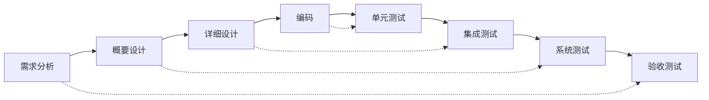
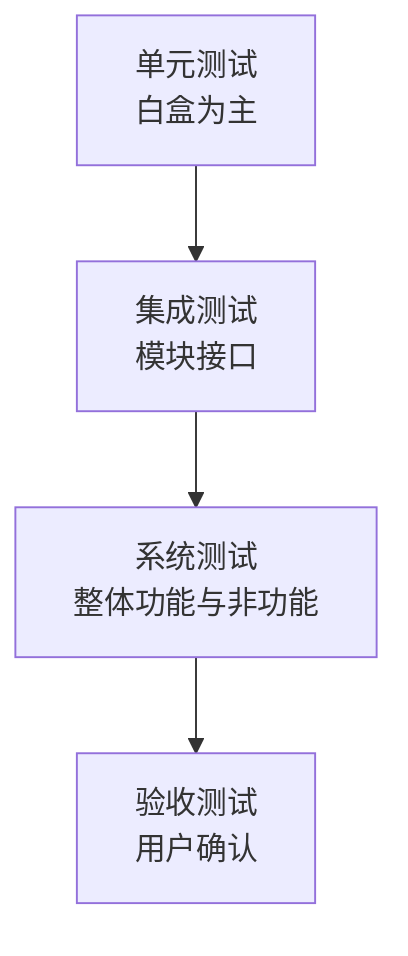
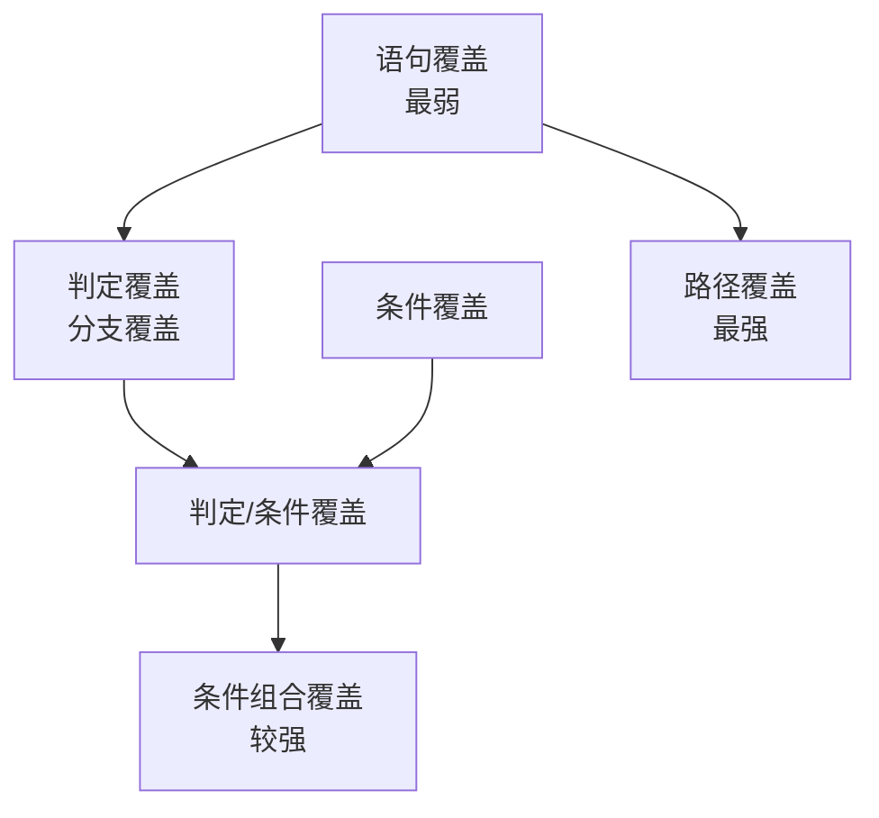
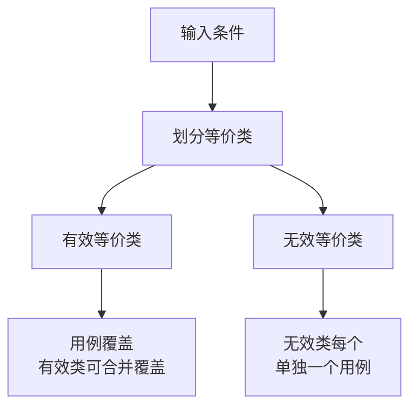
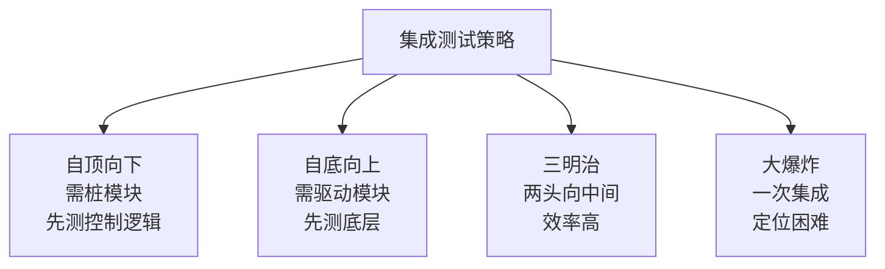
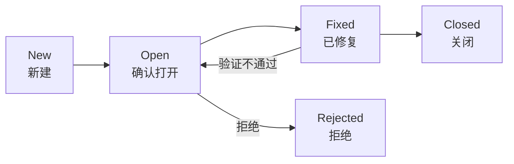

# 系统分析师｜第14章 软件实现与测试（完整版备考讲义+章节自测题）

> 适配系统分析师（第2版教材），包含教材删减但真题持续考查内容；上午选择题+案例题备考讲义，论文高频素材。  
> 标签：系统分析师、上午题、软件实现、软件测试、白盒测试、黑盒测试、McCabe、等价类、边界值、缺陷管理、备考

[TOC]

## 模块1：软件实现基础

**前置说明**：本章基于系统分析师第2版官方教材，增补第1版删减但历年真题、新考纲仍必考内容，适配上午综合选择题与案例题。  
**模块优先级**：🟡 中等优先级  
**考情分析**：年均0~1道选择题；核心：语言选型、编码规范、代码评审、代码重构、代码质量。

### 1.1 核心知识点精讲

#### 1.1.1 程序设计语言分类与选型（高频）

- 按层次：机器语言、汇编语言、高级语言。
- 按执行方式：**编译型**（整体翻译，效率高）、**解释型**（逐句解释，灵活）。
- 按范型：面向过程（C）、面向对象（Java/C++）、函数式、逻辑式。
- 选型考虑：应用领域、运行效率、开发效率、团队熟悉度、生态。

> 易错：编译型效率高、解释型灵活；选型是权衡不是唯一解。
#### 1.1.2 编码规范与编程风格

- **命名规范**：有意义的命名、统一风格（驼峰/下划线）。
- **注释规范**：必要处注释、避免过多无意义注释。
- **代码布局**：缩进、空行、行长控制。
- 目的：提升**可读性**与**可维护性**，降低缺陷引入率。

#### 1.1.3 代码评审（高频）

- **代码走查（Walkthrough）**：非正式，开发者讲解，同事提意见。
- **代码审查（Inspection）**：正式，按检查表逐项核对，有流程与记录。
- 评审价值：提前发现缺陷（比测试更早）、知识共享、质量门禁。

> 记忆：走查非正式、审查正式按检查表（与设计评审一致）。

#### 1.1.4 代码重构（高频）

- **重构**：在不改变外部行为的前提下，改善代码内部结构。
- 时机：坏味道出现时（重复代码、过长方法、过深嵌套）。
- 手法：提取方法、重命名、消除重复、简化条件。
- 注意：重构需配合**测试保障**（回归测试）。

> 易错：重构改变内部结构、不改变外部行为；必须有测试保护。
#### 1.1.5 代码质量属性

- **可读性**：他人易理解。
- **可维护性**：易修改、易扩展。
- **效率**：时间与空间性能。
- **健壮性**：异常输入处理得当。
- 代码质量靠：规范+评审+重构+测试共同保障。

#### 1.1.6 高频易错点

1. 编译/解释区别；
2. 走查与审查区别；
3. 重构不改变外部行为；
4. 代码质量多属性共同保障。

### 1.2 典型配套例题（真题同源，带完整解析）

#### 例题1 语言执行方式

逐句翻译并立即执行，灵活但效率较低的翻译方式是（）
A. 编译 B. 解释 C. 汇编 D. 链接

> 【解析】解释型逐句翻译执行，灵活但效率低于编译型。  
> 【答案】B

#### 例题2 代码评审

正式、按检查表逐项核对代码的评审方式是（）
A. 走查 B. 审查 C. 测试 D. 调试

> 【解析】代码审查（Inspection）正式、按检查表。  
> 【答案】B
### 1.3 课后习题（带完整答案+解析）

**习题1**  
代码重构的正确理解是（）
A. 重写全部功能 B. 不改变外部行为改善内部结构 C. 增加新功能 D. 删除无用代码即可

> 答案：B  
> 解析：重构在不改变外部行为前提下改善内部结构。

**习题2**  
下列不属于代码质量属性的是（）
A. 可读性 B. 可维护性 C. 代码行数 D. 健壮性

> 答案：C  
> 解析：代码行数是度量指标，非质量属性本身。

---

## 模块2：软件测试基础

**前置说明**：本章基于系统分析师第2版官方教材，增补第1版删减但历年真题、新考纲仍必考内容，适配上午综合选择题与案例题。  
**模块优先级**：🔴 最高优先级（测试模型与层次必考）  
**考情分析**：每年1~2道选择题，案例大题常考；核心：测试目的原则、V/W模型、测试层次。

### 2.1 核心知识点精讲

#### 2.1.1 测试目的与原则（高频）

- **测试目的**：发现缺陷（证明有错），而非证明无错。
- 测试原则：
  1. **尽早测试**（缺陷越早发现修复成本越低）。
  2. **穷举测试不可能**：需抽样策略。
  3. **缺陷群集**：缺陷集中在少数模块（二八定律）。
  4. **杀虫剂悖论**：同一测试重复执行发现新缺陷能力下降。
  5. 测试用例需包含**预期结果**。
  6. 重要测试：回归测试（修改后重测）。

> 记忆：尽早、不穷举、群集、悖论、带预期、回归。
#### 2.1.2 测试模型（高频，重点）

- **V模型**：需求→概要设计→详细设计→编码；对应验收→系统→集成→单元测试。测试与开发阶段**一一对应**。
- **W模型**：开发与测试**并行**（双V），测试贯穿各阶段（更早介入）。
- **H模型**：测试活动独立成流程，随时可启动。

> 记忆：V模型测试与开发阶段对应；W模型测试并行更早介入。

#### 2.1.3 测试层次（高频）

- **单元测试**：最小模块，白盒为主。
- **集成测试**：模块间接口与集成。
- **系统测试**：整体功能与非功能（性能/安全/兼容）。
- **验收测试**：用户确认（α/β测试）。

> 记忆：单元管模块、集成管接口、系统管整体、验收管用户。

#### 2.1.4 测试与开发的关系

- 测试**尽早介入**需求与设计（评审阶段即参与）。
- 测试计划与开发计划同步制定。
- 测试人员独立于开发更利于发现缺陷。

#### 2.1.5 高频易错点

1. 测试目的是发现缺陷；
2. V/W/H模型区别；
3. 测试四层次对应关系；
4. 杀虫剂悖论与缺陷群集含义。

### 2.2 典型配套例题（真题同源，带完整解析）

#### 例题1 测试原则

"缺陷往往集中在少数模块中"体现的测试原则是（）
A. 尽早测试 B. 缺陷群集 C. 杀虫剂悖论 D. 穷举不可能

> 【解析】缺陷集中在少数模块 → 缺陷群集（二八定律）。  
> 【答案】B

#### 例题2 测试模型

开发与测试并行进行、测试贯穿各阶段的模型是（）
A. V模型 B. W模型 C. 瀑布模型 D. 螺旋模型

> 【解析】W模型开发测试并行（双V），更早介入。  
> 【答案】B

### 2.3 课后习题（带完整答案+解析）

**习题1**  
V模型中，与"详细设计"对应的测试层次是（）
A. 单元测试 B. 集成测试 C. 系统测试 D. 验收测试

> 答案：B  
> 解析：V模型详细设计对应集成测试（概要设计对应系统测试）。

**习题2**  
"同一测试用例反复执行，发现新缺陷能力下降"是（）
A. 缺陷群集 B. 杀虫剂悖论 C. 帕累托原则 D. 木桶效应

> 答案：B  
> 解析：重复测试发现新缺陷能力下降 → 杀虫剂悖论。

---
## 模块3：白盒测试技术

**前置说明**：本章基于系统分析师第2版官方教材，增补第1版删减但历年真题、新考纲仍必考内容，适配上午综合选择题与案例题（计算题主力）。  
**模块优先级**：🔴 最高优先级（覆盖标准+圈复杂度必考）  
**考情分析**：每年1~2道选择题/计算题；核心：六种逻辑覆盖、McCabe圈复杂度、基本路径法。

### 3.1 核心知识点精讲

#### 3.1.1 逻辑覆盖六种标准（高频，重点）

以判定覆盖为例（if A and B then ...）：
1. **语句覆盖**：每条可执行语句至少执行一次（最弱）。
2. **判定覆盖（分支覆盖）**：每个判定的真/假分支至少各一次。
3. **条件覆盖**：每个判定中的每个条件的真/假至少各一次。
4. **判定/条件覆盖**：判定与条件均覆盖。
5. **条件组合覆盖**：每个判定中所有条件组合至少一次（较强）。
6. **路径覆盖**：所有可能路径至少执行一次（最强，但不绝对强于组合覆盖）。

> 记忆：语句<判定<条件组合；路径覆盖最强；覆盖标准间不是简单包含关系。
#### 3.1.2 覆盖标准强弱关系（高频）

> 易错：条件组合覆盖不一定覆盖所有路径；路径覆盖不一定满足条件组合覆盖，二者独立最强。

#### 3.1.3 McCabe 圈复杂度（高频，计算重点）

- 公式：**V(G)=E−N+2**（E边数、N节点数）
- 或：**V(G)=判定节点数+1**（每个if/while/case算一个判定节点）
- 或：**V(G)=区域数**
- 意义：衡量程序复杂度；圈复杂度越高，测试路径越多、越难维护。

> 记忆：三个公式任选；判定节点数+1最快。

#### 3.1.4 基本路径测试法

- 由圈复杂度确定**独立路径数**。
- 步骤：画控制流图 → 算圈复杂度 → 确定独立路径集合 → 设计测试用例。
- 保证每条独立路径至少执行一次。
#### 3.1.5 循环测试

- 简单循环：0次、1次、2次、M次、M-1、M+1次。
- 嵌套循环：由内向外测试。
- 串接循环：独立测试再组合。

#### 3.1.6 高频易错点

1. 六种覆盖标准定义与强弱；
2. 圈复杂度三公式；
3. 基本路径法步骤；
4. 循环边界取值。

### 3.2 典型配套例题（真题同源，带完整解析）

#### 例题1 覆盖标准

程序含判定"if A and B"，为满足**条件覆盖**至少需要用例（）
A. 1个 B. 2个 C. 3个 D. 4个

> 【解析】条件覆盖要求每个条件真假各一次：A真/A假、B真/B假，2个用例即可（A真B假、A假B真）。  
> 【答案】B

#### 例题2 圈复杂度

控制流图节点数N=8，边数E=10，圈复杂度为（）
A. 2 B. 3 C. 4 D. 5

> 【解析】V(G)=E−N+2=10−8+2=4。  
> 【答案】C
### 3.3 课后习题（带完整答案+解析）

**习题1**  
程序含两个串联判定，圈复杂度为（）
A. 1 B. 2 C. 3 D. 4

> 答案：C  
> 解析：V(G)=判定节点数+1=2+1=3。

**习题2**  
最弱的逻辑覆盖标准是（）
A. 语句覆盖 B. 判定覆盖 C. 条件组合覆盖 D. 路径覆盖

> 答案：A  
> 解析：语句覆盖最弱，路径覆盖最强。

---

## 模块4：黑盒测试技术

**前置说明**：本章基于系统分析师第2版官方教材，增补第1版删减但历年真题、新考纲仍必考内容，适配上午综合选择题与案例题（计算高频）。  
**模块优先级**：🔴 最高优先级（等价类/边界值必考）  
**考情分析**：每年1~2道选择题/计算题；核心：等价类划分、边界值分析、因果图、正交试验。

### 4.1 核心知识点精讲

#### 4.1.1 等价类划分（高频，重点）

- 把输入域划分为若干**等价类**，同类中任取一个代表即可。
- **有效等价类**：满足需求的输入。
- **无效等价类**：不满足需求的输入。
- 设计步骤：分析输入条件 → 划分等价类 → 编号 → 设计用例（有效类一个用例覆盖多个，无效类**一个用例只覆盖一个**）。

> 记忆：有效类可合并、无效类必须单独（防止缺陷被掩盖）。
#### 4.1.2 边界值分析（高频，重点）

- 缺陷往往集中在**边界**附近。
- 原则：选取边界值、边界两侧的值（略小于/略大于）。
- 如输入范围[1,100]：取1、100（边界），0、101（两侧），再加典型值50。

> 记忆：边界值+边界两侧值（上点、内点、离点）。

#### 4.1.3 因果图与判定表

- **因果图**：分析输入条件（因）与输出动作（果）的逻辑关系（与/或/非/约束）。
- **判定表**：条件桩、动作桩、条件组合、动作项；多条件组合决策。

> 记忆：因果图管因果关系分析、判定表管组合表达。

#### 4.1.4 正交试验法

- 从大量组合中选取**有代表性的组合**测试，控制组合爆炸。
- 用正交表安排用例，均衡搭配、覆盖主要交互。

#### 4.1.5 场景法与错误推测

- **场景法**：从用户使用场景（基本流/备选流）设计用例。
- **错误推测法**：凭经验猜测易出错处设计用例。

#### 4.1.6 高频易错点

1. 有效类合并、无效类单独；
2. 边界值+两侧值；
3. 正交试验控组合爆炸；
4. 场景法重用户流程。
### 4.2 典型配套例题（真题同源，带完整解析）

#### 例题1 等价类

输入成绩范围为0~100，下列属于无效等价类的是（）
A. 60 B. 100 C. -5 D. 50

> 【解析】-5超出范围，属于无效等价类。  
> 【答案】C

#### 例题2 边界值

输入范围[1,100]，边界值分析应选取（）
A. 1、100 B. 0、1、100、101 C. 50 D. 1、50、100

> 【解析】边界值+两侧：0、1、100、101（上点、内点、离点）。  
> 【答案】B

#### 例题3 等价类用例

某输入为0~100整数，无效等价类划分后设计用例时（）
A. 多个无效类可合并为一个用例 B. 每个无效类单独设计用例 C. 无需无效类用例 D. 只测有效类

> 【解析】无效等价类必须每个单独一个用例，防止缺陷被掩盖。  
> 【答案】B

### 4.3 课后习题（带完整答案+解析）

**习题1**  
多个条件组合过多导致用例爆炸时，宜采用（）
A. 边界值分析 B. 正交试验法 C. 错误推测 D. 场景法

> 答案：B  
> 解析：正交试验从大量组合中选代表组合，控制爆炸。

**习题2**  
从用户基本流与备选流设计测试用例的方法是（）
A. 等价类划分 B. 场景法 C. 因果图 D. 判定表

> 答案：B  
> 解析：场景法基于基本流/备选流设计用例。

---
## 模块5：测试过程与策略

**前置说明**：本章基于系统分析师第2版官方教材，增补第1版删减但历年真题、新考纲仍必考内容，适配上午综合选择题与案例题（案例高频）。  
**模块优先级**：🔴 最高优先级（集成策略与系统测试必考）  
**考情分析**：每年1~2道选择题，案例大题常考；核心：集成策略、系统测试类型、验收/回归测试。

### 5.1 核心知识点精讲

#### 5.1.1 单元测试与集成测试

- **单元测试**：针对最小模块，白盒为主，需要**桩模块**（被调模块替身）与**驱动模块**（调用被测模块的替身）。
- **集成测试**：把单元组装起来，验证模块间接口与交互。

> 记忆：驱动模块调用被测、桩模块模拟被调。

#### 5.1.2 集成测试策略（高频，重点）

- **自顶向下**：从顶层逐层向下集成，需桩模块；先测控制逻辑，底层接口晚测。
- **自底向上**：从底层模块向上集成，需驱动模块；底层先验证，顶层接口晚测。
- **三明治**：自顶向下+自底向上结合（两头向中间），效率高。
- **大爆炸**：一次性全部集成；简单但缺陷定位困难。

> 记忆：顶向下用桩、底向上用驱动、三明治结合、大爆炸难定位。
#### 5.1.3 系统测试类型（高频）

1. **功能测试**：验证功能符合需求。
2. **性能测试**：响应时间、吞吐量；含**负载测试**（正常极限）、**压力测试**（超负荷崩溃点）、**容量测试**（最大数据量）、**并发测试**（多用户竞争）。
3. **安全测试**：漏洞、越权、注入等。
4. **兼容性测试**：平台、浏览器、版本兼容。
5. **恢复测试**：故障后恢复能力。
6. **安装/卸载测试**。

> 记忆：功能+性能（负载/压力/容量/并发）+安全+兼容+恢复+安装。

#### 5.1.4 验收测试（高频）

- **α测试**：开发环境，由用户在开发者指导下进行。
- **β测试**：真实环境，由用户独立进行（不控环境）。

> 易错：α在开发环境有指导、β在真实环境独立进行。

#### 5.1.5 回归测试

- **回归测试**：修改后重新执行相关测试，验证未引入新缺陷。
- 时机：缺陷修复后、需求变更后、重构后。
- 用例选择：优先重跑受影响功能与核心流程用例。

#### 5.1.6 高频易错点

1. 四种集成策略优缺点；
2. 性能测试四类区别；
3. α/β测试环境区别；
4. 回归测试时机。
### 5.2 典型配套例题（真题同源，带完整解析）

#### 例题1 集成策略

自顶向下集成测试需要（）
A. 驱动模块 B. 桩模块 C. 测试报告 D. 用户参与

> 【解析】自顶向下先测上层，下层未就绪用桩模块模拟。  
> 【答案】B

#### 例题2 测试类型

不断加大负载直至系统崩溃，以确定系统极限的测试是（）
A. 负载测试 B. 压力测试 C. 容量测试 D. 并发测试

> 【解析】压力测试：超负荷直至崩溃点。  
> 【答案】B

#### 例题3 验收测试

在真实使用环境、由用户独立进行的验收测试是（）
A. α测试 B. β测试 C. 单元测试 D. 集成测试

> 【解析】β测试在真实环境由用户独立进行。  
> 【答案】B

### 5.3 课后习题（带完整答案+解析）

**习题1**  
验证系统在最大数据量下仍能正常运行，属于（）
A. 负载测试 B. 容量测试 C. 压力测试 D. 安全测试

> 答案：B  
> 解析：容量测试验证最大数据量下的能力。

**习题2**  
缺陷修复后重跑相关用例以验证未引入新缺陷，属于（）
A. 单元测试 B. 回归测试 C. 验收测试 D. 冒烟测试

> 答案：B  
> 解析：修改后重新执行相关测试 → 回归测试。

---
## 模块6：测试管理与质量保障

**前置说明**：本章基于系统分析师第2版官方教材，增补第1版删减但历年真题、新考纲仍必考内容，适配上午综合选择题与案例题。  
**模块优先级**：🟡 中等优先级  
**考情分析**：年均0~1道选择题；核心：测试计划、测试用例、缺陷管理、测试度量。

### 6.1 核心知识点精讲

#### 6.1.1 测试计划内容

1. 测试范围与目标。
2. 测试资源（人员、环境、工具）。
3. 测试进度安排。
4. 测试策略与方法选型。
5. **风险与应对**。

> 记忆：范围、资源、进度、策略、风险。

#### 6.1.2 测试用例要素（高频）

- 用例编号、用例名称、**前置条件**、**测试步骤**、**输入数据**、**预期结果**、实际结果、状态。
- 好用例：可复现、可判定（有预期结果）、独立性。

> 易错：预期结果必须有，否则无法判定测试通过与否。

#### 6.1.3 缺陷管理（高频）

- **缺陷等级**：致命（系统崩溃/数据丢失）、严重、一般、轻微。
- **缺陷生命周期**：New（新建）→ Open（打开/确认）→ Fixed（修复）→ Closed（关闭）；修复后验证不通过可 Reopen；拒绝可 Rejected。

> 记忆：新建→打开→修复→关闭；验证不通过重开。
#### 6.1.4 测试报告

- 测试结果统计（用例执行数、通过率、缺陷分布）。
- 遗留缺陷与风险说明。
- 结论：是否可发布。

#### 6.1.5 自动化测试

- 适用：回归测试、重复性高、大数据量、跨平台兼容。
- 不适用：探索性测试、频繁变化界面。
- 价值：提高效率、保证一致性；成本：脚本维护。

#### 6.1.6 测试度量（高频）

- **缺陷密度** = 缺陷数 / KLOC（千行代码）。
- **测试覆盖率** = 已测代码 / 总代码（语句/分支覆盖率）。
- **缺陷清除率 DRE** = 发布前发现的缺陷 / 总缺陷。

> 记忆：缺陷密度按千行、覆盖率按已测占比、DRE按发布前后占比。

#### 6.1.7 高频易错点

1. 测试用例要素含预期结果；
2. 缺陷生命周期状态；
3. 自动化适用回归；
4. 三种度量口径。

### 6.2 典型配套例题（真题同源，带完整解析）

#### 例题1 缺陷管理

缺陷状态"Fixed"表示（）
A. 已确认打开 B. 已修复待验证 C. 已关闭 D. 已拒绝

> 【解析】Fixed=已修复，待验证；验证通过转Closed。  
> 【答案】B
#### 例题2 测试度量

某模块1000行代码发布前发现20个缺陷，发布后用户又发现5个，缺陷清除率DRE为（）
A. 80% B. 75% C. 20% D. 95%

> 【解析】DRE=发布前缺陷/(发布前+发布后)=20/25=80%。  
> 【答案】A

### 6.3 课后习题（带完整答案+解析）

**习题1**  
测试用例中必须包含、用于判定测试通过与否的要素是（）
A. 用例编号 B. 预期结果 C. 测试人员 D. 执行时间

> 答案：B  
> 解析：预期结果是判定依据，不可或缺。

**习题2**  
缺陷密度=缺陷数/（）
A. 测试用例数 B. 千行代码KLOC C. 测试天数 D. 模块数

> 答案：B  
> 解析：缺陷密度=缺陷数/千行代码（KLOC）。

---

# 章节总复习综合模拟题（覆盖全部6模块，含答案与解析）

> 说明：题型贴合系统分析师上午真题风格，包含选择+计算，覆盖模块1~6所有核心考点；可直接放在讲义末尾作为章节自测。

## 一、单项选择题（15题）
1. 逐句翻译执行、灵活但效率较低的翻译方式是（）
A. 编译 B. 解释 C. 汇编 D. 链接
> 答案：B

2. 不改变外部行为、改善代码内部结构的活动是（）
A. 重构 B. 重写 C. 优化需求 D. 代码删除
> 答案：A

3. "缺陷集中在少数模块"体现的测试原则是（）
A. 尽早测试 B. 缺陷群集 C. 杀虫剂悖论 D. 穷举不可能
> 答案：B

4. 开发与测试并行、测试贯穿各阶段的模型是（）
A. V模型 B. W模型 C. 瀑布模型 D. 喷泉模型
> 答案：B

5. V模型中，与"概要设计"对应的测试层次是（）
A. 单元测试 B. 集成测试 C. 系统测试 D. 验收测试
> 答案：C

6. 程序含判定"if A or B"，满足条件覆盖至少需要用例（）
A. 1 B. 2 C. 3 D. 4
> 答案：B

7. 控制流图N=10、E=13，圈复杂度为（）
A. 3 B. 4 C. 5 D. 6
> 答案：C

8. 最弱的逻辑覆盖标准是（）
A. 语句覆盖 B. 判定覆盖 C. 条件组合覆盖 D. 路径覆盖
> 答案：A
9. 输入范围[10,20]，边界值分析应选取（）
A. 10、20 B. 9、10、20、21 C. 15 D. 10、15、20
> 答案：B

10. 无效等价类设计用例时（）
A. 多个合并一个用例 B. 每个单独一个用例 C. 不设计 D. 只测有效类
> 答案：B

11. 多条件组合爆炸时宜采用（）
A. 边界值 B. 正交试验 C. 错误推测 D. 场景法
> 答案：B

12. 自底向上集成测试需要（）
A. 桩模块 B. 驱动模块 C. 用户参与 D. 测试报告
> 答案：B

13. 不断加大负载直至崩溃以确定极限，属于（）
A. 负载测试 B. 压力测试 C. 容量测试 D. 并发测试
> 答案：B

14. 在真实环境由用户独立进行的验收测试是（）
A. α测试 B. β测试 C. 单元测试 D. 冒烟测试
> 答案：B

15. 缺陷状态"Fixed"表示（）
A. 已打开 B. 已修复待验证 C. 已关闭 D. 已拒绝
> 答案：B
## 二、计算题（4道，真题风格）

### 计算题1【McCabe圈复杂度】

某程序控制流图有8个节点、11条边，另含3个判定节点。请分别用边-节点公式和判定节点公式计算圈复杂度，并说明含义。
> 【解析】
> V(G)=E−N+2=11−8+2=5。
> V(G)=判定节点数+1=3+1=4。
> 两公式结果应一致；本例不一致说明流图结构特殊（如存在复合条件），实际以区域数或精确流图为准。真题中通常两法结果一致。
> 含义：圈复杂度=独立路径数，决定基本路径测试用例数下限。
> 答案：V(G)=5（边节点公式）；独立路径数约5

### 计算题2【逻辑覆盖用例判定】

程序片段：if (A and B) then X else Y。请设计满足①语句覆盖②判定覆盖③条件覆盖的最少测试用例。
> 【解析】
> 语句覆盖：至少执行X和Y一次 → 用例1：A真B真（执行X）；用例2：A假B假（执行Y）。共2个。
> 判定覆盖：真/假分支各一次 → 同上2个即可。
> 条件覆盖：A真/A假、B真/B假均出现 → 用例1：A真B假（条件覆盖A真B假，走Y）；用例2：A假B真（A假B真，走Y）。共2个即可满足条件覆盖（无需覆盖判定真分支）。
> 答案：语句/判定各2个；条件覆盖2个（A真B假、A假B真）
### 计算题3【等价类划分】

某登录功能：用户名3~8位字母，密码6~12位任意字符。请划分有效/无效等价类并设计最少测试用例。
> 【解析】
> 用户名有效等价类：3~8位字母（1个）；无效：长度<3、长度>8、含非字母字符（3个）。
> 密码有效等价类：6~12位任意字符（1个）；无效：长度<6、长度>12（2个）。
> 用例设计：有效类1个用例（用户名合法+密码合法）；无效类每个单独1个用例，共1+3+2=6个（可组合覆盖验证）。
> 答案：有效类2个、无效类5个；最少用例6个（有效1+无效5）

### 计算题4【边界值分析】

某温度输入范围为-10℃~50℃，步进1℃。请用边界值分析给出测试取值并说明依据。
> 【解析】
> 上点（边界值）：-10、50。
> 内点（范围内典型值）：0（或任意中间值）。
> 离点（边界两侧）：-11、51。
> 共5个取值：-11、-10、0、50、51。
> 依据：缺陷集中在边界附近，需覆盖边界值及两侧相邻值。
> 答案：-11、-10、0、50、51

## 三、简答概念题（3道）

1. 简述白盒测试与黑盒测试的区别
> 【解析】白盒测试（结构测试）：依据程序内部逻辑结构设计用例，覆盖语句/分支/路径，如逻辑覆盖、路径测试、McCabe圈复杂度；黑盒测试（功能测试）：依据需求与规格说明设计用例，不关心内部实现，如等价类划分、边界值分析、因果图、判定表。白盒重结构覆盖，黑盒重功能验证；单元测试多用白盒，系统/验收测试多用黑盒。
2. 简述四种集成测试策略及其优缺点
> 【解析】自顶向下：从顶层逐层集成，需桩模块，先验证控制逻辑，缺点底层接口验证晚；自底向上：从底层集成，需驱动模块，底层先验证，缺点顶层控制逻辑验证晚；三明治：自顶向下与自底向上结合，两头向中间集成，效率高；大爆炸：一次性全部集成，简单快捷，但缺陷定位困难。选择依据：系统结构、模块就绪顺序、缺陷定位要求。

3. 简述测试用例的基本要素与设计原则
> 【解析】要素：用例编号、名称、前置条件、测试步骤、输入数据、预期结果、实际结果、状态。设计原则：预期结果必须明确（可判定）；用例可复现；用例相互独立；覆盖等价类与边界；无效类单独用例；兼顾正常与异常路径；用例可追踪到需求。
