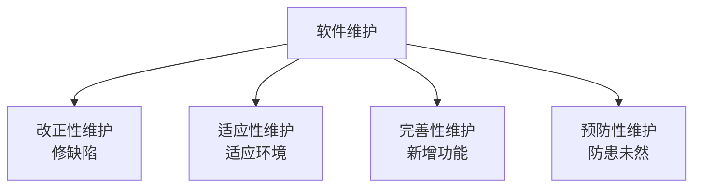
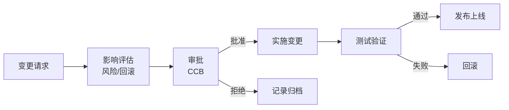
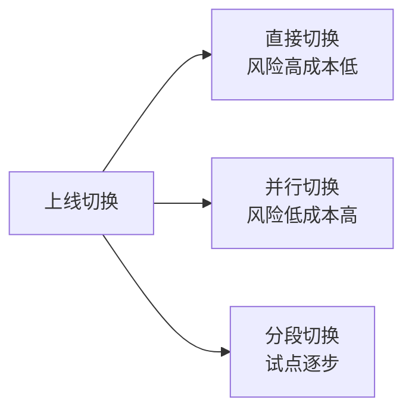

# 系统分析师｜第15章 系统运行与维护（完整版备考讲义+章节自测题）

> 适配系统分析师（第2版教材），包含教材删减但真题持续考查内容；上午选择题+案例题备考讲义，论文高频素材。  
> 标签：系统分析师、上午题、系统运行与维护、软件维护、SLA、变更管理、系统切换、数据迁移、RTO、RPO、备考

[TOC]

## 模块1：系统运行维护基础

**前置说明**：本章基于系统分析师第2版官方教材，增补第1版删减但历年真题、新考纲仍必考内容，适配上午综合选择题与案例题。  
**模块优先级**：🟡 中等优先级  
**考情分析**：年均0~1道选择题；核心：维护阶段定位、维护四大类型、维护困难点。

### 1.1 核心知识点精讲

#### 1.1.1 维护在系统生命周期中的位置（高频）

- 系统上线后进入**运行维护阶段**，是生命周期中**时间最长、成本最高**的阶段。
- 维护不只是修Bug：包括适应环境变化、完善功能、预防风险。

> 记忆：维护阶段占生命周期大部分时间与成本。
#### 1.1.2 维护四大类型（高频，必考辨析）

1. **改正性维护**：修复运行中发现的**错误/缺陷**（占比最高）。
2. **适应性维护**：适应**环境变化**（操作系统升级、硬件更换、政策法规）。
3. **完善性维护**：增加**新功能**、改进性能（用户新需求）。
4. **预防性维护**：为**防止未来问题**而主动改进（代码重构、文档更新、可维护性提升）。

> 记忆：改正修错、适应环境、完善加功能、预防防未然。
#### 1.1.3 维护的困难点

- **文档缺失/过时**：维护依据不足。
- **人员变动**：原开发者离职，知识流失。
- **代码腐化**：长期修改变得难以理解。
- **回归风险**：修改引入新缺陷。

> 易错：维护难度主要源于文档与人员，而非技术本身。

#### 1.1.4 运维组织与角色

- 运维工程师、系统管理员、DBA、网络管理员、运维负责人、业务支持人员。
- 角色分工：监控、备份、故障处置、变更实施、容量管理。

#### 1.1.5 运行管理目标

- **可用性**：系统持续可用。
- **稳定性**：运行平稳无异常。
- **安全性**：防攻击防泄露。
- **服务连续性**：故障后快速恢复。

#### 1.1.6 高频易错点

1. 四类维护辨析（改正vs适应vs完善vs预防）；
2. 维护阶段成本最高；
3. 维护困难源于文档与人员；
4. 运行管理四目标。

### 1.2 典型配套例题（真题同源，带完整解析）

#### 例题1 维护类型

操作系统升级后调整软件兼容性，属于（）
A. 改正性维护 B. 适应性维护 C. 完善性维护 D. 预防性维护

> 【解析】适应环境变化（OS升级）→ 适应性维护。  
> 【答案】B
#### 例题2 维护类型

为提升代码可维护性进行重构，属于（）
A. 改正性维护 B. 适应性维护 C. 完善性维护 D. 预防性维护

> 【解析】主动改善结构、防止未来问题 → 预防性维护。  
> 【答案】D

### 1.3 课后习题（带完整答案+解析）

**习题1**  
修复系统运行中发现的错误，属于（）
A. 改正性维护 B. 适应性维护 C. 完善性维护 D. 预防性维护

> 答案：A  
> 解析：修复缺陷 → 改正性维护（占比最高）。

**习题2**  
应新政策要求增加报表字段，属于（）
A. 改正性维护 B. 适应性维护 C. 完善性维护 D. 预防性维护

> 答案：C  
> 解析：新增功能/需求 → 完善性维护。

---

## 模块2：系统运行管理

**前置说明**：本章基于系统分析师第2版官方教材，增补第1版删减但历年真题、新考纲仍必考内容，适配上午综合选择题与案例题。  
**模块优先级**：🔴 最高优先级（备份策略与SLA必考）  
**考情分析**：每年1~2道选择题/计算题；核心：监控巡检、备份策略、SLA、容量规划。

### 2.1 核心知识点精讲

#### 2.1.1 日常运行管理

- **巡检**：定期检查系统状态（资源、日志、服务）。
- **监控**：CPU、内存、磁盘、网络、应用指标，设置告警阈值。
- **日志管理**：统一收集、留存周期、异常分析。

> 记忆：巡检+监控+日志构成日常运维基础。
#### 2.1.2 数据备份策略（高频，重点）

- **全量备份**：备份全部数据；恢复快，耗时耗空间。
- **增量备份**：只备份自上次**任何备份**以来变化的数据；快，恢复需全量+所有增量。
- **差异备份**：只备份自上次**全量备份**以来变化的数据；恢复需全量+最后一个差异。

> 记忆：增量基于上次任何备份、差异基于上次全量；恢复复杂度：增量>差异>全量。
#### 2.1.3 服务级别管理 SLA（高频，重点）

- **SLA**：服务提供方与使用方约定的服务标准。
- 常用指标：
  - **可用性** = 实际可用时间 / 约定时间（如99.9%）。
  - 平均故障间隔 MTBF、平均修复时间 MTTR。
  - 响应时间、故障处理时限。
- 可用性公式：可用性 = MTBF / (MTBF + MTTR)。

> 记忆：可用性=MTBF/(MTBF+MTTR)；SLA指标可量化可考核。

#### 2.1.4 容量规划与性能基线

- **容量规划**：根据业务增长预测资源需求（CPU/内存/存储）。
- **性能基线**：正常运行时的指标基准，用于异常对比。
- 资源管理：配额、阈值、扩容预案。

#### 2.1.5 事件、问题、变更管理（高频）

- **事件（Incident）**：服务中断或降级的**即时故障**，目标是尽快恢复。
- **问题（Problem）**：导致事件的**根本原因**，目标是根除（RCA）。
- **变更（Change）**：对系统进行的修改，需评估与控制。

> 易错：事件=症状先恢复；问题=根因后根除；变更=受控修改。
#### 2.1.6 高频易错点

1. 三种备份策略区别与恢复复杂度；
2. 可用性计算公式；
3. 事件vs问题vs变更区分；
4. 性能基线用于异常对比。

### 2.2 典型配套例题（真题同源，带完整解析）

#### 例题1 备份策略

只备份自上次全量备份以来变化数据的策略是（）
A. 全量备份 B. 增量备份 C. 差异备份 D. 冷备份

> 【解析】差异备份基于上次全量备份；增量基于上次任何备份。  
> 【答案】C

#### 例题2 事件与问题

某服务中断，运维先恢复服务再调查根本原因。恢复服务处理的是（）
A. 问题 B. 事件 C. 变更 D. 配置项

> 【解析】立即恢复服务 → 事件管理；后续根因分析 → 问题管理。  
> 【答案】B

### 2.3 课后习题（带完整答案+解析）

**习题1**  
MTBF=900小时，MTTR=100小时，系统可用性为（）
A. 90% B. 99% C. 89% D. 95%

> 答案：A  
> 解析：可用性=MTBF/(MTBF+MTTR)=900/1000=90%。

**习题2**  
增量备份恢复时需要（）
A. 仅最后一个增量 B. 全量+所有增量 C. 全量+最后一个差异 D. 仅全量

> 答案：B  
> 解析：增量恢复需全量备份+自全量以来所有增量备份。

**习题3（第2版考纲补充）**  
ITIL服务运维的核心流程包括（）
A. 事件管理、问题管理、变更管理 B. 编码、测试、发布 C. 需求、设计、实现 D. 采购、销售、库存

> 答案：A  
> 解析：ITIL核心运维流程：事件管理、问题管理、变更管理、配置管理等。

#### 2.1.6 ITIL运维框架（第2版考纲补充，高频）

- **ITIL（IT基础架构库）**：IT服务管理最佳实践框架。
- 核心流程：
  1. **事件管理**：服务中断时最快恢复服务（治标）。
  2. **问题管理**：根因分析RCA，根除问题防复发（治本）。
  3. **变更管理**：变更评估、审批、实施、回滚（CCB）。
  4. **配置管理**：配置项CMDB管理。
  5. **服务级别管理SLA**：约定服务水平并监控达成。
- 运维成熟度：从被动救火 → 主动预防 → 服务化运营持续改进。

> 记忆：ITIL管服务：事件治标、问题治本、变更控风险、配置管资产、SLA定标准。

---
## 模块3：系统维护管理与变更控制

**前置说明**：本章基于系统分析师第2版官方教材，增补第1版删减但历年真题、新考纲仍必考内容，适配上午综合选择题与案例题（案例高频）。  
**模块优先级**：🔴 最高优先级（维护流程与变更控制必考）  
**考情分析**：每年1~2道选择题，案例大题常考；核心：维护请求流程、变更管理、配置基线、维护副作用。

### 3.1 核心知识点精讲

#### 3.1.1 维护请求流程（高频）

- 流程：提交维护请求 → 评估影响（范围/成本/风险）→ 审批 → 实施修改 → 测试 → 上线发布 → 更新文档 → 归档。

> 记忆：提交→评估→审批→实施→测试→上线→归档。

#### 3.1.2 变更管理（高频，重点）

- **变更分类**：标准变更（常规、低风险）、重大变更（高影响）、紧急变更（故障应急）。
- 变更管理要点：评估影响、审批（CCB）、实施计划、**回滚方案**、变更窗口、通知相关方。

> 记忆：变更必评估、必审批、必有回滚方案。
#### 3.1.3 配置管理与版本管理

- **配置项（CI）**：软件、文档、硬件等受控对象。
- **基线（Baseline）**：评审通过、受控的配置项集合（如发布基线）。
- 版本管理：唯一标识、变更记录、可追溯。
- 维护阶段配置管理：确保版本一致性、变更可追溯。

> 记忆：配置项受控、基线评审冻结、版本可追溯。

#### 3.1.4 维护文档同步更新

- 需求、设计、测试、操作文档必须随修改**同步更新**。
- 文档过时是维护困难的重要来源。

#### 3.1.5 维护副作用

- **维护副作用**：修改可能引入新缺陷（代码耦合、回归风险）。
- 对策：回归测试、代码评审、影响分析。

> 易错：任何修改都可能引入副作用，必须回归测试。

#### 3.1.6 高频易错点

1. 维护请求流程顺序；
2. 变更必带回滚方案；
3. 基线是评审冻结的配置集合；
4. 维护副作用靠回归测试防范。
### 3.2 典型配套例题（真题同源，带完整解析）

#### 例题1 变更管理

重大变更实施前必须包含（）
A. 回滚方案 B. 用户培训 C. 硬件采购 D. 代码重构

> 【解析】变更管理要点：影响评估、审批、实施计划、回滚方案。  
> 【答案】A

#### 例题2 配置管理

评审通过后受控的配置项集合称为（）
A. 配置项 B. 基线 C. 版本 D. 变更单

> 【解析】基线=评审通过、受控的配置项集合。  
> 【答案】B

### 3.3 课后习题（带完整答案+解析）

**习题1**  
维护修改后为防止引入新缺陷，必须（）
A. 删除旧代码 B. 回归测试 C. 更换数据库 D. 重启系统

> 答案：B  
> 解析：回归测试验证修改未引入新缺陷（防维护副作用）。

**习题2**  
故障应急场景下无需走完整流程的变更属于（）
A. 标准变更 B. 紧急变更 C. 重大变更 D. 计划变更

> 答案：B  
> 解析：紧急变更为故障应急，简化流程但事后补录。

---
## 模块4：系统迁移与上线切换

**前置说明**：本章基于系统分析师第2版官方教材，增补第1版删减但历年真题、新考纲仍必考内容，适配上午综合选择题与案例题（案例高频）。  
**模块优先级**：🔴 最高优先级（切换策略与数据迁移必考）  
**考情分析**：每年1~2道选择题，案例大题常考；核心：三种切换策略、数据迁移、迁移风险。

### 4.1 核心知识点精讲

#### 4.1.1 上线切换策略（高频，重点）

1. **直接切换**：旧系统停机，新系统直接上线。
   - 优点：简单、成本低；缺点：风险高，失败无退路。
2. **并行切换**：新旧系统并行运行一段时间，确认稳定后切新。
   - 优点：风险低、可回退；缺点：双倍成本、数据双写。
3. **分段切换（试点）**：按业务/区域逐步切换。
   - 优点：风险分散、可逐步验证；缺点：周期长、新旧并存管理复杂。

> 记忆：直接快险高、并行稳贵、分段折中。

#### 4.1.2 数据迁移（高频）

- **数据清洗**：去除重复、修正错误、格式统一。
- **数据转换**：新旧数据模型映射（字段、编码、单位）。
- **数据校验**：迁移后数量、内容、完整性校验。
- **迁移回滚**：迁移失败时恢复到迁移前状态。

> 记忆：清洗→转换→校验→回滚预案。
#### 4.1.3 迁移风险识别

- **数据丢失/损坏**：备份与校验不到位。
- **业务中断**：切换窗口过长。
- **性能下降**：新系统初期未调优。
- **兼容性问题**：硬件、第三方系统、历史数据格式。

#### 4.1.4 新旧系统共存期管理

- 并行期数据同步（双写/同步机制）。
- 过渡期业务规则一致性。
- 明确切换完成判据与退出条件。

#### 4.1.5 高频易错点

1. 三种切换策略优缺点；
2. 数据迁移四步：清洗/转换/校验/回滚；
3. 迁移风险四类；
4. 并行切换需数据同步。

### 4.2 典型配套例题（真题同源，带完整解析）

#### 例题1 切换策略

新旧系统并行运行一段时间再切换，优点是（）
A. 成本低 B. 风险低可回退 C. 周期短 D. 无需数据同步

> 【解析】并行切换风险低、可回退，但成本高、需数据双写。  
> 【答案】B

#### 例题2 数据迁移

迁移前去除重复、修正错误数据的过程是（）
A. 数据转换 B. 数据清洗 C. 数据校验 D. 数据归档

> 【解析】清洗：去重、纠错、统一格式。  
> 【答案】B

### 4.3 课后习题（带完整答案+解析）

**习题1**  
对业务连续性要求极高、不允许长时间停机的系统切换宜采用（）
A. 直接切换 B. 并行切换 C. 分段切换 D. 立即切换

> 答案：B  
> 解析：并行切换新旧并行，业务不中断，风险低。

**习题2**  
迁移后核对数据数量与完整性，属于（）
A. 数据清洗 B. 数据转换 C. 数据校验 D. 数据删除

> 答案：C  
> 解析：数据校验核对数量、内容、完整性。

---
## 模块5：系统性能优化与故障管理

**前置说明**：本章基于系统分析师第2版官方教材，增补第1版删减但历年真题、新考纲仍必考内容，适配上午综合选择题与案例题。  
**模块优先级**：🟡 中等优先级  
**考情分析**：年均0~1道选择题；核心：性能定位链路、优化方向、故障处置、RTO/RPO。

### 5.1 核心知识点精讲

#### 5.1.1 性能问题定位链路

- 链路：**监控告警 → 日志分析 → 瓶颈定位**（应用/数据库/网络/存储）→ 优化验证。

> 记忆：监控发现、日志分析、瓶颈定位、优化验证。

#### 5.1.2 系统优化方向

- **应用优化**：算法、缓存、并发、代码。
- **数据库优化**：索引、SQL、连接池、读写分离。
- **存储优化**：SSD、冷热分层、压缩。
- **架构扩容**：**垂直扩容**（加单机配置，简单有上限）、**水平扩容**（加节点，可扩展）。

> 记忆：垂直加配置有上限、水平加节点可扩展。

#### 5.1.3 故障管理流程（高频）

- 流程：故障发现 → 故障定级 → 应急处置（恢复优先）→ 故障恢复 → **事后复盘（根因分析RCA）** → 改进措施。

> 记忆：发现→定级→处置→恢复→复盘→改进。
#### 5.1.4 高可用与容灾指标（高频，重点）

- **RTO（恢复时间目标）**：故障后系统恢复所需的最长时间（停机时长）。
- **RPO（恢复点目标）**：可容忍的数据丢失量（备份点距离）。
- 集群/主备/容灾方案对应不同RTO/RPO要求。

> 易错：RTO管时间（多快恢复）、RPO管数据（丢多少可接受）。

#### 5.1.5 高频易错点

1. 性能定位链路顺序；
2. 垂直vs水平扩容；
3. 故障处置恢复优先、RCA事后复盘；
4. RTO与RPO区别。

### 5.2 典型配套例题（真题同源，带完整解析）

#### 例题1 扩容方式

通过增加节点数量提升系统处理能力，属于（）
A. 垂直扩容 B. 水平扩容 C. 代码优化 D. 存储压缩

> 【解析】增加节点 → 水平扩容（可扩展）；加单机配置 → 垂直扩容。  
> 【答案】B

#### 例题2 RTO/RPO

系统故障后要求2小时内恢复、最多丢失10分钟数据，分别对应（）
A. RTO=2小时；RPO=10分钟 B. RPO=2小时；RTO=10分钟 C. 均为2小时 D. 均为10分钟

> 【解析】恢复时间→RTO；可容忍数据丢失→RPO。  
> 【答案】A

### 5.3 课后习题（带完整答案+解析）

**习题1**  
故障恢复后调查事件发生的根本原因，属于（）
A. 应急处置 B. 根因分析RCA C. 故障定级 D. 监控告警

> 答案：B  
> 解析：RCA在恢复后分析根本原因，制定防复发措施。

**习题2**  
RPO表示（）
A. 恢复所需时间 B. 可容忍的数据丢失量 C. 备份窗口 D. 故障次数

> 答案：B  
> 解析：RPO=恢复点目标，可容忍数据丢失量；RTO=恢复时间。

---
## 模块6：系统退役与处置

**前置说明**：本章基于系统分析师第2版官方教材，增补第1版删减但历年真题、新考纲仍必考内容，适配上午综合选择题。  
**模块优先级**：🟡 中等优先级  
**考情分析**：年均0~1道选择题；核心：退役触发条件、退役流程、遗留系统治理、运维自动化。

### 6.1 核心知识点精讲

#### 6.1.1 系统退役触发条件

- **技术老化**：技术栈过时、无法维护。
- **业务下线**：业务不再需要。
- **成本过高**：维护成本超过重建成本。
- **安全风险**：无法满足安全合规要求。

> 记忆：技术老、业务下、成本高、风险大。

#### 6.1.2 系统退役流程（高频）

1. 退役评估（影响面、数据、替代方案）。
2. **数据归档**（历史数据留存）。
3. **数据销毁**（敏感数据按合规销毁）。
4. 业务切换（迁移至新系统）。
5. 硬件处置与文档归档。

> 记忆：评估→归档→销毁→切换→处置。

#### 6.1.3 遗留系统治理策略（高频）

- **继续维护**：系统仍稳定，维持现状。
- **重构/重开发**：改善架构（风险高）。
- **替换**：用新系统替代（市场成熟产品）。
- **封装集成**：保留系统，接口封装接入新体系。

> 记忆：维护/重构/替换/封装四策略。

#### 6.1.4 运维自动化趋势

- 自动化监控、自动化发布、自动化巡检。
- 智能运维（AIOps）：日志分析、异常检测、预测。
- 价值：降低人工成本、提升响应速度、减少人为失误。

#### 6.1.5 高频易错点

1. 退役四触发条件；
2. 退役流程顺序（归档/销毁）；
3. 遗留系统四治理策略；
4. 自动化运维价值。

### 6.2 典型配套例题（真题同源，带完整解析）

#### 例题1 退役流程

系统退役时，对含敏感数据的存储介质应（）
A. 直接丢弃 B. 按合规销毁 C. 转售 D. 随意存放

> 【解析】敏感数据退役须按合规销毁（数据销毁环节）。  
> 【答案】B

#### 例题2 遗留系统治理

保留遗留系统，通过接口封装接入新体系，属于（）
A. 重构 B. 替换 C. 封装集成 D. 继续维护

> 【解析】封装集成：保留原系统+接口接入。  
> 【答案】C

### 6.3 课后习题（带完整答案+解析）

**习题1**  
系统技术栈过时、无法满足安全合规要求，应优先考虑（）
A. 继续维护 B. 退役 C. 增加监控 D. 扩容

> 答案：B  
> 解析：技术老化+安全风险是退役触发条件。

**习题2**  
退役流程中，历史业务数据的处理方式是（）
A. 全部删除 B. 数据归档留存 C. 转售 D. 忽略

> 答案：B  
> 解析：历史数据需归档留存（按法规保留期），敏感数据再按合规销毁。

---
# 章节总复习综合模拟题（覆盖全部6模块，含答案与解析）

> 说明：题型贴合系统分析师上午真题风格，包含选择+计算，覆盖模块1~6所有核心考点；可直接放在讲义末尾作为章节自测。

## 一、单项选择题（15题）

1. 修复系统运行中发现的错误，属于（）
A. 改正性维护 B. 适应性维护 C. 完善性维护 D. 预防性维护
> 答案：A

2. 操作系统升级后调整软件兼容性，属于（）
A. 改正性维护 B. 适应性维护 C. 完善性维护 D. 预防性维护
> 答案：B

3. 为提升可维护性主动重构代码，属于（）
A. 改正性维护 B. 适应性维护 C. 完善性维护 D. 预防性维护
> 答案：D

4. 只备份自上次全量备份以来变化的数据，属于（）
A. 全量备份 B. 增量备份 C. 差异备份 D. 热备份
> 答案：C

5. 增量备份恢复时需要（）
A. 仅最后一个增量 B. 全量+所有增量 C. 全量+最后一个差异 D. 仅全量
> 答案：B

6. MTBF=950小时、MTTR=50小时，可用性为（）
A. 90% B. 95% C. 99% D. 99.5%
> 答案：B

7. 服务中断后立即恢复服务，处理的是（）
A. 问题 B. 事件 C. 变更 D. 配置项
> 答案：B

8. 重大变更实施前必须包含（）
A. 回滚方案 B. 用户培训 C. 硬件采购 D. 代码重构
> 答案：A

9. 评审通过后受控的配置项集合称为（）
A. 配置项 B. 基线 C. 版本 D. 变更单
> 答案：B
10. 新旧系统并行运行一段时间再切换，优点是（）
A. 成本低 B. 风险低可回退 C. 周期短 D. 无需数据同步
> 答案：B

11. 迁移前去除重复、修正错误数据的过程是（）
A. 数据转换 B. 数据清洗 C. 数据校验 D. 数据归档
> 答案：B

12. 通过增加节点数量提升处理能力，属于（）
A. 垂直扩容 B. 水平扩容 C. 代码优化 D. 存储压缩
> 答案：B

13. 系统故障后要求2小时内恢复，对应（）
A. RPO=2小时 B. RTO=2小时 C. MTBF=2小时 D. SLA=2小时
> 答案：B

14. 可容忍的数据丢失量由（）表示
A. RTO B. RPO C. MTTR D. MTBF
> 答案：B

15. 保留遗留系统并通过接口封装接入新体系，属于（）
A. 重构 B. 替换 C. 封装集成 D. 继续维护
> 答案：C

## 二、计算题（4道，真题风格）

### 计算题1【系统可用性计算】

某系统一年（8760小时）内计划停机维护80小时，非计划故障停机20小时。请计算：①约定可用时间内的可用性；②若MTBF=600小时、MTTR=40小时，理论可用性为多少？
> 【解析】
> ①实际可用时间=8760−80−20=8660小时；可用性=8660/8760≈98.86%。
> ②理论可用性=MTBF/(MTBF+MTTR)=600/640=93.75%。
> 答案：①约98.86%；②93.75%
### 计算题2【RTO/RPO评估】

某银行系统要求：故障后30分钟内恢复服务，最多丢失5分钟交易数据。请给出该系统的RTO与RPO要求，并说明应采用的备份与容灾策略。
> 【解析】
> RTO=30分钟（恢复时间目标）；RPO=5分钟（数据丢失容忍）。
> 策略：RPO≤5分钟需高频备份/实时同步（如日志实时复制、双机热备）；RTO≤30分钟需快速切换机制（主备自动切换/集群）。
> 答案：RTO=30分钟、RPO=5分钟；实时同步+快速切换

### 计算题3【备份恢复耗时估算】

某数据库1TB，全量备份耗时4小时，每日增量备份耗时30分钟。周二数据库损坏需恢复，备份策略为：周日全量，周一、周二各做增量。请估算恢复所需处理的数据量及大致恢复时间（假设恢复速度为备份速度的2倍）。
> 【解析】
> 需恢复数据=周日全量(1TB)+周一增量+周二增量。增量约0.5%日变化，两次增量约10GB。
> 恢复总量约1.01TB；恢复速度=备份速度×2=1TB/4小时×2=0.5TB/小时，恢复约2.02小时。
> 答案：恢复数据约1.01TB，约2小时
### 计算题4【SLA指标测算】

某SLA约定：月度（30天×24小时=720小时）可用性≥99.5%，故障处理响应时限≤15分钟。本月发生两次故障：第一次停机2小时，第二次停机1.5小时。请判断该月SLA是否达标。
> 【解析】
> 实际可用时间=720−(2+1.5)=716.5小时。
> 可用性=716.5/720≈99.51% ≥ 99.5%，可用性达标。
> 响应时限为单次故障指标，题干未给实际响应时间，需结合运维记录核对；按约定若两次均≤15分钟则达标。
> 答案：可用性约99.51%达标；响应时限需核对记录

## 三、简答概念题（3道）

1. 简述软件维护的四种类型及区别
> 【解析】改正性维护：修复运行中发现的错误（占比最高）；适应性维护：适应环境变化（操作系统升级、政策法规）；完善性维护：增加新功能、改进性能（用户新需求）；预防性维护：为防止未来问题主动改进（重构、文档更新）。区分要点：改正修错、适应环境、完善加功能、预防防未然。

2. 简述三种系统上线切换策略的优缺点与适用场景
> 【解析】直接切换：旧停新上，简单成本低，但风险高、失败无退路，适合低风险小系统；并行切换：新旧并行一段时间，风险低可回退，但成本高、需数据双写，适合业务连续要求高的核心系统；分段切换：按业务/区域试点逐步切换，风险分散可逐步验证，但周期长、新旧并存管理复杂，适合大规模复杂系统。

3. 简述事件管理与问题管理的区别
> 【解析】事件（Incident）是服务中断或降级的即时故障，管理目标是最快恢复服务（治标）；问题（Problem）是导致一个或多个事件的根本原因，管理目标是通过根因分析（RCA）根除问题、防止复发（治本）。实践中先按事件处理恢复业务，再转入问题管理分析根因。
