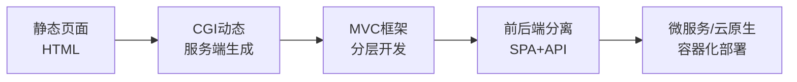
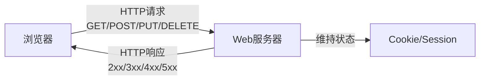
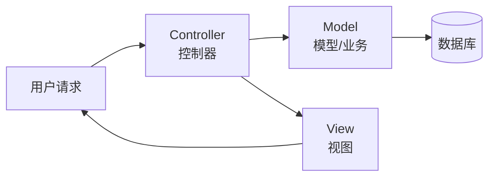
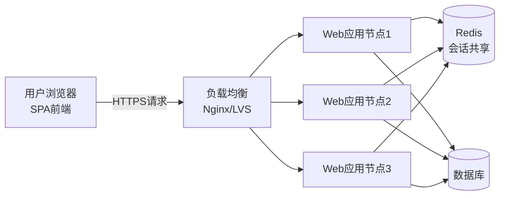
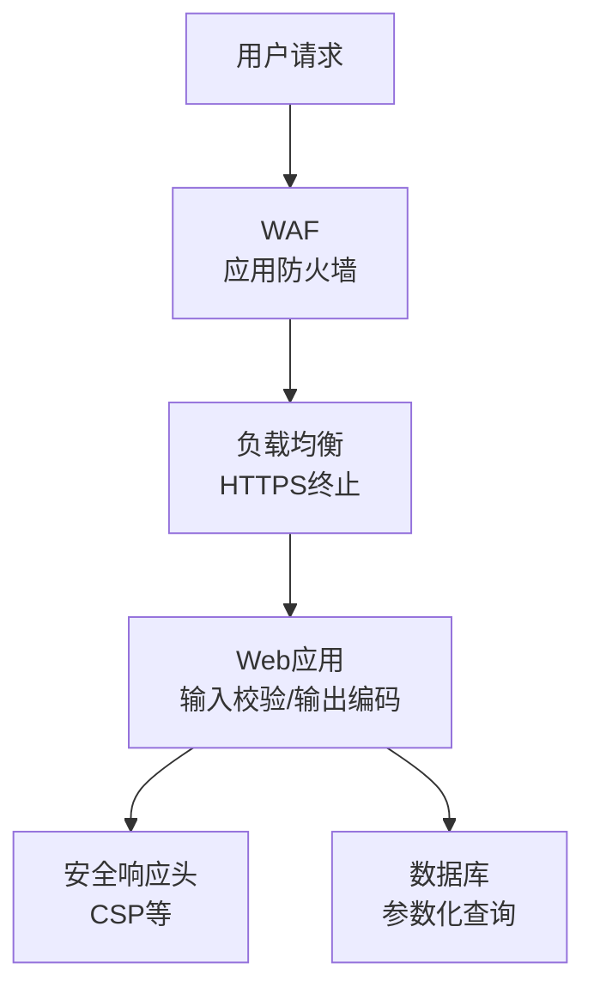
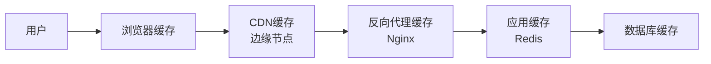

# 系统分析师｜第16章 Web应用系统分析与设计（完整版备考讲义+章节自测题）

> 适配系统分析师（第2版教材），包含教材删减但真题持续考查内容；上午选择题+案例题备考讲义，论文高频素材。  
> 标签：系统分析师、上午题、Web应用、HTTP、前后端分离、负载均衡、RESTful、SQL注入、XSS、CDN、备考

[TOC]

## 模块1：Web应用基础

**前置说明**：本章基于系统分析师第2版官方教材，增补第1版删减但历年真题、新考纲仍必考内容，适配上午综合选择题与案例题。  
**模块优先级**：🟡 中等优先级  
**考情分析**：年均0~1道选择题；核心：架构演进、B/S模型、HTTP协议、Cookie/Session。

### 1.1 核心知识点精讲

#### 1.1.1 Web架构演进（高频）

- 演进链路：**静态页面 → CGI动态 → MVC框架 → 前后端分离 → 微服务/云原生**。

> 记忆：静态→动态→分层→分离→微服务。

#### 1.1.2 B/S模型（高频）

- **B/S**：浏览器+服务器，客户端零安装。
- 优点：免安装、易维护、集中部署、跨平台。
- 缺点：受网络影响、交互能力弱于C/S、服务器压力大。
- 适用：广域网、用户多、升级频繁的系统。

> 易错：B/S免安装易维护、C/S响应快交互强。
#### 1.1.3 HTTP协议（高频，重点）

- **无状态**：每次请求相互独立（靠Cookie/Session维持状态）。
- 请求方法：GET（查）、POST（增）、PUT（改）、DELETE（删）。
- 状态码分类：
  - **2xx** 成功（200 OK）。
  - **3xx** 重定向（301/302）。
  - **4xx** 客户端错误（400、401未认证、403禁止、404不存在）。
  - **5xx** 服务器错误（500、502、503）。

> 记忆：2成4客5服3重定向；状态靠Cookie/Session。
#### 1.1.4 Cookie与Session（高频）

- **Cookie**：保存在**客户端**的小数据，随请求发送。
- **Session**：保存在**服务器端**的会话数据，通过Session ID关联。
- 关系：Session ID通常经Cookie传递。
- 安全注意：Cookie设HttpOnly防脚本读取、Secure仅HTTPS传输。

> 易错：Cookie在客户端、Session在服务端。

#### 1.1.5 Web 2.0/3.0

- Web 2.0：用户参与内容（博客、社交、RIA富互联网应用）。
- Web 3.0：语义Web、去中心化、AI驱动。

#### 1.1.6 高频易错点

1. 架构演进顺序；
2. B/S与C/S对比；
3. HTTP无状态+状态码分类；
4. Cookie客户端、Session服务端。

### 1.2 典型配套例题（真题同源，带完整解析）

#### 例题1 状态码

用户请求的资源不存在，服务器返回（）
A. 200 B. 301 C. 404 D. 500

> 【解析】404=资源不存在（客户端错误4xx）。  
> 【答案】C
#### 例题2 Cookie/Session

会话数据保存在客户端的是（）
A. Session B. Cookie C. Token D. 数据库

> 【解析】Cookie在客户端；Session在服务端。  
> 【答案】B

### 1.3 课后习题（带完整答案+解析）

**习题1**  
HTTP协议"无状态"的含义是（）
A. 无法传输数据 B. 每次请求相互独立 C. 只能GET D. 无需服务器

> 答案：B  
> 解析：无状态=每次请求独立，靠Cookie/Session维持状态。

**习题2**  
服务器内部错误对应的状态码是（）
A. 400 B. 403 C. 500 D. 301

> 答案：C  
> 解析：500服务器内部错误（5xx）；4xx客户端错误。

---

## 模块2：Web应用开发技术

**前置说明**：本章基于系统分析师第2版官方教材，增补第1版删减但历年真题、新考纲仍必考内容，适配上午综合选择题与案例题。  
**模块优先级**：🟡 中等优先级  
**考情分析**：年均0~1道选择题；核心：前后端技术、MVC模式、RESTful API、中间件。

### 2.1 核心知识点精讲

#### 2.1.1 前端技术（高频）

- HTML/CSS/JavaScript 三大基础。
- 前端框架：Vue、React、Angular。
- **SPA单页应用**：页面局部更新、前后端分离、体验好；首屏加载慢、SEO差。

> 记忆：SPA体验好、SEO差、首屏慢。
#### 2.1.2 后端技术与MVC模式（高频，重点）

- 主流：Java（Spring）、Python（Django/Flask）、Node.js、Go。
- **MVC**：Model（数据与业务）、View（展示）、Controller（控制与调度）。

> 记忆：Controller接请求、Model管业务数据、View管展示。

#### 2.1.3 RESTful API设计（高频，重点）

- **资源化URL**：名词表示资源，如 /users/{id}。
- **HTTP方法语义**：GET查、POST增、PUT/DELETE改删。
- **幂等性**：同一操作多次执行结果一致（GET/PUT/DELETE幂等，POST不保证）。
- 状态码表达结果；错误码规范。

> 易错：POST非幂等、PUT/DELETE幂等；REST用名词不用动词。
#### 2.1.4 中间件

- **Web服务器**：Nginx、Apache（静态资源、反向代理）。
- **应用服务器**：Tomcat、Jetty（运行业务应用）。
- **消息中间件**：Kafka、RabbitMQ（异步解耦、削峰）。
- 作用：解耦、负载分担、异步处理。

#### 2.1.5 前后端数据交互

- **JSON**：主流数据交换格式。
- **AJAX**：异步请求局部刷新。
- **CORS跨域**：浏览器同源策略限制，跨域需服务端配置。

> 记忆：JSON格式、AJAX异步、CORS解决跨域。

#### 2.1.6 高频易错点

1. MVC三部分职责；
2. REST资源化+方法语义+幂等；
3. Web服务器vs应用服务器；
4. 同源策略与CORS。

### 2.2 典型配套例题（真题同源，带完整解析）

#### 例题1 RESTful

RESTful API中，删除资源应使用（）
A. GET B. POST C. PUT D. DELETE

> 【解析】DELETE语义=删除资源；GET查、POST增、PUT改。  
> 【答案】D
#### 例题2 幂等性

下列HTTP方法中，多次执行结果一致（幂等）的是（）
A. POST B. GET C. PATCH D. 全部方法

> 【解析】GET/PUT/DELETE幂等；POST不保证幂等。  
> 【答案】B

### 2.3 课后习题（带完整答案+解析）

**习题1**  
浏览器跨域请求被拦截，原因是（）
A. 网络断开 B. 同源策略 C. Cookie过期 D. DNS解析失败

> 答案：B  
> 解析：浏览器同源策略限制跨域，需服务端CORS配置放行。

**习题2**  
SPA单页应用的缺点包括（）
A. 体验差 B. SEO差、首屏加载慢 C. 无法异步 D. 需安装客户端

> 答案：B  
> 解析：SPA体验好但SEO差、首屏加载慢。

---

## 模块3：Web应用架构设计

**前置说明**：本章基于系统分析师第2版官方教材，增补第1版删减但历年真题、新考纲仍必考内容，适配上午综合选择题与案例题（案例高频）。  
**模块优先级**：🔴 最高优先级（负载均衡与集群必考）  
**考情分析**：每年1~2道选择题，案例大题常考；核心：分层架构、前后端分离、负载均衡、会话保持。

### 3.1 核心知识点精讲

#### 3.1.1 Web分层架构（高频）

- 三层：**表现层→业务层→数据层**。
- 分层好处：关注点分离、可维护、可替换。
- 与MVC关系：MVC是表现层内部模式，分层是系统级组织。

> 易错：MVC是表现层模式，分层是系统级架构。
#### 3.1.2 前后端分离架构（高频，重点）

- 前端（SPA）与后端（API服务）**独立开发、独立部署**。
- 通过**接口契约**交互（RESTful/JSON）。
- 优点：并行开发、技术栈解耦、可独立扩展。
- 缺点：跨域处理、接口管理、联调成本。

> 记忆：前后端独立、接口契约、负载均衡+集群+会话共享。
#### 3.1.3 负载均衡（高频，重点）

- 实现方式：DNS轮询、**反向代理（Nginx）**、LVS、硬件负载均衡器（F5）。
- 调度策略：
  1. **轮询**：依次分配（简单，未考虑负载）。
  2. **加权轮询**：按权重分配（考虑服务器能力）。
  3. **最小连接**：分配给当前连接数最少的节点（动态）。
  4. **IP哈希**：同一IP固定到同一节点（天然会话保持，但分布不均）。

> 记忆：轮询简单、加权看能力、最小连接看负载、IP哈希保会话。

#### 3.1.4 集群与会话保持（高频）

- Web应用无状态化设计（Session外置）。
- **会话共享**：Session存Redis等集中存储，任意节点可处理。
- **会话粘滞（Sticky）**：同一用户请求固定路由到同一节点（IP哈希/ Cookie插入）。

> 易错：粘滞保会话但节点故障会丢会话；共享会话更可靠但引入依赖。
#### 3.1.5 反向代理与静态资源分离

- **反向代理**：代理服务器接收请求转发到后端，隐藏后端结构、负载分担、缓存。
- **动静分离**：静态资源（图片/CSS/JS）交给Nginx/CDN，动态请求进应用。

#### 3.1.6 高可用Web架构

- 多节点集群+负载均衡+故障转移。
- 无状态化+会话共享。
- 数据库主从/读写分离。
- 监控告警+自动伸缩。

#### 3.1.7 高频易错点

1. 负载均衡四种策略特点；
2. 会话粘滞vs会话共享；
3. 反向代理作用；
4. 动静分离。

### 3.2 典型配套例题（真题同源，带完整解析）

#### 例题1 负载均衡

同一用户IP始终分配到同一服务器，采用（）
A. 轮询 B. 最小连接 C. IP哈希 D. 加权轮询

> 【解析】IP哈希：同一IP固定同一节点，天然会话保持。  
> 【答案】C

#### 例题2 会话保持

集群中任意节点可处理用户请求的会话方案是（）
A. 会话粘滞 B. Session共享 C. Cookie本地 D. 无状态丢弃

> 【解析】Session共享（Redis集中存储）使任意节点可处理。  
> 【答案】B

### 3.3 课后习题（带完整答案+解析）

**习题1**  
考虑服务器性能差异时，宜采用（）
A. 轮询 B. 加权轮询 C. IP哈希 D. 随机

> 答案：B  
> 解析：加权轮询按权重分配，适配性能差异。

**习题2**  
静态资源与动态请求分离处理，属于（）
A. 动静分离 B. 会话共享 C. 数据库分区 D. 前端压缩

> 答案：A  
> 解析：静态交Nginx/CDN、动态进应用 → 动静分离。

---
## 模块4：Web应用安全设计

**前置说明**：本章基于系统分析师第2版官方教材，增补第1版删减但历年真题、新考纲仍必考内容，适配上午综合选择题与案例题（案例高频）。  
**模块优先级**：🔴 最高优先级（注入/XSS/CSRF必考）  
**考情分析**：每年1~2道选择题，案例大题常考；核心：Web安全威胁、认证授权、会话安全、HTTPS。

### 4.1 核心知识点精讲

#### 4.1.1 Web安全主要威胁（高频，必考）

1. **SQL注入**：恶意SQL拼接进查询，窃取/篡改数据。防护：**参数化查询/预编译**、输入校验。
2. **XSS跨站脚本**：注入恶意脚本窃取Cookie/会话。防护：**输出编码**、CSP。
3. **CSRF跨站请求伪造**：伪造用户请求执行操作。防护：**Token校验**、SameSite。
4. **会话劫持**：窃取Session ID冒充用户。防护：HTTPS、HttpOnly、会话超时。
5. **文件上传漏洞**：上传恶意文件执行。防护：类型校验、存储隔离。

> 记忆：注入靠参数化、XSS靠输出编码、CSRF靠Token、劫持靠HTTPS。
#### 4.1.2 认证与授权（高频）

- **认证**：确认身份（你是谁）——表单、Token/JWT、OAuth。
- **授权**：确认权限（能做什么）——RBAC角色权限。
- **JWT**：无状态令牌，含签名防篡改，适合分布式。
- **OAuth2**：第三方授权（微信/支付宝登录）。

> 记忆：认证管身份、授权管权限；JWT无状态、OAuth第三方授权。

#### 4.1.3 会话安全

- **Session固定攻击**防护：登录后重新生成Session ID。
- Cookie安全属性：
  - **HttpOnly**：脚本不可读（防XSS窃取）。
  - **Secure**：仅HTTPS传输。
  - **SameSite**：防CSRF（限制跨站携带）。
- 会话超时与并发控制。

> 易错：HttpOnly防脚本读取、SameSite防CSRF。

#### 4.1.4 输入校验与输出编码

- **输入校验**：白名单校验类型/长度/格式，参数化查询防注入。
- **输出编码**：对输出内容HTML编码，防XSS。

> 记忆：输入校验防注入、输出编码防XSS。
#### 4.1.5 HTTPS/TLS（高频）

- **HTTPS**=HTTP+TLS加密，保障传输**机密性、完整性、身份认证**。
- 证书体系：CA签发、公钥加密/私钥解密。
- 防：窃听、篡改、中间人攻击。

#### 4.1.6 Web安全防护体系

> 记忆：WAF入口防护、应用层校验编码、响应头加固、数据库参数化。

#### 4.1.7 高频易错点

1. 注入/XSS/CSRF防护手段；
2. HttpOnly/Secure/SameSite作用；
3. JWT无状态、OAuth第三方授权；
4. HTTPS保障三性。
### 4.2 典型配套例题（真题同源，带完整解析）

#### 例题1 SQL注入

有效防御SQL注入的措施是（）
A. 输出编码 B. 参数化查询 C. 设置HttpOnly D. 启用CSP

> 【解析】参数化查询/预编译是防SQL注入核心手段。  
> 【答案】B

#### 例题2 XSS

防止XSS窃取Cookie，应设置Cookie的（）
A. Secure属性 B. HttpOnly属性 C. Expires属性 D. Domain属性

> 【解析】HttpOnly使脚本无法读取Cookie，防XSS窃取。  
> 【答案】B

#### 例题3 CSRF

防止CSRF攻击的有效手段是（）
A. 输入校验 B. 请求Token校验 C. 数据库加密 D. 前端压缩

> 【解析】CSRF防护：请求Token校验、SameSite属性。  
> 【答案】B

### 4.3 课后习题（带完整答案+解析）

**习题1**  
用户通过第三方平台授权登录，使用的协议是（）
A. JWT B. OAuth2 C. RBAC D. LDAP

> 答案：B  
> 解析：OAuth2支持第三方授权登录；JWT是无状态令牌。

**习题2**  
仅允许Cookie在HTTPS下传输，应设置（）
A. HttpOnly B. Secure C. SameSite D. Max-Age

> 答案：B  
> 解析：Secure属性限制仅HTTPS传输。

---
## 模块5：Web应用性能与可用性

**前置说明**：本章基于系统分析师第2版官方教材，增补第1版删减但历年真题、新考纲仍必考内容，适配上午综合选择题与案例题（计算高频）。  
**模块优先级**：🔴 最高优先级（性能指标与缓存必考）  
**考情分析**：每年1~2道选择题/计算题；核心：性能指标、缓存体系、动静分离、优化方向。

### 5.1 核心知识点精讲

#### 5.1.1 性能指标（高频，重点）

- **响应时间**：请求发出到收到响应的时间。
- **吞吐量**：单位时间处理请求数（QPS每秒查询数、TPS每秒事务数）。
- **并发用户数**：同时在线操作的用户数。
- 关系：吞吐量≈并发数/平均响应时间（近似）。

> 记忆：QPS/TPS管吞吐、响应时间管快慢、并发管容量。

#### 5.1.2 多层缓存体系（高频，重点）

- **浏览器缓存**：本地静态资源（强缓存/协商缓存）。
- **CDN缓存**：边缘节点分发静态资源，就近加速。
- **反向代理缓存**：Nginx缓存热点响应。
- **应用缓存**：Redis缓存热点数据。
- **数据库缓存**：查询缓存、Buffer Pool。

> 记忆：越靠近用户越快；缓存分层逐级命中。
#### 5.1.3 静态化与动静分离

- **页面静态化**：动态内容生成静态HTML，降低后端压力。
- **动静分离**：静态资源CDN/独立域名，动态走应用。

#### 5.1.4 性能优化方向（高频）

- **前端**：压缩合并、懒加载、图片优化、减少请求。
- **后端**：缓存、异步、连接池、索引、读写分离。
- **架构**：集群、水平扩容、消息队列削峰。

> 记忆：前端减请求、后端加缓存、架构扩容量。

#### 5.1.5 性能测试流程

- 定义指标 → 基准测试 → 负载测试 → 压力测试 → 分析瓶颈 → 优化验证。

#### 5.1.6 高频易错点

1. QPS/TPS/并发/响应时间关系；
2. 缓存分层顺序；
3. 动静分离；
4. 性能测试流程。

### 5.2 典型配套例题（真题同源，带完整解析）

#### 例题1 性能指标

系统每秒处理1000个查询请求，该指标是（）
A. 响应时间 B. QPS C. 并发数 D. 带宽

> 【解析】QPS=每秒查询数，属于吞吐量指标。  
> 【答案】B

#### 例题2 缓存

离用户最近的缓存层是（）
A. 应用缓存 B. CDN缓存 C. 浏览器缓存 D. 数据库缓存

> 【解析】浏览器缓存最靠近用户，优先级最高。  
> 【答案】C
### 5.3 课后习题（带完整答案+解析）

**习题1**  
热点数据放入Redis加速访问，属于（）层缓存
A. 浏览器 B. CDN C. 应用 D. 数据库

> 答案：C  
> 解析：Redis为应用层缓存（内存数据缓存）。

**习题2**  
大幅降低后端压力的静态资源加速方式是（）
A. 数据库索引 B. CDN分发 C. 连接池 D. 读写分离

> 答案：B  
> 解析：CDN边缘节点分发静态资源，减轻源站压力。

---

## 模块6：Web应用分析与设计方法

**前置说明**：本章基于系统分析师第2版官方教材，增补第1版删减但历年真题、新考纲仍必考内容，适配上午综合选择题。  
**模块优先级**：🟡 中等优先级  
**考情分析**：年均0~1道选择题；核心：Web需求特点、用例建模、接口设计、部署设计。

### 6.1 核心知识点精讲

#### 6.1.1 Web应用需求特点

- 用户规模大、地域分散（性能与可用性要求高）。
- 界面交互强（前端体验设计重要）。
- 安全合规要求高（认证、数据保护）。
- 需求变化快（迭代交付、快速上线）。

> 记忆：大规模、强交互、高安全、快迭代。
#### 6.1.2 用例建模与界面原型

- **用例建模**：从用户视角描述功能（参与者、用例、关系）。
- **界面原型**：低保真（线框图）→高保真（视觉稿），验证交互流程。
- **页面流**：页面跳转与导航设计。

#### 6.1.3 接口设计（高频）

- **API契约**：路径、方法、参数、返回结构、错误码提前约定。
- **版本管理**：URL版本（/v1/）或Header版本。
- 幂等与重试设计。
- 接口文档与Mock联调。

> 记忆：契约先行、版本管理、幂等重试。

#### 6.1.4 部署设计

- 环境：开发/测试/生产环境隔离。
- 域名与HTTPS证书。
- 监控告警（应用、性能、日志）。
- 发布策略（蓝绿/金丝雀/滚动发布）。

#### 6.1.5 高频易错点

1. Web需求四大特点；
2. 用例建模用户视角；
3. API契约与版本管理；
4. 发布策略。

### 6.2 典型配套例题（真题同源，带完整解析）

#### 例题1 接口版本

API接口URL采用 /v1/users 表达版本，属于（）
A. 参数版本 B. URL版本 C. Header版本 D. 无版本

> 【解析】URL中 /v1/ 前缀 = URL版本管理方式。  
> 【答案】B

#### 例题2 原型

低保真线框图用于（）
A. 验证交互流程 B. 最终视觉稿 C. 后端代码 D. 数据库设计

> 【解析】低保真原型（线框图）用于快速验证交互与页面流。  
> 【答案】A
### 6.3 课后习题（带完整答案+解析）

**习题1**  
从用户视角描述系统功能的建模方式是（）
A. ER图 B. 用例建模 C. DFD D. 甘特图

> 答案：B  
> 解析：用例建模从用户视角描述功能（参与者+用例）。

**习题2**  
生产环境发布新版本、逐步引流验证的方式是（）
A. 直接替换 B. 金丝雀发布 C. 全量回滚 D. 停机发布

> 答案：B  
> 解析：金丝雀发布：小流量验证后再全量，风险低。

---

# 章节总复习综合模拟题（覆盖全部6模块，含答案与解析）

> 说明：题型贴合系统分析师上午真题风格，包含选择+计算，覆盖模块1~6所有核心考点；可直接放在讲义末尾作为章节自测。

## 一、单项选择题（15题）

1. 用户请求的资源不存在，服务器返回（）
A. 200 B. 301 C. 404 D. 500
> 答案：C

2. 会话数据保存在服务端的是（）
A. Cookie B. Session C. 本地存储 D. 缓存
> 答案：B
3. RESTful API中，幂等性不保证的方法是（）
A. GET B. PUT C. POST D. DELETE
> 答案：C

4. 同一用户IP始终分配到同一服务器，采用（）
A. 轮询 B. 最小连接 C. IP哈希 D. 加权轮询
> 答案：C

5. 集群中任意节点可处理用户请求，会话方案是（）
A. 会话粘滞 B. Session共享 C. Cookie本地 D. 丢弃会话
> 答案：B

6. 有效防御SQL注入的措施是（）
A. 输出编码 B. 参数化查询 C. HttpOnly D. CSP
> 答案：B

7. 防止脚本读取Cookie，应设置（）
A. Secure B. HttpOnly C. SameSite D. Max-Age
> 答案：B

8. 第三方平台授权登录使用的协议是（）
A. JWT B. OAuth2 C. RBAC D. SMTP
> 答案：B

9. 系统每秒处理1000个查询，该指标是（）
A. 响应时间 B. QPS C. 并发数 D. 带宽
> 答案：B

10. 离用户最近的缓存层是（）
A. 应用缓存 B. CDN缓存 C. 浏览器缓存 D. 数据库缓存
> 答案：C

11. SPA单页应用的缺点是（）
A. 体验差 B. SEO差、首屏加载慢 C. 无法异步 D. 需安装
> 答案：B
12. 热点数据放入Redis加速，属于（）层缓存
A. 浏览器 B. CDN C. 应用 D. 数据库
> 答案：C

13. 考虑服务器性能差异时，负载均衡宜采用（）
A. 轮询 B. 加权轮询 C. IP哈希 D. 随机
> 答案：B

14. 从用户视角描述功能的建模方式是（）
A. ER图 B. 用例建模 C. 甘特图 D. 网络图
> 答案：B

15. 生产发布小流量验证再全量，属于（）
A. 直接替换 B. 金丝雀发布 C. 停机发布 D. 全量回滚
> 答案：B

## 二、计算题（4道，真题风格）

### 计算题1【QPS与并发计算】

某Web系统平均响应时间200ms，高峰期同时在线用户2000人，平均每人每秒发起0.5个请求。请计算：①系统的QPS需求；②满足该QPS所需的并发处理能力说明。
> 【解析】
> ①QPS=2000人×0.5请求/秒=1000 QPS。
> ②每个请求处理时间200ms，单并发处理能力=1/0.2=5 QPS；所需并发数=1000/5=200个并发连接（或等价集群能力）。
> 答案：QPS需求1000；约需200并发处理能力
### 计算题2【缓存命中率与平均访问时间】

某页面直接访问数据库耗时300ms，经Redis缓存后命中时耗时10ms，缓存命中率为90%。请计算平均访问时间及加速比。
> 【解析】
> 平均访问时间=命中率×缓存耗时+未命中率×数据库耗时=0.9×10+0.1×300=9+30=39ms。
> 加速比=300/39≈7.69倍。
> 答案：平均39ms；加速比约7.7倍

### 计算题3【负载均衡策略评估】

三台服务器性能权重分别为1、2、3（单位能力），采用加权轮询，每轮10个请求应如何分配？若某服务器当前连接数异常高，加权轮询是否合适，应改用何策略？
> 【解析】
> 总权重=1+2+3=6；按权重比例分配：服务器1得10×1/6≈2个，服务器2得10×2/6≈3个，服务器3得10×3/6≈5个。
> 若服务器负载不均（连接数异常），加权轮询无法动态感知，宜改用最小连接策略（按当前连接数动态分配）。
> 答案：约2/3/5个；负载不均时改用最小连接
### 计算题4【会话保持场景判断】

某电商系统采用3节点无状态集群+Redis会话共享，某用户登录后请求被负载均衡分配到节点2。请说明：①用户下一次请求分配到节点1能否正常保持登录状态？为什么？②若改为IP哈希粘滞，节点2宕机后用户请求会怎样？哪种方案更可靠？
> 【解析】
> ①能正常保持：Session存于Redis共享，任意节点可从Redis读取会话，无状态设计不依赖具体节点。
> ②IP哈希粘滞下，节点2宕机后该用户请求被路由到其他节点，但本地Session丢失需重新登录（除非同步）。Session共享方案节点故障不影响会话，更可靠。
> 答案：①能（Redis共享会话）；②粘滞宕机丢会话需重登；共享方案更可靠

## 三、简答概念题（3道）

1. 简述HTTP协议的无状态特性及Web应用如何维持用户状态
> 【解析】HTTP无状态：每次请求相互独立，服务器不记忆先前请求。维持状态机制：Cookie（客户端保存小数据随请求发送）；Session（服务端保存会话数据，通过Session ID关联，Session ID常经Cookie传递）；Token/JWT（无状态令牌，服务端验签）。实际应用中登录状态通常用Session或JWT维持。

2. 简述前后端分离架构的优点与挑战
> 【解析】优点：前后端独立开发部署、技术栈解耦、可并行开发提升效率、前端SPA体验好、后端可独立扩展与复用（微服务基础）。挑战：跨域（CORS）处理、接口契约管理、联调成本、SEO较弱、需统一错误码与鉴权方案。

3. 简述SQL注入、XSS、CSRF三种Web攻击的原理与防护措施
> 【解析】SQL注入：用户输入拼接进SQL导致数据库被非法操作，防护=参数化查询/预编译+输入校验。XSS：攻击者注入恶意脚本在用户浏览器执行，窃取Cookie等，防护=输出编码+HttpOnly+CSP。CSRF：利用用户已登录状态伪造请求执行操作，防护=请求Token校验+SameSite Cookie+校验来源。三者的核心差别：注入打数据库、XSS打浏览器、CSRF借用户之手打服务器。
