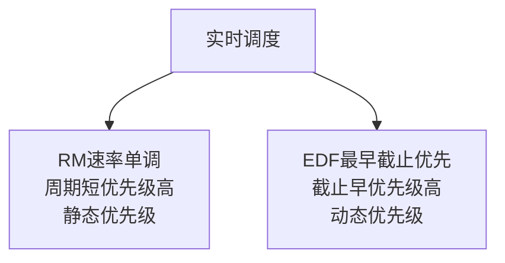
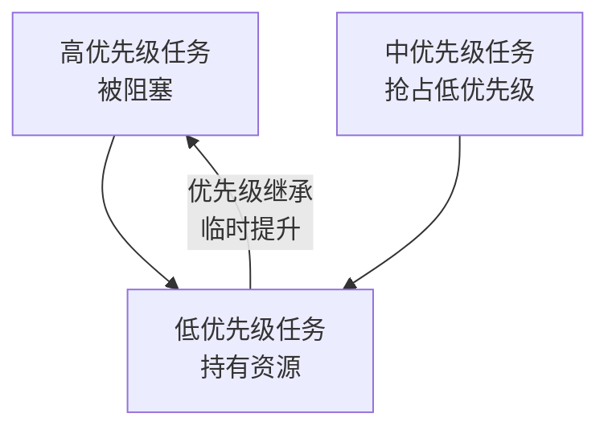
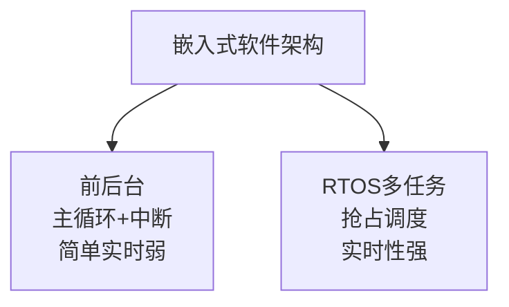
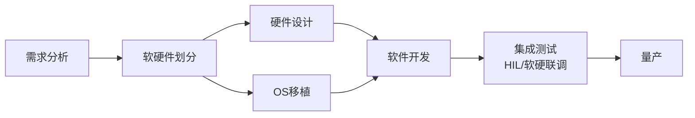

# 系统分析师｜第17章 嵌入式系统分析与设计（完整版备考讲义+章节自测题）

> 适配系统分析师（第2版教材），包含教材删减但真题持续考查内容；上午选择题+案例题备考讲义，论文高频素材。  
> 标签：系统分析师、上午题、嵌入式系统、RTOS、实时调度、RM、EDF、软硬件协同、交叉开发、低功耗、备考

[TOC]

## 模块1：嵌入式系统基础

**前置说明**：本章基于系统分析师第2版官方教材，增补第1版删减但历年真题、新考纲仍必考内容，适配上午综合选择题与案例题。  
**模块优先级**：🟡 中等优先级  
**考情分析**：年均0~1道选择题；核心：嵌入式定义与特征、硬件核心、系统分类、交叉开发。

### 1.1 核心知识点精讲

#### 1.1.1 嵌入式系统定义与特征（高频）

- **嵌入式系统**：以应用为中心、以计算机技术为基础、软硬件可裁剪、嵌入专用设备中的专用计算机系统。
- 三大组成：**硬件、嵌入式操作系统、应用软件**。
- 特点：
  1. **专用性**：面向特定应用。
  2. **资源受限**：内存/存储/功耗受限。
  3. **实时性**：响应有严格时限。
  4. **低功耗**：电池供电场景。
  5. **高可靠性**：无人值守长期运行。

> 记忆：专用、受限、实时、低耗、可靠。
#### 1.1.2 嵌入式硬件核心（高频）

- **MCU 微控制器**：CPU+存储器+外设集成单片（如单片机），资源小。
- **MPU 微处理器**：通用CPU，需外挂存储与外设。
- **DSP 数字信号处理器**：擅长信号处理运算。
- **SoC 片上系统**：多核/多功能集成（CPU+GPU+通信）。
- 存储器：**ROM/Flash**（程序与固件，非易失）、**RAM**（运行数据，易失）。

> 记忆：MCU集成小、MPU外挂大、DSP算信号、SoC全集成。

#### 1.1.3 嵌入式系统分类

- 按实时性：
  - **硬实时**：超时即灾难（飞行控制、安全气囊）。
  - **软实时**：超时可接受一定延迟（多媒体播放）。
- 按复杂度：无OS（裸机）、RTOS（实时操作系统）、嵌入式Linux（通用+实时补丁）。

> 易错：硬实时绝不容忍超时、软实时可容忍延迟。
#### 1.1.4 交叉开发模式（高频，重点）

- 嵌入式资源不足以本地开发，采用**宿主机-目标机**模式。
- **宿主机**：开发编译环境（PC）。
- **目标机**：嵌入式运行环境（板卡）。
- 关键工具：**交叉编译器**（宿主机编译、目标机执行）、交叉调试器、下载工具（JTAG）。

> 记忆：宿主编译、目标执行、交叉编译是桥梁。

#### 1.1.5 高频易错点

1. 嵌入式系统三大组成与特征；
2. MCU/MPU/DSP/SoC区分；
3. 硬实时vs软实时；
4. 交叉编译：宿主机编译目标机运行。

### 1.2 典型配套例题（真题同源，带完整解析）

#### 例题1 系统特征

嵌入式系统区别于通用计算机的典型特征不包括（）
A. 专用性 B. 资源受限 C. 软硬件可裁剪 D. 高性能通用

> 【解析】嵌入式专用、受限、可裁剪；"高性能通用"是通用计算机特征。  
> 【答案】D
#### 例题2 交叉开发

交叉编译器的作用是（）
A. 在目标机上编译 B. 在宿主机编译生成目标机代码 C. 在PC上运行程序 D. 替代操作系统

> 【解析】交叉编译：宿主机编译、生成目标机可执行代码。  
> 【答案】B

### 1.3 课后习题（带完整答案+解析）

**习题1**  
飞行控制系统对任务超时零容忍，属于（）
A. 软实时 B. 硬实时 C. 无实时 D. 批处理

> 答案：B  
> 解析：超时即灾难 → 硬实时系统。

**习题2**  
MCU微控制器的特点是（）
A. 需外挂存储 B. CPU+存储+外设集成 C. 擅长信号处理 D. 多核全集成

> 答案：B  
> 解析：MCU把CPU、存储器、外设集成于单片。

---

## 模块2：嵌入式硬件接口与总线

**前置说明**：本章基于系统分析师第2版官方教材，增补第1版删减但历年真题、新考纲仍必考内容，适配上午综合选择题。  
**模块优先级**：🟡 中等优先级  
**考情分析**：年均0~1道选择题；核心：常用外设接口、总线、ADC/DAC、硬件约束。

### 2.1 核心知识点精讲

#### 2.1.1 常用外设接口（高频，重点）

- **GPIO**：通用输入输出（高低电平控制）。
- **UART**：异步串口（点对点，慢）。
- **I2C**：两线串行（SCL+SDA，多设备，中速）。
- **SPI**：四线串行（高速，主从）。
- **CAN**：控制器局域网（汽车/工业，抗干扰、多节点）。
- **USB**：通用串行（即插即用，高速）。

> 记忆：UART点对点、I2C两线多设备、SPI高速主从、CAN汽车工业、USB即插即用。
#### 2.1.2 嵌入式总线

- **片内总线**：CPU内部连接（AHB/APB等）。
- **系统总线**：连接CPU、内存、外设控制器。
- **外设总线**：连接外部设备（I2C/SPI/USB等）。

#### 2.1.3 ADC与DAC（高频）

- **ADC 模数转换**：模拟信号→数字信号（传感器接入）。
- **DAC 数模转换**：数字信号→模拟信号（执行器输出）。
- 关键参数：分辨率（位数）、采样率、精度。

> 记忆：传感器→ADC→数字；数字→DAC→执行器。

#### 2.1.4 硬件设计约束

- **功耗**：动态功耗与频率电压相关。
- **EMC电磁兼容**：抗电磁干扰、降低辐射。
- **抗干扰**：滤波、隔离、屏蔽。
- 成本与体积约束。

#### 2.1.5 高频易错点

1. 各接口特点与适用；
2. ADC/DAC方向；
3. 总线层次；
4. 硬件约束：功耗/EMC/抗干扰。
### 2.2 典型配套例题（真题同源，带完整解析）

#### 例题1 外设接口

汽车电子多节点通信、抗干扰能力强的接口是（）
A. UART B. I2C C. CAN D. USB

> 【解析】CAN控制器局域网：汽车/工业应用、多节点、抗干扰。  
> 【答案】C

#### 例题2 ADC

温度传感器输出的模拟信号接入嵌入式系统，需要（）
A. DAC转换 B. ADC转换 C. 直接连接 GPIO D. 网络转换

> 【解析】模拟信号转数字 → ADC模数转换。  
> 【答案】B

### 2.3 课后习题（带完整答案+解析）

**习题1**  
I2C接口的传输特点是（）
A. 点对点异步 B. 两线多设备 C. 四线高速 D. 多节点抗干扰

> 答案：B  
> 解析：I2C两线（SCL+SDA）支持多设备中速通信。

**习题2**  
数模转换器DAC的作用是（）
A. 模拟转数字 B. 数字转模拟 C. 放大信号 D. 滤波

> 答案：B  
> 解析：DAC把数字信号转换为模拟信号驱动执行器。

---
## 模块3：嵌入式操作系统与实时调度

**前置说明**：本章基于系统分析师第2版官方教材，增补第1版删减但历年真题、新考纲仍必考内容，适配上午综合选择题与案例题（计算主力）。  
**模块优先级**：🔴 最高优先级（RTOS与调度算法必考）  
**考情分析**：每年1~2道选择题/计算题；核心：RTOS特征、任务管理、RM/EDF调度、优先级反转。

### 3.1 核心知识点精讲

#### 3.1.1 RTOS实时操作系统特征（高频）

- **确定性（可预测）**：任务响应时间可预测。
- **抢占式调度**：高优先级任务可抢占低优先级。
- 与通用OS（Linux/Windows）区别：通用OS追求吞吐与公平，RTOS追求**时限保障**。

> 记忆：RTOS=确定性+抢占式+时限保障。

#### 3.1.2 任务管理（高频）

- 任务状态：**就绪（Ready）→ 运行（Running）→ 阻塞（Blocked）→ 就绪**。
- 调度器按优先级/时间片选择就绪任务运行。

> 记忆：就绪→运行→阻塞→就绪循环。
#### 3.1.3 实时调度算法（高频，重点）

- **RM 速率单调调度**：**周期越短、优先级越高**（静态优先级，固定分配）。
  - 可调度性判定（充分条件）：利用率 U=Σ(Ci/Ti) ≤ n(2^(1/n)−1)；n→∞ 时约69.3%。
- **EDF 最早截止优先**：**截止时间越早、优先级越高**（动态优先级）。
  - 可调度性判定：利用率 U=Σ(Ci/Ti) ≤ 1（充分必要条件）。

> 记忆：RM静态看周期、EDF动态看截止时间；EDF利用率上限1优于RM。
#### 3.1.4 同步互斥与优先级反转（高频，重点）

- 同步互斥机制：**信号量、互斥锁、消息队列**。
- **优先级反转**：低优先级任务占用资源，阻塞高优先级任务，中优先级任务抢占导致高优先级被无限期拖延。
- 解决方案：
  1. **优先级继承**：低优先级任务临时提升到高优先级任务的优先级。
  2. **优先级天花板协议**：资源分配时直接置为最高可能优先级。

> 记忆：反转=高被低拖、中被抢；解决=继承或天花板。
#### 3.1.5 嵌入式Linux

- 通用Linux裁剪后用于嵌入式（开源、生态好）。
- 实时性不足时可加**实时补丁（PREEMPT_RT）**或搭配RTOS。
- 涉及：内核裁剪、设备树（描述硬件）、驱动。

#### 3.1.6 高频易错点

1. RTOS确定性抢占式；
2. RM周期短优先级高、EDF截止早优先级高；
3. 利用率判定（RM≤约69.3%、EDF≤1）；
4. 优先级反转与继承/天花板。

### 3.2 典型配套例题（真题同源，带完整解析）

#### 例题1 调度算法

RM速率单调调度中，优先级分配依据是（）
A. 截止时间 B. 任务周期 C. 执行时间 D. 到达顺序

> 【解析】RM：周期越短优先级越高（静态）。  
> 【答案】B

#### 例题2 优先级反转

低优先级任务持有资源导致高优先级任务被阻塞，且被中优先级任务抢占，该问题称为（）
A. 死锁 B. 优先级反转 C. 饥饿 D. 活锁

> 【解析】高优被低优拖住+中被抢 → 优先级反转。  
> 【答案】B

### 3.3 课后习题（带完整答案+解析）

**习题1**  
EDF调度中，优先级分配依据是（）
A. 周期 B. 截止时间 C. 执行时间 D. 内存大小

> 答案：B  
> 解析：EDF最早截止优先，截止时间越早优先级越高（动态）。

**习题2**  
解决优先级反转的措施是（）
A. 增加任务 B. 优先级继承 C. 降低频率 D. 关闭中断

> 答案：B  
> 解析：优先级继承/天花板协议解决优先级反转。

---
## 模块4：嵌入式软件设计

**前置说明**：本章基于系统分析师第2版官方教材，增补第1版删减但历年真题、新考纲仍必考内容，适配上午综合选择题与案例题。  
**模块优先级**：🟡 中等优先级  
**考情分析**：年均0~1道选择题；核心：软件特点、软硬件协同、软件架构、代码约束、测试。

### 4.1 核心知识点精讲

#### 4.1.1 嵌入式软件特点（高频）

- **资源受限**：内存小，**避免动态内存频繁申请**（碎片与泄漏风险），以静态内存为主。
- 代码要求：**可重入**（被中断后可再次进入）、可裁剪、低功耗配合。
- 可靠性要求高：无人值守长期运行。

> 记忆：静态内存为主、避免动态申请、可重入。

#### 4.1.2 软硬件协同设计（高频，重点）

- **软硬件划分**：决定功能由硬件还是软件实现。
- 原则：
  - **性能关键/固定功能** → 硬件（快、功耗低，但不灵活、成本高）。
  - **复杂多变/需要升级** → 软件（灵活、可升级，但慢）。
- 权衡：性能、成本、灵活性、功耗。

> 记忆：固定高频进硬件、多变升级留软件。

#### 4.1.3 嵌入式软件架构（高频）

- **前后台系统**：主循环（后台）+中断（前台）；简单、实时性弱。
- **RTOS多任务架构**：多任务并发、抢占调度、实时性强。
- 选择：简单系统用前后台、复杂实时系统用RTOS。

> 记忆：前后台简单实时弱、RTOS多任务实时强。
#### 4.1.4 嵌入式代码约束与看门狗

- 避免动态内存、避免递归深嵌套、中断服务程序短小。
- **看门狗（Watchdog）**：定时器周期性喂狗，系统异常（死循环/跑飞）未喂狗时自动复位。

> 记忆：看门狗防死机自动复位。

#### 4.1.5 嵌入式软件测试

- 单元测试：模块级逻辑验证。
- **HIL硬件在环测试**：真实硬件+仿真环境联测。
- 软硬件联合调试：宿主机调试器+目标机运行。

#### 4.1.6 高频易错点

1. 静态内存为主、避免动态申请；
2. 软硬件划分原则；
3. 前后台vs RTOS；
4. 看门狗防死机、HIL硬件在环。

### 4.2 典型配套例题（真题同源，带完整解析）

#### 例题1 软硬件划分

固定且性能要求极高的信号处理功能，宜（）
A. 软件实现 B. 硬件实现 C. 数据库实现 D. 云实现

> 【解析】固定高频功能放硬件：快、功耗低。  
> 【答案】B

#### 例题2 看门狗

系统程序跑飞后能自动复位恢复，依赖（）
A. 串口调试 B. 看门狗 C. 中断 D. DMA

> 【解析】看门狗定时器未及时喂狗即触发复位。  
> 【答案】B
### 4.3 课后习题（带完整答案+解析）

**习题1**  
嵌入式软件为防内存碎片，应（）
A. 频繁malloc/free B. 以静态内存为主 C. 动态数组 D. 无限递归

> 答案：B  
> 解析：资源受限，以静态内存为主避免动态申请。

**习题2**  
真实硬件与仿真环境联合进行的测试是（）
A. 单元测试 B. HIL硬件在环 C. 压力测试 D. 冒烟测试

> 答案：B  
> 解析：HIL硬件在环：真实硬件+仿真环境联测。

---

## 模块5：嵌入式系统可靠性、低功耗与安全

**前置说明**：本章基于系统分析师第2版官方教材，增补第1版删减但历年真题、新考纲仍必考内容，适配上午综合选择题与案例题。  
**模块优先级**：🟡 中等优先级  
**考情分析**：年均0~1道选择题；核心：可靠性指标、容错设计、低功耗、固件安全。

### 5.1 核心知识点精讲

#### 5.1.1 可靠性指标（高频）

- **MTBF 平均无故障时间**：两次故障间的平均工作时间。
- **MTTR 平均修复时间**：故障恢复平均耗时。
- 可用性 = MTBF / (MTBF + MTTR)。
- 失效率λ = 1/MTBF。

> 记忆：MTBF管多久坏一次、MTTR管多快修好。
#### 5.1.2 容错设计（高频）

- 冗余：硬件冗余（双机/双通道）、数据冗余（校验）。
- 检错纠错：奇偶校验、CRC、ECC内存。
- 看门狗复位、掉电保护（数据保存）。

> 记忆：容错=冗余+检错纠错+看门狗+掉电保护。

#### 5.1.3 低功耗设计（高频）

- **动态电源管理**：按需调整频率电压（DVFS）。
- **休眠/待机模式**：空闲时进入低功耗状态。
- **时钟门控**：关闭空闲模块时钟。
- 与外设协同：关闭未用外设电源。

> 记忆：动态调频调压、休眠待机、时钟门控。

#### 5.1.4 嵌入式安全（第2版强化）

- **固件安全**：固件加密、签名校验防篡改。
- **启动安全**：安全启动链（逐级校验）。
- 数据加密存储、通信加密。
- **OTA固件升级**：远程升级，需校验与回滚机制。

> 记忆：固件防篡改、启动防劫持、OTA升级带校验回滚。

#### 5.1.5 高频易错点

1. MTBF/MTTR/可用性公式；
2. 容错手段；
3. 低功耗三手段；
4. 安全启动与OTA回滚。
### 5.2 典型配套例题（真题同源，带完整解析）

#### 例题1 可靠性

某设备MTBF=9500小时、MTTR=500小时，可用性为（）
A. 90% B. 95% C. 99% D. 99.5%

> 【解析】可用性=MTBF/(MTBF+MTTR)=9500/10000=95%。  
> 【答案】B

#### 例题2 低功耗

空闲时降低CPU频率与电压以省电，属于（）
A. 时钟门控 B. 动态电源管理DVFS C. 休眠模式 D. 中断唤醒

> 【解析】按需调频调压 → 动态电源管理（DVFS）。  
> 【答案】B

### 5.3 课后习题（带完整答案+解析）

**习题1**  
防止固件被篡改的主要手段是（）
A. 固件签名校验 B. 提高主频 C. 增加内存 D. 关闭看门狗

> 答案：A  
> 解析：固件加密签名校验防篡改；安全启动逐级校验。

**习题2**  
远程升级固件失败时能恢复，需具备（）
A. 回滚机制 B. 更大Flash C. 更高网速 D. 更多外设

> 答案：A  
> 解析：OTA升级需校验+回滚机制，失败恢复旧版本。

---
## 模块6：嵌入式系统开发流程与系统集成

**前置说明**：本章基于系统分析师第2版官方教材，增补第1版删减但历年真题、新考纲仍必考内容，适配上午综合选择题。  
**模块优先级**：🟡 中等优先级  
**考情分析**：年均0~1道选择题；核心：开发全流程、系统裁剪、仿真验证、评估维度。

### 6.1 核心知识点精讲

#### 6.1.1 嵌入式开发全流程（高频）

- 流程：**需求分析 → 软硬件划分 → 硬件设计 → OS移植 → 软件开发 → 集成测试 → 量产**。

> 记忆：需求→划分→硬设/OS→开发→集成→量产。

#### 6.1.2 系统裁剪（高频）

- **内核裁剪**：按需裁剪内核功能（文件系统、驱动、协议栈）。
- 组件剪裁：只保留必要模块，减小体积、降低资源占用。
- 原则：按需求裁剪，保证功能完整与稳定。

> 记忆：内核裁剪减体积、组件按需保留。
#### 6.1.3 仿真与原型验证

- 指令集仿真（QEMU等）、板级仿真。
- 原型板验证：先硬件原型再量产。
- 软硬件联合调试：断点、单步、内存观测。

#### 6.1.4 嵌入式系统评估维度

- **实时性**：任务响应与时限满足。
- **功耗**：能耗是否达标。
- **成本**：器件与制造成本。
- **可靠性**：MTBF、容错能力。

#### 6.1.5 高频易错点

1. 开发流程顺序；
2. 裁剪目的；
3. 评估四维度：实时/功耗/成本/可靠。

### 6.2 典型配套例题（真题同源，带完整解析）

#### 例题1 开发流程

软硬件划分完成后，下一步是（）
A. 需求分析 B. 硬件设计与OS移植 C. 量产 D. 测试

> 【解析】划分后进入硬件设计与OS移植（并行）。  
> 【答案】B

#### 例题2 系统裁剪

裁剪嵌入式内核的主要目的是（）
A. 增加功能 B. 减小体积降低资源占用 C. 提高主频 D. 更换芯片

> 【解析】内核裁剪：按需精简，减小体积、降低资源占用。  
> 【答案】B

### 6.3 课后习题（带完整答案+解析）

**习题1**  
嵌入式系统评估不包括（）
A. 实时性 B. 功耗 C. 界面美观 D. 成本

> 答案：C  
> 解析：评估维度=实时性、功耗、成本、可靠性。

**习题2**  
开发完成后验证软硬件协同正确性的测试是（）
A. 单元测试 B. 集成测试/软硬联调 C. 代码走查 D. 需求评审

> 答案：B  
> 解析：集成测试与软硬件联合调试验证协同正确性。

---
# 章节总复习综合模拟题（覆盖全部6模块，含答案与解析）

> 说明：题型贴合系统分析师上午真题风格，包含选择+计算，覆盖模块1~6所有核心考点；可直接放在讲义末尾作为章节自测。

## 一、单项选择题（15题）

1. 嵌入式系统的典型特征不包括（）
A. 专用性 B. 资源受限 C. 软硬件可裁剪 D. 高性能通用
> 答案：D

2. CPU+存储器+外设集成于单片的硬件是（）
A. MPU B. MCU C. DSP D. GPU
> 答案：B

3. 飞行控制超时即灾难，属于（）
A. 软实时 B. 硬实时 C. 无实时 D. 批处理
> 答案：B

4. 交叉编译器在（）上运行
A. 目标机 B. 宿主机 C. 云端 D. 手机
> 答案：B

5. 汽车电子多节点抗干扰通信接口是（）
A. UART B. I2C C. CAN D. USB
> 答案：C

6. 传感器模拟信号接入嵌入式系统需（）
A. DAC B. ADC C. GPIO直连 D. 网络
> 答案：B

7. RTOS区别于通用OS的核心特征是（）
A. 界面美观 B. 确定性抢占式 C. 文件系统 D. 多用户
> 答案：B

8. RM调度中优先级分配依据是（）
A. 截止时间 B. 任务周期 C. 执行时间 D. 内存
> 答案：B
9. 低优先级任务拖住高优先级任务且被中优先级抢占，属于（）
A. 死锁 B. 优先级反转 C. 饥饿 D. 活锁
> 答案：B

10. 解决优先级反转的措施是（）
A. 增加任务 B. 优先级继承 C. 降低频率 D. 关闭中断
> 答案：B

11. 固定且性能要求极高的功能宜（）
A. 软件实现 B. 硬件实现 C. 数据库实现 D. 云实现
> 答案：B

12. 程序跑飞后自动复位依赖（）
A. 串口 B. 看门狗 C. 中断 D. DMA
> 答案：B

13. MTBF=9500小时、MTTR=500小时，可用性为（）
A. 90% B. 95% C. 99% D. 99.5%
> 答案：B

14. 空闲时降低CPU频率电压属于（）
A. 时钟门控 B. 动态电源管理DVFS C. 休眠模式 D. 中断唤醒
> 答案：B

15. 软硬件划分完成后，下一步是（）
A. 需求分析 B. 硬件设计与OS移植 C. 量产 D. 退役
> 答案：B

## 二、计算题（4道，真题风格）

### 计算题1【RM调度可调度性判定】

三个周期任务：T1周期20ms执行5ms；T2周期50ms执行10ms；T3周期100ms执行20ms。请用RM调度判断是否可调度。
> 【解析】
> 利用率U=5/20+10/50+20/100=0.25+0.2+0.2=0.65。
> n=3时RM可调度充分条件上限=n(2^(1/n)−1)=3×(2^(1/3)−1)≈3×0.26=0.78。
> U=0.65 ≤ 0.78，满足充分条件，RM可调度。
> 答案：U=0.65<0.78，可调度
### 计算题2【MTBF与可用性计算】

某嵌入式系统运行一年（8760小时），发生2次故障，总修复时间共48小时。请计算：①MTBF；②可用性。
> 【解析】
> ①MTBF=总运行时间/故障次数=(8760−48)/2≈4356小时。
> ②可用性=(8760−48)/8760≈99.45%；或MTBF/(MTBF+MTTR)=4356/(4356+24)≈99.45%。
> 答案：MTBF≈4356小时；可用性≈99.45%

### 计算题3【任务响应时间估算】

某RTOS系统，高优先级中断任务每次执行2ms，每秒触发10次；低优先级主任务执行10ms可完成一轮处理。请估算高优先级任务占用的CPU时间比例，并判断主任务能否在一秒内完成处理。
> 【解析】
> 高优先级任务每秒占用=10次×2ms=20ms，占CPU时间2%。
> 主任务执行10ms，加上被抢占等待（最多20ms），一秒内可完成。
> 答案：占用2%；主任务可在一秒内完成
### 计算题4【功耗评估】

某设备工作模式电流200mA、电压3.3V；休眠模式电流50mA。设备每10分钟工作2分钟、休眠8分钟。请计算：①工作功耗与休眠功耗；②平均功耗（不考虑转换损耗）。
> 【解析】
> ①工作功耗=200mA×3.3V=660mW；休眠功耗=50mA×3.3V=165mW。
> ②平均功耗=(660×2+165×8)/10=(1320+1320)/10=264mW。
> 答案：工作660mW、休眠165mW；平均264mW

## 三、简答概念题（3道）

1. 简述嵌入式系统的定义与主要特征
> 【解析】嵌入式系统是以应用为中心、以计算机技术为基础、软硬件可裁剪、嵌入专用设备中的专用计算机系统，由硬件、嵌入式操作系统、应用软件三部分组成。特征：专用性（面向特定应用）、资源受限（内存/存储/功耗受限）、实时性（响应有时限）、低功耗（电池供电）、高可靠性（无人值守长期运行）。

2. 简述RM与EDF两种实时调度算法的区别
> 【解析】RM速率单调调度：静态优先级，周期越短优先级越高，调度开销小、实现简单，可调度性充分条件为利用率≤n(2^(1/n)−1)（n→∞约69.3%），仅适用于周期任务；EDF最早截止优先：动态优先级，截止时间越早优先级越高，理论上利用率≤1即可调度（最优），但动态调整开销大、实现复杂。EDF调度能力更强，RM实现更简单。

3. 简述软硬件协同设计中软硬件划分的原则
> 【解析】划分依据性能、成本、灵活性、功耗：固定不变且性能要求极高的功能（如信号处理、编解码）放硬件实现——快、功耗低，但不灵活、成本高；复杂多变、需要升级维护的功能（如协议逻辑、业务规则）放软件实现——灵活、可升级，但速度慢。划分需权衡硬件成本与软件灵活性，关键路径性能不足时考虑硬件加速。
