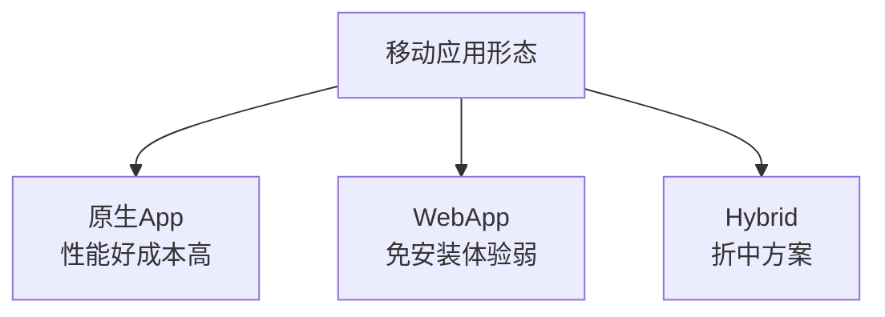
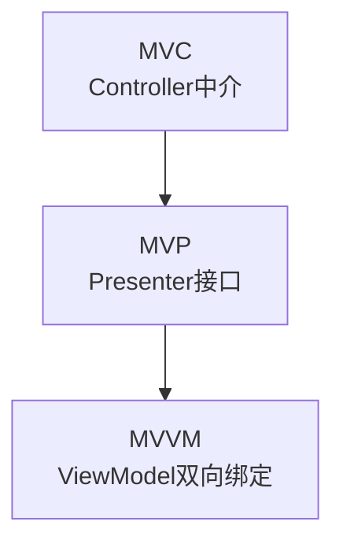
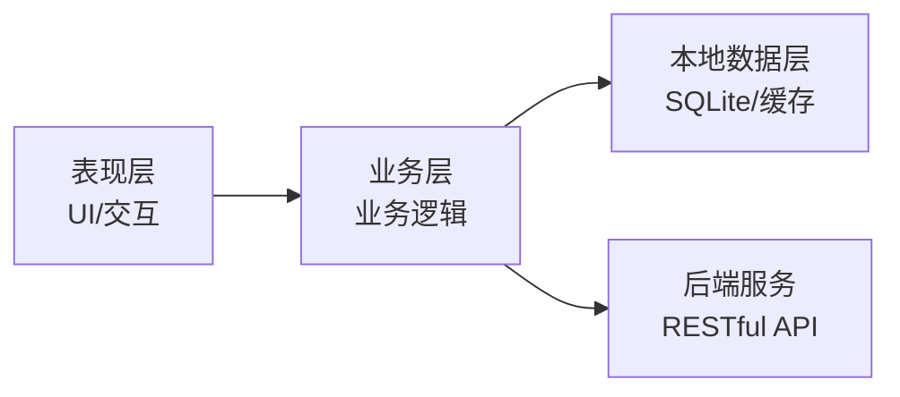
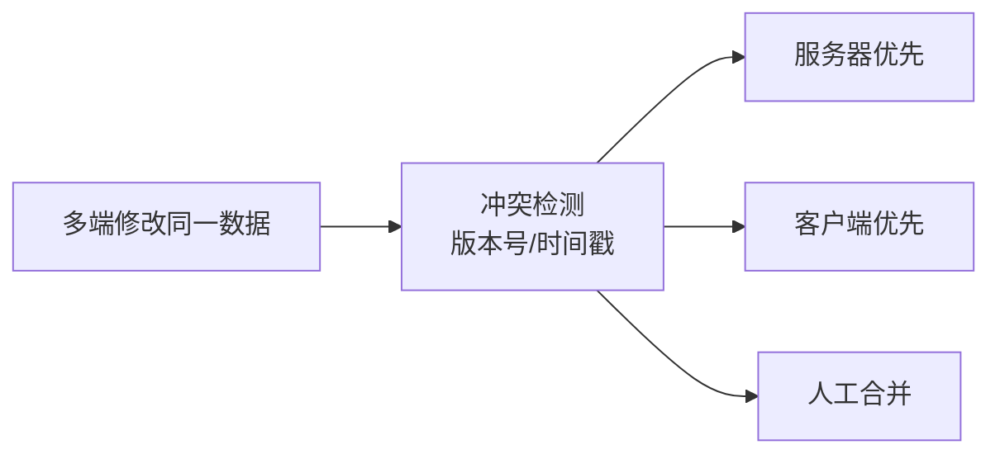
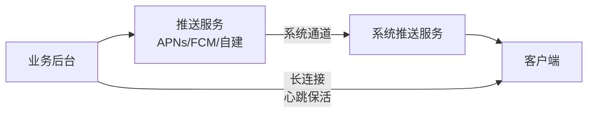

# 系统分析师｜第18章 移动应用系统分析与设计（完整版备考讲义+章节自测题）

> 适配系统分析师（第2版教材），包含教材删减但真题持续考查内容；上午选择题+案例题备考讲义，论文高频素材。  
> 标签：系统分析师、上午题、移动应用、原生App、Hybrid、MVVM、离线同步、消息推送、弱网优化、移动安全、备考

[TOC]

## 模块1：移动应用基础

**前置说明**：本章基于系统分析师第2版官方教材，增补第1版删减但历年真题、新考纲仍必考内容，适配上午综合选择题与案例题。  
**模块优先级**：🟡 中等优先级  
**考情分析**：年均0~1道选择题；核心：三类应用形态、移动设备约束、开发模式。

### 1.1 核心知识点精讲

#### 1.1.1 移动应用三类形态（高频，重点）

1. **原生App**：平台原生开发（Android/iOS）。优点：性能好、体验佳、可调用全部硬件能力；缺点：开发成本高、需多端开发。
2. **WebApp**：浏览器访问的移动网页。优点：免安装、跨平台、更新快；缺点：体验受限、性能弱、硬件调用受限。
3. **Hybrid混合App**：原生壳+Web内容（H5）。优点：跨平台、可复用Web、可调用部分原生能力；缺点：性能介于两者、兼容性复杂。

> 记忆：原生性能好贵、Web免装弱、Hybrid折中。
#### 1.1.2 移动设备约束（高频）

- **电池容量有限**：功耗设计重要。
- **计算资源受限**：CPU/内存小于PC。
- **网络不稳定**：弱网、断网、网络切换。
- **屏幕碎片化**：多分辨率、多密度。
- **传感器丰富**：GPS、加速度计、摄像头、指纹等。

> 记忆：电、算、网、屏、感五大约束。

#### 1.1.3 移动操作系统与沙盒

- 主流：Android（开放生态）、iOS（封闭生态）。
- **沙盒机制**：应用独立运行空间，访问其他应用数据受限（安全隔离）。

#### 1.1.4 开发模式

- **原生开发**：性能最优，双端独立开发。
- **跨平台开发**：Flutter、React Native（一套代码多端）。
- 选择权衡：性能、成本、团队能力、硬件能力需求。

> 易错：跨平台省成本但性能与原生有差距、复杂硬件调用受限。

#### 1.1.5 高频易错点

1. 三类形态优缺点对比；
2. 移动设备五大约束；
3. 沙盒隔离机制；
4. 跨平台开发取舍。
### 1.2 典型配套例题（真题同源，带完整解析）

#### 例题1 应用形态

免安装、跨平台、更新快但性能较弱的移动应用形态是（）
A. 原生App B. WebApp C. Hybrid D. 桌面程序

> 【解析】WebApp浏览器访问：免安装、跨平台、更新快、性能弱。  
> 【答案】B

#### 例题2 设备约束

移动应用设计必须重点考虑（）
A. 无限存储 B. 电池续航与弱网 C. 超大屏幕 D. 恒定网络

> 【解析】移动端约束：电池有限、网络不稳定。  
> 【答案】B

### 1.3 课后习题（带完整答案+解析）

**习题1**  
原生壳+Web内容、性能介于两者之间的形态是（）
A. 原生App B. WebApp C. Hybrid D. 小程序

> 答案：C  
> 解析：Hybrid混合应用：原生壳+H5，折中方案。

**习题2**  
应用独立运行空间、访问其他应用受限的机制是（）
A. 沙盒 B. 虚拟机 C. 容器 D. 沙箱网络

> 答案：A  
> 解析：移动OS沙盒机制：应用隔离，安全受限访问。

---
## 模块2：移动应用架构设计

**前置说明**：本章基于系统分析师第2版官方教材，增补第1版删减但历年真题、新考纲仍必考内容，适配上午综合选择题与案例题（案例高频）。  
**模块优先级**：🔴 最高优先级（MVVM与分层必考）  
**考情分析**：每年1~2道选择题，案例大题常考；核心：MVVM、客户端服务端架构、多端协同、组件化。

### 2.1 核心知识点精讲

#### 2.1.1 MVC/MVP/MVVM（高频，重点）

- **MVC**：Model+View+Controller；View与Model经Controller解耦。
- **MVP**：Presenter持有View接口，View与Model完全解耦，可测试性好。
- **MVVM**：ViewModel双向绑定View，自动更新，Android/iOS主流。

> 记忆：MVC老、MVP可测、MVVM绑定主流。

#### 2.1.2 移动端分层架构（高频）

- 四层：**表现层（UI）→ 业务层（用例/逻辑）→ 本地数据层（存储/缓存）→ 后端服务（API）**。

> 记忆：表现管界面、业务管逻辑、本地管存储、后端管服务。
#### 2.1.3 多端协同设计（高频）

- 移动端、Web端、后台服务共享**统一业务模型与接口**。
- 接口复用（RESTful/API网关），业务规则尽量收敛到服务端。
- 端差异化：仅表现层与体验差异化。

> 记忆：接口统一、规则收敛服务端、差异只在表现层。

#### 2.1.4 组件化与模块化

- **模块化**：按业务/功能拆分为独立模块。
- **组件化**：模块间通过组件化框架解耦、独立编译。
- 好处：并行开发、独立测试、复用。

#### 2.1.5 高频易错点

1. MVC/MVP/MVVM区别；
2. 四层架构职责；
3. 多端统一接口规则收敛；
4. 组件化解耦。

### 2.2 典型配套例题（真题同源，带完整解析）

#### 例题1 MVVM

ViewModel与View通过（）实现自动更新
A. 手动刷新 B. 双向绑定 C. 事件回调 D. 轮询

> 【解析】MVVM：ViewModel与View双向绑定，自动同步。  
> 【答案】B

#### 例题2 多端协同

多端协同设计中，业务规则应（）
A. 各端各写一套 B. 收敛到服务端 C. 写在客户端 D. 不处理

> 【解析】规则收敛服务端，保证多端一致。  
> 【答案】B

### 2.3 课后习题（带完整答案+解析）

**习题1**  
MVP相比MVC的主要优势是（）
A. 代码更少 B. View与Model完全解耦、可测试性好 C. 无需接口 D. 性能更高

> 答案：B  
> 解析：MVP通过Presenter接口解耦View与Model，可测试性好。

**习题2**  
移动端本地数据层的主要职责是（）
A. 界面渲染 B. 本地存储与缓存 C. 网络协议 D. 权限管理

> 答案：B  
> 解析：本地数据层负责SQLite存储与缓存。

---
## 模块3：移动应用数据与离线设计

**前置说明**：本章基于系统分析师第2版官方教材，增补第1版删减但历年真题、新考纲仍必考内容，适配上午综合选择题与案例题。  
**模块优先级**：🟡 中等优先级  
**考情分析**：年均0~1道选择题；核心：本地存储、离线能力、数据同步、冲突处理。

### 3.1 核心知识点精讲

#### 3.1.1 本地存储方案（高频）

- **文件存储**：大文件、图片、配置。
- **SQLite**：结构化关系数据、查询复杂。
- **KV数据库**：键值对、简单高效（如SharedPreferences）。

> 记忆：大文件用文件、结构化用SQLite、简单键值用KV。

#### 3.1.2 离线能力设计（高频）

- 本地缓存常用数据（列表、配置）。
- 离线业务：弱网/断网下可继续操作，恢复后同步。
- **数据同步**：增量同步（只传变化）、全量同步（首次/重置）。

#### 3.1.3 多端数据冲突处理（高频，重点）

- 冲突场景：同一数据多端修改（手机+Web）。
- 解决策略：
  1. **服务器优先**：以服务端最新版本为准。
  2. **客户端优先**：以本地最新修改为准。
  3. **人工合并**：冲突交给用户选择。
  4. 版本号/时间戳乐观锁检测冲突。

> 记忆：冲突解决=服务器优先/客户端优先/人工合并。
#### 3.1.4 数据同步时机

- **触发式同步**：用户操作时同步（实时）。
- **定时同步**：周期后台同步（省电省流量）。
- **网络恢复自动同步**：断网期间缓存，恢复后自动补传。

#### 3.1.5 高频易错点

1. 三种本地存储适用场景；
2. 离线设计=缓存+离线业务+同步；
3. 冲突解决三策略；
4. 同步三时机。

### 3.2 典型配套例题（真题同源，带完整解析）

#### 例题1 本地存储

结构化关系数据、需复杂查询的场景宜采用（）
A. 文件 B. SQLite C. KV数据库 D. 内存

> 【解析】SQLite适合结构化关系数据与复杂查询。  
> 【答案】B

#### 例题2 冲突处理

多端修改同一订单状态，以服务端最新版本为准，属于（）
A. 客户端优先 B. 服务器优先 C. 人工合并 D. 丢弃冲突

> 【解析】服务器优先：以服务端最新版本为准。  
> 【答案】B

### 3.3 课后习题（带完整答案+解析）

**习题1**  
断网期间本地操作，网络恢复后自动补传，属于（）
A. 定时同步 B. 网络恢复自动同步 C. 触发式同步 D. 无同步

> 答案：B  
> 解析：网络恢复自动同步：离线缓存、恢复补传。

**习题2**  
冲突检测常用的机制是（）
A. 随机数 B. 版本号/时间戳 C. 密码 D. 设备序列号

> 答案：B  
> 解析：版本号/时间戳乐观锁检测数据冲突。

---
## 模块4：移动网络与消息推送

**前置说明**：本章基于系统分析师第2版官方教材，增补第1版删减但历年真题、新考纲仍必考内容，适配上午综合选择题与案例题。  
**模块优先级**：🟡 中等优先级  
**考情分析**：年均0~1道选择题；核心：移动网络特点、弱网优化、推送体系、API适配。

### 4.1 核心知识点精讲

#### 4.1.1 移动网络特点（高频）

- **带宽波动**：信号强弱变化。
- **延迟较高**：无线链路。
- **网络切换**：4G/5G/WiFi切换。
- **流量计费**：用户关注流量消耗。

> 记忆：波动、高延迟、切换、计费。

#### 4.1.2 弱网优化策略（高频）

- **请求重试**：失败重试（指数退避）。
- **超时策略**：合理超时，避免长等待。
- **数据压缩**：减少传输量。
- **断点续传**：大文件下载中断续传。
- **请求队列**：批量/串行控制。

> 记忆：重试、超时、压缩、断点、队列。

#### 4.1.3 消息推送体系（高频）

- **系统级推送**：APNs（iOS）、FCM（Android）——系统统一通道，省电。
- **自建推送**：自有长连接通道，灵活可控，耗电。
- **长连接与心跳保活**：维持连接、检测断线。

> 记忆：系统推送省电、自建推送灵活、长连接保活。
#### 4.1.4 API接口适配

- 分页加载（列表下拉刷新/上拉加载）。
- 节流与降级：弱网时降级图片质量、关闭非核心功能。
- 接口幂等与重试安全。

#### 4.1.5 高频易错点

1. 移动网络四特点；
2. 弱网优化五手段；
3. 系统推送vs自建推送；
4. 分页/降级策略。

### 4.2 典型配套例题（真题同源，带完整解析）

#### 例题1 推送

APNs/FCM系统级推送的优点是（）
A. 完全可控 B. 系统通道省电省流量 C. 无需网络 D. 延迟最低

> 【解析】系统级推送统一通道，省电省流量；自建推送灵活可控。  
> 【答案】B

#### 例题2 弱网优化

大文件下载中断后从断点继续，属于（）
A. 请求重试 B. 断点续传 C. 数据压缩 D. 请求队列

> 【解析】断点续传：中断后从断点继续下载。  
> 【答案】B

### 4.3 课后习题（带完整答案+解析）

**习题1**  
维持客户端与服务器长连接、检测断线的机制是（）
A. 心跳保活 B. 断点续传 C. 数据压缩 D. 分页加载

> 答案：A  
> 解析：心跳保活维持长连接并检测断线。

**习题2**  
弱网下降级图片质量、关闭非核心功能属于（）
A. 重试 B. 降级策略 C. 断点续传 D. 队列

> 答案：B  
> 解析：弱网降级：牺牲非核心保核心体验。

---
## 模块5：移动应用安全、权限与隐私

**前置说明**：本章基于系统分析师第2版官方教材，增补第1版删减但历年真题、新考纲仍必考内容，适配上午综合选择题与案例题。  
**模块优先级**：🟡 中等优先级  
**考情分析**：年均0~1道选择题；核心：权限模型、安全威胁、防护手段、隐私合规。

### 5.1 核心知识点精讲

#### 5.1.1 移动端权限模型（高频）

- 敏感权限：位置、相册、相机、通讯录、麦克风。
- 原则：**最小权限**、按需申请、运行时授权、用户可撤销。

> 记忆：最小权限、按需申请、可撤销。

#### 5.1.2 移动端安全威胁（高频）

1. **本地数据泄露**：明文存储敏感信息。
2. **包篡改/重打包**：篡改后二次分发。
3. **逆向分析**：反编译窃取逻辑与密钥。
4. **重放攻击**：截获请求重复发送。
5. **中间人劫持**：拦截传输数据。

> 记忆：本地泄露、篡改、逆向、重放、劫持。

#### 5.1.3 防护手段（高频）

- 本地数据**加密存储**（密钥管理）。
- 接口**HTTPS**+**证书锁定**（防中间人）。
- **签名校验**防篡改；加固防逆向。
- 请求**时间戳+随机数**防重放。

> 记忆：加密防泄露、HTTPS+证书锁定防劫持、签名防篡改、时间戳防重放。

#### 5.1.4 隐私合规（第2版强化）

- **最小权限原则**：只申请必要权限。
- 数据采集**告知与授权**（隐私政策）。
- 用户可**查询、删除**个人数据。
- 敏感数据**脱敏**与跨境合规。

> 记忆：告知、授权、最小化、可删除。

#### 5.1.5 高频易错点

1. 权限最小化；
2. 五类威胁与防护对应；
3. 证书锁定防中间人；
4. 隐私合规要点。
### 5.2 典型配套例题（真题同源，带完整解析）

#### 例题1 权限

移动应用应遵循的权限原则是（）
A. 申请全部权限 B. 最小权限按需申请 C. 免授权 D. 后台静默获取

> 【解析】最小权限、按需申请、用户可撤销。  
> 【答案】B

#### 例题2 防护

防止中间人劫持的有效手段是（）
A. 明文传输 B. HTTPS+证书锁定 C. 关闭加密 D. 免密登录

> 【解析】HTTPS加密传输+证书锁定校验服务器身份，防中间人。  
> 【答案】B

### 5.3 课后习题（带完整答案+解析）

**习题1**  
防止截获请求重复提交，应加入（）
A. 时间戳+随机数 B. 固定密码 C. 用户头像 D. 设备型号

> 答案：A  
> 解析：时间戳+随机数防重放攻击。

**习题2**  
隐私合规要求数据采集必须（）
A. 静默进行 B. 告知并获授权 C. 不限用途 D. 永久保存

> 答案：B  
> 解析：采集需告知与授权，用户可查询删除。

---
## 模块6：移动应用性能、适配与测试

**前置说明**：本章基于系统分析师第2版官方教材，增补第1版删减但历年真题、新考纲仍必考内容，适配上午综合选择题。  
**模块优先级**：🟡 中等优先级  
**考情分析**：年均0~1道选择题；核心：性能指标、屏幕适配、专项测试、发布管理。

### 6.1 核心知识点精讲

#### 6.1.1 移动端性能指标（高频）

- **启动速度**：冷启动/热启动时间。
- **页面渲染帧率**：流畅度（60帧/s）。
- **内存占用**：防泄漏、防OOM。
- **电量消耗**：功耗优化。

> 记忆：启动、帧率、内存、电量四指标。

#### 6.1.2 屏幕适配（高频）

- 多分辨率、多尺寸、多密度。
- **响应式布局**：自适应不同屏幕。
- 单位适配（dp/sp）；多套资源。

> 记忆：响应式布局+密度适配。

#### 6.1.3 移动专项测试（高频）

- **弱网测试**：弱网/断网表现。
- **电量测试**：耗电评估。
- **兼容性测试**：多机型、多系统版本。
- 压力测试、安装卸载测试、升级测试。

> 记忆：弱网、电量、兼容、压测、安装升级。

#### 6.1.4 发布与版本管理

- **灰度发布**：小比例用户先行验证。
- **热更新**：不重新安装更新代码（有风险需控制）。
- 版本管理：版本号、强制/非强制升级。

> 记忆：开发→专项测试→灰度→全量→迭代。

#### 6.1.5 高频易错点

1. 四性能指标；
2. 屏幕适配；
3. 专项测试类型；
4. 灰度与热更新。
### 6.2 典型配套例题（真题同源，带完整解析）

#### 例题1 性能指标

衡量页面渲染流畅度的指标是（）
A. 启动速度 B. 帧率 C. 内存 D. 电量

> 【解析】帧率（60帧/s）衡量渲染流畅度。  
> 【答案】B

#### 例题2 发布策略

小比例用户先行验证新版本，属于（）
A. 全量发布 B. 灰度发布 C. 强制升级 D. 热更新

> 【解析】灰度发布：小比例用户先行验证，再逐步放量。  
> 【答案】B

### 6.3 课后习题（带完整答案+解析）

**习题1**  
验证应用在弱网与断网环境下的表现，属于（）
A. 单元测试 B. 弱网测试 C. 代码评审 D. 需求评审

> 答案：B  
> 解析：弱网测试专项验证弱网/断网表现。

**习题2**  
不重新安装即可更新代码的方式是（）
A. 全量发布 B. 热更新 C. 冷启动 D. 换机

> 答案：B  
> 解析：热更新不重新安装更新代码，需控制风险。

---
# 章节总复习综合模拟题（覆盖全部6模块，含答案与解析）

> 说明：题型贴合系统分析师上午真题风格，包含选择+计算，覆盖模块1~6所有核心考点；可直接放在讲义末尾作为章节自测。

## 一、单项选择题（15题）

1. 免安装、跨平台、更新快但性能较弱的形态是（）
A. 原生App B. WebApp C. Hybrid D. 桌面程序
> 答案：B

2. 移动应用设计必须重点考虑（）
A. 无限存储 B. 电池续航与弱网 C. 恒定网络 D. 超大屏幕
> 答案：B

3. ViewModel与View自动同步的架构是（）
A. MVC B. MVP C. MVVM D. 前后台
> 答案：C

4. 多端协同设计中业务规则应（）
A. 各端各写 B. 收敛到服务端 C. 写在客户端 D. 不处理
> 答案：B

5. 结构化关系数据、需复杂查询的场景宜采用（）
A. 文件 B. SQLite C. KV数据库 D. 内存
> 答案：B

6. 多端修改同一数据，以服务端最新版本为准属于（）
A. 客户端优先 B. 服务器优先 C. 人工合并 D. 丢弃
> 答案：B

7. 断网期间本地操作、网络恢复自动补传属于（）
A. 定时同步 B. 网络恢复自动同步 C. 触发式同步 D. 无同步
> 答案：B

8. APNs/FCM系统级推送的优点是（）
A. 完全可控 B. 系统通道省电 C. 无需网络 D. 延迟最低
> 答案：B

9. 大文件下载中断后从断点继续，属于（）
A. 重试 B. 断点续传 C. 压缩 D. 队列
> 答案：B

10. 维持长连接并检测断线的机制是（）
A. 心跳保活 B. 断点续传 C. 压缩 D. 分页
> 答案：A

11. 移动应用权限应遵循（）
A. 申请全部 B. 最小权限按需申请 C. 免授权 D. 静默获取
> 答案：B

12. 防止中间人劫持的有效手段是（）
A. 明文传输 B. HTTPS+证书锁定 C. 关闭加密 D. 免密
> 答案：B

13. 防止截获请求重复提交，应加入（）
A. 时间戳+随机数 B. 固定密码 C. 头像 D. 型号
> 答案：A

14. 衡量页面渲染流畅度的指标是（）
A. 启动速度 B. 帧率 C. 内存 D. 电量
> 答案：B

15. 小比例用户先行验证新版本属于（）
A. 全量发布 B. 灰度发布 C. 强制升级 D. 热更新
> 答案：B
## 二、计算题（4道，真题风格）

### 计算题1【弱网请求吞吐量估算】

某移动应用在弱网下平均请求耗时由200ms增加到800ms，重试率20%（每次重试额外耗时800ms）。请计算：①不考虑重试时单用户每秒可发起请求数；②考虑重试后的有效吞吐量。
> 【解析】
> ①无重试吞吐=1/0.8≈1.25次/秒。
> ②每次请求期望耗时=0.8×1+0.2×1.6=0.8+0.32=1.12秒；有效吞吐=1/1.12≈0.89次/秒。
> 答案：无重试1.25次/秒；考虑重试约0.89次/秒

### 计算题2【缓存命中率计算】

某移动应用本地缓存命中率70%，缓存读取耗时5ms，网络请求耗时500ms。请计算平均响应时间及采用缓存后的加速比。
> 【解析】
> 平均响应=0.7×5+0.3×500=3.5+150=153.5ms。
> 加速比=500/153.5≈3.26倍。
> 答案：平均153.5ms；加速比约3.3倍
### 计算题3【多端同步冲突场景评估】

用户在手机上修改了订单收货地址，同时在PC端修改了同一订单的备注。同步时两端数据冲突。请分析：①应采用何种冲突解决策略更合适？②说明理由。
> 【解析】
> ①按字段级合并（收货地址以手机端为准、备注以PC端为准），仅同字段冲突才需策略。
> ②不同字段修改可合并，避免丢失任一修改；若同字段冲突，可按时间戳取最新或人工确认。比整条记录覆盖更合理。
> 答案：字段级合并优先；同字段冲突按时间戳/人工确认

### 计算题4【功耗指标测算】

某移动应用亮屏使用功耗600mW、后台运行功耗80mW。用户一天亮屏使用2小时、后台22小时。请计算日均功耗及电量消耗占比（电池容量3000mAh，电压3.7V）。
> 【解析】
> 日均功耗=(600×2+80×22)/24=(1200+1760)/24≈123.3mW。
> 日耗电=600×2+80×22=2960mWh；电池总能量=3000mAh×3.7V=11100mWh；占比=2960/11100≈26.7%。
> 答案：日均约123.3mW；耗电占比约26.7%

## 三、简答概念题（3道）

1. 简述原生App、WebApp、Hybrid混合应用三者的区别与选型
> 【解析】原生App：平台原生开发，性能好、体验佳、可调用全部硬件能力，但多端开发成本高；WebApp：浏览器访问，免安装、跨平台、更新快，但性能弱、硬件调用受限；Hybrid：原生壳+Web内容，跨平台复用Web、可调部分原生能力，性能介于两者。选型：重性能与硬件能力选原生，轻量快速更新选Web，兼顾成本与能力选Hybrid。
2. 简述移动端离线能力设计的基本思路
> 【解析】离线设计三要素：①本地缓存常用数据（列表、配置、最近记录），弱网/断网可直接展示；②离线业务支持：断网时本地操作不中断，记录变更；③数据同步：网络恢复后增量同步本地变更到服务端，同步时机可为触发式、定时或网络恢复自动同步。同步时需处理多端数据冲突（字段级合并、服务器/客户端优先、人工确认）。

3. 简述移动端安全的常见威胁与防护措施
> 【解析】威胁：本地数据泄露（明文存储）、包篡改重打包、逆向分析、重放攻击、中间人劫持。防护：本地敏感数据加密存储；接口HTTPS+证书锁定防中间人；应用签名校验防篡改、加固防逆向；请求加时间戳与随机数防重放；遵循最小权限原则，隐私数据采集告知授权、用户可删除，敏感数据脱敏。
