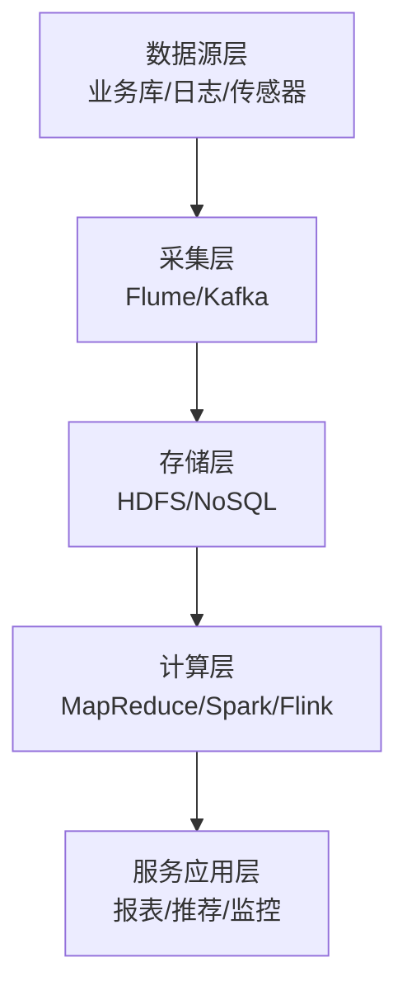
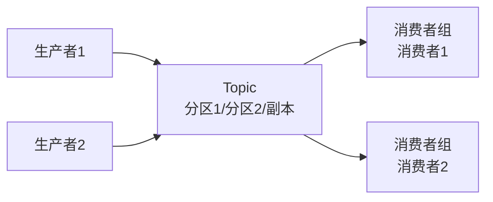
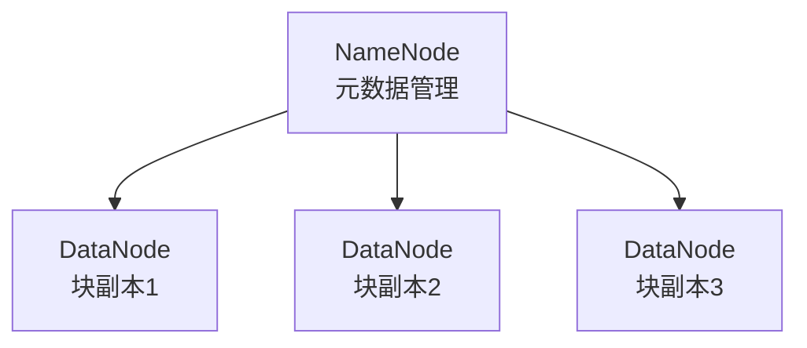
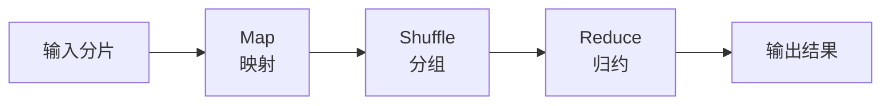
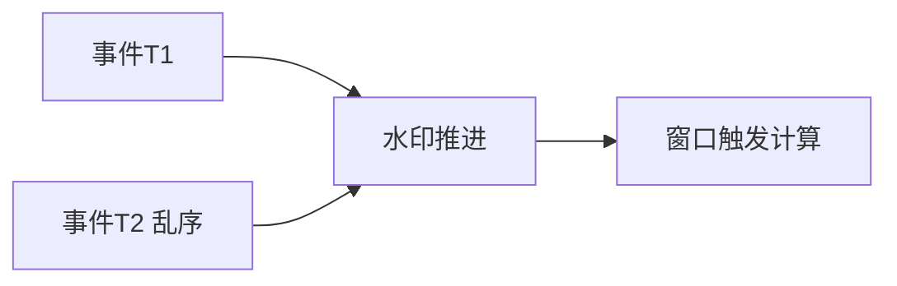
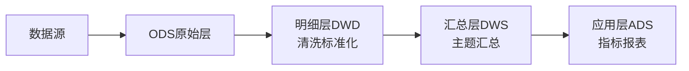

# 系统分析师｜第19章 大数据处理系统分析与设计（完整版备考讲义+章节自测题）

> 适配系统分析师（第2版教材），包含教材删减但真题持续考查内容；上午选择题+案例题备考讲义，论文高频素材。  
> 标签：系统分析师、上午题、大数据、4V、HDFS、Kafka、MapReduce、Spark、Flink、数据分层、湖仓一体、数据治理、备考

[TOC]

## 模块1：大数据基础概念

**前置说明**：本章基于系统分析师第2版官方教材，增补第1版删减但历年真题、新考纲仍必考内容，适配上午综合选择题与案例题。  
**模块优先级**：🟡 中等优先级  
**考情分析**：年均1~2道选择题；核心：4V特征、OLTP/OLAP、平台分层。

### 1.1 核心知识点精讲

#### 1.1.1 大数据4V特征（高频，重点）

1. **Volume 大量**：数据规模海量（TB/PB级）。
2. **Velocity 高速**：产生与处理速度快。
3. **Variety 多样**：结构化、半结构化、非结构化。
4. **Value 价值密度低**：海量数据中价值信息稀疏。

> 记忆：量大、速快、多样、价值密度低。

#### 1.1.2 大数据应用场景

- 离线统计（报表、分析）、实时监控、个性化推荐、风控反欺诈、日志分析、用户画像。

> 记忆：离统、实时、推荐、风控、日志、画像。
#### 1.1.3 大数据与传统数据库、数据仓库（高频）

- **OLTP**：联机事务处理，面向交易（增删改查），关系数据库，实时性强。
- **OLAP**：联机分析处理，面向分析（聚合查询），数据仓库，吞吐大。
- 大数据平台解决海量数据的存储与分析，支持水平扩展。

> 记忆：OLTP管交易、OLAP管分析。

#### 1.1.4 大数据平台五层架构（高频，重点）

- **数据源层 → 数据采集层 → 数据存储层 → 数据计算层 → 服务应用层**。

> 记忆：源→采→存→算→用五层。

#### 1.1.5 高频易错点

1. 4V特征；
2. OLTP/OLAP区别；
3. 五层分层及每层代表组件。
### 1.2 典型配套例题（真题同源，带完整解析）

#### 例题1 4V特征

"数据量大、产生速度快、类型多样、价值密度低"描述的是大数据的（）
A. 3V特征 B. 4V特征 C. 5V特征 D. 交易特征

> 【解析】Volume/Velocity/Variety/Value 即4V特征。  
> 【答案】B

#### 例题2 OLAP

面向海量数据聚合分析的场景属于（）
A. OLTP B. OLAP C. 事务处理 D. 数据录入

> 【解析】OLAP联机分析处理：面向海量数据分析。  
> 【答案】B

### 1.3 课后习题（带完整答案+解析）

**习题1**  
大数据平台存储层常采用的组件是（）
A. Kafka B. HDFS/NoSQL C. Flume D. 报表工具

> 答案：B  
> 解析：存储层用HDFS分布式文件系统与NoSQL数据库。

**习题2**  
OLTP系统的主要特征是（）
A. 海量聚合分析 B. 高频增删改查事务 C. 只读报表 D. 批量加载

> 答案：B  
> 解析：OLTP联机事务处理，高频增删改查。

---
## 模块2：数据采集与传输

**前置说明**：本章基于系统分析师第2版官方教材，增补第1版删减但历年真题、新考纲仍必考内容，适配上午综合选择题。  
**模块优先级**：🟡 中等优先级  
**考情分析**：年均0~1道选择题；核心：数据来源、采集工具、Kafka消息队列。

### 2.1 核心知识点精讲

#### 2.1.1 数据来源类型（高频）

- **结构化**：关系库表（行列表格）。
- **半结构化**：JSON、XML、日志。
- **非结构化**：文本、图片、音视频。

> 记忆：结构表、半结构JSON/XML、非结构文本媒体。

#### 2.1.2 数据采集工具（高频）

- **Flume**：日志采集，分布式可靠收集聚合。
- **Sqoop**：关系数据库与Hadoop间数据导入导出。
- **Canal等**：数据库binlog增量采集。

> 记忆：Flume收日志、Sqoop导关系库、Canal采增量。

#### 2.1.3 Kafka消息队列（高频，重点）

- 核心作用：**削峰、解耦、异步**。
- 模型：**生产者→Topic（分区Partition）→消费者**（消费者组）。
- **分区**：并行读写、扩展吞吐；**副本**：数据冗余容错。
- 持久化：消息落盘，可回溯。

> 记忆：削峰解耦异步；分区并行、副本容错。
#### 2.1.4 数据接入约束

- **高吞吐**：支持海量并发写入。
- **容错**：节点故障不丢数据。
- **有序**：分区内消息有序。
- **不丢失**：acks机制确认。

#### 2.1.5 高频易错点

1. 三类数据来源；
2. Flume/Sqoop职责；
3. Kafka三大作用、分区与副本；
4. 接入四约束。

### 2.2 典型配套例题（真题同源，带完整解析）

#### 例题1 Kafka作用

Kafka在数据链路中的主要作用不包括（）
A. 削峰 B. 解耦 C. 事务处理 D. 异步缓冲

> 【解析】Kafka：削峰、解耦、异步；不做事务处理。  
> 【答案】C

#### 例题2 采集工具

将关系数据库数据导入HDFS的常用工具是（）
A. Flume B. Sqoop C. Kafka D. Redis

> 【解析】Sqoop：关系库与Hadoop数据导入导出。  
> 【答案】B

### 2.3 课后习题（带完整答案+解析）

**习题1**  
Kafka实现并行高吞吐的关键机制是（）
A. 单分区串行 B. 分区并行 C. 丢弃消息 D. 全量复制

> 答案：B  
> 解析：Topic拆分为多个分区，并行读写提升吞吐。

**习题2**  
Kafka副本机制的主要作用是（）
A. 提升速度 B. 数据容错 C. 压缩数据 D. 加密数据

> 答案：B  
> 解析：副本冗余存储，节点故障时数据不丢失。

---
## 模块3：分布式存储系统

**前置说明**：本章基于系统分析师第2版官方教材，增补第1版删减但历年真题、新考纲仍必考内容，适配上午综合选择题与案例题。  
**模块优先级**：🔴 最高优先级（存储必考）  
**考情分析**：每年1~2道选择题；核心：HDFS、NoSQL四类、对象存储、湖仓。

### 3.1 核心知识点精讲

#### 3.1.1 HDFS分布式文件系统（高频，重点）

- **主从架构**：NameNode（元数据）+DataNode（数据块）。
- **数据块**：文件切分为块（默认128MB）。
- **副本机制**：默认3副本，容错（机架感知）。
- 特点：高容错、高吞吐、适合大文件批量读写；不适合低延迟随机访问。

> 记忆：Name管元数据、Data存块、3副本容错。

#### 3.1.2 NoSQL数据库分类（高频，重点）

1. **键值KV**：Redis——高速缓存、简单查询。
2. **列存储**：HBase——海量结构化宽表、稀疏。
3. **文档**：MongoDB——灵活文档、半结构化。
4. **图数据库**：Neo4j——关系图谱、社交推荐。

> 记忆：KV缓存快、列存宽表、文档灵活、图库查关系。
#### 3.1.3 对象存储

- 海量**非结构化数据**（图片、视频、备份）存储。
- 特点：高扩展、扁平命名（桶/对象）、适合冷热归档。

#### 3.1.4 数据湖、数据仓库、湖仓一体（高频，重点）

- **数据仓库**：结构化、schema-on-write、面向分析主题。
- **数据湖**：全量原始数据（含非结构化）、schema-on-read、灵活。
- **湖仓一体**：数据湖+仓库优势融合，统一存储与治理。

> 记忆：仓管结构化主题、湖存原始全量、湖仓一体融合。

#### 3.1.5 高频易错点

1. HDFS主从与副本；
2. NoSQL四类适用场景；
3. 对象存储适用非结构化；
4. 湖仓差异。

### 3.2 典型配套例题（真题同源，带完整解析）

#### 例题1 HDFS

HDFS中负责存储数据块副本的节点是（）
A. NameNode B. DataNode C. ResourceManager D. Zookeeper

> 【解析】DataNode存储数据块与副本；NameNode管元数据。  
> 【答案】B

#### 例题2 图数据库

社交网络好友关系图谱分析宜采用（）
A. Redis B. HBase C. 图数据库 D. MongoDB

> 【解析】图数据库擅长关系图谱查询。  
> 【答案】C

### 3.3 课后习题（带完整答案+解析）

**习题1**  
海量原始数据全量存储、schema-on-read的是（）
A. 数据仓库 B. 数据湖 C. 关系库 D. 缓存

> 答案：B  
> 解析：数据湖存储全量原始数据，读取时定义结构。

**习题2**  
HDFS默认副本数为（）
A. 1 B. 2 C. 3 D. 5

> 答案：C  
> 解析：HDFS默认3副本，机架感知容错。

---
## 模块4：大数据计算引擎

**前置说明**：本章基于系统分析师第2版官方教材，增补第1版删减但历年真题、新考纲仍必考内容，适配上午综合选择题与案例题（案例高频）。  
**模块优先级**：🔴 最高优先级（计算必考）  
**考情分析**：每年1~2道选择题，案例常考；核心：批处理、流处理、水印、批流一体、YARN。

### 4.1 核心知识点精讲

#### 4.1.1 批处理MapReduce与Spark（高频）

- **MapReduce**：Map映射→Shuffle→Reduce归约；适合离线批处理，磁盘IO多。
- **Spark**：**内存计算**，DAG有向无环图调度，迭代计算快。

> 记忆：Map映射、Reduce归约；Spark内存计算更快。

#### 4.1.2 流处理Flink与水印（高频，重点）

- **流处理**：数据持续到达、实时计算（毫秒级延迟）。
- **事件时间/处理时间**：事件发生时间 vs 计算时间。
- **水印Watermark**：处理乱序事件的机制，标记"此时间前数据已到齐"。
- 状态管理：跨事件保存计算状态。

> 记忆：流处理实时、水印解决乱序、事件/处理时间。
#### 4.1.3 批流一体（第2版强化）

- 统一批处理与流处理框架（如Flink）——一套逻辑处理批与流。
- 优点：代码复用、口径一致、运维简化。

#### 4.1.4 资源调度YARN

- **ResourceManager**：全局资源管理。
- **NodeManager**：节点资源管理。
- 资源隔离、任务调度（队列、优先级）。

> 记忆：RM全局管、NM节点管、隔离调度。

#### 4.1.5 高频易错点

1. MapReduce流程；
2. Spark内存计算；
3. 水印处理乱序；
4. 批流一体与YARN。

### 4.2 典型配套例题（真题同源，带完整解析）

#### 例题1 Spark

Spark相比MapReduce的主要优势是（）
A. 磁盘计算 B. 内存计算 C. 无调度 D. 不支持迭代

> 【解析】Spark基于内存计算+DAG，迭代计算快。  
> 【答案】B

#### 例题2 水印

流处理中处理乱序事件的机制是（）
A. 水印Watermark B. 副本 C. 分区 D. 压缩

> 【解析】Watermark标记数据到达进度，处理乱序。  
> 【答案】A

### 4.3 课后习题（带完整答案+解析）

**习题1**  
毫秒级延迟、数据持续到达的计算模式是（）
A. 批处理 B. 流处理 C. 离线计算 D. 全量计算

> 答案：B  
> 解析：流处理持续实时计算，延迟低。

**习题2**  
MapReduce流程的正确顺序是（）
A. Reduce-Map-Shuffle B. Map-Shuffle-Reduce C. Shuffle-Map-Reduce D. Reduce-Shuffle-Map

> 答案：B  
> 解析：Map映射→Shuffle分组→Reduce归约。

---
## 模块5：数据治理、数据质量与数据安全

**前置说明**：本章基于系统分析师第2版官方教材，增补第1版删减但历年真题、新考纲仍必考内容，适配上午综合选择题与案例题。  
**模块优先级**：🟡 中等优先级  
**考情分析**：年均0~1道选择题；核心：数据分层、治理、质量、安全。

### 5.1 核心知识点精讲

#### 5.1.1 数据分层模型（高频，重点）

- **ODS 原始层**：原样接入源数据。
- **DWD 明细层**：清洗、标准化明细数据。
- **DWS 汇总层**：按主题轻度汇总。
- **ADS 应用层**：面向应用/报表的指标数据。

> 记忆：ODS→DWD→DWS→ADS，层层加工。

#### 5.1.2 数据治理内容

- **元数据管理**：数据字典、数据描述。
- **数据标准**：命名、编码、口径统一。
- **数据血缘**：数据加工来源与流向追踪。
- **生命周期管理**：数据归档、销毁。

> 记忆：元数据、标准、血缘、生命周期。

#### 5.1.3 数据质量维度（高频）

- **完整性**、**准确性**、**一致性**、**时效性**、**唯一性**。

> 记忆：完、准、一、时、唯五维度。
#### 5.1.4 大数据安全（第2版强化）

- **脱敏**：敏感字段匿名化。
- **分级分类**：按敏感度分级管控。
- 权限控制、操作审计。
- **隐私计算**：联邦学习、多方安全计算、差分隐私。

> 记忆：脱敏、分级、权限审计、隐私计算。

#### 5.1.5 高频易错点

1. 四层数据分层；
2. 治理四内容；
3. 质量五维度；
4. 安全与隐私计算。

### 5.2 典型配套例题（真题同源，带完整解析）

#### 例题1 数据分层

清洗、标准化后的明细数据存放于（）
A. ODS B. DWD C. DWS D. ADS

> 【解析】DWD明细层：清洗标准化明细数据。  
> 【答案】B

#### 例题2 数据血缘

追踪数据加工来源与流向的是（）
A. 数据血缘 B. 数据脱敏 C. 数据备份 D. 数据压缩

> 【解析】数据血缘追踪数据来源与流向。  
> 【答案】A

### 5.3 课后习题（带完整答案+解析）

**习题1**  
面向应用报表的指标数据存放于（）
A. ODS B. DWD C. DWS D. ADS

> 答案：D  
> 解析：ADS应用层面向应用与报表指标。

**习题2**  
多源数据同一指标口径不一致，违背了数据质量的（）
A. 完整性 B. 一致性 C. 时效性 D. 唯一性

> 答案：B  
> 解析：一致性：多源数据口径统一、不矛盾。

---
## 模块6：大数据系统设计、测试与运维

**前置说明**：本章基于系统分析师第2版官方教材，增补第1版删减但历年真题、新考纲仍必考内容，适配上午综合选择题。  
**模块优先级**：🟡 中等优先级  
**考情分析**：年均0~1道选择题；核心：设计原则、架构选型、专项测试、运维。

### 6.1 核心知识点精讲

#### 6.1.1 大数据系统设计原则（高频）

- **水平扩展**：加节点扩容，避免垂直升级。
- **容错**：副本/重试，故障自愈。
- **高吞吐**：批量+并行。
- **按需弹性**：资源动态伸缩。

> 记忆：水平扩展、容错、高吞吐、弹性。

#### 6.1.2 架构选型（高频）

- **离线平台**：T+1报表分析——批处理为主。
- **实时平台**：秒级监控/推荐——流处理为主。
- **湖仓平台**：全量数据+分析统一——湖仓一体。
- 选型依据：延迟要求、数据量、成本。

> 记忆：离线批、实时流、湖仓统一。

#### 6.1.3 大数据专项测试

- 吞吐量测试、压力测试。
- **容错测试**：节点故障数据不丢。
- 数据一致性测试：批流口径一致。

> 记忆：吞吐、容错、一致性。

#### 6.1.4 运维要点

- 集群监控（CPU/内存/IO）、故障恢复。
- 动态扩容、**冷热数据分离**（热数据高速存储、冷数据归档）。

> 记忆：监控、恢复、扩容、冷热分离。

#### 6.1.5 高频易错点

1. 设计四原则；
2. 三种平台选型；
3. 专项测试；
4. 冷热数据分离。

### 6.2 典型配套例题（真题同源，带完整解析）

#### 例题1 设计原则

大数据系统扩容应优先采用（）
A. 更换更强单机 B. 水平扩展加节点 C. 关闭副本 D. 降低吞吐

> 【解析】水平扩展：加节点横向扩容，成本低弹性好。  
> 【答案】B

#### 例题2 运维

降低存储成本、将不常访问数据移至归档存储，属于（）
A. 冷热数据分离 B. 数据删除 C. 数据加密 D. 扩容

> 【解析】冷热数据分离：热数据高速、冷数据归档降成本。  
> 【答案】A

### 6.3 课后习题（带完整答案+解析）

**习题1**  
秒级实时监控场景宜采用（）
A. 离线批处理 B. 实时流处理 C. 手工报表 D. 数据库直查

> 答案：B  
> 解析：实时监控需要低延迟，选流处理。

**习题2**  
验证节点故障后数据不丢失的测试是（）
A. 单元测试 B. 容错测试 C. 冒烟测试 D. 代码走查

> 答案：B  
> 解析：容错测试验证故障下数据完整不丢失。

---
# 章节总复习综合模拟题（覆盖全部6模块，含答案与解析）

> 说明：题型贴合系统分析师上午真题风格，包含选择+计算，覆盖模块1~6所有核心考点；可直接放在讲义末尾作为章节自测。

## 一、单项选择题（15题）

1. "数据量大、速度快、类型多样、价值密度低"是大数据的（）
A. 3V B. 4V C. 5V D. 交易特征
> 答案：B

2. 面向海量数据聚合分析的场景属于（）
A. OLTP B. OLAP C. 事务 D. 录入
> 答案：B

3. 将关系数据库数据导入HDFS的工具是（）
A. Flume B. Sqoop C. Kafka D. Redis
> 答案：B

4. Kafka的核心作用不包括（）
A. 削峰 B. 解耦 C. 异步 D. 事务处理
> 答案：D

5. HDFS中存储数据块副本的节点是（）
A. NameNode B. DataNode C. RM D. NM
> 答案：B

6. 社交关系图谱分析宜采用（）
A. Redis B. HBase C. 图数据库 D. MongoDB
> 答案：C

7. 海量原始数据全量存储、schema-on-read的是（）
A. 数据仓库 B. 数据湖 C. 关系库 D. 缓存
> 答案：B

8. Spark相比MapReduce的主要优势是（）
A. 磁盘计算 B. 内存计算 C. 无调度 D. 不支持迭代
> 答案：B

9. 流处理中处理乱序事件的机制是（）
A. 水印 B. 副本 C. 分区 D. 压缩
> 答案：A

10. MapReduce流程顺序是（）
A. Reduce-Map-Shuffle B. Map-Shuffle-Reduce C. Shuffle-Map-Reduce D. Reduce-Shuffle-Map
> 答案：B

11. 清洗标准化后的明细数据存放于（）
A. ODS B. DWD C. DWS D. ADS
> 答案：B

12. 追踪数据加工来源与流向的是（）
A. 数据血缘 B. 脱敏 C. 备份 D. 压缩
> 答案：A

13. 多源数据同一指标口径不一致，违背（）
A. 完整性 B. 一致性 C. 时效性 D. 唯一性
> 答案：B

14. 大数据系统扩容应优先采用（）
A. 换强单机 B. 水平扩展 C. 关副本 D. 降吞吐
> 答案：B

15. 降低存储成本、不常访问数据归档属于（）
A. 冷热数据分离 B. 数据删除 C. 加密 D. 扩容
> 答案：A
## 二、计算题（4道，真题风格）

### 计算题1【HDFS副本存储容量估算】

某平台每日新增日志数据量200GB，HDFS默认3副本，数据保留30天。请计算：①单份数据30天总量；②考虑副本后的总存储需求（GB）。
> 【解析】
> ①单份30天总量=200×30=6000GB。
> ②总存储=6000×3=18000GB。
> 答案：单份6000GB；含副本18000GB

### 计算题2【Kafka分区吞吐评估】

某Kafka集群单个分区可支撑写入10MB/s，Topic需支撑峰值写入200MB/s。请计算：①至少需要多少分区；②若消费者组内每个消费者最多消费5MB/s，处理该Topic至少需要几个消费者（按1分区1消费者）。
> 【解析】
> ①分区数≥200/10=20个。
> ②20个分区对应至少20个消费者才能并行消费。
> 答案：至少20分区；至少20消费者
### 计算题3【数据分层存储成本测算】

某数据仓库日增原始数据100GB：ODS层全量存储30天；DWD层清洗后为原量60%、存储90天；DWS层汇总后为原量20%、存储180天。存储单价0.1元/GB/天。请计算单个自然日的日均新增数据在生命周期内的总存储成本。
> 【解析】
> ODS成本=100×30×0.1=300元。
> DWD成本=100×0.6×90×0.1=540元。
> DWS成本=100×0.2×180×0.1=360元。
> 合计=300+540+360=1200元。
> 答案：总成本约1200元

### 计算题4【流处理延迟估算】

某实时系统数据从采集到入库平均耗时80ms，流计算窗口计算耗时30ms，结果写出耗时40ms。数据乱序导致等待水印额外引入50ms。请估算端到端处理延迟。
> 【解析】
> 端到端延迟=80+30+40+50=200ms。
> 答案：端到端约200ms

## 三、简答概念题（3道）

1. 简述大数据4V特征及各特征对系统的要求
> 【解析】Volume大量：要求分布式存储与水平扩展；Velocity高速：要求高吞吐采集与实时计算；Variety多样：要求支持结构化、半结构化、非结构化统一处理；Value价值密度低：要求数据治理与挖掘分析，从海量数据中提取价值。

2. 简述数据仓库、数据湖与湖仓一体的区别
> 【解析】数据仓库：存储结构化清洗后数据，schema-on-write，面向主题分析，查询性能好但扩展与灵活性有限；数据湖：存储全量原始数据（含非结构化），schema-on-read，灵活低成本，但缺乏治理易变"数据沼泽"；湖仓一体：融合两者优势，统一存储+ACID+治理+分析能力，兼顾灵活与质量。

3. 简述大数据系统设计的核心原则
> 【解析】①水平扩展：通过增加节点扩容，避免单机垂直升级瓶颈；②容错：副本与重试机制，节点故障数据不丢失、任务可恢复；③高吞吐：并行处理与批量计算；④按需弹性：资源动态伸缩，降低空闲成本；⑤冷热数据分离：热数据高速存储、冷数据归档，平衡性能与成本。
