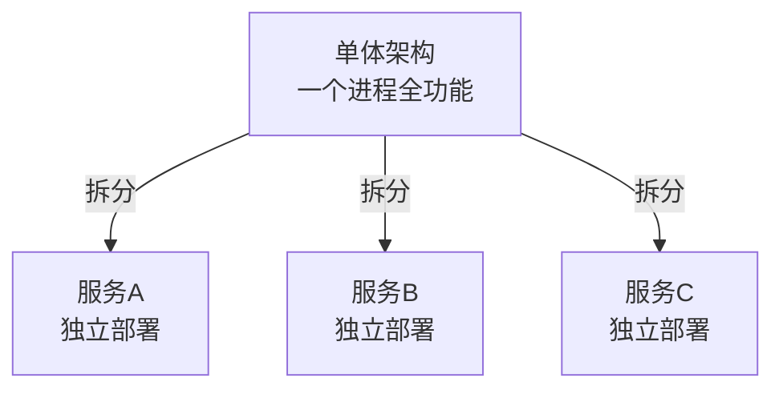
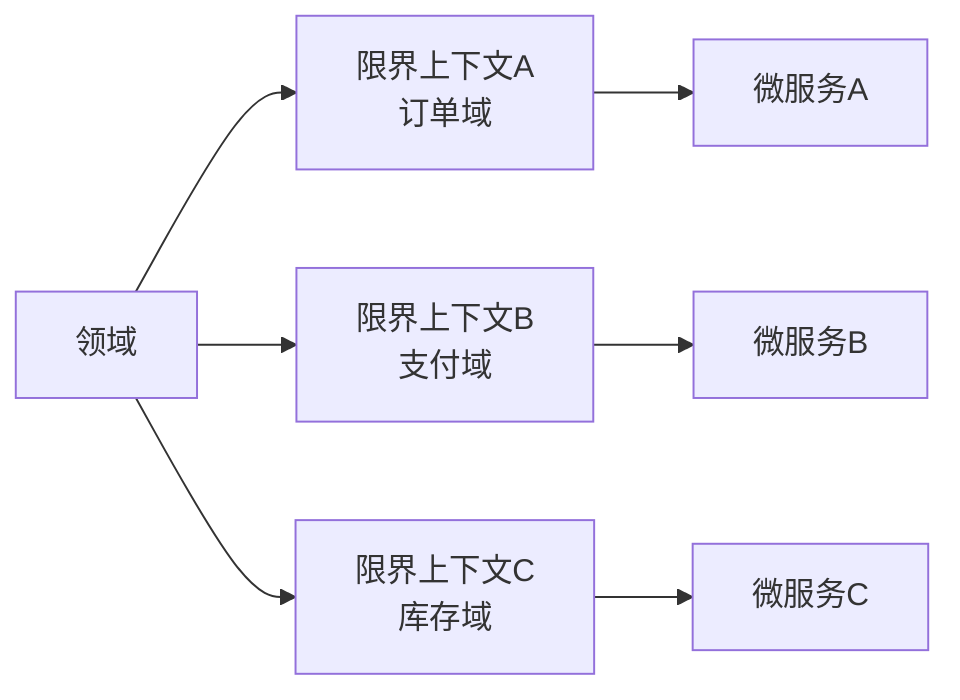
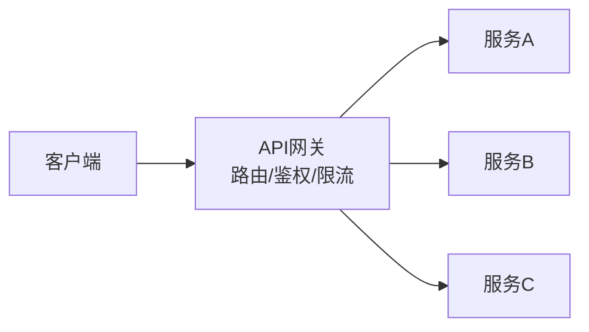
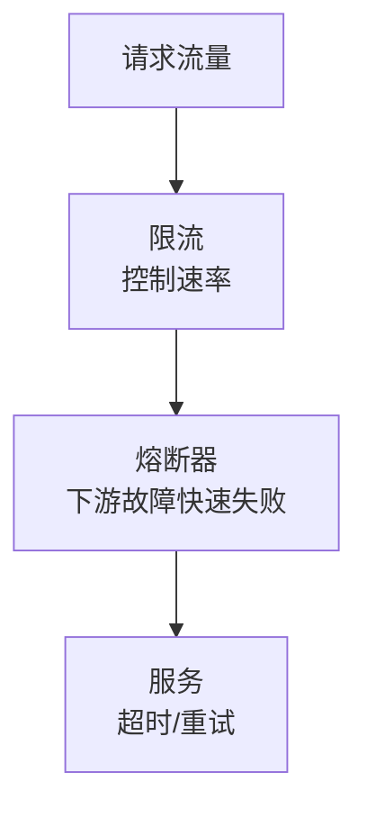
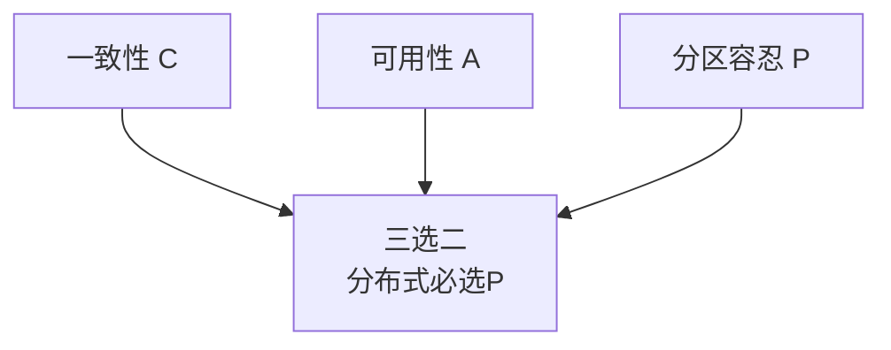

# 系统分析师｜第20章 微服务系统分析与设计（完整版备考讲义+章节自测题）

> 适配系统分析师（第2版教材），包含教材删减但真题持续考查内容；上午选择题+案例题备考讲义，论文高频素材。  
> 标签：系统分析师、上午题、微服务、单体架构、DDD、API网关、注册发现、熔断降级、CAP、分布式事务、K8s、备考

[TOC]

## 模块1：微服务基础

**前置说明**：本章基于系统分析师第2版官方教材，增补第1版删减但历年真题、新考纲仍必考内容，适配上午综合选择题与案例题。  
**模块优先级**：🔴 最高优先级（基础概念必考）  
**考情分析**：年均1~2道选择题；核心：微服务定义特征、与单体/SOA对比、DDD基础。

### 1.1 核心知识点精讲

#### 1.1.1 单体架构痛点与微服务定义（高频，重点）

- **单体架构**：全部功能打包部署于一个进程。痛点：**耦合高、构建慢、扩容难、故障放大、技术栈锁定**。
- **微服务**：将系统拆分为**单一业务能力**的一组小型服务，每个服务**独立代码库、独立部署、独立数据库、自治团队**。

> 记忆：单体耦合难扩容；微服务业务自治独立部署。

#### 1.1.2 微服务与单体、SOA对比（高频）

- 微服务是**SOA的演进**：粒度更细、去ESB、轻量通信。
- SOA：粗粒度、ESB总线、共享库；微服务：细粒度、无中心、独立库。

> 记忆：SOA粗粒度ESB、微服务细粒度无中心。

#### 1.1.3 微服务代价

- 分布式复杂度上升（网络、事务、一致性）。
- 运维成本提高（更多服务实例）。
- 链路长、排障难（需可观测性）。

> 记忆：复杂、运维、排障三代价。

#### 1.1.4 DDD领域驱动设计基础（高频）

- **限界上下文**：领域模型的边界，微服务常按限界上下文划分。
- **聚合根**：聚合的入口，保证聚合内一致性。
- **实体/值对象**：有标识的实体 vs 无标识的值。

> 记忆：限界上下文划边界、聚合根保一致。

> 微服务常按限界上下文划分，聚合根保证聚合内一致性。
#### 1.1.5 高频易错点

1. 单体四痛点；
2. 微服务四独立；
3. SOA vs 微服务；
4. 限界上下文与聚合根。

### 1.2 典型配套例题（真题同源，带完整解析）

#### 例题1 单体痛点

不属于单体架构痛点的是（）
A. 模块耦合高 B. 独立扩容难 C. 故障放大 D. 服务粒度细

> 【解析】"服务粒度细"是微服务特征，非单体痛点。  
> 【答案】D

#### 例题2 DDD

DDD中定义领域模型边界的核心概念是（）
A. 实体 B. 限界上下文 C. 值对象 D. 仓储

> 【解析】限界上下文是领域模型边界，微服务按此划分。  
> 【答案】B

### 1.3 课后习题（带完整答案+解析）

**习题1**  
微服务区别于SOA的显著特征是（）
A. 粗粒度 ESB B. 细粒度 去中心化 C. 共享数据库 D. 统一部署

> 答案：B  
> 解析：微服务细粒度、去ESB无中心、独立库独立部署。

**习题2**  
聚合内一致性由（）保证
A. 限界上下文 B. 聚合根 C. 值对象 D. 网关

> 答案：B  
> 解析：聚合根是聚合入口，保证聚合内一致性。

---
## 模块2：微服务拆分策略

**前置说明**：本章基于系统分析师第2版官方教材，增补第1版删减但历年真题、新考纲仍必考内容，适配上午综合选择题与案例题（案例高频）。  
**模块优先级**：🔴 最高优先级（拆分必考）  
**考情分析**：每年1~2道选择题，案例大题常考；核心：拆分原则、误区、数据库拆分、渐进式改造。

### 2.1 核心知识点精讲

#### 2.1.1 拆分原则（高频，重点）

- **按业务能力拆分（首选）**：如订单、支付、库存各为服务。
- **按子域拆分**：DDD子域（核心域、支撑域、通用域）。
- **禁止按技术层拆分**（控制层/服务层/DAO层各一服务是错误示范）。

> 记忆：按业务、按子域、不按技术层。

#### 2.1.2 拆分误区与评估

- **过度拆分**：粒度过细 → 通信成本剧增、运维爆炸。
- 评估维度：业务独立变化频率、团队规模、调用关系。

> 记忆：粒度适中，过细是坑。

#### 2.1.3 数据库拆分策略（高频）

- 理想：**数据库按服务隔离**（每个服务独享库）。
- 共享数据库弊端：耦合、扩容难、故障影响面大。
- 过渡：先共享库后逐步拆分（数据迁移风险）。

> 记忆：服务独享库、共享库耦合。

#### 2.1.4 渐进式改造（第2版强化）

- **绞杀者模式（Strangler Fig）**：新功能用微服务，逐步替换单体模块，单体逐渐被"绞杀"消亡。
- 分支按业务剥离、新旧并行灰度。

> 记忆：绞杀者逐步替换单体。

#### 2.1.5 高频易错点

1. 按业务拆分、禁按技术层；
2. 过度拆分危害；
3. 数据库按服务隔离；
4. 绞杀者模式。
### 2.2 典型配套例题（真题同源，带完整解析）

#### 例题1 拆分原则

微服务拆分应优先依据（）
A. 技术层 B. 业务能力 C. 开发人数 D. 代码行数

> 【解析】按业务能力拆分是首选，禁止按技术层拆分。  
> 【答案】B

#### 例题2 数据库

微服务数据库隔离的推荐方式是（）
A. 共享一个库 B. 每服务独享库 C. 无数据库 D. 全放缓存

> 【解析】数据库按服务隔离，避免共享库耦合。  
> 【答案】B

### 2.3 课后习题（带完整答案+解析）

**习题1**  
新功能用微服务、逐步替换单体模块的改造模式是（）
A. 大爆炸重构 B. 绞杀者模式 C. 推倒重来 D. 复制粘贴

> 答案：B  
> 解析：绞杀者模式（Strangler Fig）渐进式替换单体。

**习题2**  
微服务粒度过细的主要危害是（）
A. 代码变少 B. 通信与运维成本剧增 C. 测试变易 D. 部署变快

> 答案：B  
> 解析：过度拆分导致通信成本剧增、运维爆炸。

---
## 模块3：微服务通信与API设计

**前置说明**：本章基于系统分析师第2版官方教材，增补第1版删减但历年真题、新考纲仍必考内容，适配上午综合选择题。  
**模块优先级**：🟡 中等优先级  
**考情分析**：年均0~1道选择题；核心：同步/异步通信、API网关、API版本。

### 3.1 核心知识点精讲

#### 3.1.1 同步通信（高频）

- **RESTful HTTP**：简单通用、资源化、跨语言。
- **gRPC**：高性能、强类型、二进制（内部服务调用）。

> 记忆：REST简单通用、gRPC高性能。

#### 3.1.2 异步通信（高频）

- **消息队列**（Kafka/RabbitMQ）：解耦、削峰、异步。
- **事件驱动EDA**：服务间通过事件解耦，发布订阅。

> 记忆：MQ解耦削峰、EDA事件驱动。

#### 3.1.3 API网关（高频，重点）

- 统一入口：**路由转发、鉴权认证、限流、日志监控、协议转换、聚合**。
- 好处：客户端只连网关、关注点收敛。

> 记忆：网关统一入口：路由鉴权限流日志。

#### 3.1.4 API版本管理

- 契约先行（OpenAPI/Swagger）。
- 版本兼容：向后兼容、优雅废弃。

#### 3.1.5 高频易错点

1. REST vs gRPC；
2. MQ/EDA异步；
3. 网关五大职责；
4. 版本兼容。
### 3.2 典型配套例题（真题同源，带完整解析）

#### 例题1 网关

不属于API网关职责的是（）
A. 路由转发 B. 鉴权认证 C. 业务数据库存储 D. 限流

> 【解析】网关做路由、鉴权、限流、日志、协议转换，不做业务存储。  
> 【答案】C

#### 例题2 异步通信

服务间通过发布订阅解耦的架构是（）
A. 同步调用 B. 事件驱动EDA C. 共享数据库 D. 文件传输

> 【解析】EDA事件驱动：服务通过事件发布订阅解耦。  
> 【答案】B

### 3.3 课后习题（带完整答案+解析）

**习题1**  
内部服务间高性能强类型调用的协议是（）
A. gRPC B. FTP C. SMTP D. SNMP

> 答案：A  
> 解析：gRPC高性能、强类型二进制，适合内部服务调用。

**习题2**  
客户端只连接统一入口，由入口转发到各服务，该组件是（）
A. 注册中心 B. API网关 C. 配置中心 D. 消息队列

> 答案：B  
> 解析：API网关是统一入口，负责路由转发等。

---
## 模块4：服务治理

**前置说明**：本章基于系统分析师第2版官方教材，增补第1版删减但历年真题、新考纲仍必考内容，适配上午综合选择题与案例题。  
**模块优先级**：🔴 最高优先级（治理必考）  
**考情分析**：每年1~2道选择题，案例常考；核心：注册发现、熔断降级、可观测性、配置中心。

### 4.1 核心知识点精讲

#### 4.1.1 服务注册与发现（高频）

- **注册中心**（Nacos/Eureka/Consul）：服务注册、健康检查、服务列表。
- 流程：服务启动注册 → 消费者从注册中心获取服务地址 → 调用。

> 记忆：注册中心管地址、健康检查剔除坏实例。

#### 4.1.2 熔断、降级、限流（高频，重点）

- **熔断**：下游故障时快速失败，避免持续等待（断路器）。
- **降级**：非核心功能降级/关闭，保核心。
- **限流**：控制流量速率，防压垮。
- 超时与重试：设置超时、有限重试。

> 记忆：熔断防故障放大、降级保核心、限流防压垮。

#### 4.1.3 雪崩与防护（第2版强化）

- **雪崩**：单服务故障 → 级联失败 → 系统整体瘫痪。
- 防护：超时、重试限制、熔断、隔离（线程/信号量）、限流。

> 记忆：超时熔断隔离限流防雪崩。

#### 4.1.4 可观测性与配置中心

- 可观测性三支柱：**链路追踪、日志聚合、监控指标**。
- **配置中心**：统一配置、动态刷新。

> 记忆：追踪+日志+指标；配置中心动态推送。

#### 4.1.5 高频易错点

1. 注册发现流程；
2. 熔断/降级/限流区别；
3. 雪崩防护；
4. 可观测性三支柱。
### 4.2 典型配套例题（真题同源，带完整解析）

#### 例题1 熔断

下游服务故障时快速失败、避免持续等待的机制是（）
A. 限流 B. 熔断 C. 降级 D. 扩容

> 【解析】熔断（断路器）在下游故障时快速失败。  
> 【答案】B

#### 例题2 雪崩

单服务故障导致级联失败、系统整体瘫痪称为（）
A. 雪崩 B. 热点 C. 抖动 D. 阻塞

> 【解析】雪崩：单点故障级联放大致整体瘫痪。  
> 【答案】A

### 4.3 课后习题（带完整答案+解析）

**习题1**  
非核心功能关闭、保证核心功能的策略是（）
A. 熔断 B. 降级 C. 限流 D. 重试

> 答案：B  
> 解析：降级：关闭非核心、保核心功能。

**习题2**  
可观测性三大支柱是（）
A. 链路追踪、日志、指标 B. 缓存、队列、文件 C. CPU、内存、磁盘 D. 注册、发现、配置

> 答案：A  
> 解析：可观测性=链路追踪+日志聚合+监控指标。

---
## 模块5：分布式核心问题

**前置说明**：本章基于系统分析师第2版官方教材，增补第1版删减但历年真题、新考纲仍必考内容，适配上午综合选择题与案例题。  
**模块优先级**：🔴 最高优先级（CAP与分布式事务必考）  
**考情分析**：每年1~2道选择题；核心：CAP/BASE、分布式事务、幂等、分布式锁。

### 5.1 核心知识点精讲

#### 5.1.1 CAP与BASE理论（高频，重点）

- **CAP**：一致性C、可用性A、分区容忍性P三选二；分布式必选P，在C与A间权衡。
- **BASE**：基本可用、软状态、最终一致（放弃强一致，追求最终一致）。

> 记忆：CAP三选二必选P；BASE最终一致。

#### 5.1.2 分布式事务方案（高频，重点）

1. **2PC两阶段提交**：强一致，阻塞、性能差。
2. **TCC**：Try-Confirm-Cancel，业务补偿，性能较好，实现复杂。
3. **Saga**：长事务拆分本地事务+补偿，最终一致。
4. **本地消息表**：本地事务+消息表，最终一致。
5. **事务消息**（RocketMQ）：半消息+确认。

> 记忆：2PC强一致慢、TCC补偿复杂、Saga长事务最终一致。

#### 5.1.3 幂等性设计（高频）

- 防止重复请求重复处理（重试安全）。
- 手段：唯一标识、状态机、去重表。

> 记忆：唯一ID+状态机+去重表防重复。

#### 5.1.4 分布式锁

- 跨进程互斥访问共享资源。
- 手段：Redis分布式锁、ZooKeeper锁。

#### 5.1.5 高频易错点

1. CAP三选二、BASE最终一致；
2. 五种分布式事务优缺点；
3. 幂等三手段；
4. 分布式锁。
### 5.2 典型配套例题（真题同源，带完整解析）

#### 例题1 CAP

分布式系统中必须满足的是（）
A. 一致性 C B. 可用性 A C. 分区容忍性 P D. 三选二均可

> 【解析】网络分区不可避免，分布式必选P，C与A权衡。  
> 【答案】C

#### 例题2 分布式事务

基于Try-Confirm-Cancel业务补偿的方案是（）
A. 2PC B. TCC C. 本地消息表 D. 无事务

> 【解析】TCC：Try-Confirm-Cancel三阶段业务补偿。  
> 【答案】B

### 5.3 课后习题（带完整答案+解析）

**习题1**  
BASE理论追求的一致性模型是（）
A. 强一致 B. 最终一致 C. 无一致 D. 线性一致

> 答案：B  
> 解析：BASE：基本可用、软状态、最终一致。

**习题2**  
防重复请求重复处理的机制是（）
A. 幂等性 B. 分页 C. 缓存 D. 压缩

> 答案：A  
> 解析：幂等性保证同一请求重复执行结果一致。

---
## 模块6：微服务部署、测试与运维

**前置说明**：本章基于系统分析师第2版官方教材，增补第1版删减但历年真题、新考纲仍必考内容，适配上午综合选择题。  
**模块优先级**：🟡 中等优先级  
**考情分析**：年均0~1道选择题；核心：容器K8s、测试策略、发布策略、弹性扩缩容。

### 6.1 核心知识点精讲

#### 6.1.1 容器与编排（高频）

- **Docker容器**：镜像打包应用与依赖，环境一致。
- **K8s编排**：Pod、服务发现、自动扩缩容、滚动更新。

> 记忆：Docker镜像一致、K8s编排调度。

#### 6.1.2 微服务测试策略

- **单元测试**（单服务内）、**契约测试**（服务间接口）、**端到端测试**（全链路）。
- 契约测试是微服务特有重点。

> 记忆：单元→契约→端到端三层测试。

#### 6.1.3 CI/CD与发布策略（高频）

- **CI/CD**：持续集成、持续交付部署。
- **蓝绿发布**：两套环境切换，回滚快、成本高。
- **灰度/金丝雀发布**：小流量验证再放量。

> 记忆：蓝绿双环境切换、金丝雀小流量验证。

#### 6.1.4 容量与弹性

- 容量规划：按峰值评估实例数。
- **弹性扩缩容**：按负载自动增减实例。

#### 6.1.5 高频易错点

1. Docker/K8s作用；
2. 契约测试；
3. 蓝绿vs金丝雀；
4. 弹性扩缩容。

### 6.2 典型配套例题（真题同源，带完整解析）

#### 例题1 发布

两套环境直接切换、回滚快的发布方式是（）
A. 蓝绿发布 B. 全量覆盖 C. 停机发布 D. 冷启动

> 【解析】蓝绿发布：双环境切换，回滚快、成本高。  
> 【答案】A

#### 例题2 测试

验证服务间接口契约一致性的测试是（）
A. 单元测试 B. 契约测试 C. 冒烟测试 D. 压力测试

> 【解析】契约测试验证服务间接口契约。  
> 【答案】B

### 6.3 课后习题（带完整答案+解析）

**习题1**  
小流量验证再逐步放量的发布方式是（）
A. 蓝绿 B. 金丝雀 C. 停机 D. 冷启动

> 答案：B  
> 解析：金丝雀/灰度发布小流量验证再放量。

**习题2**  
K8s中应用运行与调度的基本单元是（）
A. 镜像 B. Pod C. 容器组 D. 卷

> 答案：B  
> 解析：K8s以Pod为基本调度单元。

---
# 章节总复习综合模拟题（覆盖全部6模块，含答案与解析）

> 说明：题型贴合系统分析师上午真题风格，包含选择+计算，覆盖模块1~6所有核心考点；可直接放在讲义末尾作为章节自测。

## 一、单项选择题（15题）

1. 不属于单体架构痛点的是（）
A. 模块耦合高 B. 独立扩容难 C. 故障放大 D. 服务粒度细
> 答案：D

2. DDD中定义领域模型边界的概念是（）
A. 实体 B. 限界上下文 C. 值对象 D. 仓储
> 答案：B

3. 微服务拆分应优先依据（）
A. 技术层 B. 业务能力 C. 开发人数 D. 代码行数
> 答案：B

4. 新功能用微服务逐步替换单体的模式是（）
A. 大爆炸 B. 绞杀者模式 C. 推倒重来 D. 复制
> 答案：B

5. 不属于API网关职责的是（）
A. 路由转发 B. 鉴权认证 C. 业务数据库存储 D. 限流
> 答案：C

6. 服务间通过发布订阅解耦的架构是（）
A. 同步调用 B. EDA事件驱动 C. 共享库 D. 文件传输
> 答案：B

7. 下游故障时快速失败、避免持续等待的机制是（）
A. 限流 B. 熔断 C. 降级 D. 扩容
> 答案：B

8. 单服务故障导致级联失败、整体瘫痪称为（）
A. 雪崩 B. 热点 C. 抖动 D. 阻塞
> 答案：A

9. 分布式系统中必须满足的是（）
A. 一致性 B. 可用性 C. 分区容忍性 D. 三选二均可
> 答案：C

10. 基于Try-Confirm-Cancel业务补偿的方案是（）
A. 2PC B. TCC C. 本地消息表 D. 无事务
> 答案：B

11. BASE理论追求的一致性模型是（）
A. 强一致 B. 最终一致 C. 无一致 D. 线性一致
> 答案：B

12. 防重复请求重复处理的机制是（）
A. 幂等性 B. 分页 C. 缓存 D. 压缩
> 答案：A

13. 两套环境直接切换、回滚快的发布方式是（）
A. 蓝绿发布 B. 全量覆盖 C. 停机发布 D. 冷启动
> 答案：A

14. 验证服务间接口契约一致性的测试是（）
A. 单元测试 B. 契约测试 C. 冒烟测试 D. 压力测试
> 答案：B

15. 小流量验证再逐步放量的发布方式是（）
A. 蓝绿 B. 金丝雀 C. 停机 D. 冷启动
> 答案：B
## 二、计算题（4道，真题风格）

### 计算题1【服务容量估算】

某微服务单实例每秒可处理100请求（QPS=100），高峰流量预计12000 QPS，每实例需预留20%余量。请计算所需最小实例数。
> 【解析】
> 单实例有效容量=100×(1-20%)=80 QPS。
> 实例数=12000/80=150个。
> 答案：最少150个实例

### 计算题2【限流阈值计算】

某网关限流策略为令牌桶，容量1000个令牌，每秒补充500个令牌。突发一次性到达2000个请求。请计算：①首秒可放行请求数；②队列排空（2000请求全部放行）所需时间（秒）。
> 【解析】
> ①首秒放行=桶容量1000（消耗完桶）即1000个。
> ②剩余1000请求按500/秒补充：需1000/500=2秒（补充期间持续放行）。
> 答案：首秒放行1000；约2秒后全部放行
### 计算题3【分布式事务开销评估】

某业务采用TCC事务，Try耗时50ms、Confirm耗时30ms、Cancel耗时20ms，成功概率95%。请计算：①成功路径单事务耗时；②考虑失败回滚（Cancel）后的平均耗时。
> 【解析】
> ①成功路径=50+30=80ms。
> ②平均=0.95×80+0.05×(50+20)=76+3.5=79.5ms。
> 答案：成功80ms；平均约79.5ms

### 计算题4【集群可用性计算】

某微服务集群由3个节点组成，单节点可用性99%（故障相互独立）。请计算：①三节点同时可用概率（集群可用性，需全部在线）；②若采用2副本容错（至少2个在线即可），集群可用性为多少。
> 【解析】
> ①全部在线=0.99³≈0.9703=97.03%。
> ②至少2在线=C(3,2)×0.99²×0.01+0.99³=3×0.9801×0.01+0.9703=0.0294+0.9703=0.9997=99.97%。
> 答案：全部在线97.03%；2副本容错99.97%

## 三、简答概念题（3道）

1. 简述微服务的核心特征及与单体架构的区别
> 【解析】微服务核心特征：按单一业务能力拆分，每个服务独立代码库、独立部署、独立数据库、自治团队。与单体区别：单体一个进程打包全部功能，耦合高、扩容难、故障放大、技术栈锁定；微服务拆分后独立演进、独立扩缩容、故障隔离、技术栈灵活，但引入分布式复杂度（网络、事务、一致性）与运维成本。

2. 简述CAP理论与BASE理论的核心思想
> 【解析】CAP：分布式系统在一致性C、可用性A、分区容忍性P三者中最多满足两项；网络分区不可避免，故分布式必选P，在C与A之间权衡。BASE：基本可用（允许部分不可用）、软状态（中间状态允许）、最终一致（不要求强一致），放弃强一致换取可用性，最终达到一致，是多数分布式系统的实践取向。

3. 简述微服务架构中的服务治理包含哪些内容
> 【解析】服务治理包括：①服务注册与发现：注册中心管理服务地址与健康检查；②流量治理：熔断（下游故障快速失败）、降级（保核心）、限流（防压垮）、超时与重试控制；③雪崩防护：超时、隔离、熔断、限流组合；④可观测性：链路追踪、日志聚合、监控指标三支柱；⑤配置中心：统一配置与动态推送；⑥容量与弹性：按负载自动扩缩容。
