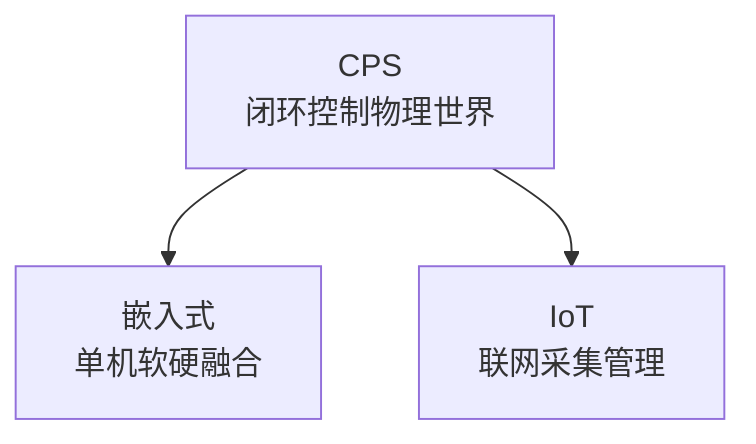
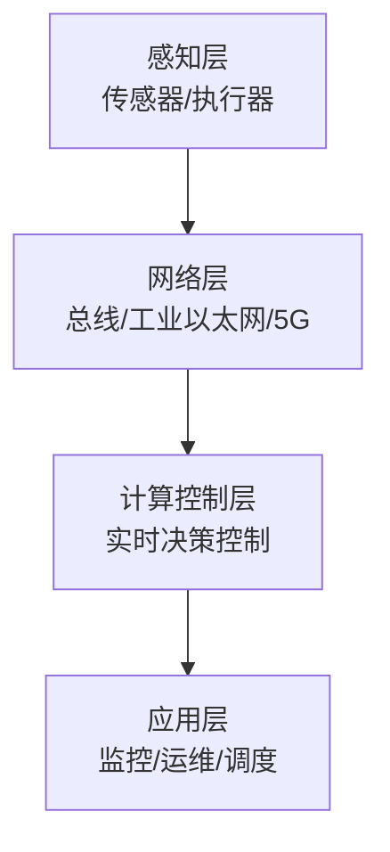
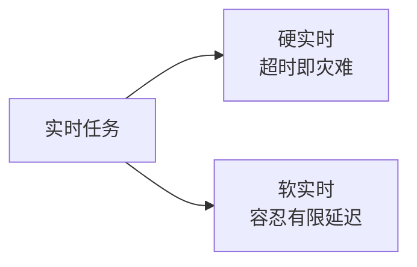

# 系统分析师｜第21章 信息物理系统分析与设计（完整版备考讲义+章节自测题）

> 适配系统分析师（第2版教材），包含教材删减但真题持续考查内容；上午选择题+案例题备考讲义。  
> 标签：系统分析师、上午题、信息物理系统、CPS、闭环反馈、数字孪生、TSN、混合动态系统、功能安全、HIL、备考

[TOC]

## 模块1：CPS基础概念

**前置说明**：本章基于系统分析师第2版官方教材，增补第1版删减但历年真题、新考纲仍必考内容，适配上午综合选择题与案例题。  
**模块优先级**：🟡 中等优先级  
**考情分析**：年均1~2道选择题；核心：CPS定义、特征、场景、与IoT/嵌入式辨析。

### 1.1 核心知识点精讲

#### 1.1.1 CPS定义（高频，重点）

- **CPS（信息物理系统）**：信息（Cyber）计算通信与物理（Physical）实体深度融合的系统。
- 组成闭环：**感知 → 计算 → 通信 → 控制 → 执行 → 影响物理世界**。
- 本质：信息世界与物理世界双向交互、闭环反馈。

> 记忆：感知进信息、指令回物理、闭环反馈是核心。

#### 1.1.2 CPS核心特征（高频）

- **实时性**：感知、计算、控制严格时限。
- **自治性**：局部自主决策。
- **异构集成**：软硬件、网络、物理系统融合。
- **闭环反馈**：计算作用于物理并感知结果。
- **高可靠安全**：故障与攻击影响实体安全。

> 记忆：实时、自治、异构、闭环、高可靠。
#### 1.1.3 CPS应用场景

- 智能制造、工业机器人、智能电网、自动驾驶、轨道交通、医疗设备、无人机、智慧城市。

> 记忆：制造、电网、车、轨道、医疗、无人机。

#### 1.1.4 CPS、IoT、嵌入式三者辨析（高频，重点）

- **嵌入式系统**：软件嵌入硬件，侧重单机控制。
- **物联网IoT**：设备联网，侧重数据采集上传与远程管理。
- **CPS**：感知-通信-计算-控制**闭环**，双向作用物理世界。

> 记忆：嵌入式单机、IoT联网、CPS闭环控制。
#### 1.1.5 高频易错点

1. CPS闭环反馈本质；
2. 核心特征六项；
3. CPS/IoT/嵌入式区别（高频坑）；
4. 典型应用场景。

### 1.2 典型配套例题（真题同源，带完整解析）

#### 例题1 CPS本质

CPS区别于物联网的核心特征是（）
A. 设备联网 B. 感知-计算-控制闭环反馈 C. 数据上传 D. 云端存储

> 【解析】CPS强调闭环控制双向作用物理世界；IoT侧重联网采集。  
> 【答案】B

#### 例题2 特征

不属于CPS核心特征的是（）
A. 实时性 B. 闭环反馈 C. 单机运行 D. 高可靠安全

> 【解析】CPS强调异构集成与系统协同，非单机运行。  
> 【答案】C

### 1.3 课后习题（带完整答案+解析）

**习题1**  
CPS中"感知→计算→通信→控制→执行"构成（）
A. 开环流程 B. 闭环反馈 C. 单向传输 D. 批处理

> 答案：B  
> 解析：CPS核心是闭环反馈控制物理世界。

**习题2**  
侧重设备联网与数据采集的概念是（）
A. CPS B. 物联网 C. 嵌入式 D. 云计算

> 答案：B  
> 解析：物联网侧重联网采集与管理；CPS侧重闭环控制。

---
## 模块2：CPS分层参考架构

**前置说明**：本章基于系统分析师第2版官方教材，增补第1版删减但历年真题、新考纲仍必考内容，适配上午综合选择题与案例题（案例高频）。  
**模块优先级**：🔴 最高优先级（四层架构必考）  
**考情分析**：每年1~2道选择题，案例常考；核心：四层架构、感知执行、时空同步。

### 2.1 核心知识点精讲

#### 2.1.1 CPS四层参考架构（高频，重点）

- **感知层**：传感器、执行器；采集物理量、执行动作。
- **网络层**：异构网络传输（现场总线、工业以太网、5G）。
- **计算控制层**：实时计算、决策、闭环控制。
- **应用层**：业务应用、监控、运维、调度。

> 记忆：感→传→算控→用四层。

#### 2.1.2 感知与执行（高频）

- **传感器**：温度、位置、振动、压力采集。
- **执行器**：电机、阀门、制动器改变物理状态。
- 感知噪声：数据预处理、滤波。

> 记忆：传感器采集、执行器改变、噪声需滤波。

#### 2.1.3 时空同步

- **时间同步**：保证感知数据时序一致（PTP精确时间协议）。
- **空间定位**：位置信息对齐。
- 作用：多源数据融合的时序与空间基准。

> 记忆：时间同步PTP、空间定位，保证数据对齐。

#### 2.1.4 高频易错点

1. 四层架构职责与顺序；
2. 传感器vs执行器方向；
3. 时空同步作用。
### 2.2 典型配套例题（真题同源，带完整解析）

#### 例题1 分层架构

CPS中负责实时计算与闭环控制的层是（）
A. 感知层 B. 网络层 C. 计算控制层 D. 应用层

> 【解析】计算控制层负责实时计算、决策与闭环控制。  
> 【答案】C

#### 例题2 感知执行

执行器在CPS中的作用是（）
A. 采集物理量 B. 改变物理状态 C. 传输数据 D. 存储数据

> 【解析】执行器（电机/阀门）执行指令改变物理状态。  
> 【答案】B

### 2.3 课后习题（带完整答案+解析）

**习题1**  
保证CPS多源感知数据时序一致的机制是（）
A. 时间同步 B. 数据压缩 C. 加密 D. 缓存

> 答案：A  
> 解析：时间同步（PTP）保证感知数据时序一致。

**习题2**  
CPS网络层的主要职责是（）
A. 采集物理量 B. 异构网络低时延传输 C. 业务展示 D. 设备执行

> 答案：B  
> 解析：网络层承担异构网络低时延可靠传输。

---
## 模块3：CPS核心关键技术

**前置说明**：本章基于系统分析师第2版官方教材，增补第1版删减但历年真题、新考纲仍必考内容，适配上午综合选择题。  
**模块优先级**：🟡 中等优先级  
**考情分析**：年均0~1道选择题；核心：实时计算、TSN、边缘计算、数字孪生。

### 3.1 核心知识点精讲

#### 3.1.1 实时计算（高频）

- 硬实时：超时即灾难（安全控制）；软实时：可容忍有限延迟。
- RTOS实时操作系统：确定性调度保障时限。
- 指标：截止时间、抖动。

> 记忆：硬实时零容忍、软实时可容忍。

#### 3.1.2 异构网络与TSN（高频）

- 工业总线（Modbus/Profibus）、工业以太网、5G工业无线。
- **TSN时间敏感网络**：确定性低时延传输，保障控制流量。

> 记忆：TSN=确定性低时延。

#### 3.1.3 边缘计算（第2版强化）

- 在靠近设备的**边缘**本地实时决策，降低云端往返延迟。
- 云端协同：边缘快速响应、云端全局分析。

> 记忆：边缘保实时、云端做全局。

#### 3.1.4 数字孪生（第2版强化）

- **数字孪生**：物理实体的虚拟镜像，实时映射状态。
- 与CPS关系：数字孪生是CPS的重要支撑，支撑仿真、预测与优化。

> 记忆：孪生是镜像、仿真预测优化、支撑CPS。
#### 3.1.5 高频易错点

1. 硬实时/软实时；
2. TSN确定性传输；
3. 边缘计算实时决策；
4. 数字孪生与CPS关系。

### 3.2 典型配套例题（真题同源，带完整解析）

#### 例题1 TSN

TSN时间敏感网络的主要特点是（）
A. 尽力而为 B. 确定性低时延 C. 无连接 D. 高抖动

> 【解析】TSN提供确定性低时延传输，保障控制流量。  
> 【答案】B

#### 例题2 数字孪生

物理实体的实时虚拟镜像，用于仿真预测，属于（）
A. 数字孪生 B. 数据仓库 C. 消息队列 D. 负载均衡

> 【解析】数字孪生：物理实体虚拟镜像，仿真预测优化。  
> 【答案】A

### 3.3 课后习题（带完整答案+解析）

**习题1**  
靠近设备本地实时决策、降低云端延迟的技术是（）
A. 边缘计算 B. 云计算 C. 批处理 D. 数据挖掘

> 答案：A  
> 解析：边缘计算靠近设备实时决策，减少往返延迟。

**习题2**  
安全气囊触发控制属于（）
A. 软实时 B. 硬实时 C. 批处理 D. 非实时

> 答案：B  
> 解析：超时即灾难（人身安全）→ 硬实时。

---
## 模块4：CPS建模、仿真与验证

**前置说明**：本章基于系统分析师第2版官方教材，增补第1版删减但历年真题、新考纲仍必考内容，适配上午综合选择题。  
**模块优先级**：🟡 中等优先级  
**考情分析**：年均0~1道选择题；核心：混合动态系统、建模、验证、需求。

### 4.1 核心知识点精讲

#### 4.1.1 混合动态系统（高频，重点）

- CPS同时包含**连续物理动态**（微分方程）与**离散计算事件**（状态跳转）。
- 建模难点：两类动态交互（事件触发、模式切换）。

> 记忆：连续物理+离散事件=混合动态系统。

#### 4.1.2 建模方法

- **状态机**：离散状态与迁移。
- **混合自动机**：连续变量+离散模式（经典建模）。
- **联合仿真**：物理仿真+信息逻辑仿真协同。

> 记忆：混合自动机建模、联合仿真验证。

#### 4.1.3 模型验证

- **形式化验证**：数学证明安全性与可达性。
- 检查：安全性（不进入危险状态）、可达性、无死锁。
- 仿真：预演故障与边界场景。

> 记忆：形式化验证安全性可达性、仿真预演故障。

#### 4.1.4 需求特点

- 功能需求+强**非功能需求**：实时性、可靠性、安全性（安全是核心）。

#### 4.1.5 高频易错点

1. 混合动态系统内涵；
2. 混合自动机；
3. 形式化验证目标；
4. 安全为核心非功能需求。

### 4.2 典型配套例题（真题同源，带完整解析）

#### 例题1 混合系统

CPS建模的核心难点是（）
A. 纯离散计算 B. 连续物理与离散事件交互 C. 纯连续方程 D. 纯网络传输

> 【解析】CPS是混合动态系统：连续物理+离散事件交互。  
> 【答案】B

#### 例题2 验证

形式化验证主要检查（）
A. 界面美观 B. 安全性与可达性 C. 代码风格 D. 网络速度

> 【解析】形式化验证检查安全性、可达性、无死锁。  
> 【答案】B
### 4.3 课后习题（带完整答案+解析）

**习题1**  
连续变量+离散模式的CPS建模方法是（）
A. 混合自动机 B. 关系数据库 C. 马尔可夫链 D. 排队论

> 答案：A  
> 解析：混合自动机描述连续变量与离散模式交互。

**习题2**  
CPS最重要的非功能需求是（）
A. 界面 B. 安全性 C. 配色 D. 文案

> 答案：B  
> 解析：安全（人身/设备）是CPS核心非功能需求。

---

## 模块5：CPS可靠性、安全与风险

**前置说明**：本章基于系统分析师第2版官方教材，增补第1版删减但历年真题、新考纲仍必考内容，适配上午综合选择题与案例题。  
**模块优先级**：🟡 中等优先级  
**考情分析**：年均0~1道选择题；核心：安全特点、分类、故障、功能安全。

### 5.1 核心知识点精讲

#### 5.1.1 CPS安全特点（高频，重点）

- 攻击不只影响信息，**直接危害物理设备与人身安全**。
- 安全=**信息安全**（机密、完整、可用）+**物理安全**（设备故障、失控）。

> 记忆：信息+物理双安全。

#### 5.1.2 安全威胁分类

- 网络攻击：入侵、篡改控制指令、拒绝服务。
- 物理故障：传感器失效、执行器卡死。
- 后果：设备损坏、生产事故、人身伤害。

> 记忆：网络攻击+物理故障双风险。

#### 5.1.3 故障模式与容错

- 随机硬件故障、恶意攻击。
- **容错**：冗余（双通道）、故障检测、故障隔离、降级运行。

> 记忆：冗余、检测、隔离、降级。
#### 5.1.4 功能安全（高频）

- **IEC 61508** 功能安全标准：降低风险到可接受水平。
- **SIL安全完整性等级**：按风险程度分级（SIL1~SIL4），等级越高要求越严。

> 记忆：IEC61508管功能安全、SIL分级控风险。

#### 5.1.5 高频易错点

1. 信息+物理双安全；
2. 容错四手段；
3. IEC61508与SIL。

### 5.2 典型配套例题（真题同源，带完整解析）

#### 例题1 安全特点

CPS安全区别于传统信息安全的特点是（）
A. 只保护数据 B. 直接关系物理设备与人身安全 C. 无需加密 D. 无攻击面

> 【解析】CPS攻击直接影响物理设备与人身安全。  
> 【答案】B

#### 例题2 功能安全

衡量安全功能降低风险能力的等级是（）
A. SLA B. SIL C. QoS D. API

> 【解析】SIL安全完整性等级衡量降低风险能力。  
> 【答案】B

### 5.3 课后习题（带完整答案+解析）

**习题1**  
传感器失效、执行器卡死属于（）
A. 网络攻击 B. 物理故障 C. 数据泄露 D. 钓鱼

> 答案：B  
> 解析：物理故障：传感器失效、执行器卡死等。

**习题2**  
CPS功能安全基础标准是（）
A. ISO9001 B. IEC61508 C. IEEE802.11 D. RFC791

> 答案：B  
> 解析：IEC61508是功能安全基础标准，SIL分级。

---
## 模块6：CPS工程设计、测试与应用

**前置说明**：本章基于系统分析师第2版官方教材，增补第1版删减但历年真题、新考纲仍必考内容，适配上午综合选择题。  
**模块优先级**：🟡 中等优先级  
**考情分析**：年均0~1道选择题；核心：开发流程、专项测试、典型应用、设计权衡。

### 6.1 核心知识点精讲

#### 6.1.1 CPS开发流程（高频）

- **需求 → 建模仿真 → 软硬件协同设计 → 集成测试 → 部署运维**。
- **软硬件协同设计**是重点（划分功能到软硬件）。

> 记忆：需求→建模→软硬协同→集成→部署。

#### 6.1.2 CPS专项测试（高频）

- **实时性测试**：验证时限满足。
- **硬件在环HIL**：真实硬件+仿真环境联测。
- **故障注入测试**：人为注入故障验证容错。

> 记忆：实时性、HIL、故障注入三测试。

#### 6.1.3 典型应用

- 工业4.0智能制造、自动驾驶、智能电网。

#### 6.1.4 设计权衡

- **实时性 vs 算力**：更严实时需更强调度与算力。
- **安全 vs 成本**：高安全冗余增成本。
- **确定性 vs 灵活性**：确定性限制灵活。

> 记忆：实时/安全/确定 vs 算力/成本/灵活。

#### 6.1.5 高频易错点

1. 开发流程顺序；
2. 三种专项测试；
3. 设计权衡维度。

### 6.2 典型配套例题（真题同源，带完整解析）

#### 例题1 测试

真实硬件+实时仿真环境联合测试是（）
A. 单元测试 B. HIL硬件在环 C. 代码走查 D. 需求评审

> 【解析】HIL硬件在环：真实硬件+仿真环境联测。  
> 【答案】B

#### 例题2 流程

CPS开发中软硬件划分属于（）
A. 需求分析 B. 软硬件协同设计 C. 部署 D. 运维

> 【解析】软硬件协同设计阶段进行软硬件划分。  
> 【答案】B

### 6.3 课后习题（带完整答案+解析）

**习题1**  
人为注入故障验证容错能力的测试是（）
A. 冒烟测试 B. 故障注入测试 C. 压力测试 D. 兼容测试

> 答案：B  
> 解析：故障注入测试验证容错与降级能力。

**习题2**  
自动驾驶、智能电网属于CPS的（）
A. 典型应用 B. 开发工具 C. 建模语言 D. 测试框架

> 答案：A  
> 解析：自动驾驶、智能电网、智能制造是CPS典型应用。

---
# 章节总复习综合模拟题（覆盖全部6模块，含答案与解析）

> 说明：题型贴合系统分析师上午真题风格，包含选择+计算，覆盖模块1~6所有核心考点；可直接放在讲义末尾作为章节自测。

## 一、单项选择题（15题）

1. CPS区别于物联网的核心特征是（）
A. 设备联网 B. 感知-计算-控制闭环反馈 C. 数据上传 D. 云端存储
> 答案：B

2. 不属于CPS核心特征的是（）
A. 实时性 B. 闭环反馈 C. 单机运行 D. 高可靠安全
> 答案：C

3. CPS中执行器的作用是（）
A. 采集物理量 B. 改变物理状态 C. 传输数据 D. 存储数据
> 答案：B

4. CPS四层架构中负责实时计算与闭环控制的层是（）
A. 感知层 B. 网络层 C. 计算控制层 D. 应用层
> 答案：C

5. 保证CPS多源感知数据时序一致的机制是（）
A. 时间同步 B. 压缩 C. 加密 D. 缓存
> 答案：A

6. TSN时间敏感网络的主要特点是（）
A. 尽力而为 B. 确定性低时延 C. 无连接 D. 高抖动
> 答案：B

7. 物理实体实时虚拟镜像、用于仿真预测的是（）
A. 数字孪生 B. 数据仓库 C. 消息队列 D. 负载均衡
> 答案：A

8. 靠近设备本地实时决策、降低云端延迟的是（）
A. 边缘计算 B. 云计算 C. 批处理 D. 挖掘
> 答案：A

9. CPS建模核心难点是（）
A. 纯离散 B. 连续物理与离散事件交互 C. 纯连续 D. 纯网络
> 答案：B

10. 形式化验证主要检查（）
A. 界面 B. 安全性与可达性 C. 代码风格 D. 网速
> 答案：B

11. CPS安全区别于传统信息安全的特点是（）
A. 只保护数据 B. 直接关系物理设备与人身安全 C. 无需加密 D. 无攻击面
> 答案：B

12. 衡量安全功能降低风险能力的等级是（）
A. SLA B. SIL C. QoS D. API
> 答案：B

13. 传感器失效、执行器卡死属于（）
A. 网络攻击 B. 物理故障 C. 数据泄露 D. 钓鱼
> 答案：B

14. 真实硬件+实时仿真环境联合测试是（）
A. 单元测试 B. HIL硬件在环 C. 代码走查 D. 需求评审
> 答案：B

15. 人为注入故障验证容错能力的是（）
A. 冒烟测试 B. 故障注入测试 C. 压力测试 D. 兼容测试
> 答案：B
## 二、计算题（4道，真题风格）

### 计算题1【实时任务调度可调度性估算】

某CPS控制任务周期50ms、执行时间10ms；另一监测任务周期100ms、执行时间15ms。请用RM速率单调调度判断是否可调度（n=2时上限≈0.828）。
> 【解析】
> 利用率U=10/50+15/100=0.2+0.15=0.35。
> n=2时RM充分条件上限=0.828。
> U=0.35≤0.828，满足充分条件，可调度。
> 答案：U=0.35<0.828，可调度

### 计算题2【网络时延预算计算】

某CPS闭环控制链路：传感器采样2ms、网络传输5ms、控制计算3ms、执行器动作2ms、反馈返回3ms。请计算闭环总时延，并判断是否满足20ms控制周期要求。
> 【解析】
> 总时延=2+5+3+2+3=15ms。
> 15ms<20ms，满足控制周期要求。
> 答案：总时延15ms，满足20ms要求
### 计算题3【SIL风险评估】

某CPS系统一年运行8760小时，评估其危险事件发生频率为每10年1次，每次危险事件预计造成严重伤害（不可接受后果）。请按风险频率判断应达到的最低SIL等级（SIL1允许频率1e-5~1e-6次/小时；SIL2为1e-6~1e-7次/小时；SIL3为1e-7~1e-8次/小时）。
> 【解析】
> 危险频率=1/(10×8760)≈1.14e-5次/小时。
> 落在SIL1区间（1e-5~1e-6）内，需达到SIL1。
> 答案：危险频率约1.14e-5次/小时，最低SIL1

### 计算题4【传感器采样周期测算】

某CPS需监测转速信号，最高频率成分为200Hz。按奈奎斯特采样定理，采样频率至少为最高频率的2倍。请计算：①最小采样频率；②对应最大采样周期（ms）。
> 【解析】
> ①最小采样频率=200×2=400Hz。
> ②最大采样周期=1/400=2.5ms。
> 答案：最小采样频率400Hz；最大采样周期2.5ms

## 三、简答概念题（3道）

1. 简述CPS的定义与核心特征
> 【解析】CPS（信息物理系统）是信息世界的计算通信与物理世界实体深度融合的系统，通过感知→计算→通信→控制→执行形成闭环反馈，双向作用物理世界。核心特征：实时性（严格时限）、自治性（局部自主决策）、异构集成（软硬件网络物理融合）、闭环反馈（计算作用于物理并感知结果）、高可靠安全（故障与攻击影响实体安全）。

2. 简述CPS、物联网IoT、嵌入式系统三者的区别
> 【解析】嵌入式系统：软件嵌入硬件，侧重单机控制与软硬融合；物联网：设备联网，侧重数据采集上传、远程管理，强调连接与数据；CPS：在感知-通信-计算-控制闭环中双向作用物理世界，强调实时闭环控制与安全。三者的关系：CPS往往基于嵌入式硬件与IoT网络，但核心差异在"闭环反馈控制物理世界"。

3. 简述CPS安全的特殊性及功能安全概念
> 【解析】CPS安全兼具信息与物理双重属性：网络攻击不只影响数据，可直接危害物理设备与人身安全，同时存在物理故障（传感器失效、执行器卡死）风险。功能安全以IEC 61508为基础标准，通过风险评估确定SIL安全完整性等级，采用冗余、故障检测隔离、降级运行等容错手段，将风险降低到可接受水平。
